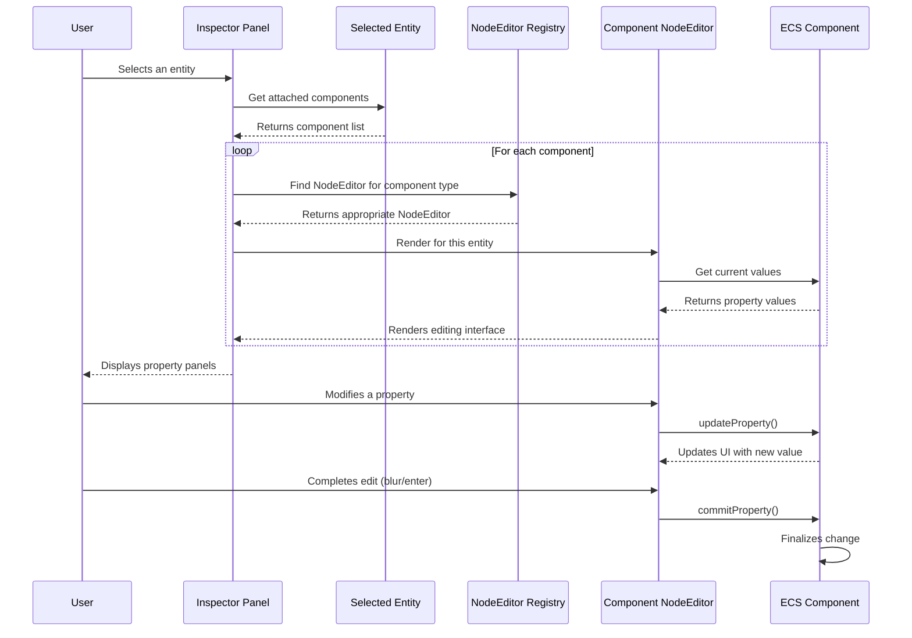

# Editor properties UI (NodeEditor components)

## Overview

The Editor Properties UI system provides a structured framework for creating and managing property editing panels within the iR Engine editor. These panels allow users to inspect and modify the properties of entities in the scene without writing code. 

Built on top of the UI primitives discussed in the previous chapter, this system organizes related properties into collapsible sections, each dedicated to a specific component type. This approach creates an intuitive and consistent editing experience throughout the application.

## Core concepts

### Entity-component-system (ECS)

The iR Engine uses an Entity-component-system architecture where:

- **Entities** are the objects in the scene (e.g., a lamp, a character, a camera)
- **Components** are data containers attached to entities (e.g., `TransformComponent`, `LightComponent`)
- **Systems** process entities with specific components

The Editor Properties UI focuses on providing interfaces for editing the data stored in components.

### NodeEditor components

NodeEditor components are specialized React components that create editing interfaces for specific component types. Each NodeEditor:

1. Retrieves the component data for the selected entity
2. Renders appropriate input controls for each property
3. Updates the component data when users modify values
4. Provides a consistent visual structure with collapsible sections

These components serve as the bridge between the UI and the underlying data model, allowing users to modify entity properties through a graphical interface.

## Implementation

### NodeEditor structure

A typical NodeEditor component follows this structure:

```typescript
// Simplified from: src/components/editor/properties/light/ambient/index.tsx
import NodeEditor from '@ir-engine/editor/src/panels/properties/common/NodeEditor';
import { AmbientLightComponent } from '@ir-engine/spatial';
import { useComponent } from '@ir-engine/ecs';
import { ColorInput, NumericInput, InputGroup } from '@ir-engine/ui';
import { HiOutlineSun } from 'react-icons/hi2';

export const AmbientLightNodeEditor = (props) => {
  // Get the component data for the selected entity
  const lightComponent = useComponent(props.entity, AmbientLightComponent);

  return (
    <NodeEditor
      name="Ambient light"
      description="Sets the global ambient light properties."
      Icon={HiOutlineSun}
      entity={props.entity}
    >
      <InputGroup name="Color" label="Light color">
        <ColorInput
          value={lightComponent.color.value}
          onChange={updateProperty(AmbientLightComponent, 'color')}
          onRelease={commitProperty(AmbientLightComponent, 'color')}
        />
      </InputGroup>
      <InputGroup name="Intensity" label="Light intensity">
        <NumericInput
          value={lightComponent.intensity.value}
          onChange={updateProperty(AmbientLightComponent, 'intensity')}
          onRelease={commitProperty(AmbientLightComponent, 'intensity')}
        />
      </InputGroup>
    </NodeEditor>
  );
};
```

This component:
1. Uses the `useComponent` hook to access the `AmbientLightComponent` data
2. Wraps everything in a `NodeEditor` container that provides the collapsible section
3. Creates input fields for each property (`color` and `intensity`)
4. Connects the input fields to the component data using `updateProperty` and `commitProperty`

### Common NodeEditor wrapper

The `NodeEditor` wrapper component provides a consistent visual structure for all property editors:

```typescript
// Simplified concept from: @ir-engine/editor/src/panels/properties/common/NodeEditor
import React, { useState } from 'react';
import { twMerge } from 'tailwind-merge';

const NodeEditor = ({
  name,
  description,
  Icon,
  children,
  defaultExpanded = true,
  ...props
}) => {
  const [expanded, setExpanded] = useState(defaultExpanded);

  return (
    <div className="mb-2">
      {/* Header section with icon, name, and expand/collapse control */}
      <div 
        className="flex items-center p-2 bg-ui-secondary rounded-t cursor-pointer"
        onClick={() => setExpanded(!expanded)}
      >
        {Icon && <Icon className="mr-2 text-ui-primary" />}
        <div className="flex-1">
          <h3 className="text-sm font-medium">{name}</h3>
          {description && <p className="text-xs text-text-secondary">{description}</p>}
        </div>
        <div className="transform transition-transform">
          {expanded ? '▼' : '►'}
        </div>
      </div>
      
      {/* Content section that shows/hides based on expanded state */}
      {expanded && (
        <div className="p-2 border border-ui-outline rounded-b">
          {children}
        </div>
      )}
    </div>
  );
};

export default NodeEditor;
```

This wrapper:
1. Manages the expanded/collapsed state of the section
2. Renders a header with an icon, name, and description
3. Provides a toggle control for expanding/collapsing
4. Conditionally renders the content (input fields) based on the expanded state

### ComponentDropdown

Some NodeEditors use a more specific `ComponentDropdown` component that extends the basic NodeEditor pattern:

```typescript
// Simplified from: src/components/editor/properties/transform/index.tsx
import ComponentDropdown from '../../ComponentDropdown';
import { TransformComponent } from '@ir-engine/spatial';
import { Vector3Input, EulerInput } from '@ir-engine/ui';
import { LuMove3D } from 'react-icons/lu';

export const TransformPropertyGroup = (props) => {
  const transformComponent = useComponent(props.entity, TransformComponent);

  return (
    <ComponentDropdown
      name="Transform"
      description="Position, rotation, and scale of the object."
      Icon={LuMove3D}
      entity={props.entity}
    >
      <InputGroup name="Position" label="Position">
        <Vector3Input 
          value={transformComponent.position.value}
          onChange={updateProperty(TransformComponent, 'position')}
          onRelease={commitProperty(TransformComponent, 'position')}
        />
      </InputGroup>
      <InputGroup name="Rotation" label="Rotation">
        <EulerInput 
          value={transformComponent.rotation.value}
          onChange={updateProperty(TransformComponent, 'rotation')}
          onRelease={commitProperty(TransformComponent, 'rotation')}
        />
      </InputGroup>
      <InputGroup name="Scale" label="Scale">
        <Vector3Input 
          value={transformComponent.scale.value}
          onChange={updateProperty(TransformComponent, 'scale')}
          onRelease={commitProperty(TransformComponent, 'scale')}
        />
      </InputGroup>
    </ComponentDropdown>
  );
};
```

The `ComponentDropdown` typically provides additional functionality specific to component management, such as:
- Component addition/removal controls
- Component-specific actions
- Integration with the component registry

### Property update functions

The `updateProperty` and `commitProperty` functions handle the connection between UI inputs and component data:

```typescript
// Simplified concept from: @ir-engine/editor
export const updateProperty = (ComponentType, propertyName) => (newValue) => {
  // Get the currently selected entity
  const entity = getSelectedEntity();
  
  // Get the component instance
  const component = getComponent(entity, ComponentType);
  
  // Update the property value (may be staged for undo/redo)
  component[propertyName].set(newValue);
  
  // Mark the component as modified
  markComponentModified(entity, ComponentType);
};

export const commitProperty = (ComponentType, propertyName) => (finalValue) => {
  // Get the currently selected entity
  const entity = getSelectedEntity();
  
  // Finalize the change (e.g., add to undo/redo history)
  commitComponentChange(entity, ComponentType, propertyName, finalValue);
};
```

These functions:
1. Create handlers that know which component type and property to update
2. Handle the details of accessing and modifying component data
3. Integrate with the editor's undo/redo system
4. Ensure changes are properly propagated to the underlying systems

## Inspector workflow

The process of displaying and editing properties follows this workflow:



## NodeEditor examples

The iR Engine includes NodeEditors for various component types:

### Camera properties

```typescript
// Simplified from: src/components/editor/properties/camera/index.tsx
export const CameraNodeEditor = (props) => {
  const component = useComponent(props.entity, CameraComponent);

  return (
    <NodeEditor
      name="Camera"
      description="Camera properties."
      Icon={HiOutlineCamera}
      {...props}
    >
      <InputGroup name="Field of view (FOV)" label="FOV">
        <NumericInput
          value={component.fov.value}
          onChange={updateProperty(CameraComponent, 'fov')}
          onRelease={commitProperty(CameraComponent, 'fov')}
          min={1}
          max={179}
        />
      </InputGroup>
      <InputGroup name="Near clip" label="Near clip">
        <NumericInput
          value={component.near.value}
          onChange={updateProperty(CameraComponent, 'near')}
          onRelease={commitProperty(CameraComponent, 'near')}
          min={0.001}
        />
      </InputGroup>
      <InputGroup name="Far clip" label="Far clip">
        <NumericInput
          value={component.far.value}
          onChange={updateProperty(CameraComponent, 'far')}
          onChange={updateProperty(CameraComponent, 'far')}
          min={0.1}
        />
      </InputGroup>
    </NodeEditor>
  );
};
```

### Collider properties

```typescript
// Simplified from: src/components/editor/properties/collider/index.tsx
export const ColliderNodeEditor = (props) => {
  const component = useComponent(props.entity, ColliderComponent);
  
  return (
    <NodeEditor
      name="Collider"
      description="Physical collision properties."
      Icon={TbCubeSend}
      {...props}
    >
      <InputGroup name="Shape" label="Collision shape">
        <Select
          value={component.shape.value}
          onChange={updateProperty(ColliderComponent, 'shape')}
          options={[
            { value: 'box', label: 'Box' },
            { value: 'sphere', label: 'Sphere' },
            { value: 'capsule', label: 'Capsule' }
          ]}
        />
      </InputGroup>
      
      {component.shape.value === 'box' && (
        <InputGroup name="Size" label="Box size">
          <Vector3Input
            value={component.boxSize.value}
            onChange={updateProperty(ColliderComponent, 'boxSize')}
            onRelease={commitProperty(ColliderComponent, 'boxSize')}
          />
        </InputGroup>
      )}
      
      {component.shape.value === 'sphere' && (
        <InputGroup name="Radius" label="Sphere radius">
          <NumericInput
            value={component.radius.value}
            onChange={updateProperty(ColliderComponent, 'radius')}
            onRelease={commitProperty(ColliderComponent, 'radius')}
            min={0.01}
          />
        </InputGroup>
      )}
      
      {/* Additional shape-specific properties */}
    </NodeEditor>
  );
};
```

## Next steps

With an understanding of how property editing panels are structured, the next chapter explores the specialized input components that make these panels powerful and intuitive. These components provide tailored interfaces for specific data types like vectors, colors, and 3D models.

Next: [Specialized editor input components](03_specialized_editor_input_components_.md)

---


