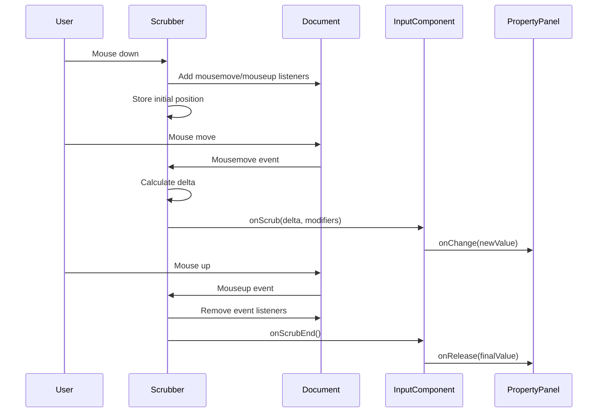

# Specialized editor input components

## Overview

Specialized editor input components are custom UI controls designed for editing specific data types within the iR Engine editor. Unlike standard form elements, these components provide intuitive interfaces tailored to the unique requirements of 3D editing, such as manipulating vectors, colors, and asset references. By offering visual feedback and specialized interaction patterns, these components significantly improve the editing experience, allowing users to make precise adjustments efficiently.

## Core components

The iR Engine UI framework includes several specialized input components for different data types:

### NumericInput

The `NumericInput` component provides enhanced functionality for editing numeric values:

```typescript
// Simplified from: src/components/editor/input/Numeric/index.tsx
import React from 'react';
import { Input } from '@ir-engine/ui';
import { Scrubber } from '../layout/Scrubber';

export const NumericInput = ({
  value,
  onChange,
  onRelease,
  smallStep = 0.1,
  mediumStep = 1,
  largeStep = 10,
  min,
  max,
  ...props
}) => {
  // Handle direct input changes
  const handleChange = (e) => {
    const newValue = parseFloat(e.target.value);
    if (!isNaN(newValue)) {
      onChange(clamp(newValue, min, max));
    }
  };
  
  // Handle scrubbing (click and drag)
  const handleScrub = (delta, modifiers) => {
    let step = smallStep;
    if (modifiers.shift) step = largeStep;
    else if (modifiers.alt) step = mediumStep;
    
    const newValue = value + (delta * step);
    onChange(clamp(newValue, min, max));
  };
  
  return (
    <div className="flex items-center">
      <Scrubber onScrub={handleScrub} onScrubEnd={onRelease}>
        <div className="cursor-ew-resize px-1">⋮</div>
      </Scrubber>
      <Input
        type="number"
        value={value}
        onChange={handleChange}
        onBlur={() => onRelease?.(value)}
        {...props}
      />
    </div>
  );
};
```

Key features:
- Numeric validation and formatting
- Min/max value constraints
- "Scrubbing" behavior (click and drag to adjust values)
- Step size control with modifier keys (Shift, Alt)

### Vector3Input

The `Vector3Input` component provides a specialized interface for editing 3D vectors:

```typescript
// Simplified from: src/components/editor/input/Vector3/index.tsx
import React from 'react';
import { NumericInput } from '../Numeric';
import { Vector3Scrubber } from './Vector3Scrubber';

export const Vector3Input = ({
  value, // { x, y, z } object
  onChange,
  onRelease,
  ...props
}) => {
  // Handle changes to individual axes
  const handleAxisChange = (axis) => (newValue) => {
    onChange({
      ...value,
      [axis]: newValue
    });
  };
  
  // Handle final value commitment
  const handleAxisRelease = (axis) => (finalValue) => {
    onRelease?.({
      ...value,
      [axis]: finalValue
    });
  };
  
  return (
    <div className="flex space-x-1">
      <div className="flex-1">
        <NumericInput
          value={value.x}
          onChange={handleAxisChange('x')}
          onRelease={handleAxisRelease('x')}
          prefix={
            <Vector3Scrubber
              axis="x"
              value={value.x}
              onChange={handleAxisChange('x')}
              onRelease={handleAxisRelease('x')}
            />
          }
          {...props}
        />
      </div>
      <div className="flex-1">
        <NumericInput
          value={value.y}
          onChange={handleAxisChange('y')}
          onRelease={handleAxisRelease('y')}
          prefix={
            <Vector3Scrubber
              axis="y"
              value={value.y}
              onChange={handleAxisChange('y')}
              onRelease={handleAxisRelease('y')}
            />
          }
          {...props}
        />
      </div>
      <div className="flex-1">
        <NumericInput
          value={value.z}
          onChange={handleAxisChange('z')}
          onRelease={handleAxisRelease('z')}
          prefix={
            <Vector3Scrubber
              axis="z"
              value={value.z}
              onChange={handleAxisChange('z')}
              onRelease={handleAxisRelease('z')}
            />
          }
          {...props}
        />
      </div>
    </div>
  );
};
```

Key features:
- Three coordinated numeric inputs (X, Y, Z)
- Per-axis scrubbing with color-coded labels
- Unified value object handling
- Optional uniform scaling mode

### ColorInput

The `ColorInput` component provides a visual interface for selecting colors:

```typescript
// Simplified from: src/primitives/tailwind/Color/index.tsx
import React, { useState } from 'react';
import { Sketch as SketchPicker } from '@uiw/react-color-sketch';
import { hexToRgb, rgbToHex } from '../../utils/colorConversion';

export const ColorInput = ({
  value, // RGB color object or hex string
  onChange,
  onRelease,
  ...props
}) => {
  const [isPickerOpen, setIsPickerOpen] = useState(false);
  
  // Convert internal color format to hex for display
  const hexColor = typeof value === 'string' ? value : rgbToHex(value);
  
  // Handle color picker changes
  const handleChange = (color) => {
    const newColor = hexToRgb(color.hex);
    onChange(newColor);
  };
  
  // Handle picker close
  const handleClose = () => {
    setIsPickerOpen(false);
    onRelease?.(value);
  };
  
  return (
    <div className="relative">
      <div
        className="w-8 h-8 rounded border border-ui-outline cursor-pointer"
        style={{ backgroundColor: hexColor }}
        onClick={() => setIsPickerOpen(!isPickerOpen)}
      />
      
      {isPickerOpen && (
        <div className="absolute z-10 mt-1">
          <div className="fixed inset-0" onClick={handleClose} />
          <SketchPicker
            color={hexColor}
            onChange={handleChange}
            onClose={handleClose}
          />
        </div>
      )}
    </div>
  );
};
```

Key features:
- Color swatch preview
- Popup color picker with RGB, HSL, and hex input
- Alpha channel support
- Color format conversion utilities

### TextureInput

The `TextureInput` component provides an interface for selecting and previewing texture assets:

```typescript
// Simplified from: src/components/editor/input/Texture/index.tsx
import React, { useState, useEffect } from 'react';
import { FileBrowserInput } from '../FileBrowser';
import { assetManager } from '@ir-engine/core';

export const TextureInput = ({
  value, // Texture path or URL
  onChange,
  onRelease,
  showPreview = true,
  ...props
}) => {
  const [previewSrc, setPreviewSrc] = useState('');
  
  // Load preview when texture path changes
  useEffect(() => {
    if (value && showPreview) {
      assetManager.getTexturePreview(value)
        .then(previewUrl => setPreviewSrc(previewUrl))
        .catch(() => setPreviewSrc(''));
    } else {
      setPreviewSrc('');
    }
  }, [value, showPreview]);
  
  return (
    <div className="flex flex-col">
      {showPreview && previewSrc && (
        <div className="mb-2 border border-ui-outline rounded overflow-hidden">
          
        </div>
      )}
      
      <FileBrowserInput
        value={value}
        onChange={onChange}
        onRelease={onRelease}
        acceptFileTypes={['.png', '.jpg', '.jpeg', '.webp']}
        {...props}
      />
    </div>
  );
};
```

Key features:
- File path input with browse button
- Texture preview thumbnail
- File type filtering
- Integration with asset management system

### SelectInput

The `SelectInput` component provides a dropdown interface for selecting from predefined options:

```typescript
// Simplified from: src/components/editor/input/Select/index.tsx
import React from 'react';
import { Select } from '@ir-engine/ui';

export const SelectInput = ({
  value,
  onChange,
  options, // Array of { label, value } objects
  ...props
}) => {
  const handleChange = (e) => {
    onChange(e.target.value);
  };
  
  return (
    <Select
      value={value}
      onChange={handleChange}
      {...props}
    >
      {options.map(option => (
        <option key={option.value} value={option.value}>
          {option.label}
        </option>
      ))}
    </Select>
  );
};
```

Key features:
- Structured options with labels and values
- Consistent styling with other inputs
- Support for option groups
- Searchable variant for long option lists

## InputGroup container

The `InputGroup` component provides consistent layout and labeling for input components:

```typescript
// Simplified from: src/components/editor/input/Group/index.tsx
import React from 'react';
import { Label } from '@ir-engine/ui';
import { Tooltip } from '@ir-engine/ui';
import { LuInfo } from 'react-icons/lu';

export const InputGroup = ({
  name,
  label,
  info,
  children,
  ...props
}) => {
  return (
    <div className="mb-2" {...props}>
      <div className="flex items-center mb-1">
        <Label htmlFor={name} className="text-xs font-medium">
          {label}
        </Label>
        
        {info && (
          <Tooltip content={info}>
            <div className="ml-1 text-text-secondary">
              <LuInfo size={12} />
            </div>
          </Tooltip>
        )}
      </div>
      
      <div>
        {children}
      </div>
    </div>
  );
};
```

Key features:
- Consistent spacing and alignment
- Label with optional tooltip for additional information
- Accessible labeling with proper HTML semantics
- Flexible container for any input component

## Scrubbing functionality

Many specialized inputs implement "scrubbing" behavior, allowing users to click and drag to adjust values:

```typescript
// Simplified from: src/components/editor/layout/Scrubber.tsx
import React, { useRef, useCallback } from 'react';

export const Scrubber = ({
  children,
  onScrub,
  onScrubEnd,
  sensitivity = 1,
}) => {
  const isDragging = useRef(false);
  const lastPosition = useRef({ x: 0, y: 0 });
  
  // Start scrubbing on mouse down
  const handleMouseDown = useCallback((e) => {
    isDragging.current = true;
    lastPosition.current = { x: e.clientX, y: e.clientY };
    
    // Capture mouse events on the entire document
    document.addEventListener('mousemove', handleMouseMove);
    document.addEventListener('mouseup', handleMouseUp);
    
    e.preventDefault();
  }, []);
  
  // Calculate delta and call onScrub during mouse movement
  const handleMouseMove = useCallback((e) => {
    if (!isDragging.current) return;
    
    const deltaX = (e.clientX - lastPosition.current.x) * sensitivity;
    
    // Determine modifier keys
    const modifiers = {
      shift: e.shiftKey,
      alt: e.altKey,
      ctrl: e.ctrlKey
    };
    
    onScrub(deltaX, modifiers);
    
    lastPosition.current = { x: e.clientX, y: e.clientY };
  }, [onScrub, sensitivity]);
  
  // End scrubbing on mouse up
  const handleMouseUp = useCallback(() => {
    if (isDragging.current) {
      isDragging.current = false;
      onScrubEnd?.();
      
      // Remove document-level event listeners
      document.removeEventListener('mousemove', handleMouseMove);
      document.removeEventListener('mouseup', handleMouseUp);
    }
  }, [onScrubEnd]);
  
  return (
    <div
      className="cursor-ew-resize"
      onMouseDown={handleMouseDown}
    >
      {children}
    </div>
  );
};
```

The scrubbing workflow follows this sequence:



## Usage examples

### Basic property editing

```jsx
import { InputGroup, NumericInput } from '@ir-engine/ui';

function LightIntensityEditor({ entity }) {
  const lightComponent = useComponent(entity, LightComponent);
  
  return (
    <InputGroup 
      name="intensity" 
      label="Light intensity"
      info="Controls how bright the light appears"
    >
      <NumericInput
        value={lightComponent.intensity.value}
        onChange={updateProperty(LightComponent, 'intensity')}
        onRelease={commitProperty(LightComponent, 'intensity')}
        min={0}
        max={10}
        smallStep={0.1}
      />
    </InputGroup>
  );
}
```

### Vector property editing

```jsx
import { InputGroup, Vector3Input } from '@ir-engine/ui';

function PositionEditor({ entity }) {
  const transformComponent = useComponent(entity, TransformComponent);
  
  return (
    <InputGroup 
      name="position" 
      label="Position"
    >
      <Vector3Input
        value={transformComponent.position.value}
        onChange={updateProperty(TransformComponent, 'position')}
        onRelease={commitProperty(TransformComponent, 'position')}
      />
    </InputGroup>
  );
}
```

### Material property editing

```jsx
import { InputGroup, ColorInput, TextureInput, SelectInput } from '@ir-engine/ui';

function MaterialEditor({ entity }) {
  const materialComponent = useComponent(entity, MaterialComponent);
  
  const blendModes = [
    { label: 'Normal', value: 'normal' },
    { label: 'Additive', value: 'additive' },
    { label: 'Multiply', value: 'multiply' }
  ];
  
  return (
    <>
      <InputGroup name="baseColor" label="Base color">
        <ColorInput
          value={materialComponent.color.value}
          onChange={updateProperty(MaterialComponent, 'color')}
          onRelease={commitProperty(MaterialComponent, 'color')}
        />
      </InputGroup>
      
      <InputGroup name="albedoMap" label="Albedo texture">
        <TextureInput
          value={materialComponent.albedoMap.value}
          onChange={updateProperty(MaterialComponent, 'albedoMap')}
          onRelease={commitProperty(MaterialComponent, 'albedoMap')}
        />
      </InputGroup>
      
      <InputGroup name="blendMode" label="Blend mode">
        <SelectInput
          value={materialComponent.blendMode.value}
          options={blendModes}
          onChange={updateProperty(MaterialComponent, 'blendMode')}
        />
      </InputGroup>
    </>
  );
}
```

## Next steps

With an understanding of the specialized input components that enable intuitive property editing, the next chapter explores the icon system that provides visual cues throughout the UI.

Next: [Icon system](04_icon_system_.md)

---


