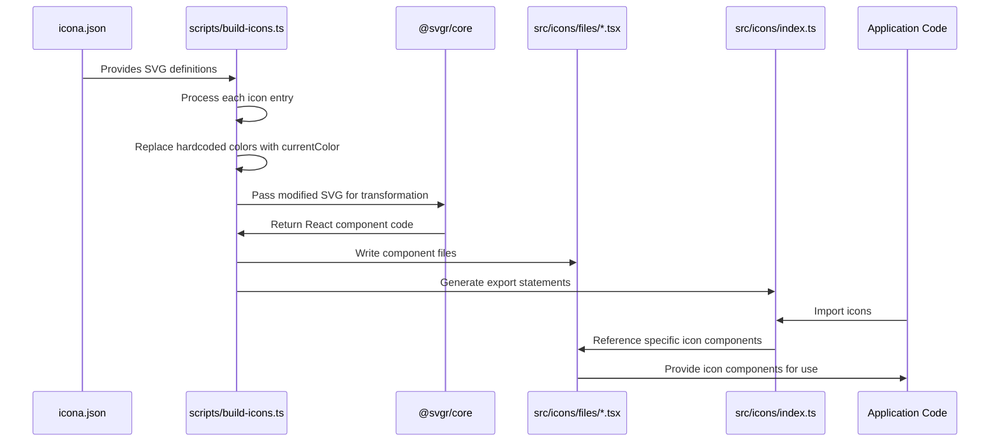

# Icon system

## Overview

The icon system provides a comprehensive framework for managing and using visual symbols throughout the iR Engine UI. It transforms raw SVG icon definitions into standardized React components that can be easily imported and used in the application. By automating the icon generation process and ensuring consistent behavior, the system enables developers to efficiently incorporate visual cues that enhance usability and aesthetics. The icons automatically adapt to their context, inheriting colors and scaling appropriately based on the surrounding UI elements.

## Core components

The icon system consists of several key components that work together to create a streamlined workflow:

### Icon definitions

Icon definitions are stored in a central JSON file (`icona.json`) that serves as the source of truth for the icon library:

```json
// Simplified from: icona.json
{
  "admin-md": {
    "name": "AdminMd",
    "svg": "<svg xmlns=\"http://www.w3.org/2000/svg\" width=\"20\" height=\"20\" fill=\"none\" viewBox=\"0 0 20 20\"><path stroke=\"#111827\" stroke-linecap=\"round\" stroke-linejoin=\"round\" stroke-width=\"1.75\" d=\"M3.125 5.238A9.97 9.97 0 0 0 10 2.5a9.97 9.97 0 0 0 7.002 2.737c.323.984.498 2.035.498 3.126 0 4.66-3.187 8.575-7.5 9.685-4.313-1.11-7.5-5.025-7.5-9.685a10 10 0 0 1 .498-3.126Z\"/></svg>"
  },
  "save-01-md": {
    "name": "Save01Md",
    "svg": "<svg viewBox='0 0 20 20'><path d='...' fill='none' stroke='#000000'/></svg>"
  },
  // Additional icon definitions...
}
```

Each entry contains:
- A unique identifier key (e.g., `"admin-md"`)
- A `name` property that defines the React component name
- An `svg` property containing the raw SVG markup

### Build script

The build script (`scripts/build-icons.ts`) processes the icon definitions and generates React components:

```typescript
// Simplified from: scripts/build-icons.ts
import { transform } from '@svgr/core';
import fs from 'fs/promises';
import iconaJson from '../icona.json';

// Transform kebab-case to PascalCase for component names
function transformName(name: string) {
  const parts = name.split(/[^A-Za-z0-9]/gi);
  return parts.map((part) => part.charAt(0).toUpperCase() + part.slice(1)).join('');
}

async function buildIcons() {
  const componentNames = [];
  
  // Process each icon in the JSON file
  for (const [key, iconEntry] of Object.entries(iconaJson)) {
    const componentName = transformName(iconEntry.name);
    componentNames.push(componentName);
    
    // Replace hardcoded colors with currentColor for CSS styling
    const correctedSVG = iconEntry.svg
      .replace(/stroke=\"#\w{6}\"/gi, "stroke='currentColor'")
      .replace(/fill=\"#\w{6}\"/gi, "fill='currentColor'");
    
    // Convert SVG to React component
    const reactComponent = await transform(
      correctedSVG,
      {
        icon: true,
        dimensions: true,
        typescript: true,
        ref: true
      },
      { componentName }
    );
    
    // Write component to file if it doesn't exist
    const filePath = `./src/icons/files/${componentName}.tsx`;
    try {
      await fs.access(filePath);
      console.log(`${componentName} already exists, skipping...`);
    } catch {
      await fs.writeFile(filePath, reactComponent);
      console.log(`Created ${componentName}`);
    }
  }
  
  // Update index file with exports
  const componentExports = componentNames
    .sort()
    .map((name) => `export { default as ${name} } from './files/${name}'`)
    .join('\n');
  
  await fs.writeFile('./src/icons/index.ts', componentExports + '\n');
  console.log('Updated index.ts with all icon exports');
}

buildIcons().catch(console.error);
```

Key operations performed by the script:
1. Reading icon definitions from `icona.json`
2. Converting kebab-case names to PascalCase for React components
3. Replacing hardcoded colors with `currentColor` for dynamic styling
4. Using `@svgr/core` to transform SVG markup into React components
5. Writing each component to its own file in `src/icons/files/`
6. Generating an index file that exports all icon components

### Generated icon components

Each icon is transformed into a standardized React component:

```tsx
// Example of a generated icon component: src/icons/files/AdminMd.tsx
import type { SVGProps } from 'react';
import * as React from 'react';
import { Ref, forwardRef } from 'react';

const AdminMd = (props: SVGProps<SVGSVGElement>, ref: Ref<SVGSVGElement>) => (
  <svg
    xmlns="http://www.w3.org/2000/svg"
    width="1em"
    height="1em"
    fill="none"
    viewBox="0 0 20 20"
    role="img"
    ref={ref}
    {...props}
  >
    <path
      stroke="currentColor"
      strokeLinecap="round"
      strokeLinejoin="round"
      strokeWidth={1.75}
      d="M3.125 5.238A9.97 9.97 0 0 0 10 2.5a9.97 9.97 0 0 0 7.002 2.737c.323.984.498 2.035.498 3.126 0 4.66-3.187 8.575-7.5 9.685-4.313-1.11-7.5-5.025-7.5-9.685a10 10 0 0 1 .498-3.126z"
    />
  </svg>
);

const ForwardRef = forwardRef(AdminMd);
export default ForwardRef;
```

Key features of generated components:
- Default dimensions of `1em` to scale with text size
- Use of `currentColor` to inherit color from CSS
- Support for all standard SVG props
- Ref forwarding for direct DOM access
- Accessibility attributes (`role="img"`)

### Central export file

All icon components are exported from a central index file:

```typescript
// From: src/icons/index.ts
export { default as AdminMd } from './files/AdminMd';
export { default as AdminSm } from './files/AdminSm';
export { default as AlertCircleLg } from './files/AlertCircleLg';
export { default as Save01Md } from './files/Save01Md';
// Additional exports...
```

This provides a single import point for all icons, simplifying usage.

### Type definitions

Type definitions ensure proper usage of icon components:

```typescript
// From: src/icons/types.tsx
export type SVGIconType = React.ForwardRefExoticComponent<
  Omit<React.SVGProps<SVGSVGElement>, 'ref'> &
  React.RefAttributes<SVGSVGElement>
>;
```

These types provide TypeScript validation and IDE autocompletion when using icons.

## Icon generation workflow

The process of transforming raw SVG definitions into usable React components follows this workflow:



## Usage examples

### Basic icon usage

Icons can be imported and used like any React component:

```jsx
import { Save01Md } from '@ir-engine/ui/src/icons';

function SaveButton() {
  return (
    <button className="flex items-center">
      <Save01Md className="w-4 h-4 mr-2" />
      Save
    </button>
  );
}
```

The icon inherits the text color of its parent element and can be sized using CSS classes.

### Icon with custom styling

Icons can be customized with different colors and sizes:

```jsx
import { AlertCircleLg } from '@ir-engine/ui/src/icons';

function ErrorMessage({ message }) {
  return (
    <div className="flex items-center text-red-500">
      <AlertCircleLg className="w-5 h-5 mr-2" />
      <span>{message}</span>
    </div>
  );
}
```

In this example, both the icon and text will be red due to the `text-red-500` class on the parent.

### Icon in a button

Icons are commonly used in buttons to enhance visual communication:

```jsx
import { Button } from '@ir-engine/ui';
import { TrashMd } from '@ir-engine/ui/src/icons';

function DeleteButton({ onDelete }) {
  return (
    <Button variant="danger" onClick={onDelete}>
      <TrashMd className="w-4 h-4 mr-2" />
      Delete
    </Button>
  );
}
```

### Icon as a standalone element

Icons can also be used as standalone interactive elements:

```jsx
import { SettingsLg } from '@ir-engine/ui/src/icons';

function SettingsToggle({ onClick }) {
  return (
    <div 
      className="p-2 rounded-full hover:bg-gray-200 cursor-pointer"
      onClick={onClick}
      aria-label="Settings"
      role="button"
    >
      <SettingsLg className="w-6 h-6 text-gray-700" />
    </div>
  );
}
```

## Benefits of the icon system

The automated icon system provides several key advantages:

1. **Consistency**: All icons follow the same patterns for sizing, coloring, and behavior
2. **Maintainability**: Adding new icons requires only updating the source JSON file
3. **Performance**: Icons are optimized during the build process
4. **Developer experience**: TypeScript integration provides autocompletion and validation
5. **Flexibility**: Icons automatically adapt to their context through CSS inheritance
6. **Accessibility**: Generated components include appropriate ARIA attributes

## Next steps

With an understanding of how icons are managed and used throughout the UI, the next chapter explores a specific feature module that incorporates many of the UI components we've discussed so far: the chat feature.

Next: [Chat feature module](05_chat_feature_module_.md)

---


