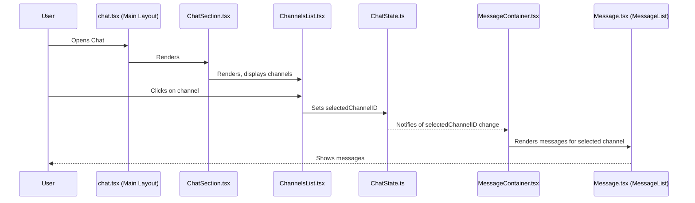

# Chat feature module

## Overview

The chat feature module provides a comprehensive real-time communication system that can be integrated into iR Engine applications. It enables users to exchange text messages, share media files, and participate in video calls without leaving the application. This module demonstrates how the UI primitives, specialized input components, and icon system can be combined to create a complex, interactive feature. By encapsulating all chat-related functionality in a cohesive module, the system maintains separation of concerns while providing a complete communication solution.

## Architecture

The chat feature module is organized into several key components that work together to create a complete communication interface:



### Main components

The module consists of several React components that handle different aspects of the chat interface:

1. **ChatPage (`chat.tsx`)**: The top-level component that serves as the entry point and layout container for the chat feature
2. **ChatSection (`ChatSection.tsx`)**: Manages the sidebar containing channel lists and user information
3. **ChannelsList (`ChannelsList.tsx`)**: Displays available chat channels and handles channel selection
4. **MessageContainer (`MessageContainer.tsx`)**: Renders the main message area based on the selected channel
5. **Message components (`Message.tsx`)**: Contains sub-components for message display and input
6. **VideoCall (`VideoCall.tsx` or `MediaCall.tsx`)**: Handles video communication interfaces

### State management

The module uses a dedicated state management system to track chat-specific information:

```typescript
// From: src/components/Chat/ChatState.ts
import { defineState } from '@ir-engine/hyperflux';

export const ChatState = defineState({
  name: 'ui.chat.ChatState',
  initial: () => ({
    selectedChannelID: null as string | null,
    isTyping: false,
    unreadMessages: {} as Record<string, number>,
    activeCall: null as string | null
    // Additional state properties
  })
});
```

This centralized state allows different components to:
- Track which channel is currently selected
- Monitor typing indicators
- Track unread message counts
- Manage active call information

## Implementation details

### ChatPage component

The `ChatPage` component serves as the main container for the chat interface:

```tsx
// From: src/pages/Chat/chat.tsx
import React from 'react';
import { ChatSection } from '@ir-engine/ui/src/components/Chat/ChatSection';
import { MessageContainer } from '@ir-engine/ui/src/components/Chat/Message';

export function ChatPage() {
  return (
    <div className="flex h-screen bg-ui-background">
      <ChatSection className="w-64 border-r border-ui-outline" />
      <MessageContainer className="flex-1" />
    </div>
  );
}
```

This component:
- Creates a full-height layout with a fixed-width sidebar and flexible main area
- Imports and composes the main chat components
- Applies appropriate styling using Tailwind classes

### ChatSection component

The `ChatSection` component manages the sidebar containing channels and user information:

```tsx
// From: src/components/Chat/ChatSection.tsx
import React from 'react';
import { ChannelsList } from './ChannelsList';
import { UserProfile } from './UserProfile';
import { SearchInput } from '@ir-engine/ui';

export const ChatSection = ({ className }) => {
  return (
    <div className={`flex flex-col ${className}`}>
      <div className="p-3 border-b border-ui-outline">
        <UserProfile />
      </div>
      
      <div className="p-3">
        <SearchInput 
          placeholder="Search channels" 
          onChange={handleSearch} 
        />
      </div>
      
      <div className="flex-1 overflow-y-auto">
        <ChannelsList />
      </div>
      
      <div className="p-3 border-t border-ui-outline">
        <UserStatus />
      </div>
    </div>
  );
};
```

This component:
- Provides a vertical layout with user profile at top and status at bottom
- Includes a search input for filtering channels
- Renders the `ChannelsList` in a scrollable container
- Uses UI primitives like `SearchInput` from the core framework

### ChannelsList component

The `ChannelsList` component displays available channels and handles selection:

```tsx
// From: src/components/Chat/ChannelsList.tsx
import React from 'react';
import { useMutableState } from '@ir-engine/hyperflux';
import { ChatState } from './ChatState';
import { HashtagMd, LockMd } from '@ir-engine/ui/src/icons';

export const ChannelsList = () => {
  const chatState = useMutableState(ChatState);
  const selectedChannelID = chatState.selectedChannelID.value;
  
  // Fetch channels from API or state
  const channels = useChannels();
  
  const handleChannelClick = (channelId) => {
    chatState.selectedChannelID.set(channelId);
  };
  
  return (
    <div className="space-y-1 py-2">
      {channels.map(channel => (
        <div 
          key={channel.id}
          className={`flex items-center px-3 py-2 rounded cursor-pointer ${
            selectedChannelID === channel.id ? 'bg-ui-hover-primary text-ui-primary' : 'hover:bg-ui-hover'
          }`}
          onClick={() => handleChannelClick(channel.id)}
        >
          {channel.isPrivate ? (
            <LockMd className="w-4 h-4 mr-2 text-text-secondary" />
          ) : (
            <HashtagMd className="w-4 h-4 mr-2 text-text-secondary" />
          )}
          <span className="truncate">{channel.name}</span>
          {channel.unreadCount > 0 && (
            <span className="ml-auto bg-ui-primary text-white rounded-full w-5 h-5 flex items-center justify-center text-xs">
              {channel.unreadCount}
            </span>
          )}
        </div>
      ))}
    </div>
  );
};
```

This component:
- Uses the `ChatState` to track and update the selected channel
- Displays channels with appropriate icons from the icon system
- Highlights the selected channel with different styling
- Shows unread message counts as badges
- Handles channel selection through click events

### MessageContainer component

The `MessageContainer` component manages the main message area:

```tsx
// From: src/components/Chat/MessageContainer.tsx
import React from 'react';
import { useHookstate } from '@hookstate/core';
import { getMutableState } from '@ir-engine/hyperflux';
import { ChatState } from './ChatState';
import { MessageHeader, MessageList, MessageInput } from './Message';
import { MediaCall } from './MediaCall';

export const MessageContainer = ({ className }) => {
  const selectedChannelID = useHookstate(getMutableState(ChatState).selectedChannelID).value;
  const activeCall = useHookstate(getMutableState(ChatState).activeCall).value;
  
  return (
    <div className={`flex flex-col ${className}`}>
      {selectedChannelID ? (
        <>
          <MessageHeader channelID={selectedChannelID} />
          
          <div className="flex-1 flex">
            <div className={`flex-1 flex flex-col ${activeCall ? 'md:w-1/2' : 'w-full'}`}>
              <MessageList channelID={selectedChannelID} />
              <MessageInput channelID={selectedChannelID} />
            </div>
            
            {activeCall && (
              <div className="hidden md:block md:w-1/2 border-l border-ui-outline">
                <MediaCall callID={activeCall} />
              </div>
            )}
          </div>
        </>
      ) : (
        <div className="flex-1 flex items-center justify-center text-text-secondary">
          <p>Select a channel to start chatting</p>
        </div>
      )}
    </div>
  );
};
```

This component:
- Observes the selected channel ID from `ChatState`
- Conditionally renders message components when a channel is selected
- Handles layout adjustments when a video call is active
- Provides a responsive design that adapts to different screen sizes

### Message components

The `Message.tsx` file contains several sub-components for handling different aspects of message display and input:

```tsx
// From: src/components/Chat/Message.tsx
import React, { useState } from 'react';
import { Button, Input } from '@ir-engine/ui';
import { SendMd, PhoneMd } from '@ir-engine/ui/src/icons';

// Message header with channel info and actions
export const MessageHeader = ({ channelID }) => {
  const channel = useChannel(channelID);
  
  const startCall = () => {
    // Initiate call logic
  };
  
  return (
    <div className="px-4 py-3 border-b border-ui-outline flex items-center">
      <h2 className="text-lg font-medium">{channel?.name || 'Unknown Channel'}</h2>
      <div className="ml-auto">
        <Button variant="secondary" onClick={startCall}>
          <PhoneMd className="w-4 h-4 mr-2" />
          Call
        </Button>
      </div>
    </div>
  );
};

// Message list that displays conversation history
export const MessageList = ({ channelID }) => {
  const messages = useMessages(channelID);
  
  return (
    <div className="flex-1 overflow-y-auto p-4 space-y-4">
      {messages.map(message => (
        <div key={message.id} className="flex">
          
          <div>
            <div className="flex items-baseline">
              <span className="font-medium">{message.sender.name}</span>
              <span className="ml-2 text-xs text-text-secondary">
                {formatTime(message.timestamp)}
              </span>
            </div>
            <p className="mt-1">{message.text}</p>
          </div>
        </div>
      ))}
    </div>
  );
};

// Message input for composing and sending messages
export const MessageInput = ({ channelID }) => {
  const [message, setMessage] = useState('');
  
  const sendMessage = () => {
    if (!message.trim()) return;
    
    // Send message logic
    console.log(`Sending message to ${channelID}: ${message}`);
    setMessage('');
  };
  
  return (
    <div className="p-4 border-t border-ui-outline">
      <div className="flex">
        <Input
          value={message}
          onChange={(e) => setMessage(e.target.value)}
          placeholder="Type a message..."
          onKeyDown={(e) => e.key === 'Enter' && sendMessage()}
          className="flex-1"
        />
        <Button 
          variant="primary" 
          onClick={sendMessage}
          disabled={!message.trim()}
          className="ml-2"
        >
          <SendMd className="w-4 h-4" />
        </Button>
      </div>
    </div>
  );
};
```

These components:
- Use UI primitives like `Button` and `Input` from the core framework
- Incorporate icons from the icon system
- Implement specific chat functionality like message display and sending
- Handle user interactions and state updates

### VideoCall component

The `VideoCall` or `MediaCall` component manages video communication:

```tsx
// From: src/components/Chat/MediaCall.tsx
import React from 'react';
import { Button } from '@ir-engine/ui';
import { MicMd, MicOffMd, VideoMd, VideoOffMd, PhoneOffMd } from '@ir-engine/ui/src/icons';

export const MediaCall = ({ callID }) => {
  const [isMuted, setMuted] = useState(false);
  const [isVideoEnabled, setVideoEnabled] = useState(true);
  const participants = useCallParticipants(callID);
  
  const toggleMute = () => setMuted(!isMuted);
  const toggleVideo = () => setVideoEnabled(!isVideoEnabled);
  const endCall = () => {
    // End call logic
  };
  
  return (
    <div className="flex flex-col h-full">
      <div className="p-3 border-b border-ui-outline">
        <h3 className="font-medium">Active Call ({participants.length})</h3>
      </div>
      
      <div className="flex-1 p-2 grid grid-cols-2 gap-2 overflow-y-auto">
        {participants.map(participant => (
          <div 
            key={participant.id} 
            className="aspect-video bg-ui-secondary rounded overflow-hidden relative"
          >
            {participant.videoStream ? (
              <video 
                srcObject={participant.videoStream} 
                autoPlay 
                muted={participant.isLocal}
              />
            ) : (
              <div className="absolute inset-0 flex items-center justify-center">
                <UserCircleLg className="w-12 h-12 text-text-secondary" />
              </div>
            )}
            <div className="absolute bottom-2 left-2 bg-black bg-opacity-50 text-white text-xs px-2 py-1 rounded">
              {participant.name} {participant.isLocal && '(You)'}
              {participant.isMuted && <MicOffMd className="w-3 h-3 ml-1 inline" />}
            </div>
          </div>
        ))}
      </div>
      
      <div className="p-3 border-t border-ui-outline flex justify-center space-x-2">
        <Button 
          variant={isMuted ? 'danger' : 'secondary'} 
          onClick={toggleMute}
        >
          {isMuted ? <MicOffMd className="w-5 h-5" /> : <MicMd className="w-5 h-5" />}
        </Button>
        <Button 
          variant={isVideoEnabled ? 'secondary' : 'danger'} 
          onClick={toggleVideo}
        >
          {isVideoEnabled ? <VideoMd className="w-5 h-5" /> : <VideoOffMd className="w-5 h-5" />}
        </Button>
        <Button variant="danger" onClick={endCall}>
          <PhoneOffMd className="w-5 h-5" />
        </Button>
      </div>
    </div>
  );
};
```

This component:
- Manages the video call interface with participant video streams
- Provides controls for microphone, camera, and call management
- Uses icons to represent call states and actions
- Handles responsive layout for multiple participants

## Usage example

To integrate the chat feature into an application:

```tsx
import React from 'react';
import { ChatPage } from '@ir-engine/ui/src/pages/Chat/chat';

function AppWithChat() {
  return (
    <div className="app-container">
      <header className="app-header">
        {/* App header content */}
      </header>
      
      <main className="app-content">
        <ChatPage />
      </main>
    </div>
  );
}
```

This example shows how the entire chat feature can be added to an application by simply importing and rendering the `ChatPage` component.

## Next steps

With an understanding of how a complex feature module like chat is structured, the next chapter explores the state management system that enables these components to share and react to data changes.

Next: [State management (Hyperflux)](06_state_management__hyperflux__.md)

---


