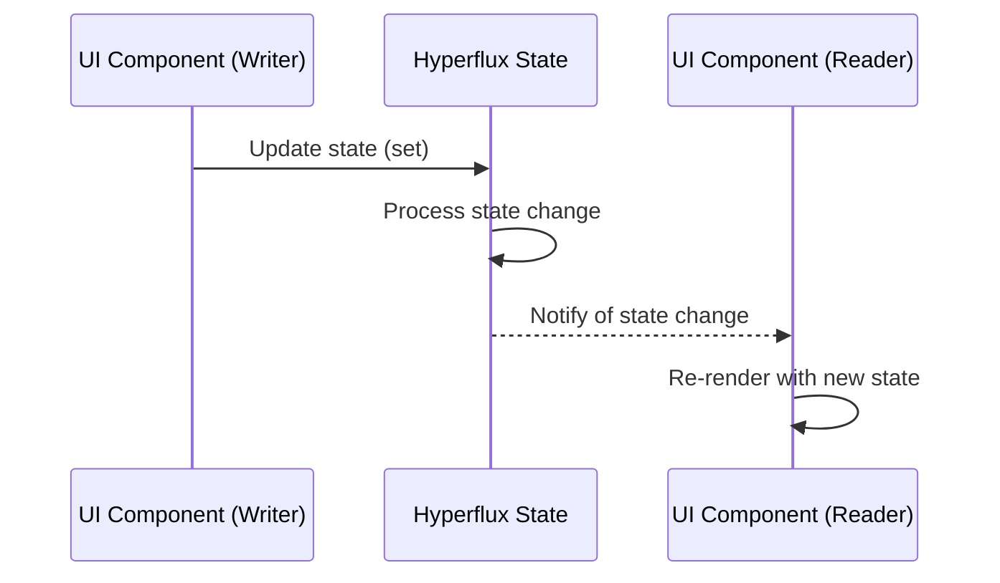
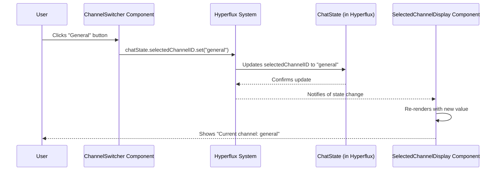

# State management (Hyperflux)

## Overview

State management is a critical aspect of modern UI development, particularly for complex applications like the iR Engine. Hyperflux is the state management system used throughout the iR Engine UI framework to maintain data consistency and enable reactive updates across components. It provides a centralized approach to managing both global application state and local component state, ensuring that UI elements automatically reflect the current data and remain synchronized. This chapter explores how Hyperflux works and how it's implemented in the iR Engine UI framework.

## Core concepts

### State

In UI development, "state" refers to any data that can change over time and affects what the user sees or how the application behaves. Examples include:

- Which item is currently selected
- Whether a dropdown menu is expanded or collapsed
- What text is entered in an input field
- Which user is currently logged in
- Which entities are currently visible

State management becomes increasingly important as applications grow in complexity, particularly when multiple components need access to the same data or when changes in one component need to be reflected in others.

### Hyperflux architecture

Hyperflux provides a structured approach to state management with several key components:

1. **State definitions**: Centralized declarations of state structures and their initial values
2. **State subscriptions**: Mechanisms for components to "listen" for changes to specific state values
3. **State mutations**: Methods for updating state in a controlled, predictable manner
4. **Automatic updates**: System for notifying and re-rendering components when relevant state changes

This architecture creates a unidirectional data flow that makes applications more predictable and easier to debug:



## Implementation

### Defining state

State is defined using the `defineState` function, which creates a centralized repository for a specific slice of application data:

```typescript
// From: src/components/Chat/ChatState.ts
import { defineState } from '@ir-engine/hyperflux';

export const ChatState = defineState({
  name: 'ui.chat.ChatState',  // Unique identifier for debugging
  initial: () => ({           // Initial state values
    selectedChannelID: null as string | null,
    isTyping: false,
    unreadMessages: {} as Record<string, number>
  })
});
```

This creates a state container with:
- A unique name for identification
- Initial values for all state properties
- Type definitions for proper TypeScript support

State definitions can also include helper functions for common operations:

```typescript
// From: src/components/editor/ComponentDropdown/ComponentDropdownState.ts
export const ComponentDropdownState = defineState({
  name: 'ComponentDropdownState',
  initial: () => ({
    componentStates: {} as Record<EntityUUID, Record<string, boolean>>
  }),
  
  // Helper function to update component state
  addOrUpdateEntity: (entity, componentName, value) => {
    const state = getMutableState(ComponentDropdownState);
    const entityUUID = getEntityUUID(entity);
    
    if (!state.componentStates[entityUUID]) {
      state.componentStates[entityUUID] = {};
    }
    
    state.componentStates[entityUUID][componentName] = value;
  }
});
```

### Reading state in components

Components can subscribe to state changes using the `useHookstate` hook:

```tsx
// Example component that displays the selected channel
import React from 'react';
import { useHookstate, getMutableState } from '@ir-engine/hyperflux';
import { ChatState } from './ChatState';

function SelectedChannelDisplay() {
  // Subscribe to the selectedChannelID state
  const selectedChannelID = useHookstate(getMutableState(ChatState).selectedChannelID);
  
  // Component will automatically re-render when selectedChannelID changes
  return (
    <div className="channel-header">
      Current channel: {selectedChannelID.value || 'None selected'}
    </div>
  );
}
```

Key points:
- `useHookstate` subscribes the component to changes in the specified state
- `.value` accesses the current state value
- The component automatically re-renders when the subscribed state changes

### Updating state

Components can modify state using the `useMutableState` hook:

```tsx
// Example component with buttons to change the selected channel
import React from 'react';
import { useMutableState } from '@ir-engine/hyperflux';
import { Button } from '@ir-engine/ui';
import { ChatState } from './ChatState';

function ChannelSwitcher() {
  // Get a mutable reference to the ChatState
  const chatState = useMutableState(ChatState);
  
  const handleSelectChannel = (channelId: string) => {
    // Update the selectedChannelID
    chatState.selectedChannelID.set(channelId);
  };
  
  return (
    <div className="channel-switcher">
      <Button onClick={() => handleSelectChannel('general')}>
        General
      </Button>
      <Button onClick={() => handleSelectChannel('random')}>
        Random
      </Button>
    </div>
  );
}
```

Key points:
- `useMutableState` provides access to modify the state
- `.set()` method updates a specific state property
- Changes are immediately reflected in all components subscribed to that state

### Non-component state access

For accessing state outside of React components (in utility functions, services, etc.), Hyperflux provides the `getMutableState` function:

```typescript
// Example utility function that works with state
import { getMutableState } from '@ir-engine/hyperflux';
import { ChatState } from './ChatState';

export function markChannelAsRead(channelId: string) {
  const chatState = getMutableState(ChatState);
  
  // Update unread message count for the channel
  const unreadMessages = { ...chatState.unreadMessages.value };
  unreadMessages[channelId] = 0;
  chatState.unreadMessages.set(unreadMessages);
  
  console.log(`Marked channel ${channelId} as read`);
}
```

This allows state to be accessed and modified from anywhere in the application, not just within React components.

## Practical examples

### Component dropdown state

The `ComponentDropdownState` manages which property sections are expanded or collapsed in the editor:

```typescript
// From: src/components/editor/ComponentDropdown/ComponentDropdownState.ts
import { defineState, getMutableState } from '@ir-engine/hyperflux';
import { getEntityUUID } from '@ir-engine/ecs';

export const ComponentDropdownState = defineState({
  name: 'ComponentDropdownState',
  initial: () => ({
    componentStates: {}
  })
});

// In the ComponentDropdown component
function ComponentDropdown({ entity, componentName, defaultExpanded = true }) {
  const entityUUID = getEntityUUID(entity);
  
  // Get the expanded state from global state or use default
  const isExpanded = useHookstate(
    getMutableState(ComponentDropdownState).componentStates[entityUUID]?.[componentName] ?? defaultExpanded
  );
  
  const toggleExpanded = () => {
    const state = getMutableState(ComponentDropdownState);
    if (!state.componentStates[entityUUID]) {
      state.componentStates[entityUUID] = {};
    }
    state.componentStates[entityUUID][componentName] = !isExpanded.value;
  };
  
  return (
    <div className="component-dropdown">
      <div className="header" onClick={toggleExpanded}>
        {componentName}
        {isExpanded.value ? '▼' : '►'}
      </div>
      {isExpanded.value && (
        <div className="content">
          {/* Component content */}
        </div>
      )}
    </div>
  );
}
```

This example shows how Hyperflux can manage UI state that persists across component instances, allowing the editor to remember which sections are expanded.

### Chat feature state

The chat feature uses Hyperflux to coordinate between multiple components:

```tsx
// In ChannelsList.tsx
function ChannelsList() {
  const chatState = useMutableState(ChatState);
  const selectedChannelID = useHookstate(getMutableState(ChatState).selectedChannelID);
  
  return (
    <div className="channels-list">
      {channels.map(channel => (
        <div
          key={channel.id}
          className={`channel ${selectedChannelID.value === channel.id ? 'selected' : ''}`}
          onClick={() => chatState.selectedChannelID.set(channel.id)}
        >
          {channel.name}
        </div>
      ))}
    </div>
  );
}

// In MessageContainer.tsx
function MessageContainer() {
  const selectedChannelID = useHookstate(getMutableState(ChatState).selectedChannelID);
  
  // Fetch messages for the selected channel
  const messages = useMessages(selectedChannelID.value);
  
  return (
    <div className="message-container">
      {selectedChannelID.value ? (
        <>
          <div className="messages">
            {messages.map(message => (
              <div key={message.id} className="message">
                {message.text}
              </div>
            ))}
          </div>
          <MessageInput channelID={selectedChannelID.value} />
        </>
      ) : (
        <div className="no-channel">Select a channel to start chatting</div>
      )}
    </div>
  );
}
```

This example demonstrates how Hyperflux enables different components to stay synchronized without direct communication between them.

## State update workflow

When state changes occur, Hyperflux follows this workflow:



This unidirectional flow ensures predictable updates and makes debugging easier.

## Key Hyperflux functions

### defineState

```typescript
defineState({
  name: string,
  initial: () => StateShape,
  ...additionalHelpers
})
```

Creates a new state definition with:
- `name`: A unique identifier for debugging
- `initial`: A function that returns the initial state values
- Optional helper methods for common operations on this state

### useHookstate

```typescript
useHookstate(stateValue)
```

A React hook that:
- Subscribes a component to changes in the specified state value
- Returns a state object with `.value` for reading and `.set()` for writing
- Causes the component to re-render when the state changes

### useMutableState

```typescript
useMutableState(StateDefinition)
```

A React hook that:
- Provides a mutable reference to an entire state definition
- Allows components to modify state without necessarily subscribing to changes
- Is typically used for writing to state rather than reading

### getMutableState

```typescript
getMutableState(StateDefinition)
```

A function that:
- Can be used anywhere, not just in React components
- Provides direct access to read or write state
- Is useful in utility functions, services, or helper methods

## Next steps

With an understanding of how state is managed throughout the UI framework, the next chapter explores how components are documented, tested, and showcased using Storybook integration.

Next: [Storybook integration](07_storybook_integration_.md)

---


