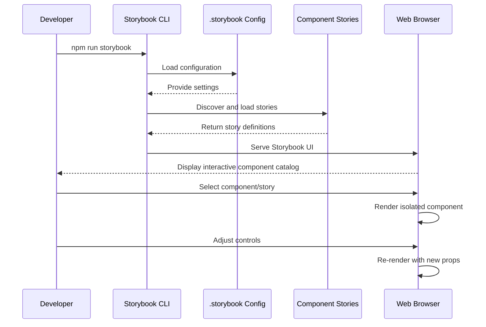

# Storybook integration

## Overview

Storybook integration provides a dedicated environment for developing, documenting, and testing UI components in isolation. It serves as an interactive component catalog that allows developers to view and interact with components outside the main application context. 

The iR Engine UI framework leverages Storybook extensively to showcase component variations, document usage patterns, and ensure visual consistency. This approach accelerates development by enabling focused work on individual components and facilitates collaboration by providing a shared reference for designers and developers.

## Core concepts

### Stories

Stories are the fundamental building blocks of Storybook. Each story represents a single state or variation of a component:

- A story captures a specific component configuration (props, state, context)
- Multiple stories can exist for a single component to demonstrate different variations
- Stories serve as both examples and documentation
- Stories can include interactive controls to manipulate component properties

### Component isolation

Storybook renders components in isolation from the main application:

- Components are displayed in a controlled environment
- Each component can be viewed and tested independently
- The rendering environment can be configured to provide necessary context
- Isolation helps identify issues that might be masked in the full application

### Addons

Storybook's functionality can be extended through addons:

- **Controls**: Allow interactive manipulation of component props
- **Actions**: Log and display event handler calls
- **Accessibility**: Perform automated accessibility checks
- **Docs**: Generate documentation from component code and stories
- **Viewport**: Test responsive behavior across different screen sizes

## Implementation

### Story files

Each component in the UI framework typically has an associated `.stories.tsx` file that defines its stories:

```typescript
// From: src/primitives/tailwind/Button/index.stories.tsx
import React from 'react';
import type { Meta, StoryObj } from '@storybook/react';
import Button from './index';
import { SendMd, SettingsMd } from '../../../icons';

// Define metadata for this component
const meta: Meta<typeof Button> = {
  title: 'Primitives/Button',  // Location in Storybook sidebar
  component: Button,           // The component being documented
  tags: ['autodocs'],          // Generate automatic documentation
  argTypes: {
    variant: {
      control: 'select',
      options: ['primary', 'secondary', 'tertiary', 'green', 'red'],
      description: 'The visual style of the button'
    },
    size: {
      control: 'select',
      options: ['xs', 'sm', 'l', 'xl'],
      description: 'The size of the button'
    },
    disabled: {
      control: 'boolean',
      description: 'Whether the button is disabled'
    }
  }
};

export default meta;
type Story = StoryObj<typeof Button>;

// Define individual stories
export const Primary: Story = {
  args: {
    variant: 'primary',
    children: 'Primary Button'
  }
};

export const Secondary: Story = {
  args: {
    variant: 'secondary',
    children: 'Secondary Button'
  }
};

export const WithIcon: Story = {
  args: {
    variant: 'primary',
    children: 'Send Message',
    startIcon: <SendMd className="w-4 h-4" />
  }
};

// Additional stories for other variations...
```

This file:
- Defines metadata about the Button component
- Specifies which props can be controlled in the Storybook UI
- Creates individual stories for different button variations
- Demonstrates how to use icons with buttons

### Storybook configuration

The Storybook environment is configured through files in the `.storybook` directory:

#### Main configuration

```typescript
// From: .storybook/main.ts
import type { StorybookConfig } from '@storybook/react-vite';
import { join, dirname } from 'path';

function getAbsolutePath(value: string): string {
  return dirname(require.resolve(join(value, 'package.json')));
}

const config: StorybookConfig = {
  // Define where to find story files
  stories: [
    '../src/primitives/tailwind/**/*.stories.@(js|jsx|ts|tsx)',
    '../src/components/editor/**/*.stories.@(js|jsx|ts|tsx)',
    '../src/icons/**/*.stories.@(js|jsx|ts|tsx)',
    '../src/pages/**/*.stories.@(js|jsx|ts|tsx)'
  ],
  
  // Configure addons
  addons: [
    getAbsolutePath('@storybook/addon-links'),
    getAbsolutePath('@storybook/addon-essentials'),
    getAbsolutePath('@storybook/addon-interactions'),
    getAbsolutePath('@storybook/addon-a11y')
  ],
  
  // Use Vite as the build tool
  framework: {
    name: getAbsolutePath('@storybook/react-vite'),
    options: {}
  },
  
  // Additional configuration...
};

export default config;
```

This configuration:
- Specifies where to find story files in the project
- Configures which addons to use
- Sets up the build framework (Vite in this case)

#### Preview configuration

```tsx
// From: .storybook/preview.tsx
import React from 'react';
import { I18nextProvider } from 'react-i18next';
import { DndProvider } from 'react-dnd';
import { HTML5Backend } from 'react-dnd-html5-backend';
import i18n from './i18n';
import { ThemeProvider } from '@ir-engine/client-core';

// Global decorators wrap every story
export const decorators = [
  (Story) => (
    <ThemeProvider>
      <I18nextProvider i18n={i18n}>
        <DndProvider backend={HTML5Backend}>
          <div className="p-4 bg-ui-background">
            <Story />
          </div>
        </DndProvider>
      </I18nextProvider>
    </ThemeProvider>
  ),
];

// Default parameters for all stories
export const parameters = {
  actions: { argTypesRegex: '^on[A-Z].*' },
  controls: {
    matchers: {
      color: /(background|color)$/i,
      date: /Date$/,
    },
  },
  layout: 'centered',
};
```

This configuration:
- Provides global decorators that wrap every story
- Sets up necessary context providers (theme, i18n, drag-and-drop)
- Configures default parameters for all stories

#### Internationalization setup

```typescript
// From: .storybook/i18n.ts
import i18n from 'i18next';
import { initReactI18next } from 'react-i18next';
import enTranslation from '../src/locales/en/translation.json';

i18n
  .use(initReactI18next)
  .init({
    resources: {
      en: {
        translation: enTranslation
      }
    },
    lng: 'en',
    fallbackLng: 'en',
    interpolation: {
      escapeValue: false
    }
  });

export default i18n;
```

This configuration:
- Sets up internationalization for Storybook
- Loads translation resources
- Configures language settings

## Example stories

### UI primitives

The basic UI primitives have straightforward stories that demonstrate their variations:

```typescript
// From: src/primitives/tailwind/Input/index.stories.tsx
import React from 'react';
import type { Meta, StoryObj } from '@storybook/react';
import Input from './index';
import { SearchMd } from '../../../icons';

const meta: Meta<typeof Input> = {
  title: 'Primitives/Input',
  component: Input,
  tags: ['autodocs'],
  argTypes: {
    placeholder: { control: 'text' },
    disabled: { control: 'boolean' },
    error: { control: 'boolean' }
  }
};

export default meta;
type Story = StoryObj<typeof Input>;

export const Default: Story = {
  args: {
    placeholder: 'Enter text...'
  }
};

export const WithIcon: Story = {
  args: {
    placeholder: 'Search...',
    startIcon: <SearchMd className="w-4 h-4 text-text-secondary" />
  }
};

export const Disabled: Story = {
  args: {
    placeholder: 'Disabled input',
    disabled: true
  }
};

export const WithError: Story = {
  args: {
    placeholder: 'Error state',
    error: true
  }
};
```

### Complex components

More complex components often have stories that demonstrate interactive behavior:

```typescript
// From: src/components/editor/AudioVolumeVisualizer/index.stories.tsx
import React from 'react';
import type { Meta, StoryObj } from '@storybook/react';
import { AudioVolumeVisualizer } from './index';

const meta: Meta<typeof AudioVolumeVisualizer> = {
  title: 'Editor/AudioVolumeVisualizer',
  component: AudioVolumeVisualizer,
  parameters: {
    layout: 'centered',
  }
};

export default meta;
type Story = StoryObj<typeof AudioVolumeVisualizer>;

export const Default: Story = {
  args: {
    volume: 0.5,
    onChange: (value) => console.log('Volume changed:', value)
  }
};

export const Interactive: Story = {
  render: () => {
    const [volume, setVolume] = React.useState(0.5);
    
    return (
      <div className="p-4 flex flex-col items-center gap-4">
        <AudioVolumeVisualizer 
          volume={volume} 
          onChange={setVolume} 
        />
        <div className="text-sm">
          Current volume: {Math.round(volume * 100)}%
        </div>
      </div>
    );
  }
};
```

### Icon gallery

The icon system has a special story that displays all available icons:

```typescript
// From: src/icons/index.stories.tsx
import React from 'react';
import type { Meta } from '@storybook/react';
import * as Icons from './index';

const meta: Meta = {
  title: 'Icons/Gallery',
  parameters: {
    layout: 'centered',
  }
};

export default meta;

export const IconGallery = () => {
  const iconEntries = Object.entries(Icons);
  
  return (
    <div className="grid grid-cols-4 gap-4 max-w-4xl">
      {iconEntries.map(([name, Icon]) => (
        <div 
          key={name}
          className="flex flex-col items-center p-4 border border-ui-outline rounded"
        >
          <Icon className="w-8 h-8 mb-2 text-ui-primary" />
          <div className="text-xs text-center">{name}</div>
          <code className="text-xs mt-1 text-text-secondary">
            {`import { ${name} } from '@ir-engine/ui/icons'`}
          </code>
        </div>
      ))}
    </div>
  );
};
```

## Storybook workflow

The process of using Storybook follows this workflow:



## Benefits

Storybook integration provides several key benefits for the UI framework:

### Development benefits

- **Focused development**: Work on components in isolation without the complexity of the full application
- **Rapid iteration**: See changes immediately without navigating through the application
- **Edge case testing**: Easily test unusual prop combinations or states
- **Visual regression detection**: Identify unintended visual changes

### Documentation benefits

- **Living documentation**: Always up-to-date with the actual implementation
- **Interactive examples**: Demonstrate component behavior through interaction
- **Prop exploration**: Understand available props and their effects
- **Usage patterns**: Show recommended ways to use components

### Collaboration benefits

- **Design-development bridge**: Shared reference for designers and developers
- **Onboarding tool**: Help new team members understand the component library
- **Review aid**: Facilitate UI reviews with isolated components
- **Communication tool**: Discuss specific components without ambiguity

## Conclusion

Storybook integration is a vital part of the iR Engine UI framework, providing a dedicated environment for component development, documentation, and testing. By enabling isolated component work and interactive exploration, it accelerates development and improves collaboration. The comprehensive story catalog serves as both a development tool and living documentation, ensuring that the UI framework remains maintainable and accessible to all team members.

This concludes our exploration of the iR Engine UI framework. Throughout these chapters, we've covered the foundational UI primitives, specialized editor components, the icon system, the chat feature module, state management with Hyperflux, and now Storybook integration. Together, these systems provide a robust foundation for building complex, interactive user interfaces for the iR Engine.

---


