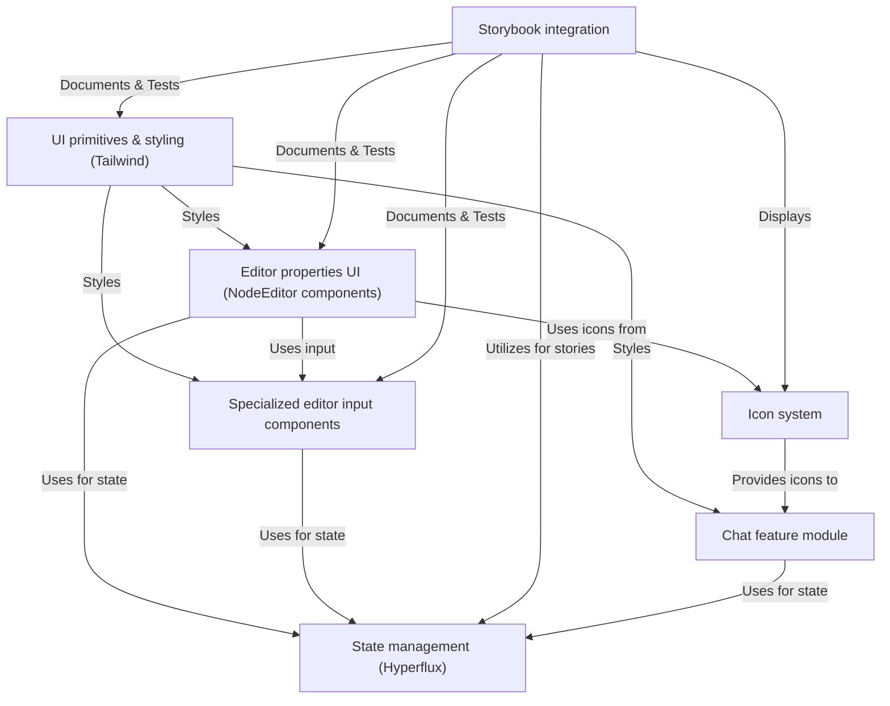

# UI framework

The iR Engine UI framework provides a comprehensive set of reusable components and tools for building the user interface of the iR Engine editor. It features a system for creating editor property panels with specialized input controls, a real-time chat module, and an integrated icon system. 

Styling is consistently applied using Tailwind CSS, and components are developed and documented with Storybook. State throughout the UI is managed by Hyperflux.

## System architecture

The UI framework consists of several interconnected components that work together to provide a cohesive user interface system:

## Key components

1. **UI primitives & styling**: Core UI components like buttons, inputs, and text elements styled with Tailwind CSS
2. **Editor properties UI**: Components for displaying and editing properties in the NodeEditor interface
3. **Specialized editor input components**: Custom input controls for specific data types and use cases
4. **Icon system**: A unified system for managing and displaying icons throughout the application
5. **Chat feature module**: Real-time communication functionality integrated into the editor
6. **State management**: Integration with Hyperflux for managing UI state
7. **Storybook integration**: Tools for documenting, testing, and showcasing UI components

## Documentation chapters

1. [UI primitives & styling (Tailwind)](01_ui_primitives___styling__tailwind__.md)
2. [Editor properties UI (NodeEditor components)](02_editor_properties_ui___nodeeditor__components__.md)
3. [Specialized editor input components](03_specialized_editor_input_components_.md)
4. [Icon system](04_icon_system_.md)
5. [Chat feature module](05_chat_feature_module_.md)
6. [State management (Hyperflux)](06_state_management__hyperflux__.md)
7. [Storybook integration](07_storybook_integration_.md)

---

