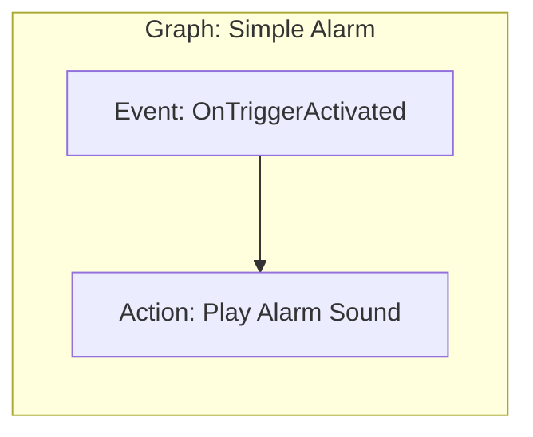
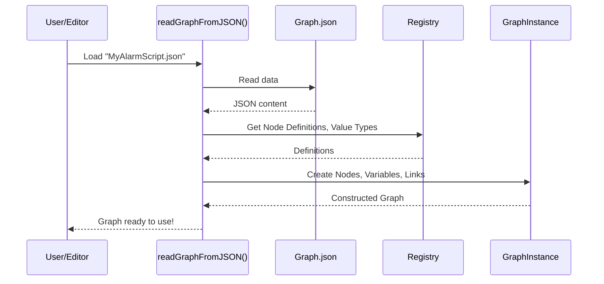

# Visual script graph

## Overview

The visual script graph is the foundational component of the iR Engine visual scripting system. It serves as the container and organizational structure for visual programming, providing a canvas where users arrange and connect nodes to create logical flows. Similar to a flowchart or blueprint, the graph defines both the components of a script and the relationships between them. 

This chapter explores the concept, structure, and implementation of visual script graphs within the iR Engine.

## Core concepts

### Graph as a container

A visual script graph functions as the primary container for all elements of a visual script:

1. **Nodes**: The graph holds all the visual script nodes that represent individual operations or functions
2. **Connections**: It maintains the links between nodes that define how data and execution flow
3. **Variables**: It manages script-level variables that can be accessed by multiple nodes
4. **Custom events**: It contains definitions for custom events that can trigger execution flows

The graph not only stores these elements but also defines their relationships and the overall structure of the script.

### Execution flow

One of the graph's most important functions is defining the execution flow of the script:

- Execution typically begins at designated entry point nodes
- It follows the connections between nodes in the direction specified by the links
- The graph's structure determines branching, looping, and conditional execution paths
- When execution reaches terminal nodes with no outgoing connections, that particular flow path ends

This flow-based approach allows users to visualize program execution in a way that's more intuitive than traditional text-based code.

## Implementation

### Graph data structure

The visual script graph is implemented as a structured data object that contains all the necessary information for the script:

```typescript
// Simplified from: src/engine/Graphs/Graph.ts
type GraphInstance = {
  name: string;                          // Descriptive name for the graph
  nodes: Record<string, NodeInstance>;   // Collection of all nodes in the graph
  variables: Record<string, Variable>;   // Graph-level variables
  customEvents: Record<string, CustomEvent>; // Custom event definitions
  metadata?: Metadata;                   // Additional information about the graph
};
```

This structure serves as the in-memory representation of a complete visual script, containing all the components needed for execution.

### Graph API

The graph provides an interface (`IGraph`) that allows nodes and other components to interact with it:

```typescript
// Simplified from: src/engine/Graphs/Graph.ts
interface IGraph {
  readonly variables: Record<string, Variable>;      // Access to variables
  readonly customEvents: Record<string, CustomEvent>; // Access to custom events
  readonly values: ValueTypeMap;                     // Access to value types
  readonly getDependency: <T>(id: string) => T | undefined; // Dependency injection
}
```

This interface enables nodes to:
- Access and modify graph variables
- Trigger or respond to custom events
- Retrieve information about available value types
- Access external dependencies or services

### Graph serialization

To save and load visual scripts, graphs are serialized to and from JSON format:

```typescript
// Simplified from: src/engine/Graphs/IO/GraphJSON.ts
type GraphJSON = {
  name: string;
  nodes: NodeJSON[];
  variables: VariableJSON[];
  customEvents: CustomEventJSON[];
  metadata?: MetadataJSON;
};
```

The serialization process involves:

1. **Writing**: Converting the in-memory `GraphInstance` to a JSON structure using `writeGraphToJSON`
2. **Reading**: Reconstructing a `GraphInstance` from JSON using `readGraphFromJSON`
3. **Validation**: Ensuring the graph structure is valid and consistent

This serialization enables graphs to be stored in files, shared between users, and version-controlled.

## Graph operations

### Creating a graph

A new graph can be created programmatically:

```typescript
// Simplified concept from: src/engine/Graphs/Graph.ts
function createGraph(name: string, registry: Registry): GraphInstance {
  return {
    name,
    nodes: {},
    variables: {},
    customEvents: {},
    metadata: { created: Date.now() }
  };
}
```

In practice, graphs are typically created through the visual editor interface, which provides a more intuitive way to build scripts.

### Adding nodes to a graph

Nodes are added to a graph using a function like:

```typescript
// Simplified concept from: src/engine/Graphs/Graph.ts
function addNodeToGraph(
  graph: GraphInstance, 
  nodeDefinition: NodeDefinition, 
  position: Vector2
): NodeInstance {
  const nodeId = generateUniqueId();
  const node = createNode(nodeDefinition, nodeId, position);
  
  graph.nodes[nodeId] = node;
  return node;
}
```

This function:
1. Creates a new node instance based on a node definition
2. Assigns it a unique identifier
3. Positions it on the graph canvas
4. Adds it to the graph's collection of nodes

### Connecting nodes

Connections between nodes are established by creating links between their sockets:

```typescript
// Simplified concept from: src/engine/Graphs/Graph.ts
function connectNodes(
  graph: GraphInstance,
  sourceNodeId: string,
  sourceSocketId: string,
  targetNodeId: string,
  targetSocketId: string
): boolean {
  const sourceNode = graph.nodes[sourceNodeId];
  const targetNode = graph.nodes[targetNodeId];
  
  if (!sourceNode || !targetNode) return false;
  
  const sourceSocket = sourceNode.outputs[sourceSocketId];
  const targetSocket = targetNode.inputs[targetSocketId];
  
  if (!sourceSocket || !targetSocket) return false;
  if (!areSocketsCompatible(sourceSocket, targetSocket)) return false;
  
  targetSocket.connectedTo = { nodeId: sourceNodeId, socketId: sourceSocketId };
  return true;
}
```

This function:
1. Retrieves the source and target nodes
2. Finds the specific output and input sockets
3. Verifies that the connection is valid (compatible types)
4. Establishes the link between the sockets

## Graph validation

Before execution, graphs are validated to ensure they have a consistent structure:

```typescript
// Simplified from: src/engine/Graphs/Validation/validateGraph.ts
function validateGraph(graph: GraphInstance): ValidationResult {
  const errors: ValidationError[] = [];
  
  // Check for orphaned nodes (no connections)
  for (const nodeId in graph.nodes) {
    const node = graph.nodes[nodeId];
    if (isOrphaned(node, graph)) {
      errors.push({
        type: 'orphaned-node',
        nodeId,
        message: `Node ${node.name} (${nodeId}) is not connected to any other node`
      });
    }
  }
  
  // Check for invalid connections
  for (const nodeId in graph.nodes) {
    const node = graph.nodes[nodeId];
    for (const inputId in node.inputs) {
      const input = node.inputs[inputId];
      if (input.connectedTo && !isValidConnection(input.connectedTo, graph)) {
        errors.push({
          type: 'invalid-connection',
          nodeId,
          socketId: inputId,
          message: `Invalid connection to input ${inputId} on node ${nodeId}`
        });
      }
    }
  }
  
  // Additional validation checks...
  
  return {
    valid: errors.length === 0,
    errors
  };
}
```

Validation helps catch issues like:
- Orphaned nodes with no connections
- Invalid connections between incompatible sockets
- Missing required connections
- Circular dependencies that could cause infinite loops

## Example use case

Let's examine a simple alarm system implemented as a visual script graph:



In this example:
1. The graph contains two nodes: an event node (`OnTriggerActivated`) and an action node (`Play Alarm Sound`)
2. There is one execution link connecting the output of the event node to the input of the action node
3. When the trigger is activated, execution flows from the event node to the action node
4. The action node plays the alarm sound

The corresponding graph data structure might look like:

```typescript
// Conceptual representation
const alarmGraph: GraphInstance = {
  name: "Simple Alarm",
  nodes: {
    "node1": {
      id: "node1",
      type: "OnTriggerActivated",
      position: { x: 100, y: 100 },
      inputs: {},
      outputs: {
        "exec": { type: "execution", connectedTo: { nodeId: "node2", socketId: "exec" } }
      }
    },
    "node2": {
      id: "node2",
      type: "PlaySound",
      position: { x: 300, y: 100 },
      inputs: {
        "exec": { type: "execution", connectedTo: { nodeId: "node1", socketId: "exec" } },
        "soundFile": { type: "string", value: "alarm.wav" }
      },
      outputs: {}
    }
  },
  variables: {},
  customEvents: {}
};
```

## Graph loading workflow

When a visual script is loaded, the graph goes through several processing stages:



This process involves:
1. Reading the serialized graph data from a JSON file
2. Consulting the registry to understand node types and value types
3. Creating node instances based on their definitions
4. Establishing connections between nodes
5. Setting up variables and custom events
6. Validating the reconstructed graph

## Next steps

With an understanding of the visual script graph as the container and organizational structure for visual scripts, the next chapter explores the individual building blocks that populate these graphs: visual script nodes.

Next: [Visual script node](02_visual_script_node_.md)

---


