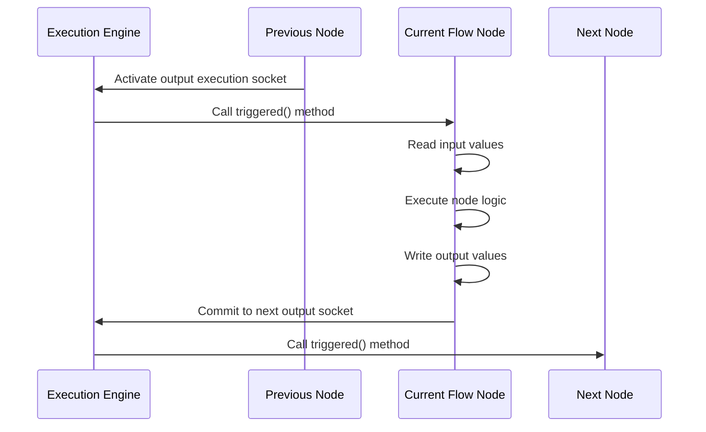
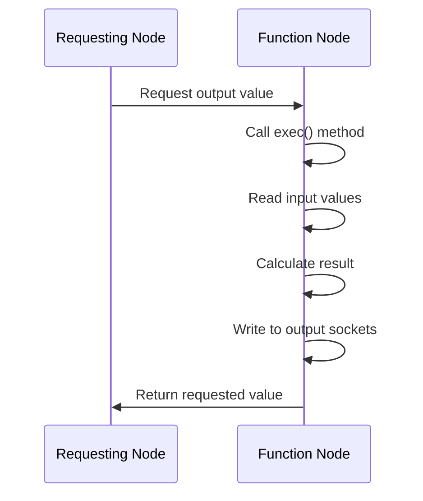
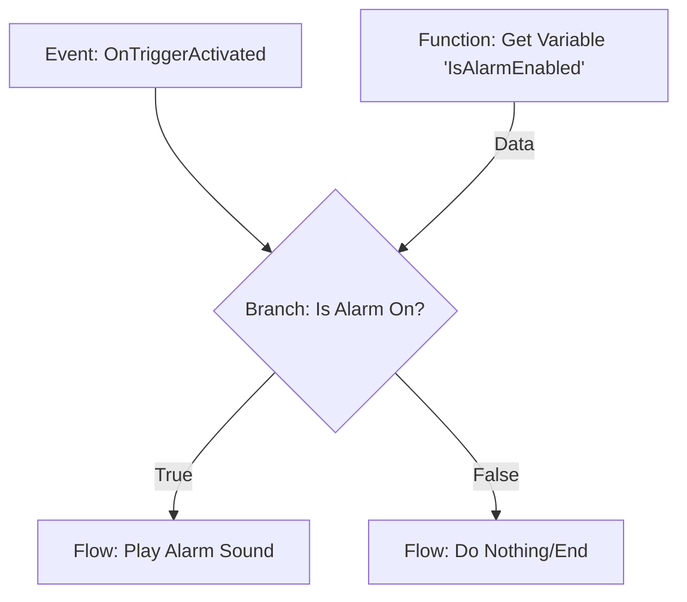

# Visual script node

## Overview

Visual script nodes are the fundamental building blocks of the iR Engine visual scripting system. Each node represents a specific operation, function, or action that can be performed within a visual script. Nodes are placed on the visual script graph and connected to create logical flows and data transformations. By combining different types of nodes, users can create complex behaviors without writing traditional code. This chapter explores the concept, structure, and implementation of visual script nodes within the iR Engine.

## Core concepts

### Node purpose and function

A visual script node serves as a discrete unit of functionality within a visual script:

- Each node performs a specific, well-defined task
- Nodes can process data, control execution flow, or trigger events
- Nodes communicate with each other through input and output sockets
- Multiple nodes work together to create complete logical operations

Nodes abstract complex operations into visual components that can be easily understood and manipulated, making programming more accessible to non-programmers.

### Node structure

Every node consists of several key components:

1. **Visual representation**: The node's appearance in the editor, typically a box with a title and connection points
2. **Input sockets**: Connection points that receive data or execution signals from other nodes
3. **Output sockets**: Connection points that send data or execution signals to other nodes
4. **Internal logic**: The code that defines what the node does when executed
5. **Configuration**: Node-specific settings that can be adjusted by the user

This structure allows nodes to be both self-contained units and interconnected parts of a larger system.

### Node types

The iR Engine categorizes nodes into several types based on their role in the execution flow:

```typescript
// From: src/engine/Nodes/NodeInstance.ts
enum NodeType {
  Event,    // Nodes that initiate execution flows
  Flow,     // Nodes that process execution flows
  Function, // Nodes that process data without execution flow
  Async     // Nodes that handle time-dependent operations
}
```

Each type has specific characteristics:

- **Event nodes**: Serve as entry points for execution, triggered by external events
  - Examples: "On Game Start", "On Mouse Click", "On Player Enters Area"
  - Have output execution sockets but no input execution sockets
  - Begin the flow of execution through the graph

- **Flow nodes**: Perform actions as part of an execution sequence
  - Examples: "Play Sound", "Move Object", "Branch (If/Else)"
  - Have both input and output execution sockets
  - Process data and determine the next steps in the execution flow

- **Function nodes**: Transform data without directly participating in execution flow
  - Examples: "Add Numbers", "Get Player Name", "Convert Text to Uppercase"
  - Typically have only data sockets, not execution sockets
  - Provide data to other nodes when requested

- **Async nodes**: Handle operations that take time to complete
  - Examples: "Wait for Seconds", "Load File", "Download Data"
  - Manage asynchronous operations without blocking the execution flow
  - Often have special handling in the execution engine

## Implementation

### Node interface

The core interface for all nodes is `INode`, which defines the essential properties and methods:

```typescript
// Simplified from: src/engine/Nodes/NodeInstance.ts
interface INode {
  description: INodeDescription;     // Metadata about the node type
  inputs: Socket[];                  // Input connection points
  outputs: Socket[];                 // Output connection points
  graph: IGraph;                     // Reference to the containing graph
  configuration: NodeConfiguration;  // Node-specific settings
  nodeType: NodeType;                // Event, Flow, Function, or Async
  label?: string;                    // Optional user-defined name
  metadata?: any;                    // Additional information
  
  // Methods for reading input values and writing output values
  readInput<T>(inputName: string): T;
  writeOutput<T>(outputName: string, value: T): void;
}
```

This interface ensures that all node types provide a consistent set of properties and behaviors, regardless of their specific functionality.

### Base node class

The `Node` abstract class implements the `INode` interface and provides common functionality for all node types:

```typescript
// Simplified from: src/engine/Nodes/Node.ts
export abstract class Node<TNodeType extends NodeType> implements INode {
  public readonly description: INodeDescription;
  public readonly inputs: Socket[];
  public readonly outputs: Socket[];
  public readonly graph: IGraph;
  public readonly configuration: NodeConfiguration;
  public readonly nodeType: TNodeType;
  public label?: string;
  public metadata?: any;
  
  constructor(
    description: INodeDescription,
    graph: IGraph,
    configuration: NodeConfiguration = {},
    nodeType: TNodeType
  ) {
    this.description = description;
    this.graph = graph;
    this.configuration = configuration;
    this.nodeType = nodeType;
    this.inputs = createInputSockets(description.inputs, this);
    this.outputs = createOutputSockets(description.outputs, this);
  }
  
  // Read a value from an input socket
  readInput = <T>(inputName: string): T => {
    const socket = this.inputs.find(s => s.name === inputName);
    if (!socket) throw new Error(`Input socket '${inputName}' not found`);
    return readInputFromSocket(socket) as T;
  };
  
  // Write a value to an output socket
  writeOutput = <T>(outputName: string, value: T): void => {
    const socket = this.outputs.find(s => s.name === outputName);
    if (!socket) throw new Error(`Output socket '${outputName}' not found`);
    writeOutputToSocket(socket, value);
  };
}
```

This base class:
- Initializes the node with its description, graph reference, and configuration
- Creates input and output sockets based on the node description
- Provides methods for reading input values and writing output values
- Handles common error checking and validation

### Specialized node classes

Specific node types extend the base `Node` class to implement their unique behaviors:

#### Event node

```typescript
// Simplified from: src/engine/Nodes/EventNode.ts
export class EventNode extends Node<NodeType.Event> {
  constructor(description: INodeDescription, graph: IGraph, configuration: NodeConfiguration = {}) {
    super(description, graph, configuration, NodeType.Event);
    
    // Validate that event nodes have no input execution sockets
    Assert.mustBeTrue(!this.inputs.some(socket => socket.valueTypeName === 'flow'));
    // Validate that event nodes have at least one output execution socket
    Assert.mustBeTrue(this.outputs.some(socket => socket.valueTypeName === 'flow'));
  }
  
  // Method to trigger the event
  trigger = (fiber: Fiber): void => {
    // Find the output execution socket
    const outputSocket = this.outputs.find(s => s.valueTypeName === 'flow');
    if (outputSocket) {
      // Continue execution through this socket
      fiber.commit(this, outputSocket.name);
    }
  };
}
```

#### Flow node

```typescript
// Simplified from: src/engine/Nodes/FlowNode.ts
export class FlowNode extends Node<NodeType.Flow> {
  constructor(description: INodeDescription, graph: IGraph, configuration: NodeConfiguration = {}) {
    super(description, graph, configuration, NodeType.Flow);
    
    // Validate that flow nodes have at least one input execution socket
    Assert.mustBeTrue(this.inputs.some(socket => socket.valueTypeName === 'flow'));
  }
  
  // Method called when the node is triggered by execution flow
  triggered = (fiber: Fiber, inputSocketName: string): void => {
    // Read input values
    const inputValues = this.gatherInputValues();
    
    // Execute node-specific logic
    const result = this.executeNodeLogic(inputValues);
    
    // Write output values
    this.applyOutputValues(result);
    
    // Continue execution through the appropriate output socket
    const outputSocketName = this.determineNextOutputSocket(result);
    fiber.commit(this, outputSocketName);
  };
  
  // These methods would be implemented by specific flow node types
  protected gatherInputValues(): any { /* ... */ }
  protected executeNodeLogic(inputs: any): any { /* ... */ }
  protected applyOutputValues(result: any): void { /* ... */ }
  protected determineNextOutputSocket(result: any): string { /* ... */ }
}
```

#### Function node

```typescript
// Simplified from: src/engine/Nodes/FunctionNode.ts
export class FunctionNode extends Node<NodeType.Function> {
  constructor(description: INodeDescription, graph: IGraph, configuration: NodeConfiguration = {}) {
    super(description, graph, configuration, NodeType.Function);
  }
  
  // Method called when another node requests data from this node
  exec = (): void => {
    // Read input values
    const inputValues = this.gatherInputValues();
    
    // Execute function logic
    const result = this.calculateResult(inputValues);
    
    // Write result to output sockets
    this.applyOutputValues(result);
  };
  
  // These methods would be implemented by specific function node types
  protected gatherInputValues(): any { /* ... */ }
  protected calculateResult(inputs: any): any { /* ... */ }
  protected applyOutputValues(result: any): void { /* ... */ }
}
```

## Node execution

The execution of nodes is managed by the execution engine, which follows these general steps:

### Flow node execution



1. The execution engine calls the node's `triggered` method
2. The node reads values from its input sockets
3. The node performs its specific logic
4. The node writes values to its output sockets
5. The node tells the execution engine which output execution socket to follow next

### Function node execution



1. Another node requests a value from the function node
2. The function node's `exec` method is called
3. The function node reads values from its input sockets
4. The function node calculates its result
5. The function node writes the result to its output sockets
6. The requesting node receives the value

## Example use case

Let's examine an enhanced alarm system implemented with visual script nodes:



In this example:

1. **Event node** (`OnTriggerActivated`): Initiates the execution flow when a trigger is activated
2. **Function node** (`Get Variable 'IsAlarmEnabled'`): Retrieves the current value of the "IsAlarmEnabled" variable
3. **Flow node** (`Branch: Is Alarm On?`): Checks the condition and directs execution to one of two paths
4. **Flow node** (`Play Alarm Sound`): Plays the alarm sound if the condition is true
5. **Flow node** (`Do Nothing/End`): Terminates the execution flow if the condition is false

The corresponding node instances might be structured like:

```typescript
// Conceptual representation
const triggerNode: EventNode = {
  nodeType: NodeType.Event,
  description: { name: "OnTriggerActivated", /* ... */ },
  inputs: [],
  outputs: [
    { name: "Triggered", valueTypeName: "flow", /* ... */ }
  ],
  /* ... */
};

const getVariableNode: FunctionNode = {
  nodeType: NodeType.Function,
  description: { name: "GetVariable", /* ... */ },
  inputs: [],
  outputs: [
    { name: "Value", valueTypeName: "boolean", /* ... */ }
  ],
  configuration: { variableName: "IsAlarmEnabled" },
  /* ... */
};

const branchNode: FlowNode = {
  nodeType: NodeType.Flow,
  description: { name: "Branch", /* ... */ },
  inputs: [
    { name: "Exec", valueTypeName: "flow", connectedTo: { nodeId: triggerNode.id, socketName: "Triggered" } },
    { name: "Condition", valueTypeName: "boolean", connectedTo: { nodeId: getVariableNode.id, socketName: "Value" } }
  ],
  outputs: [
    { name: "True", valueTypeName: "flow", /* ... */ },
    { name: "False", valueTypeName: "flow", /* ... */ }
  ],
  /* ... */
};

const playSoundNode: FlowNode = {
  nodeType: NodeType.Flow,
  description: { name: "PlaySound", /* ... */ },
  inputs: [
    { name: "Exec", valueTypeName: "flow", connectedTo: { nodeId: branchNode.id, socketName: "True" } },
    { name: "SoundFile", valueTypeName: "string", value: "alarm.wav" }
  ],
  outputs: [
    { name: "Completed", valueTypeName: "flow", /* ... */ }
  ],
  /* ... */
};
```

## Next steps

With an understanding of visual script nodes as the building blocks of visual scripts, the next chapter explores the connection mechanism that allows nodes to communicate with each other: sockets and links.

Next: [Socket & link](03_socket___link_.md)

---


