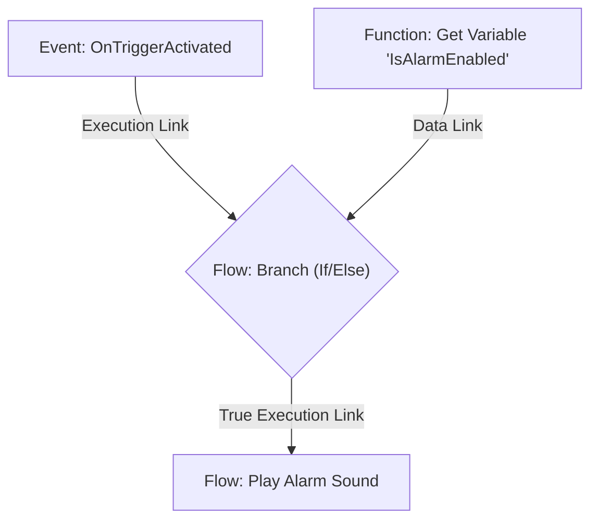
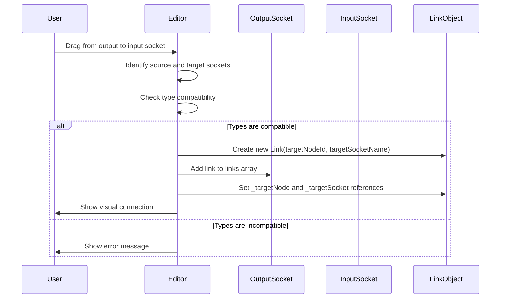

# Socket & link

## Overview

Sockets and links form the connection system of the iR Engine visual scripting framework. Sockets are the connection points on nodes that allow them to receive input or send output, while links are the connections between these sockets that define how data and execution flow through the visual script. Together, they create the pathways that enable nodes to communicate and work together to form a complete logical system. This chapter explores the concept, structure, and implementation of sockets and links within the iR Engine.

## Core concepts

### Socket purpose and types

Sockets serve as the interface points for nodes, allowing them to communicate with other nodes in the visual script:

1. **Input sockets**: Located on the left side of a node, these receive data or execution signals from other nodes
2. **Output sockets**: Located on the right side of a node, these send data or execution signals to other nodes

Sockets can handle two fundamental types of connections:

1. **Data sockets**: Transfer information values (numbers, strings, booleans, vectors, etc.) between nodes
2. **Execution sockets**: Transfer control flow signals that determine the order of node execution

This dual system allows visual scripts to manage both the flow of information and the sequence of operations.

### Link function

Links are the connections that join an output socket on one node to an input socket on another node:

- Links always flow from an output socket to an input socket
- A single output socket can connect to multiple input sockets (one-to-many relationship)
- An input socket can only connect to one output socket (many-to-one relationship)
- Links define both data pathways and execution sequences

By connecting nodes through links, users create the logical structure of their visual script.

## Implementation

### Socket implementation

The `Socket` class represents a connection point on a node:

```typescript
// Simplified from: src/engine/Sockets/Socket.ts
export class Socket {
  public readonly links: Link[] = []; // Links starting from this socket (if it's an output)
  
  constructor(
    public readonly valueTypeName: string, // Data type: "number", "string", "boolean", "flow", etc.
    public readonly name: string,          // Unique identifier: "Value", "Execute", etc.
    public value: any | undefined = undefined, // Current data value
    public readonly label: string | undefined = undefined, // Display name
    public readonly valueChoices?: string[] // Optional list of allowed values
  ) {}
  
  // Methods for managing connections and values
  connect(targetNode: INode, targetSocketName: string): Link { /* ... */ }
  disconnect(link: Link): boolean { /* ... */ }
  getValue(): any { /* ... */ }
  setValue(value: any): void { /* ... */ }
}
```

Key properties:
- `valueTypeName`: Defines what kind of data the socket can handle (e.g., "number", "string", "flow")
- `name`: A unique identifier for the socket within its node
- `value`: The actual data value stored in or transmitted through the socket
- `links`: For output sockets, an array of Link objects representing connections to input sockets

### Link implementation

The `Link` class represents a connection between two sockets:

```typescript
// Simplified from: src/engine/Nodes/Link.ts
export class Link {
  // References to the actual node and socket objects (resolved at runtime)
  public _targetNode: INode | undefined = undefined;
  public _targetSocket: Socket | undefined = undefined;
  
  constructor(
    public nodeId: string = '',     // ID of the target node
    public socketName: string = ''  // Name of the target socket
  ) {}
  
  // Methods for managing the connection
  isResolved(): boolean { return !!this._targetNode && !!this._targetSocket; }
  resolve(nodes: Map<string, INode>): boolean { /* ... */ }
  transmit(value: any): void { /* ... */ }
}
```

Key properties:
- `nodeId`: The unique identifier of the target node
- `socketName`: The name of the target socket on that node
- `_targetNode` and `_targetSocket`: Direct references to the actual node and socket objects

### Socket creation

Sockets are created when a node is instantiated, based on the node's definition:

```typescript
// Simplified from: src/engine/Nodes/Node.ts
function createInputSockets(
  inputDefinitions: SocketDefinition[],
  node: INode
): Socket[] {
  return inputDefinitions.map(def => {
    return new Socket(
      def.valueTypeName,
      def.name,
      def.defaultValue,
      def.label,
      def.valueChoices
    );
  });
}

function createOutputSockets(
  outputDefinitions: SocketDefinition[],
  node: INode
): Socket[] {
  return outputDefinitions.map(def => {
    return new Socket(
      def.valueTypeName,
      def.name,
      undefined, // Output sockets typically don't have default values
      def.label,
      def.valueChoices
    );
  });
}
```

These functions:
1. Take an array of socket definitions from the node's description
2. Create a new Socket instance for each definition
3. Return an array of Socket objects that the node can use for inputs or outputs

### Link creation

Links are created when the user connects two sockets in the visual editor:

```typescript
// Simplified concept from: src/engine/Graphs/Graph.ts
function connectSockets(
  sourceNode: INode,
  sourceSocketName: string,
  targetNode: INode,
  targetSocketName: string
): Link | null {
  // Find the source and target sockets
  const sourceSocket = sourceNode.outputs.find(s => s.name === sourceSocketName);
  const targetSocket = targetNode.inputs.find(s => s.name === targetSocketName);
  
  if (!sourceSocket || !targetSocket) {
    return null; // Socket not found
  }
  
  // Check if the connection is valid (compatible types)
  if (!areSocketsCompatible(sourceSocket, targetSocket)) {
    return null; // Incompatible socket types
  }
  
  // Create and store the link
  const link = new Link(targetNode.id, targetSocketName);
  link._targetNode = targetNode;
  link._targetSocket = targetSocket;
  sourceSocket.links.push(link);
  
  return link;
}
```

This function:
1. Finds the source output socket and target input socket
2. Validates that the connection is allowed (compatible types)
3. Creates a new Link object pointing to the target
4. Adds the link to the source socket's links array
5. Returns the created link

### Type compatibility

Before creating a link, the system checks if the sockets are compatible:

```typescript
// Simplified concept from: src/engine/Sockets/SocketCompatibility.ts
function areSocketsCompatible(
  sourceSocket: Socket,
  targetSocket: Socket
): boolean {
  // Check if both are execution sockets or both are data sockets
  if (sourceSocket.valueTypeName === 'flow' && targetSocket.valueTypeName === 'flow') {
    return true; // Execution sockets are always compatible with each other
  }
  
  if (sourceSocket.valueTypeName === 'flow' || targetSocket.valueTypeName === 'flow') {
    return false; // Can't connect execution to data or vice versa
  }
  
  // Check data type compatibility
  return isTypeCompatible(sourceSocket.valueTypeName, targetSocket.valueTypeName);
}

function isTypeCompatible(
  sourceType: string,
  targetType: string
): boolean {
  if (sourceType === targetType) {
    return true; // Exact match is always compatible
  }
  
  // Check for implicit conversions (e.g., int to float)
  const conversionTable = {
    'int': ['float', 'string'],
    'float': ['string'],
    // Additional conversion rules...
  };
  
  return conversionTable[sourceType]?.includes(targetType) || false;
}
```

This ensures that:
1. Execution sockets can only connect to other execution sockets
2. Data sockets can only connect to compatible data sockets
3. Some automatic type conversions are allowed (e.g., integer to float)

## Socket and link operations

### Reading input values

When a node needs to read a value from an input socket:

```typescript
// Simplified from: src/engine/Nodes/NodeSockets.ts
export function readInputFromSocket<T>(socket: Socket): T {
  // If the socket has a direct value, return it
  if (socket.value !== undefined) {
    return socket.value as T;
  }
  
  // Otherwise, we need to find which output socket is connected to this input
  // This is typically done by the execution engine, which maintains a map
  // of input sockets to their source output sockets
  
  // Find the source node and socket that connect to this input
  const sourceNodeAndSocket = findSourceForInputSocket(socket);
  
  if (!sourceNodeAndSocket) {
    return undefined as unknown as T; // No connection found
  }
  
  const { sourceNode, sourceSocket } = sourceNodeAndSocket;
  
  // If the source is a function node, we might need to execute it first
  if (sourceNode.nodeType === NodeType.Function) {
    sourceNode.exec(); // This will update the output socket's value
  }
  
  // Return the value from the source output socket
  return sourceSocket.value as T;
}
```

This function:
1. Checks if the socket has a direct value (e.g., a constant or user-set value)
2. If not, finds the output socket that's connected to this input
3. Ensures the source node has calculated its output value
4. Returns the value from the source output socket

### Writing output values

When a node needs to write a value to an output socket:

```typescript
// Simplified from: src/engine/Nodes/NodeSockets.ts
export function writeOutputToSocket<T>(socket: Socket, value: T): void {
  // Set the value on the output socket
  socket.value = value;
  
  // Propagate the value to all connected input sockets
  for (const link of socket.links) {
    if (link._targetSocket) {
      link._targetSocket.value = value;
    }
  }
}
```

This function:
1. Sets the value on the output socket
2. Propagates the value to all connected input sockets through links

### Execution flow

For execution sockets, the process is slightly different:

```typescript
// Simplified concept from: src/engine/Execution/Fiber.ts
export class Fiber {
  // ... other properties ...
  
  // Called by a node to continue execution through a specific output socket
  commit(node: INode, outputSocketName: string): void {
    // Find the output socket
    const outputSocket = node.outputs.find(s => s.name === outputSocketName);
    
    if (!outputSocket || outputSocket.valueTypeName !== 'flow') {
      return; // Not an execution socket or not found
    }
    
    // For each link from this output socket
    for (const link of outputSocket.links) {
      if (link._targetNode) {
        // Queue the target node for execution
        this.queueNodeExecution(link._targetNode, link._targetSocket!.name);
      }
    }
  }
  
  // Queue a node to be executed
  private queueNodeExecution(node: INode, inputSocketName: string): void {
    // Add to execution queue
    this.executionQueue.push({ node, inputSocketName });
    
    // If not already running, start processing the queue
    if (!this.isRunning) {
      this.processExecutionQueue();
    }
  }
  
  // Process the execution queue
  private processExecutionQueue(): void {
    this.isRunning = true;
    
    while (this.executionQueue.length > 0) {
      const { node, inputSocketName } = this.executionQueue.shift()!;
      
      // Execute the node
      if (node.nodeType === NodeType.Flow) {
        (node as FlowNode).triggered(this, inputSocketName);
      }
    }
    
    this.isRunning = false;
  }
}
```

This system:
1. Allows nodes to signal which output execution path to follow
2. Queues target nodes for execution
3. Processes the execution queue in the correct order

## Example use case

Let's examine the socket and link structure in our enhanced alarm system:



In this example:

1. **Execution link from Trigger to Branch**:
   - `Trigger` has an output execution socket named "Triggered"
   - `Branch` has an input execution socket named "Execute"
   - A link connects "Triggered" to "Execute"
   - When the trigger event occurs, execution flows through this link

2. **Data link from GetVar to Branch**:
   - `GetVar` has an output data socket named "Value" (type: boolean)
   - `Branch` has an input data socket named "Condition" (type: boolean)
   - A link connects "Value" to "Condition"
   - The branch node reads the boolean value through this link

3. **Execution link from Branch to PlaySound**:
   - `Branch` has an output execution socket named "True"
   - `PlaySound` has an input execution socket named "Execute"
   - A link connects "True" to "Execute"
   - If the condition is true, execution flows through this link

The socket and link objects might be structured like:

```typescript
// Conceptual representation
// Trigger node
const triggerNode = {
  // ...
  outputs: [
    new Socket("flow", "Triggered", undefined, "When triggered"),
  ],
  // ...
};

// GetVar node
const getVarNode = {
  // ...
  outputs: [
    new Socket("boolean", "Value", undefined, "Variable value"),
  ],
  // ...
};

// Branch node
const branchNode = {
  // ...
  inputs: [
    new Socket("flow", "Execute", undefined, "Execution input"),
    new Socket("boolean", "Condition", undefined, "Branch condition"),
  ],
  outputs: [
    new Socket("flow", "True", undefined, "If condition is true"),
    new Socket("flow", "False", undefined, "If condition is false"),
  ],
  // ...
};

// PlaySound node
const playSoundNode = {
  // ...
  inputs: [
    new Socket("flow", "Execute", undefined, "Play the sound"),
    new Socket("string", "SoundFile", "alarm.wav", "Sound file to play"),
  ],
  // ...
};

// Links
triggerNode.outputs[0].links.push(new Link(branchNode.id, "Execute"));
getVarNode.outputs[0].links.push(new Link(branchNode.id, "Condition"));
branchNode.outputs[0].links.push(new Link(playSoundNode.id, "Execute"));
```

## Link creation workflow

When a user creates a link in the visual editor, the following process occurs:



This process ensures that:
1. Only valid connections are created
2. The link is properly registered with the source socket
3. Direct references are established for efficient execution

## Next steps

With an understanding of how sockets and links enable communication between nodes, the next chapter explores how different types of nodes with their specific sets of sockets are defined in the system.

Next: [Node definition](04_node_definition_.md)

---


