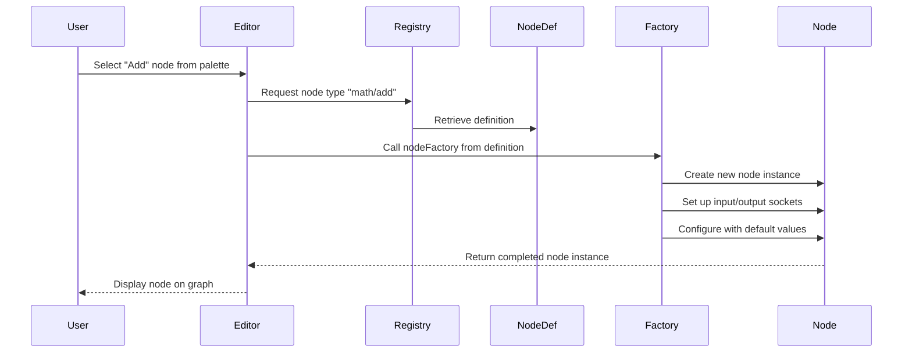

# Node definition

## Overview

Node definitions serve as the blueprints for all node types available in the iR Engine visual scripting system. They define the structure, behavior, and appearance of each type of node that can be used in visual scripts. 

By providing a formal specification for node types, node definitions enable the system to create consistent instances of nodes, validate connections between them, and execute their logic correctly. This chapter explores the concept, structure, and implementation of node definitions within the iR Engine.

## Core concepts

### Definition purpose

Node definitions serve several essential purposes in the visual scripting system:

1. **Type specification**: They define the unique characteristics of each node type
2. **Interface declaration**: They specify what inputs and outputs a node has
3. **Behavior implementation**: They contain the logic that executes when the node is activated
4. **Visual representation**: They provide information about how the node should appear in the editor
5. **Organization**: They categorize nodes to make them easier to find and use

By centralizing this information in a formal definition, the system can ensure consistency and provide a framework for extending the available node types.

### Definition components

A complete node definition includes several key components:

1. **Type identifier**: A unique string that identifies the node type (e.g., "math/add", "events/onTrigger")
2. **Category**: A grouping for organization in the editor (e.g., "Math", "Events", "Logic")
3. **Label**: The display name shown on the node in the visual editor
4. **Input sockets**: Specifications for all input connection points
5. **Output sockets**: Specifications for all output connection points
6. **Configuration properties**: Optional settings that can be adjusted on individual instances
7. **Execution logic**: The code that runs when the node is activated

These components provide all the information needed to create, display, and execute instances of the node type.

## Implementation

### Node definition interface

The core interface for node definitions is `INodeDefinition`:

```typescript
// Simplified from: src/engine/Nodes/NodeDefinitions.ts
export interface INodeDefinition<
  TInput extends SocketsDefinition = SocketsDefinition,
  TOutput extends SocketsDefinition = SocketsDefinition
> {
  typeName: string;              // Unique identifier (e.g., "math/add")
  category?: NodeCategory;       // Grouping for the editor (e.g., "Math")
  label?: string;                // Display name (e.g., "Add")
  helpDescription?: string;      // Documentation for the node
  
  in: TInput;                    // Input socket definitions
  out: TOutput;                  // Output socket definitions
  
  configuration?: NodeConfigurationDescription; // Configurable properties
  
  readonly nodeFactory: NodeFactory; // Function to create node instances
}
```

This interface defines the structure that all node definitions must follow, ensuring they provide all necessary information for the system.

### Socket definition

Input and output sockets are defined using the `SocketDefinition` interface:

```typescript
// Simplified from: src/engine/Nodes/NodeDefinitions.ts
export interface SocketDefinition {
  valueType: string;         // Data type (e.g., "number", "string", "flow")
  defaultValue?: any;        // Default value if no connection exists
  label?: string;            // Display name for the socket
  choices?: Choices;         // Optional list of allowed values
  description?: string;      // Documentation for the socket
}

// Sockets are typically defined in a map
export type SocketsMap = Record<string, SocketDefinition | string>;
```

Socket definitions specify:
- What type of data the socket accepts or provides
- Default values for input sockets when not connected
- Display information for the visual editor
- Any constraints on the values (e.g., a list of allowed options)

### Specialized node definitions

Different types of nodes have specialized definition interfaces that extend the base `INodeDefinition`:

#### Function node definition

For nodes that process data without participating in execution flow:

```typescript
// Simplified from: src/engine/Nodes/NodeDefinitions.ts
export interface IFunctionNodeDefinition<
  TInput extends SocketsDefinition = SocketsDefinition,
  TOutput extends SocketsDefinition = SocketsDefinition
> extends INodeDefinition<TInput, TOutput> {
  exec: (context: {
    read: <T>(inputName: string) => T;
    write: <T>(outputName: string, value: T) => void;
    configuration: Record<string, any>;
  }) => void;
}
```

The `exec` function defines the node's data processing logic, with helpers for reading inputs and writing outputs.

#### Flow node definition

For nodes that participate in execution flow:

```typescript
// Simplified from: src/engine/Nodes/NodeDefinitions.ts
export interface IFlowNodeDefinition<
  TInput extends SocketsDefinition = SocketsDefinition,
  TOutput extends SocketsDefinition = SocketsDefinition
> extends INodeDefinition<TInput, TOutput> {
  triggered: (context: {
    read: <T>(inputName: string) => T;
    write: <T>(outputName: string, value: T) => void;
    configuration: Record<string, any>;
    commit: (outputFlowName: string) => void;
  }) => void;
}
```

The `triggered` function includes all the capabilities of `exec` plus a `commit` function to continue execution through a specific output flow socket.

#### Event node definition

For nodes that initiate execution flow:

```typescript
// Simplified from: src/engine/Nodes/NodeDefinitions.ts
export interface IEventNodeDefinition<
  TInput extends SocketsDefinition = SocketsDefinition,
  TOutput extends SocketsDefinition = SocketsDefinition
> extends INodeDefinition<TInput, TOutput> {
  init: (context: {
    trigger: (outputFlowName: string) => void;
    configuration: Record<string, any>;
  }) => void;
  dispose?: () => void;
}
```

The `init` function sets up event listeners, and the `trigger` function initiates execution flow when the event occurs.

### Helper functions

The system provides helper functions to simplify the creation of node definitions:

```typescript
// Simplified from: src/engine/Nodes/NodeDefinitions.ts
export function makeFunctionNodeDefinition<
  TInput extends SocketsDefinition = SocketsDefinition,
  TOutput extends SocketsDefinition = SocketsDefinition
>(definition: Omit<IFunctionNodeDefinition<TInput, TOutput>, 'nodeFactory'>): 
  IFunctionNodeDefinition<TInput, TOutput> {
  
  // Create the node factory function
  const nodeFactory: NodeFactory = (graph, configuration) => {
    // Create a new function node instance
    const node = new FunctionNodeInstance(
      definition,
      graph,
      configuration || {}
    );
    
    return node;
  };
  
  // Return the complete definition with the factory
  return {
    ...definition,
    nodeFactory
  };
}
```

Similar helper functions exist for other node types (`makeFlowNodeDefinition`, `makeEventNodeDefinition`, etc.). These functions:
1. Take a partial definition without the `nodeFactory`
2. Create an appropriate factory function for the node type
3. Return a complete definition with the factory attached

## Example: "Add" node definition

Let's examine a complete definition for a simple "Add" node that adds two numbers:

```typescript
// Example of a function node definition
const addNodeDefinition = makeFunctionNodeDefinition({
  typeName: 'math/add',
  category: 'Math',
  label: 'Add',
  helpDescription: 'Adds two numbers together',
  
  // Input socket definitions
  in: {
    numberA: { 
      valueType: 'number', 
      label: 'Number A',
      defaultValue: 0
    },
    numberB: { 
      valueType: 'number', 
      label: 'Number B',
      defaultValue: 0
    }
  },
  
  // Output socket definitions
  out: {
    sum: { 
      valueType: 'number', 
      label: 'Sum'
    }
  },
  
  // Node logic
  exec: ({ read, write }) => {
    // Read input values
    const a = read<number>('numberA');
    const b = read<number>('numberB');
    
    // Calculate result
    const sum = a + b;
    
    // Write to output
    write<number>('sum', sum);
  }
});
```

This definition:
1. Identifies the node as "math/add" in the "Math" category
2. Specifies two input sockets for numbers, with default values of 0
3. Defines one output socket for the sum
4. Implements the logic to add the inputs and write the result to the output

## Node creation process

When a user adds a node to a visual script graph, the system follows this process:



1. The user selects a node type from the editor palette
2. The editor requests the node definition from the registry
3. The editor calls the `nodeFactory` function from the definition
4. The factory creates a new node instance with the appropriate structure
5. The factory sets up input and output sockets based on the definition
6. The factory configures the node with any default values
7. The completed node instance is returned to the editor
8. The editor displays the node on the graph

## Node execution

When a node is executed during script runtime, the system uses the definition's logic:

### Function node execution

```typescript
// Simplified concept from: src/engine/Nodes/FunctionNode.ts
function executeFunctionNode(node: FunctionNodeInstance): void {
  // Get the node definition
  const definition = node.definition as IFunctionNodeDefinition;
  
  // Create the execution context
  const context = {
    read: <T>(inputName: string): T => {
      // Find the input socket
      const socket = node.inputs.find(s => s.name === inputName);
      if (!socket) throw new Error(`Input socket '${inputName}' not found`);
      
      // Read the value from the socket
      return readInputFromSocket(socket) as T;
    },
    
    write: <T>(outputName: string, value: T): void => {
      // Find the output socket
      const socket = node.outputs.find(s => s.name === outputName);
      if (!socket) throw new Error(`Output socket '${outputName}' not found`);
      
      // Write the value to the socket
      writeOutputToSocket(socket, value);
    },
    
    configuration: node.configuration
  };
  
  // Execute the node's logic
  definition.exec(context);
}
```

This process:
1. Retrieves the node's definition
2. Creates a context with helper functions for reading inputs and writing outputs
3. Calls the definition's `exec` function with this context
4. The `exec` function reads inputs, performs calculations, and writes outputs

## Next steps

With an understanding of how node definitions specify the structure and behavior of node types, the next chapter explores the data types that can flow through sockets, known as value types.

Next: [ValueType](05_valuetype_.md)

---


