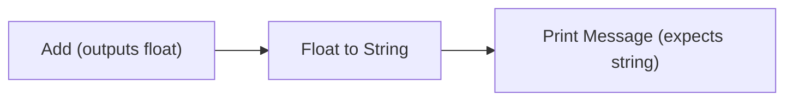
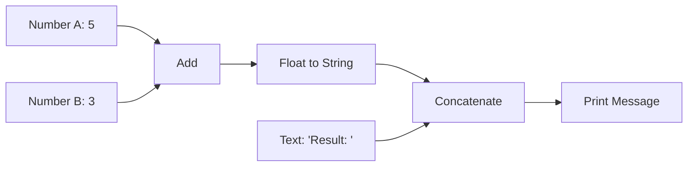

# ValueType

## Overview

ValueType is a fundamental concept in the iR Engine visual scripting system that defines the nature and behavior of data that flows between nodes. Each ValueType represents a specific kind of data (such as numbers, strings, or vectors) and provides a complete specification for how that data should be created, manipulated, compared, and stored. By formalizing these data types, the system ensures consistent handling of values throughout the visual script, enables type checking for connections, and supports serialization for saving and loading scripts. This chapter explores the concept, structure, and implementation of ValueTypes within the iR Engine.

## Core concepts

### Type definition purpose

ValueTypes serve several essential purposes in the visual scripting system:

1. **Data identity**: They provide a unique identifier for each kind of data
2. **Default values**: They define how to create default instances of each type
3. **Serialization**: They specify how to convert between in-memory values and JSON-compatible formats
4. **Comparison**: They define how to determine if two values of the same type are equal
5. **Cloning**: They provide methods for creating independent copies of values
6. **Interpolation**: They enable blending between values of the same type

By centralizing these aspects in a formal type definition, the system can handle data consistently across all components of the visual scripting framework.

### Type compatibility

ValueTypes are fundamental to determining whether connections between sockets are valid:

- Sockets with the same ValueType are always compatible
- Some ValueTypes may be implicitly convertible to others (e.g., integer to float)
- Incompatible types require explicit conversion nodes

This type system helps prevent logical errors by ensuring that data flows correctly between nodes.

## Implementation

### ValueType interface

The core interface for value types is `ValueType<TValue, TJson>`:

```typescript
// Simplified from: src/engine/Values/ValueType.ts
export interface ValueType<TValue = any, TJson = any> {
  name: string;                                      // Unique identifier (e.g., "float", "string")
  creator: () => TValue;                             // Creates a default value
  deserialize: (jsonValue: TJson) => TValue;         // Converts from JSON to in-memory format
  serialize: (value: TValue) => TJson;               // Converts from in-memory format to JSON
  lerp: (start: TValue, end: TValue, t: number) => TValue; // Interpolates between values
  equals: (a: TValue, b: TValue) => boolean;         // Compares values for equality
  clone: (value: TValue) => TValue;                  // Creates an independent copy
}
```

This generic interface uses two type parameters:
- `TValue`: The actual in-memory data type (e.g., JavaScript number, string, or custom object)
- `TJson`: The JSON-compatible representation of the data (e.g., number, string, or array)

### Common value types

The iR Engine includes several built-in value types for common data:

#### FloatValue (for numbers)

```typescript
// Simplified from: src/profiles/core/values/FloatValue.ts
export const FloatValue: ValueType<number, number | string> = {
  name: 'float',
  creator: () => 0,                                  // Default is 0
  deserialize: (value) => 
    (typeof value === 'string' ? parseSafeFloat(value, 0) : value),
  serialize: (value: number) => value,               // Numbers serialize as themselves
  lerp: (start: number, end: number, t: number) =>
    start * (1 - t) + end * t,                       // Standard linear interpolation
  equals: (a: number, b: number) => a === b,         // Simple equality check
  clone: (value: number) => value                    // Numbers are primitive, so just return
};
```

#### StringValue (for text)

```typescript
// Simplified from: src/profiles/core/values/StringValue.ts
export const StringValue: ValueType<string, string> = {
  name: 'string',
  creator: () => '',                                 // Default is empty string
  deserialize: (value: string) => value,             // Strings deserialize as themselves
  serialize: (value: string) => value,               // Strings serialize as themselves
  lerp: (start: string, end: string, t: number) => 
    (t < 0.5 ? start : end),                         // Simple threshold-based interpolation
  equals: (a: string, b: string) => a === b,         // Simple equality check
  clone: (value: string) => value                    // Strings are primitive-like
};
```

#### BooleanValue (for true/false)

```typescript
// Simplified from: src/profiles/core/values/BooleanValue.ts
export const BooleanValue: ValueType<boolean, boolean> = {
  name: 'boolean',
  creator: () => false,                              // Default is false
  deserialize: (value: boolean) => value,            // Booleans deserialize as themselves
  serialize: (value: boolean) => value,              // Booleans serialize as themselves
  lerp: (start: boolean, end: boolean, t: number) => 
    (t < 0.5 ? start : end),                         // Simple threshold-based interpolation
  equals: (a: boolean, b: boolean) => a === b,       // Simple equality check
  clone: (value: boolean) => value                   // Booleans are primitive
};
```

### Complex value types

For more complex data structures, the ValueType implementation becomes more sophisticated:

#### Vec3Value (for 3D vectors)

```typescript
// Simplified concept for: src/profiles/scene/values/Vec3Value.ts
export const Vec3Value: ValueType<Vec3, [number, number, number]> = {
  name: 'vec3',
  creator: () => new Vec3(0, 0, 0),                  // Default is origin (0,0,0)
  deserialize: (json: [number, number, number]) => 
    new Vec3(json[0], json[1], json[2]),             // Create from array
  serialize: (value: Vec3) => 
    [value.x, value.y, value.z] as [number, number, number], // Convert to array
  lerp: (start: Vec3, end: Vec3, t: number) => 
    new Vec3(
      start.x * (1 - t) + end.x * t,
      start.y * (1 - t) + end.y * t,
      start.z * (1 - t) + end.z * t
    ),                                               // Component-wise interpolation
  equals: (a: Vec3, b: Vec3) => 
    a.x === b.x && a.y === b.y && a.z === b.z,       // Component-wise equality
  clone: (value: Vec3) => 
    new Vec3(value.x, value.y, value.z)              // Create new instance with same values
};
```

#### ListValue (for arrays/collections)

```typescript
// Simplified concept for: src/profiles/struct/values/ListValue.ts
export const ListValue: ValueType<any[], any[]> = {
  name: 'list',
  creator: () => [],                                 // Default is empty array
  deserialize: (json: any[]) => 
    json.map(item => deserializeItem(item)),         // Recursively deserialize items
  serialize: (value: any[]) => 
    value.map(item => serializeItem(item)),          // Recursively serialize items
  lerp: (start: any[], end: any[], t: number) => {
    // If arrays have different lengths, use threshold approach
    if (start.length !== end.length) {
      return t < 0.5 ? clone(start) : clone(end);
    }
    
    // Otherwise, interpolate each element
    return start.map((item, index) => 
      lerpItem(item, end[index], t)
    );
  },
  equals: (a: any[], b: any[]) => {
    if (a.length !== b.length) return false;
    return a.every((item, index) => 
      areItemsEqual(item, b[index])
    );
  },
  clone: (value: any[]) => 
    value.map(item => cloneItem(item))               // Deep clone the array
};
```

### Special value types

Some value types serve special purposes in the system:

#### FlowValue (for execution flow)

```typescript
// Simplified concept for: src/profiles/core/values/FlowValue.ts
export const FlowValue: ValueType<void, null> = {
  name: 'flow',
  creator: () => undefined,                          // Flow has no actual value
  deserialize: () => undefined,                      // Nothing to deserialize
  serialize: () => null,                             // Serialize as null
  lerp: () => undefined,                             // Cannot interpolate flow
  equals: () => true,                                // All flow values are equal
  clone: () => undefined                             // Nothing to clone
};
```

This special type is used for execution sockets that control the flow of execution rather than carrying data values.

## ValueTypeMap

All value types are collected in a central registry called the `ValueTypeMap`:

```typescript
// From: src/engine/Values/ValueTypeMap.ts
export type ValueTypeMap = { readonly [key: string]: ValueType };
```

This map allows the system to look up value types by name:

```typescript
// Example usage
function getValueType(typeName: string): ValueType | undefined {
  return valueTypeMap[typeName];
}

function createDefaultValue(typeName: string): any {
  const valueType = getValueType(typeName);
  if (!valueType) {
    throw new Error(`Unknown value type: ${typeName}`);
  }
  return valueType.creator();
}
```

The `ValueTypeMap` is typically populated during system initialization, with value types from various profiles being registered.

## Value type operations

### Serialization and deserialization

When saving a visual script to a file, the system uses value types to convert in-memory data to JSON:

```typescript
// Simplified concept
function serializeSocketValue(socket: Socket): any {
  const valueType = getValueType(socket.valueTypeName);
  if (!valueType) {
    throw new Error(`Unknown value type: ${socket.valueTypeName}`);
  }
  return valueType.serialize(socket.value);
}

function deserializeSocketValue(socket: Socket, jsonValue: any): void {
  const valueType = getValueType(socket.valueTypeName);
  if (!valueType) {
    throw new Error(`Unknown value type: ${socket.valueTypeName}`);
  }
  socket.value = valueType.deserialize(jsonValue);
}
```

This process ensures that complex data structures can be saved to and loaded from JSON files.

### Type checking and conversion

When connecting sockets, the system uses value types to determine compatibility:

```typescript
// Simplified concept
function canConnect(
  sourceSocket: Socket,
  targetSocket: Socket
): boolean {
  // Direct type match
  if (sourceSocket.valueTypeName === targetSocket.valueTypeName) {
    return true;
  }
  
  // Check for implicit conversion
  return canConvert(sourceSocket.valueTypeName, targetSocket.valueTypeName);
}

function canConvert(
  sourceTypeName: string,
  targetTypeName: string
): boolean {
  // Conversion rules (could be more sophisticated)
  const conversionMap: Record<string, string[]> = {
    'integer': ['float', 'string'],
    'float': ['string'],
    'boolean': ['string']
    // Additional conversion rules...
  };
  
  return conversionMap[sourceTypeName]?.includes(targetTypeName) || false;
}
```

For cases where direct connections aren't possible, explicit conversion nodes can be used:



### Value interpolation

The `lerp` function enables smooth transitions between values, which is particularly useful for animations:

```typescript
// Simplified concept
function animateValue<T>(
  startValue: T,
  endValue: T,
  valueTypeName: string,
  duration: number,
  onUpdate: (value: T) => void
): void {
  const valueType = getValueType(valueTypeName);
  if (!valueType) {
    throw new Error(`Unknown value type: ${valueTypeName}`);
  }
  
  const startTime = Date.now();
  
  function update() {
    const elapsed = Date.now() - startTime;
    const t = Math.min(elapsed / duration, 1);
    
    const currentValue = valueType.lerp(startValue, endValue, t);
    onUpdate(currentValue);
    
    if (t < 1) {
      requestAnimationFrame(update);
    }
  }
  
  update();
}
```

## Example use case

Let's examine how value types are used in a simple visual script that adds two numbers and displays the result:



In this example:

1. The `NumberA` and `NumberB` nodes provide constant values of type `float`
2. The `AddNode` adds these values, producing a `float` result (8)
3. The `ConvertNode` converts the `float` to a `string` using the appropriate conversion logic
4. The `ConcatNode` combines the prefix text with the converted number, producing a `string` ("Result: 8")
5. The `PrintNode` displays the final string

Each step in this process relies on value types to ensure that data is handled correctly:
- `FloatValue` defines how the numbers are stored and added
- Conversion logic (possibly using `StringValue`) defines how to convert the number to text
- `StringValue` defines how the strings are concatenated and displayed

## Next steps

With an understanding of how value types define the data that flows through visual scripts, the next chapter explores how the execution engine processes these scripts at runtime.

Next: [Execution engine (VisualScriptEngine & Fiber)](06_execution_engine__visualscriptengine___fiber__.md)

---


