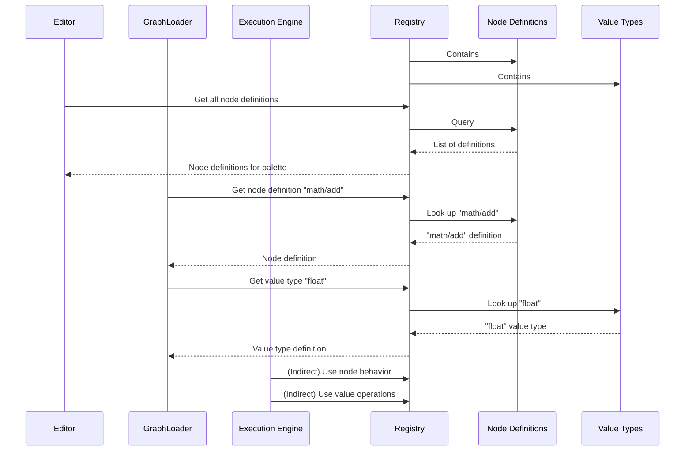

# Node & value registry

## Overview

The node and value registry serves as the central repository for all building blocks available in the iR Engine visual scripting system. It maintains a comprehensive catalog of node definitions and value types, providing a single source of truth that all components of the system can reference. By centralizing these definitions, the registry ensures consistency across the editor, runtime, and serialization systems, while also enabling extensibility through the addition of new node types and data types. This chapter explores the concept, structure, and implementation of the node and value registry within the iR Engine.

## Core concepts

### Registry purpose

The registry serves several essential purposes in the visual scripting system:

1. **Centralized catalog**: It provides a single location where all available node types and value types are defined
2. **Component lookup**: It enables the system to look up definitions by name when needed
3. **Consistency enforcement**: It ensures that all parts of the system share the same understanding of nodes and values
4. **Extensibility support**: It allows new node types and value types to be added to the system
5. **Dependency management**: It can provide access to shared services that nodes might require

By fulfilling these roles, the registry forms the foundation upon which the entire visual scripting system is built.

### Registry components

The registry consists of two primary collections:

1. **Node definitions map**: A collection of all available node types, where:
   - Each entry is identified by a unique type name (e.g., "math/add", "events/onStart")
   - Each entry contains a complete node definition with inputs, outputs, and behavior
   - Each definition includes a factory function for creating instances of that node type

2. **Value types map**: A collection of all available data types, where:
   - Each entry is identified by a unique type name (e.g., "float", "string", "boolean")
   - Each entry contains a complete value type definition with serialization, comparison, and other operations
   - Each definition specifies how data of that type should be handled throughout the system

These collections provide the blueprints that the system uses to create and manipulate nodes and values.

## Implementation

### Registry interface

The core interface for the registry is `IRegistry`:

```typescript
// Simplified from: src/engine/Registry.ts
export interface IRegistry {
  readonly values: ValueTypeMap;                  // Collection of value type definitions
  readonly nodes: NodeDefinitionsMap;             // Collection of node definitions
  readonly dependencies: Record<string, unknown>; // Shared services and resources
}
```

This interface defines the structure that all registry implementations must follow, ensuring they provide access to node definitions, value types, and dependencies.

### Value type map

The `ValueTypeMap` is a collection of value type definitions:

```typescript
// From: src/engine/Values/ValueTypeMap.ts
import { ValueType } from './ValueType';

export type ValueTypeMap = { readonly [key: string]: ValueType };
```

This simple map structure allows value types to be looked up by name:
- Keys are value type names (e.g., "float", "string", "boolean")
- Values are the corresponding `ValueType` objects that define behavior

### Node definitions map

The `NodeDefinitionsMap` is a collection of node definitions:

```typescript
// Simplified from: src/engine/Nodes/Registry/NodeDefinitionsMap.ts
import { INodeDefinition, IHasNodeFactory } from '../NodeDefinitions';

// A node definition that includes a factory function
export type NodeDefinition = IHasNodeFactory & 
  Pick<INodeDefinition, 'typeName' | 'otherTypeNames'>;

// Map of node definitions by type name
export type NodeDefinitionsMap = {
  readonly [type: string]: NodeDefinition;
};
```

This map structure allows node definitions to be looked up by type name:
- Keys are node type names (e.g., "math/add", "events/onStart")
- Values are the corresponding `NodeDefinition` objects that include factories

### Registry creation

The registry is typically created during system initialization:

```typescript
// Simplified from: src/functions/createRegistry.ts
import { IRegistry } from '../engine/Registry';
import { registerCoreProfile } from '../profiles/core/registerCoreProfile';
import { registerSceneProfile } from '../profiles/scene/registerSceneProfile';
import { registerStructProfile } from '../profiles/struct/registerStructProfile';

export function createBaseRegistry(): IRegistry {
  // Start with an empty registry
  const emptyRegistry: IRegistry = {
    values: {},
    nodes: {},
    dependencies: {}
  };
  
  // Register profiles to populate the registry
  let registry = registerCoreProfile(emptyRegistry);
  registry = registerSceneProfile(registry);
  registry = registerStructProfile(registry);
  
  // Validate the registry to ensure consistency
  const errors = validateRegistry(registry);
  if (errors.length > 0) {
    console.error('Registry validation errors:', errors);
  }
  
  return registry;
}
```

This function:
1. Creates an empty registry structure
2. Calls registration functions from various profiles to populate it
3. Validates the registry to ensure all references are valid
4. Returns the fully populated registry

### Registry validation

To ensure the registry is in a consistent state, a validation function checks for common issues:

```typescript
// Simplified from: src/engine/validateRegistry.ts
export function validateRegistry(registry: IRegistry): string[] {
  const errors: string[] = [];
  
  // Check that all value types referenced by node definitions exist
  for (const [nodeName, nodeDef] of Object.entries(registry.nodes)) {
    // Check input sockets
    for (const [socketName, socketDef] of Object.entries(nodeDef.in)) {
      const valueTypeName = typeof socketDef === 'string' ? 
        socketDef : socketDef.valueType;
      
      if (!registry.values[valueTypeName]) {
        errors.push(
          `Node "${nodeName}" input socket "${socketName}" references ` +
          `unknown value type "${valueTypeName}"`
        );
      }
    }
    
    // Check output sockets (similar to inputs)
    // ...
  }
  
  // Check for duplicate node type names
  const nodeTypeNames = new Set<string>();
  for (const nodeDef of Object.values(registry.nodes)) {
    if (nodeTypeNames.has(nodeDef.typeName)) {
      errors.push(`Duplicate node type name: "${nodeDef.typeName}"`);
    }
    nodeTypeNames.add(nodeDef.typeName);
  }
  
  // Additional validation checks...
  
  return errors;
}
```

This validation helps catch issues early, such as:
- References to non-existent value types
- Duplicate node type names
- Missing required properties
- Inconsistent definitions

## Registry usage

The registry is used by various components of the visual scripting system:

### Editor usage

The visual script editor uses the registry to populate its node palette:

```typescript
// Simplified concept
function buildNodePalette(registry: IRegistry): NodePaletteItem[] {
  const palette: NodePaletteItem[] = [];
  
  // Group nodes by category
  const nodesByCategory: Record<string, NodeDefinition[]> = {};
  
  // Collect all node definitions
  for (const nodeDef of Object.values(registry.nodes)) {
    const category = nodeDef.category || 'Uncategorized';
    if (!nodesByCategory[category]) {
      nodesByCategory[category] = [];
    }
    nodesByCategory[category].push(nodeDef);
  }
  
  // Create palette items for each category and node
  for (const [category, nodes] of Object.entries(nodesByCategory)) {
    palette.push({
      type: 'category',
      name: category
    });
    
    for (const nodeDef of nodes) {
      palette.push({
        type: 'node',
        name: nodeDef.label || nodeDef.typeName,
        typeName: nodeDef.typeName,
        category
      });
    }
  }
  
  return palette;
}
```

This function:
1. Collects all node definitions from the registry
2. Groups them by category
3. Creates a structured palette that the editor can display

### Graph loading

When loading a visual script from JSON, the system uses the registry to instantiate nodes:

```typescript
// Simplified from: src/engine/Graphs/IO/readGraphFromJSON.ts
function createNodeFromJSON(
  nodeJson: NodeJSON,
  registry: IRegistry,
  graph: IGraph
): INode {
  // Look up the node definition by type name
  const nodeDefinition = registry.nodes[nodeJson.type];
  if (!nodeDefinition) {
    throw new Error(`Unknown node type: ${nodeJson.type}`);
  }
  
  // Create a node instance using the factory
  const node = nodeDefinition.nodeFactory(graph, nodeJson.configuration || {});
  
  // Set up input values from JSON
  for (const [inputName, inputValue] of Object.entries(nodeJson.inputs || {})) {
    const inputSocket = node.inputs.find(s => s.name === inputName);
    if (inputSocket) {
      // If the input is a literal value (not a connection)
      if (!isLinkReference(inputValue)) {
        // Get the value type definition
        const valueType = registry.values[inputSocket.valueTypeName];
        if (!valueType) {
          throw new Error(
            `Unknown value type: ${inputSocket.valueTypeName}`
          );
        }
        
        // Deserialize the value using the value type
        inputSocket.value = valueType.deserialize(inputValue);
      }
    }
  }
  
  return node;
}
```

This function:
1. Looks up the node definition in the registry using the type name from JSON
2. Uses the node factory to create a new instance
3. Sets up input values, using value types from the registry to deserialize data

### Execution engine

The execution engine indirectly uses the registry through node instances:

```typescript
// Simplified concept
function resolveSocketValue(
  engine: VisualScriptEngine,
  inputSocket: Socket
): void {
  // If the socket has an incoming connection
  if (inputSocket.links.length > 0) {
    const sourceLink = inputSocket.links[0];
    const sourceNode = engine.nodes[sourceLink.nodeId];
    const sourceSocket = sourceNode.outputs.find(
      s => s.name === sourceLink.socketName
    );
    
    // If the source is a function node, execute it
    if (isFunctionNode(sourceNode)) {
      // The function node's exec method uses logic from its node definition
      // which was originally obtained from the registry
      sourceNode.exec();
      
      // Copy the value
      inputSocket.value = sourceSocket.value;
    }
  }
}
```

While the execution engine doesn't directly access the registry during runtime, it relies on:
- Node instances created using factories from the registry
- Node behavior defined in node definitions from the registry
- Value operations defined in value types from the registry

## Registry workflow

The registry is central to the workflow of the visual scripting system:



This diagram illustrates how:
1. The registry contains collections of node definitions and value types
2. The editor queries the registry to build its node palette
3. The graph loader uses the registry to instantiate nodes and deserialize values
4. The execution engine indirectly uses definitions from the registry

## Next steps

With an understanding of how the node and value registry provides a central repository for all building blocks, the next chapter explores how these building blocks are organized and added to the registry through profiles.

Next: [Profiles](08_profiles_.md)

---


