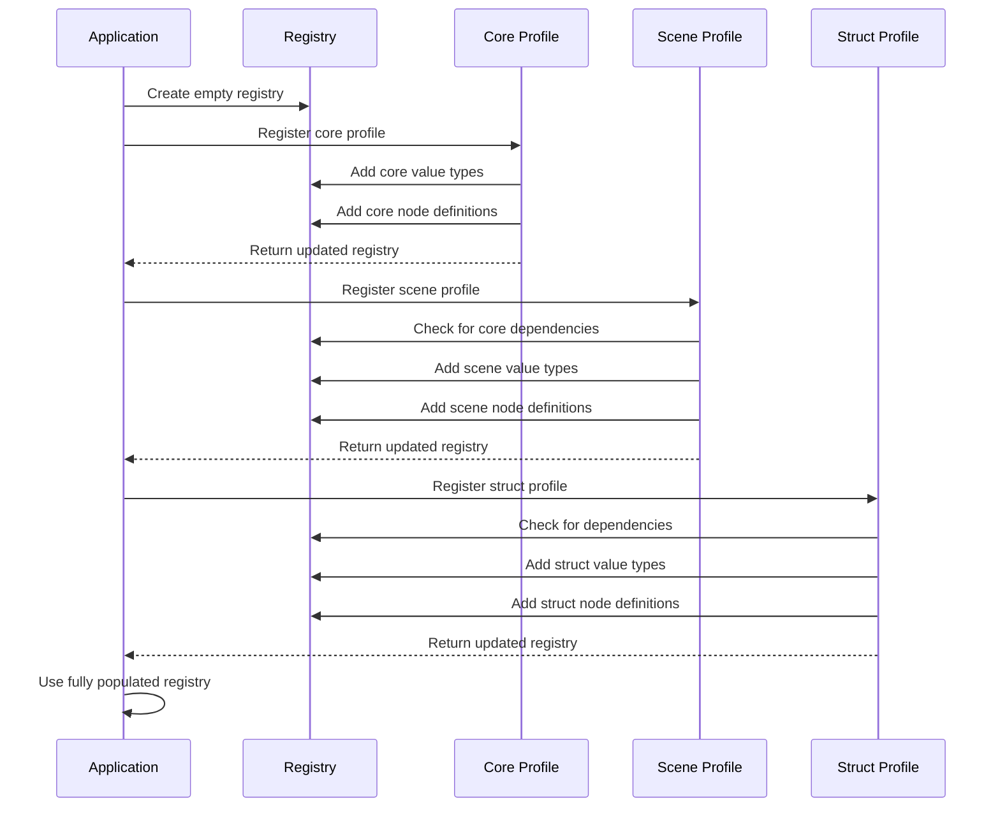

# Profiles

## Overview

Profiles are modular collections of related node definitions and value types that extend the capabilities of the iR Engine visual scripting system. They provide a structured way to organize, load, and manage specialized sets of visual scripting components for different domains or purposes. 

By grouping related functionality into profiles, the system remains modular, extensible, and focused, allowing developers to include only the components needed for their specific applications. This chapter explores the concept, structure, and implementation of profiles within the iR Engine.

## Core concepts

### Profile purpose

Profiles serve several important purposes in the visual scripting system:

1. **Organization**: They group related node types and value types into cohesive, domain-specific collections
2. **Modularity**: They allow the system to be extended with new capabilities without modifying core components
3. **Customization**: They enable developers to tailor the visual scripting environment to specific project needs
4. **Maintainability**: They promote separation of concerns by isolating domain-specific functionality
5. **Performance**: They allow loading only the components that are actually needed for a particular application

By organizing functionality into profiles, the system becomes more manageable, adaptable, and focused on the specific requirements of each project.

### Common profiles

The iR Engine includes several standard profiles that provide functionality for different domains:

1. **Core profile**: Provides fundamental components used in almost all visual scripts
   - Basic value types: float, integer, string, boolean
   - Essential nodes: math operations, logic gates, flow control, basic events

2. **Scene profile**: Provides components for working with 2D and 3D scenes
   - Spatial value types: Vec2, Vec3, Quaternion, Transform
   - Visual value types: Color, Texture
   - Scene nodes: position/rotation manipulation, visibility control, physics interactions

3. **Struct profile**: Provides components for working with structured data
   - Collection value types: List, Map, Set
   - Object value types: custom data structures
   - Collection nodes: create, add, remove, iterate, filter

4. **UI profile**: Provides components for user interface interactions
   - UI value types: Rect, Anchor, Alignment
   - UI nodes: button events, text manipulation, layout control

These profiles can be combined as needed to provide the specific functionality required for a particular application.

## Implementation

### Profile registration

Profiles are registered with the system through registration functions:

```typescript
// Simplified from: src/profiles/core/registerCoreProfile.ts
import { IRegistry } from '../../engine/Registry';
import { FloatValue, StringValue, BooleanValue } from './values';
import { AddNode, SubtractNode, BranchNode } from './nodes';

export function registerCoreProfile(registry: IRegistry): IRegistry {
  // Collect value types for this profile
  const valueTypes = {
    'float': FloatValue,
    'string': StringValue,
    'boolean': BooleanValue
    // Additional value types...
  };
  
  // Collect node definitions for this profile
  const nodeDefinitions = {
    'math/add': AddNode,
    'math/subtract': SubtractNode,
    'flow/branch': BranchNode
    // Additional node definitions...
  };
  
  // Return a new registry with the profile's components added
  return {
    values: { ...registry.values, ...valueTypes },
    nodes: { ...registry.nodes, ...nodeDefinitions },
    dependencies: { ...registry.dependencies }
  };
}
```

This function:
1. Collects all value types defined by the profile
2. Collects all node definitions defined by the profile
3. Creates a new registry that includes these components along with any existing ones
4. Returns the updated registry

### Profile module structure

Each profile is typically organized as a module with a consistent structure:

```
src/profiles/
├── core/                      # Core profile
│   ├── values/                # Value type definitions
│   │   ├── FloatValue.ts
│   │   ├── StringValue.ts
│   │   └── ...
│   ├── nodes/                 # Node definitions
│   │   ├── math/
│   │   │   ├── AddNode.ts
│   │   │   └── ...
│   │   ├── flow/
│   │   │   ├── BranchNode.ts
│   │   │   └── ...
│   │   └── ...
│   ├── CoreProfileModule.ts   # Exports all profile components
│   └── registerCoreProfile.ts # Registration function
├── scene/                     # Scene profile
│   ├── values/
│   ├── nodes/
│   ├── SceneProfileModule.ts
│   └── registerSceneProfile.ts
└── ...                        # Additional profiles
```

This structure:
- Organizes value types and node definitions into separate directories
- Groups related node definitions into subdirectories by category
- Provides a module file that exports all components
- Includes a registration function for adding the profile to the registry

### Profile module exports

Each profile typically includes a module file that exports all its components:

```typescript
// Simplified from: src/profiles/core/CoreProfileModule.ts
// Export value types
export * from './values/FloatValue';
export * from './values/StringValue';
export * from './values/BooleanValue';
// Additional value types...

// Export node definitions
export * from './nodes/math/AddNode';
export * from './nodes/math/SubtractNode';
export * from './nodes/flow/BranchNode';
// Additional node definitions...

// Export registration function
export * from './registerCoreProfile';
```

This file:
- Exports all value types defined by the profile
- Exports all node definitions defined by the profile
- Exports the registration function
- Makes it easy to import all profile components with a single import statement

### Profile dependencies

Profiles can depend on components from other profiles:

```typescript
// Simplified from: src/profiles/scene/registerSceneProfile.ts
import { IRegistry } from '../../engine/Registry';
import { Vec3Value, ColorValue } from './values';
import { SetPositionNode, GetPositionNode } from './nodes';

export function registerSceneProfile(registry: IRegistry): IRegistry {
  // Check for required dependencies from other profiles
  if (!registry.values['float']) {
    throw new Error('Scene profile requires float value type from Core profile');
  }
  
  // Collect value types for this profile
  const valueTypes = {
    'vec3': Vec3Value,
    'color': ColorValue
    // Additional value types...
  };
  
  // Collect node definitions for this profile
  const nodeDefinitions = {
    'scene/setPosition': SetPositionNode,
    'scene/getPosition': GetPositionNode
    // Additional node definitions...
  };
  
  // Return a new registry with the profile's components added
  return {
    values: { ...registry.values, ...valueTypes },
    nodes: { ...registry.nodes, ...nodeDefinitions },
    dependencies: { ...registry.dependencies }
  };
}
```

This function:
1. Checks that required dependencies from other profiles are present
2. Adds its own value types and node definitions to the registry
3. Ensures that profiles are registered in the correct order

## Registry initialization

The complete registry is typically initialized by registering multiple profiles in sequence:

```typescript
// Simplified from: src/functions/createRegistry.ts
import { IRegistry } from '../engine/Registry';
import { registerCoreProfile } from '../profiles/core/registerCoreProfile';
import { registerSceneProfile } from '../profiles/scene/registerSceneProfile';
import { registerStructProfile } from '../profiles/struct/registerStructProfile';

export function createBaseRegistry(): IRegistry {
  // Start with an empty registry
  const emptyRegistry: IRegistry = {
    values: {},
    nodes: {},
    dependencies: {}
  };
  
  // Register profiles in dependency order
  let registry = registerCoreProfile(emptyRegistry);
  registry = registerSceneProfile(registry);
  registry = registerStructProfile(registry);
  
  // Additional profiles can be registered as needed
  // registry = registerCustomProfile(registry);
  
  return registry;
}
```

This function:
1. Creates an empty registry
2. Registers profiles in order, with each profile building on the previous ones
3. Returns the fully populated registry with components from all profiles

The registration order is important, as profiles may depend on components from other profiles.

## Profile registration workflow

The process of registering profiles follows this workflow:



This sequence ensures that:
1. Profiles are registered in the correct order
2. Each profile can build on components from previously registered profiles
3. The final registry contains all components from all registered profiles

## Custom profiles

Developers can create custom profiles to extend the system with specialized functionality:

```typescript
// Example of a custom profile for audio functionality
import { IRegistry } from '../../engine/Registry';
import { AudioClipValue } from './values';
import { PlaySoundNode, StopSoundNode } from './nodes';

export function registerAudioProfile(registry: IRegistry): IRegistry {
  // Check for required dependencies
  if (!registry.values['string']) {
    throw new Error('Audio profile requires string value type from Core profile');
  }
  
  // Collect value types for this profile
  const valueTypes = {
    'audioClip': AudioClipValue
  };
  
  // Collect node definitions for this profile
  const nodeDefinitions = {
    'audio/playSound': PlaySoundNode,
    'audio/stopSound': StopSoundNode
  };
  
  // Return a new registry with the profile's components added
  return {
    values: { ...registry.values, ...valueTypes },
    nodes: { ...registry.nodes, ...nodeDefinitions },
    dependencies: { ...registry.dependencies }
  };
}
```

Custom profiles follow the same structure and registration pattern as built-in profiles, making the system easily extensible.

## Benefits of profiles

The profile system provides several key benefits:

1. **Modularity**: Functionality is organized into cohesive, self-contained modules
2. **Extensibility**: New capabilities can be added without modifying existing code
3. **Customization**: Applications can include only the profiles they need
4. **Clarity**: Related components are grouped together, making the system easier to understand
5. **Maintainability**: Changes to one domain don't affect others
6. **Scalability**: The system can grow with new profiles without becoming unwieldy

These benefits make the visual scripting system more flexible, maintainable, and adaptable to different use cases.

## Conclusion

Profiles are the organizational framework that brings structure and extensibility to the iR Engine visual scripting system. By grouping related node definitions and value types into cohesive collections, profiles enable a modular, customizable approach to visual scripting that can be tailored to specific application domains.

Throughout this documentation, we've explored the fundamental components of the iR Engine visual scripting system:

1. **Visual script graph**: The container that holds nodes and defines the overall structure
2. **Visual script node**: The building blocks that perform specific operations
3. **Socket & link**: The connection system that enables nodes to communicate
4. **Node definition**: The blueprints that define the behavior of node types
5. **ValueType**: The data type system that defines how information flows between nodes
6. **Execution engine**: The runtime system that processes and executes visual scripts
7. **Node & value registry**: The central repository for all available components
8. **Profiles**: The organizational framework that groups related components

Together, these components form a comprehensive visual scripting system that enables non-programmers to create complex, interactive behaviors through a visual interface.

---


