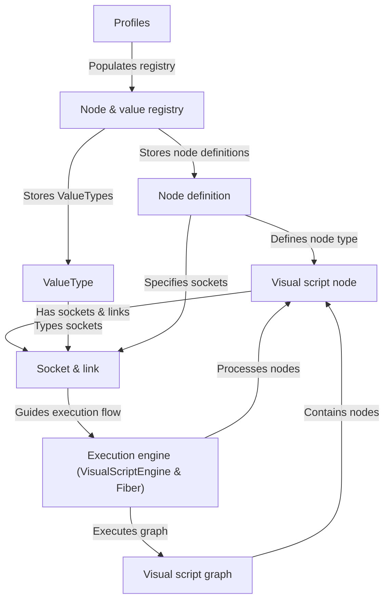

# Visual scripting

The iR Engine visual scripting system enables the creation of interactive behaviors and logic through a graphical programming interface. Instead of writing traditional code, users build programs by arranging and connecting nodes (individual operations or functions) on a visual script graph (the main canvas). Nodes have input and output sockets (connection points) that are joined by links (wires) to define how data and control signals flow. The execution engine processes these visual scripts at runtime, following the paths defined by the connections between nodes.

## System architecture

The visual scripting system consists of several interconnected components that work together to provide a complete visual programming environment:

## Key components

1. **Visual script graph**: The main container that holds nodes and manages the overall script structure
2. **Visual script node**: Individual operations or functions that perform specific tasks within the graph
3. **Socket & link**: Connection points on nodes and the wires that connect them, defining data and execution flow
4. **Node definition**: Templates that define the behavior and interface of specific node types
5. **ValueType**: Data type definitions that specify what kind of information can flow between nodes
6. **Execution engine**: The runtime system that processes and executes visual scripts
7. **Node & value registry**: A central repository that manages available node types and value types
8. **Profiles**: Collections of related node definitions and value types for specific domains

## Documentation chapters

1. [Visual script graph](01_visual_script_graph_.md)
2. [Visual script node](02_visual_script_node_.md)
3. [Socket & link](03_socket___link_.md)
4. [Node definition](04_node_definition_.md)
5. [ValueType](05_valuetype_.md)
6. [Execution engine (VisualScriptEngine & Fiber)](06_execution_engine__visualscriptengine___fiber__.md)
7. [Node & value registry](07_node___value_registry_.md)
8. [Profiles](08_profiles_.md)

---

