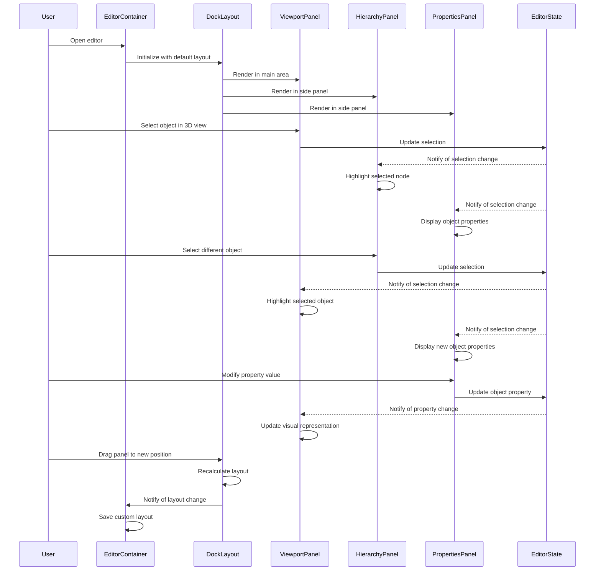

# Editor panels and UI structure

## Overview

The Editor Panels and UI Structure component is a fundamental element of the iR Engine's World Editor that organizes the user interface into specialized, interactive panels. It provides a flexible framework for arranging and managing the various tools and views needed for 3D world creation. By implementing a dockable panel system, this component enables users to customize their workspace while maintaining a consistent and intuitive editing experience. This chapter explores the implementation, organization, and customization of the editor's user interface.

## Core concepts

### Panel architecture

The editor interface is built on a panel-based architecture:

- **Modular design**: Each panel serves a specific function and can operate independently
- **Dockable framework**: Panels can be arranged, resized, and grouped according to user preference
- **Tab system**: Related panels can be grouped as tabs within a single container
- **Consistent styling**: All panels follow the same visual language and interaction patterns
- **Responsive layout**: The interface adapts to different screen sizes and configurations

This architecture creates a flexible and customizable editing environment.

### Main panel types

The editor includes several specialized panel types:

- **Viewport panel**: Displays the 3D scene and provides direct manipulation tools
- **Hierarchy panel**: Shows the scene's object structure in a tree view
- **Properties panel**: Displays and allows editing of the selected object's properties
- **Assets panel**: Provides access to project resources like models and textures
- **Inspector panel**: Shows detailed information about selected components
- **Materials panel**: Enables creation and editing of material properties
- **Visual script panel**: Provides a node-based programming interface

These panels cover the essential functions needed for world editing.

### Layout management

The layout system manages panel arrangement and interaction:

- **Default layout**: Provides a standard arrangement for new users
- **Layout persistence**: Saves and restores user-customized layouts
- **Drag-and-drop rearrangement**: Allows intuitive reorganization of panels
- **Split views**: Supports horizontal and vertical splitting of panel areas
- **Collapsible regions**: Enables panels to be minimized when not in use

This system enables users to optimize their workspace for specific tasks.

## Implementation

### EditorContainer component

The `EditorContainer` serves as the main UI framework:

```typescript
// Simplified from: src/components/EditorContainer.tsx
import React, { useEffect } from 'react';
import { DockLayout } from 'rc-dock';
import { useHookstate } from '@hookstate/core';
import { EditorState } from '../services/EditorServices';
import { ViewportPanelTab } from '../panels/viewport';
import { HierarchyPanelTab } from '../panels/hierarchy';
import { PropertiesPanelTab } from '../panels/properties';
import { AssetsPanelTab } from '../panels/assets';
import { Toolbar } from './toolbar/Toolbar';
import './EditorContainer.css';

/**
 * Main container for the editor UI
 * @returns Editor container component
 */
export const EditorContainer: React.FC = () => {
  // Get editor state
  const editorState = useHookstate(EditorState.state);
  
  // Define default layout
  const defaultLayout = {
    dockbox: {
      mode: 'horizontal',
      children: [
        {
          mode: 'vertical',
          size: 800,
          children: [
            { tabs: [{ ...ViewportPanelTab }] },
            { tabs: [{ ...AssetsPanelTab }] }
          ]
        },
        {
          mode: 'vertical',
          size: 300,
          children: [
            { tabs: [{ ...HierarchyPanelTab }] },
            { tabs: [{ ...PropertiesPanelTab }] }
          ]
        }
      ]
    }
  };
  
  // Handle layout changes
  const handleLayoutChange = (newLayout) => {
    // Save layout to persistent storage
    localStorage.setItem('editorLayout', JSON.stringify(newLayout));
  };
  
  // Load saved layout on component mount
  useEffect(() => {
    const savedLayout = localStorage.getItem('editorLayout');
    if (savedLayout) {
      try {
        const parsedLayout = JSON.parse(savedLayout);
        // Apply saved layout
        // Implementation details omitted for brevity
      } catch (e) {
        console.error('Failed to parse saved layout', e);
      }
    }
  }, []);
  
  return (
    <div className="editor-container">
      <Toolbar />
      <div className="editor-main">
        <DockLayout
          defaultLayout={defaultLayout}
          style={{ position: 'absolute', left: 0, top: 0, right: 0, bottom: 0 }}
          onLayoutChange={handleLayoutChange}
        />
      </div>
    </div>
  );
};
```

This component:
1. Imports panel definitions from various panel modules
2. Defines a default layout structure for the panels
3. Handles saving and loading of custom layouts
4. Renders the main editor interface with toolbar and dock layout

### Panel definition

Each panel is defined as a tab configuration:

```typescript
// Simplified from: src/panels/viewport/index.tsx
import React from 'react';
import { ViewportContent } from './ViewportContent';

/**
 * Viewport panel tab configuration
 */
export const ViewportPanelTab = {
  id: 'viewport',
  title: 'Viewport',
  content: <ViewportContent />,
  closable: false,
  group: 'main'
};
```

This definition:
1. Specifies a unique ID for the panel
2. Sets the display title shown in the tab
3. Provides the React component to render as content
4. Configures whether the panel can be closed
5. Assigns the panel to a group for organization

### Viewport panel

The viewport panel displays the 3D scene:

```typescript
// Simplified from: src/panels/viewport/index.tsx
import React, { useEffect, useRef } from 'react';
import { useHookstate } from '@hookstate/core';
import { Engine } from '@ir-engine/core';
import { EditorState } from '../../services/EditorServices';
import { TransformGizmoTool } from './tools/TransformGizmoTool';
import { CameraGizmoTool } from './tools/CameraGizmoTool';
import { GridTool } from './tools/GridTool';

/**
 * Viewport panel content
 * @returns Viewport component
 */
export const ViewportContent: React.FC = () => {
  // Reference to the canvas element
  const canvasRef = useRef<HTMLCanvasElement>(null);
  
  // Get editor state
  const editorState = useHookstate(EditorState.state);
  
  // Initialize engine and scene
  useEffect(() => {
    if (!canvasRef.current) return;
    
    // Initialize engine with canvas
    const engine = new Engine(canvasRef.current);
    
    // Store engine reference in editor state
    editorState.engine.set(engine);
    
    // Set up scene and camera
    // Implementation details omitted for brevity
    
    // Clean up on unmount
    return () => {
      engine.dispose();
    };
  }, [canvasRef]);
  
  return (
    <div className="viewport-container">
      <canvas ref={canvasRef} className="viewport-canvas" />
      <div className="viewport-tools">
        <TransformGizmoTool />
        <CameraGizmoTool />
        <GridTool />
      </div>
    </div>
  );
};
```

This component:
1. Creates a canvas element for rendering the 3D scene
2. Initializes the rendering engine with the canvas
3. Sets up the scene and camera
4. Renders viewport tools for scene manipulation
5. Handles cleanup when the component is unmounted

### Hierarchy panel

The hierarchy panel displays the scene structure:

```typescript
// Simplified from: src/panels/hierarchy/index.tsx
import React from 'react';
import { useHookstate } from '@hookstate/core';
import { EditorState } from '../../services/EditorServices';
import { HierarchyTree } from './hierarchytree';
import { HierarchyContextMenu } from './contextmenu';

/**
 * Hierarchy panel tab configuration
 */
export const HierarchyPanelTab = {
  id: 'hierarchy',
  title: 'Hierarchy',
  content: <HierarchyContent />,
  closable: false,
  group: 'scene'
};

/**
 * Hierarchy panel content
 * @returns Hierarchy component
 */
const HierarchyContent: React.FC = () => {
  // Get editor state
  const editorState = useHookstate(EditorState.state);
  
  // Handle node selection
  const handleNodeSelect = (nodeId: string) => {
    // Update selection in editor state
    editorState.selectedEntityId.set(nodeId);
  };
  
  return (
    <div className="hierarchy-container">
      <div className="hierarchy-toolbar">
        <button onClick={() => EditorState.createEntity()}>Add Entity</button>
        <button onClick={() => EditorState.deleteSelectedEntity()}>Delete</button>
      </div>
      <HierarchyTree 
        rootNodes={editorState.scene.entities.value}
        onNodeSelect={handleNodeSelect}
        selectedNodeId={editorState.selectedEntityId.value}
      />
      <HierarchyContextMenu />
    </div>
  );
};
```

This component:
1. Renders a toolbar with common hierarchy operations
2. Displays a tree view of entities in the scene
3. Handles selection of entities in the hierarchy
4. Provides a context menu for additional operations
5. Synchronizes with the editor's selection state

### Properties panel

The properties panel displays and edits object properties:

```typescript
// Simplified from: src/panels/properties/index.tsx
import React from 'react';
import { useHookstate } from '@hookstate/core';
import { EditorState } from '../../services/EditorServices';
import { PropertyEditor } from './propertyeditor';
import { MaterialEditor } from './materialeditor';

/**
 * Properties panel tab configuration
 */
export const PropertiesPanelTab = {
  id: 'properties',
  title: 'Properties',
  content: <PropertiesContent />,
  closable: false,
  group: 'inspector'
};

/**
 * Properties panel content
 * @returns Properties component
 */
const PropertiesContent: React.FC = () => {
  // Get editor state
  const editorState = useHookstate(EditorState.state);
  const selectedId = editorState.selectedEntityId.value;
  
  // Get selected entity
  const selectedEntity = selectedId 
    ? editorState.scene.entities.value.find(e => e.id === selectedId)
    : null;
  
  if (!selectedEntity) {
    return <div className="properties-empty">No entity selected</div>;
  }
  
  return (
    <div className="properties-container">
      <h3>{selectedEntity.name}</h3>
      
      <section className="properties-section">
        <h4>Transform</h4>
        <PropertyEditor 
          entity={selectedEntity}
          component="transform"
        />
      </section>
      
      {selectedEntity.components.material && (
        <section className="properties-section">
          <h4>Material</h4>
          <MaterialEditor 
            entity={selectedEntity}
          />
        </section>
      )}
      
      {/* Additional component editors */}
    </div>
  );
};
```

This component:
1. Retrieves the currently selected entity from editor state
2. Displays the entity's name and basic information
3. Renders property editors for each component on the entity
4. Shows specialized editors for specific component types
5. Handles updates to component properties

## Panel workflow

The complete panel interaction workflow follows this sequence:



This diagram illustrates:
1. The editor initializes with a default panel layout
2. Panels communicate through the shared editor state
3. Selection in one panel updates the view in other panels
4. Property changes affect the visual representation
5. Users can customize the layout by dragging panels

## Layout customization

The editor supports various layout customizations:

### Panel docking

Panels can be docked in different positions:

```typescript
// Example of programmatic docking
const dockPanel = (panelId, position) => {
  // Get the dock layout instance
  const dockLayout = dockLayoutRef.current;
  
  // Get the panel to dock
  const panel = dockLayout.find(panelId);
  
  // Dock the panel at the specified position
  dockLayout.dockMove(panel, position, 'middle');
};

// Dock the hierarchy panel to the right
dockPanel('hierarchy', 'right');
```

This functionality:
- Allows panels to be moved to different sides of the editor
- Supports docking relative to other panels
- Enables creation of complex layouts
- Persists across editor sessions
- Can be triggered programmatically or through user interaction

### Tab grouping

Related panels can be grouped as tabs:

```typescript
// Example of programmatic tab grouping
const groupPanelsAsTabs = (panelIds, groupId) => {
  // Get the dock layout instance
  const dockLayout = dockLayoutRef.current;
  
  // Get the panels to group
  const panels = panelIds.map(id => dockLayout.find(id));
  
  // Group the panels as tabs
  dockLayout.dockMove(panels[0], panels[1], 'middle');
  
  // Set the group ID for the tab group
  const tabGroup = dockLayout.getTabGroup(panels[0]);
  tabGroup.group = groupId;
};

// Group properties and inspector panels
groupPanelsAsTabs(['properties', 'inspector'], 'details');
```

This functionality:
- Combines multiple panels in a single container
- Allows switching between panels using tabs
- Saves screen space for related functionality
- Enables logical grouping of panels
- Supports drag-and-drop reorganization

### Layout persistence

User layouts are saved and restored:

```typescript
// Example of layout persistence
// Save layout
const saveLayout = (layout) => {
  localStorage.setItem('editorLayout', JSON.stringify(layout));
};

// Load layout
const loadLayout = () => {
  const savedLayout = localStorage.getItem('editorLayout');
  if (savedLayout) {
    return JSON.parse(savedLayout);
  }
  return defaultLayout;
};

// Reset to default layout
const resetLayout = () => {
  localStorage.removeItem('editorLayout');
  return defaultLayout;
};
```

This functionality:
- Saves user customizations to local storage
- Restores layouts when the editor is reopened
- Provides options to reset to default layouts
- Handles invalid or outdated layouts gracefully
- Enables sharing layouts between projects

## Integration with other components

The panel system integrates with several other components of the World Editor:

### Editor state

Panels interact with the central editor state:

```typescript
// Example of editor state integration
import { useHookstate } from '@hookstate/core';
import { EditorState } from '../../services/EditorServices';

// Inside a panel component
const Panel = () => {
  // Subscribe to editor state
  const editorState = useHookstate(EditorState.state);
  
  // Get current selection
  const selectedEntityId = editorState.selectedEntityId.value;
  
  // Update selection
  const handleSelect = (entityId) => {
    editorState.selectedEntityId.set(entityId);
  };
  
  // ... panel rendering
};
```

This integration:
- Provides reactive updates when state changes
- Ensures consistency across panels
- Centralizes editor data management
- Enables undo/redo functionality
- Supports persistence of editor state

### Gizmo system

Panels interact with the gizmo system for visual manipulation:

```typescript
// Example of gizmo integration in viewport panel
import { TransformGizmoSystem } from '../../systems/TransformGizmoSystem';

// Inside viewport panel
const ViewportPanel = () => {
  // Initialize transform gizmo
  useEffect(() => {
    // Create transform gizmo system
    const gizmoSystem = new TransformGizmoSystem(scene, camera);
    
    // Configure gizmo based on editor state
    gizmoSystem.setMode(editorState.transformMode.value);
    gizmoSystem.setSpace(editorState.transformSpace.value);
    
    // Clean up on unmount
    return () => {
      gizmoSystem.dispose();
    };
  }, [scene, camera]);
  
  // ... viewport rendering
};
```

This integration:
- Displays manipulation gizmos in the viewport
- Updates gizmo state based on editor settings
- Handles user interaction with gizmos
- Provides visual feedback for transformations
- Supports different transformation modes

### Asset system

Panels interact with the asset system for resource management:

```typescript
// Example of asset system integration in assets panel
import { useHookstate } from '@hookstate/core';
import { FilesState } from '../../services/FilesState';

// Inside assets panel
const AssetsPanel = () => {
  // Subscribe to files state
  const filesState = useHookstate(FilesState.state);
  
  // Get current directory and files
  const currentDir = filesState.currentDirectory.value;
  const files = filesState.files.value;
  
  // Handle file selection
  const handleFileSelect = (file) => {
    FilesState.selectFile(file.id);
  };
  
  // ... assets panel rendering
};
```

This integration:
- Displays available assets in the assets panel
- Handles navigation of asset directories
- Supports asset selection and preview
- Enables drag-and-drop of assets into the scene
- Provides asset import and management functionality

## Benefits of the panel system

The Editor Panels and UI Structure component provides several key advantages:

1. **Flexibility**: Enables users to customize their workspace for different tasks
2. **Organization**: Groups related functionality into logical panels
3. **Consistency**: Provides a uniform interface across different editor functions
4. **Efficiency**: Allows users to optimize their workflow through layout customization
5. **Extensibility**: Supports addition of new panels for specialized functionality
6. **Responsiveness**: Adapts to different screen sizes and window configurations
7. **Familiarity**: Follows conventions from other professional editing tools

These benefits create an intuitive and efficient editing environment for world creation.

## Next steps

With an understanding of the editor's panel structure, the next chapter explores how assets are managed and processed within the World Editor.

Next: [Asset handling and pipeline](02_asset_handling___pipeline_.md)

---


