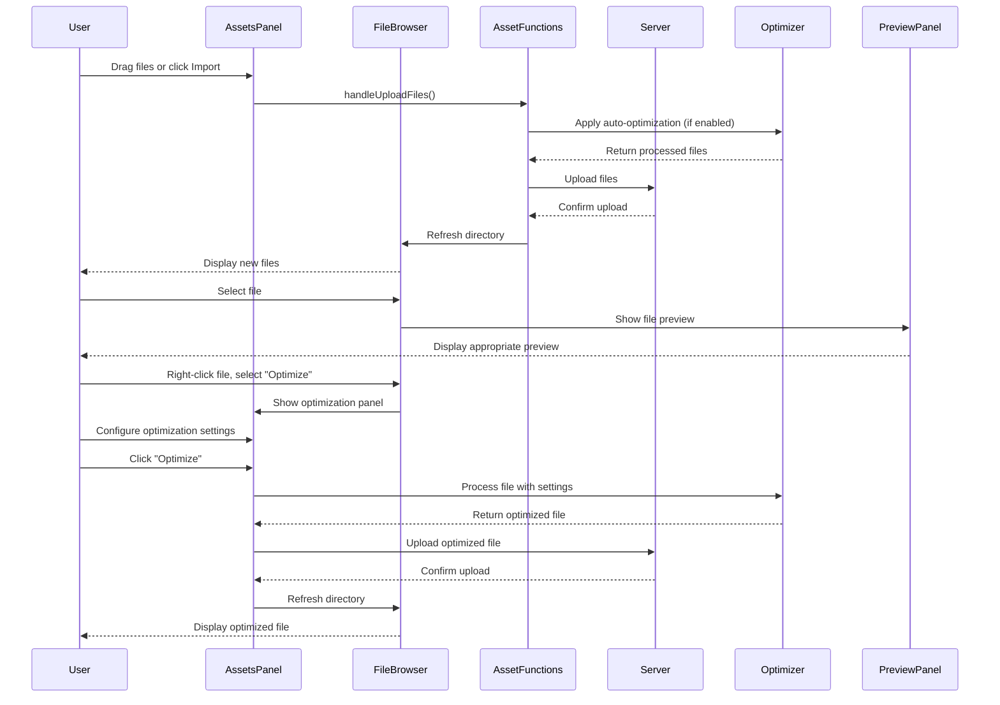

# Asset handling and pipeline

## Overview

The Asset Handling and Pipeline component is a critical element of the iR Engine's World Editor that manages the import, organization, and optimization of digital resources used in 3D worlds. It provides a comprehensive system for bringing external files into projects, organizing them in a structured library, and processing them for optimal performance.

By implementing specialized preview and compression tools, this component ensures that creators can efficiently work with various asset types while maintaining high performance in their worlds. This chapter explores the implementation, workflow, and optimization of assets within the World Editor.

## Core concepts

### Asset types

The editor supports various asset types for world creation:

- **3D models**: Three-dimensional object representations (GLB, GLTF, FBX)
- **Textures**: Image files used for surface details (PNG, JPG, KTX2)
- **Materials**: Surface property definitions that determine appearance
- **Audio**: Sound effects and music files (MP3, WAV)
- **Video**: Motion picture files for dynamic content (MP4, WebM)
- **Scripts**: Code files that define behavior
- **Prefabs**: Reusable object templates with predefined components

These assets serve as the building blocks for creating interactive 3D environments.

### Asset management

The asset management system provides tools for organizing resources:

- **File browser**: Interface for navigating the project's asset structure
- **Categorization**: Grouping assets by type and function
- **Search functionality**: Finding assets by name, type, or metadata
- **Metadata handling**: Storing and editing additional information about assets
- **Version tracking**: Managing different iterations of the same asset

This system creates an organized library of resources for efficient project development.

### Asset pipeline

The asset pipeline processes resources for optimal use:

- **Import processing**: Converting external formats to engine-compatible formats
- **Optimization**: Reducing file sizes while maintaining quality
- **Compression**: Applying specialized algorithms for different asset types
- **Preview generation**: Creating thumbnails and preview representations
- **Validation**: Checking assets for compatibility and potential issues

This pipeline ensures assets are prepared for efficient use in the engine.

## Implementation

### Asset panel

The Assets Panel provides the main interface for asset management:

```typescript
// Simplified from: src/panels/assets/index.tsx
import React from 'react';
import { useHookstate } from '@hookstate/core';
import { PanelDragContainer, PanelTitle } from '@ir-engine/ui/src/components/editor/layout/Panel';
import { TabData } from 'rc-dock';
import { useTranslation } from 'react-i18next';
import { FilesState } from '../../services/FilesState';
import CategoriesList from './categories';
import Resources from './resources';
import Topbar from './topbar';

/**
 * Assets panel content component
 * @returns Assets panel component
 */
const AssetsPanel: React.FC = () => {
  const { t } = useTranslation();
  const filesState = useHookstate(FilesState.state);

  return (
    <div className="assets-panel">
      <Topbar />
      <div className="assets-panel-content">
        <CategoriesList />
        <Resources />
      </div>
    </div>
  );
};

/**
 * Assets panel title component
 * @returns Assets panel title component
 */
const AssetsPanelTitle: React.FC = () => {
  const { t } = useTranslation();

  return (
    <PanelDragContainer>
      <PanelTitle>{t('editor:assets.title')}</PanelTitle>
    </PanelDragContainer>
  );
};

/**
 * Assets panel tab configuration
 */
export const AssetsPanelTab: TabData = {
  id: 'assetsPanel',
  title: <AssetsPanelTitle />,
  content: <AssetsPanel />,
  closable: false
};
```

This component:
1. Provides the main interface for browsing and managing assets
2. Includes a topbar with actions like import and create
3. Contains a categories list for filtering assets by type
4. Displays resources (files and folders) in the current directory
5. Integrates with the editor's tab system

### File browser

The file browser displays and manages project files:

```typescript
// Simplified from: src/panels/files/filebrowser.tsx
import React, { useEffect, useState } from 'react';
import { useHookstate } from '@hookstate/core';
import { FilesState } from '../../services/FilesState';
import { FileItem } from './fileitem';
import { ContextMenu } from './contextmenu';

/**
 * File browser component
 * @param props Component props
 * @returns File browser component
 */
export const FileBrowser: React.FC<{
  currentPath: string;
  onFileSelect: (file: FileData) => void;
}> = ({ currentPath, onFileSelect }) => {
  // Get files state
  const filesState = useHookstate(FilesState.state);
  const files = filesState.files.value;
  const selectedFileId = filesState.selectedFileId.value;

  // Load files for the current path
  useEffect(() => {
    FilesState.loadDirectory(currentPath);
  }, [currentPath]);

  // Handle file selection
  const handleFileClick = (file: FileData) => {
    FilesState.selectFile(file.id);
    onFileSelect(file);
  };

  // Handle context menu
  const handleContextMenu = (e: React.MouseEvent, file: FileData) => {
    e.preventDefault();
    FilesState.selectFile(file.id);
    // Show context menu at cursor position
    ContextMenu.show(e.clientX, e.clientY, file);
  };

  return (
    <div className="file-browser">
      {files.map(file => (
        <FileItem
          key={file.id}
          file={file}
          isSelected={file.id === selectedFileId}
          onClick={() => handleFileClick(file)}
          onContextMenu={(e) => handleContextMenu(e, file)}
        />
      ))}
    </div>
  );
};
```

This component:
1. Displays files and folders in the current directory
2. Handles file selection and context menu interactions
3. Loads directory contents when the path changes
4. Renders file items with appropriate icons and information
5. Integrates with the FilesState service for data management

### Asset preview

The asset preview system displays appropriate visualizations for different asset types:

```typescript
// Simplified from: src/components/assets/AssetsPreviewPanel.tsx
import React, { useEffect } from 'react';
import { useHookstate } from '@hookstate/core';
import { FilesState } from '../../services/FilesState';
import { AudioPreviewPanel } from './AssetPreviewPanels/AudioPreviewPanel';
import { ImagePreviewPanel } from './AssetPreviewPanels/ImagePreviewPanel';
import { ModelPreviewPanel } from './AssetPreviewPanels/ModelPreviewPanel';
import { VideoPreviewPanel } from './AssetPreviewPanels/VideoPreviewPanel';
import { PreviewUnavailable } from './AssetPreviewPanels/PreviewUnavailable';

/**
 * Asset preview panel component
 * @returns Asset preview panel component
 */
export const AssetsPreviewPanel: React.FC = () => {
  // Get selected file
  const filesState = useHookstate(FilesState.state);
  const selectedFileId = filesState.selectedFileId.value;
  const selectedFile = filesState.files.value.find(f => f.id === selectedFileId);

  // State for preview component
  const [PreviewComponent, setPreviewComponent] = useState<React.ComponentType<any> | null>(null);

  // Determine preview component based on file type
  useEffect(() => {
    if (!selectedFile) {
      setPreviewComponent(null);
      return;
    }

    // Select appropriate preview component based on file type
    switch (selectedFile.contentType) {
      case 'image/png':
      case 'image/jpeg':
      case 'image/webp':
        setPreviewComponent(() => ImagePreviewPanel);
        break;
      case 'model/gltf-binary':
      case 'model/gltf+json':
        setPreviewComponent(() => ModelPreviewPanel);
        break;
      case 'audio/mpeg':
      case 'audio/wav':
        setPreviewComponent(() => AudioPreviewPanel);
        break;
      case 'video/mp4':
      case 'video/webm':
        setPreviewComponent(() => VideoPreviewPanel);
        break;
      default:
        setPreviewComponent(() => PreviewUnavailable);
        break;
    }
  }, [selectedFile]);

  // If no file is selected or no preview component is available
  if (!selectedFile || !PreviewComponent) {
    return <div className="no-preview">No file selected</div>;
  }

  // Render the appropriate preview component
  return (
    <div className="asset-preview-panel">
      <h3>{selectedFile.name}</h3>
      <PreviewComponent file={selectedFile} />
    </div>
  );
};
```

This component:
1. Determines the appropriate preview component based on file type
2. Renders specialized previews for different asset types
3. Displays file information alongside the preview
4. Handles cases where no file is selected or preview is unavailable
5. Updates dynamically when the selection changes

### Asset import

The asset import system handles bringing external files into the project:

```typescript
// Simplified from: src/functions/assetFunctions.ts
import { FilesState } from '../services/FilesState';
import { ImportSettingsState } from '../services/ImportSettingsState';

/**
 * Handles file upload to the project
 * @param files Files to upload
 * @param directory Target directory
 * @returns Promise resolving to uploaded file paths
 */
export const handleUploadFiles = async (
  files: File[],
  directory: string
): Promise<string[]> => {
  // Get import settings
  const importSettings = ImportSettingsState.getSettings();

  // Process each file
  const uploadPromises = files.map(async (file) => {
    // Check if file should be processed before upload
    if (importSettings.autoOptimize) {
      // Apply automatic optimization based on file type
      if (file.type.startsWith('image/')) {
        file = await compressImage(file, importSettings.imageCompression);
      } else if (file.type.includes('gltf') || file.type.includes('glb')) {
        file = await optimizeModel(file, importSettings.modelOptimization);
      }
    }

    // Upload the file to the server
    const response = await uploadFileToServer(file, directory);

    // Return the path to the uploaded file
    return response.path;
  });

  // Wait for all uploads to complete
  const uploadedPaths = await Promise.all(uploadPromises);

  // Refresh the directory to show new files
  await FilesState.refreshDirectory(directory);

  return uploadedPaths;
};

/**
 * Uploads a file to the server
 * @param file File to upload
 * @param directory Target directory
 * @returns Server response
 */
const uploadFileToServer = async (file: File, directory: string) => {
  // Create form data for the upload
  const formData = new FormData();
  formData.append('file', file);
  formData.append('directory', directory);

  // Send the upload request
  const response = await fetch('/api/upload', {
    method: 'POST',
    body: formData
  });

  // Parse and return the response
  return await response.json();
};
```

This code:
1. Processes files before upload based on import settings
2. Applies automatic optimization for supported file types
3. Uploads files to the server with appropriate metadata
4. Refreshes the directory listing to show new files
5. Returns paths to the uploaded files for further use

### Image compression

The image compression system optimizes textures for performance:

```typescript
// Simplified from: src/components/assets/ImageCompressionPanel.tsx
import React, { useState } from 'react';
import { Button, Select, Slider } from '@ir-engine/ui';
import { compressImage } from '../../functions/assetFunctions';
import { FilesState } from '../../services/FilesState';

/**
 * Image compression panel component
 * @param props Component props
 * @returns Image compression panel component
 */
export const ImageCompressionPanel: React.FC<{
  file: FileData;
  onClose: () => void;
}> = ({ file, onClose }) => {
  // Compression settings
  const [format, setFormat] = useState('ktx2');
  const [quality, setQuality] = useState(75);
  const [mipMaps, setMipMaps] = useState(true);
  const [loading, setLoading] = useState(false);

  // Handle compression
  const handleCompress = async () => {
    setLoading(true);

    try {
      // Get the file content
      const fileContent = await fetch(file.url).then(res => res.blob());

      // Compress the image
      const compressedImage = await compressImage(fileContent, {
        format,
        quality,
        mipMaps,
        originalName: file.name
      });

      // Upload the compressed image
      await handleUploadFiles([compressedImage], file.directory);

      // Close the panel
      onClose();
    } catch (error) {
      console.error('Error compressing image:', error);
    } finally {
      setLoading(false);
    }
  };

  return (
    <div className="image-compression-panel">
      <h3>Image Compression</h3>

      <div className="form-group">
        <label>Format</label>
        <Select
          value={format}
          onChange={(e) => setFormat(e.target.value)}
          options={[
            { value: 'ktx2', label: 'KTX2 (Recommended)' },
            { value: 'webp', label: 'WebP' },
            { value: 'jpg', label: 'JPG' }
          ]}
        />
      </div>

      <div className="form-group">
        <label>Quality: {quality}%</label>
        <Slider
          min={1}
          max={100}
          value={quality}
          onChange={(value) => setQuality(value)}
        />
      </div>

      <div className="form-group">
        <label>Generate MipMaps</label>
        <input
          type="checkbox"
          checked={mipMaps}
          onChange={(e) => setMipMaps(e.target.checked)}
        />
      </div>

      <div className="actions">
        <Button onClick={onClose} variant="secondary">Cancel</Button>
        <Button
          onClick={handleCompress}
          variant="primary"
          disabled={loading}
        >
          {loading ? 'Compressing...' : 'Compress'}
        </Button>
      </div>
    </div>
  );
};
```

This component:
1. Provides controls for configuring image compression settings
2. Supports different output formats optimized for real-time rendering
3. Allows quality adjustment to balance file size and visual fidelity
4. Includes options for generating mipmaps for better rendering at different distances
5. Processes and uploads the compressed image to replace or supplement the original

### Model optimization

The model optimization system prepares 3D assets for efficient rendering:

```typescript
// Simplified from: src/components/assets/ModelCompressionPanel.tsx
import React, { useState } from 'react';
import { Button, Checkbox, NumberInput } from '@ir-engine/ui';
import { optimizeModel } from '../../functions/assetFunctions';
import { FilesState } from '../../services/FilesState';

/**
 * Model optimization panel component
 * @param props Component props
 * @returns Model optimization panel component
 */
export const ModelCompressionPanel: React.FC<{
  file: FileData;
  onClose: () => void;
}> = ({ file, onClose }) => {
  // Optimization settings
  const [generateLODs, setGenerateLODs] = useState(true);
  const [lodLevels, setLodLevels] = useState(3);
  const [compressTextures, setCompressTextures] = useState(true);
  const [draco, setDraco] = useState(true);
  const [loading, setLoading] = useState(false);

  // Handle optimization
  const handleOptimize = async () => {
    setLoading(true);

    try {
      // Get the file content
      const fileContent = await fetch(file.url).then(res => res.blob());

      // Optimize the model
      const optimizedModel = await optimizeModel(fileContent, {
        generateLODs,
        lodLevels,
        compressTextures,
        draco,
        originalName: file.name
      });

      // Upload the optimized model
      await handleUploadFiles([optimizedModel], file.directory);

      // Close the panel
      onClose();
    } catch (error) {
      console.error('Error optimizing model:', error);
    } finally {
      setLoading(false);
    }
  };

  return (
    <div className="model-optimization-panel">
      <h3>Model Optimization</h3>

      <div className="form-group">
        <Checkbox
          label="Generate LODs (Levels of Detail)"
          checked={generateLODs}
          onChange={(e) => setGenerateLODs(e.target.checked)}
        />
      </div>

      {generateLODs && (
        <div className="form-group">
          <label>LOD Levels</label>
          <NumberInput
            min={1}
            max={5}
            value={lodLevels}
            onChange={(value) => setLodLevels(value)}
          />
        </div>
      )}

      <div className="form-group">
        <Checkbox
          label="Compress Textures"
          checked={compressTextures}
          onChange={(e) => setCompressTextures(e.target.checked)}
        />
      </div>

      <div className="form-group">
        <Checkbox
          label="Apply Draco Compression"
          checked={draco}
          onChange={(e) => setDraco(e.target.checked)}
        />
      </div>

      <div className="actions">
        <Button onClick={onClose} variant="secondary">Cancel</Button>
        <Button
          onClick={handleOptimize}
          variant="primary"
          disabled={loading}
        >
          {loading ? 'Optimizing...' : 'Optimize'}
        </Button>
      </div>
    </div>
  );
};
```

This component:
1. Provides controls for configuring model optimization settings
2. Supports generation of level-of-detail (LOD) variants for performance
3. Includes options for texture compression within the model
4. Offers mesh compression using algorithms like Draco
5. Processes and uploads the optimized model to the project

## Asset workflow

The complete asset workflow follows this sequence:



This diagram illustrates:
1. The user imports files through the Assets Panel
2. Files are processed according to import settings
3. Uploaded files appear in the file browser
4. The user can select files to view previews
5. The user can apply additional optimization as needed
6. Optimized files are uploaded and displayed in the browser

## Integration with other components

The asset handling system integrates with several other components of the World Editor:

### Scene management

Assets are used in scene creation and manipulation:

```typescript
// Example of scene integration
import { FilesState } from '../services/FilesState';
import { EditorState } from '../services/EditorServices';

/**
 * Adds a model to the scene
 * @param modelId ID of the model asset
 * @returns Promise resolving to the created entity
 */
export const addModelToScene = async (modelId: string): Promise<Entity> => {
  // Get the model file
  const modelFile = FilesState.getFileById(modelId);
  if (!modelFile) {
    throw new Error(`Model with ID ${modelId} not found`);
  }

  // Create an entity for the model
  const entity = EditorState.createEntity();

  // Add a model component to the entity
  EditorState.addComponent(entity, 'model', {
    url: modelFile.url,
    type: modelFile.contentType
  });

  // Position the entity at the center of the scene
  EditorState.addComponent(entity, 'transform', {
    position: { x: 0, y: 0, z: 0 },
    rotation: { x: 0, y: 0, z: 0 },
    scale: { x: 1, y: 1, z: 1 }
  });

  return entity;
};
```

This integration:
- Retrieves asset information from the file system
- Creates entities in the scene based on assets
- Configures components with asset properties
- Positions assets in the 3D environment
- Connects the asset library to the scene graph

### Material system

Assets are used in material creation and configuration:

```typescript
// Example of material system integration
import { FilesState } from '../services/FilesState';
import { MaterialsState } from '../services/MaterialsState';

/**
 * Creates a material from a texture
 * @param textureId ID of the texture asset
 * @returns Promise resolving to the created material ID
 */
export const createMaterialFromTexture = async (textureId: string): Promise<string> => {
  // Get the texture file
  const textureFile = FilesState.getFileById(textureId);
  if (!textureFile) {
    throw new Error(`Texture with ID ${textureId} not found`);
  }

  // Create a material with the texture
  const materialId = await MaterialsState.createMaterial({
    name: `${textureFile.name.split('.')[0]}_material`,
    type: 'standard',
    properties: {
      map: textureFile.url,
      color: '#ffffff',
      roughness: 0.5,
      metalness: 0.0
    }
  });

  return materialId;
};
```

This integration:
- Uses texture assets to create materials
- Configures material properties based on asset characteristics
- Manages relationships between assets and materials
- Provides a workflow for material creation from assets
- Enables reuse of assets across multiple materials

### Visual scripting

Assets are referenced in visual scripting nodes:

```typescript
// Example of visual scripting integration
import { FilesState } from '../services/FilesState';
import { VisualScriptState } from '../services/VisualScriptState';

/**
 * Creates a play sound node in the visual script
 * @param soundId ID of the sound asset
 * @param graphId ID of the visual script graph
 * @returns Promise resolving to the created node ID
 */
export const createPlaySoundNode = async (
  soundId: string,
  graphId: string
): Promise<string> => {
  // Get the sound file
  const soundFile = FilesState.getFileById(soundId);
  if (!soundFile) {
    throw new Error(`Sound with ID ${soundId} not found`);
  }

  // Create a play sound node in the graph
  const nodeId = await VisualScriptState.createNode(graphId, {
    type: 'playSound',
    position: { x: 100, y: 100 },
    data: {
      soundUrl: soundFile.url,
      volume: 1.0,
      loop: false
    }
  });

  return nodeId;
};
```

This integration:
- References audio assets in sound playback nodes
- Configures node properties based on asset metadata
- Maintains connections between assets and script nodes
- Enables dynamic behavior based on project assets
- Provides a visual representation of asset usage in scripts

## Benefits of the asset pipeline

The Asset Handling and Pipeline component provides several key advantages:

1. **Organization**: Provides a structured system for managing project resources
2. **Optimization**: Reduces file sizes and improves runtime performance
3. **Previewing**: Enables quick visualization of assets without external tools
4. **Workflow**: Streamlines the process of importing and using assets
5. **Consistency**: Ensures assets follow project standards and formats
6. **Performance**: Prepares assets for efficient rendering and memory usage
7. **Collaboration**: Facilitates team workflows with clear asset organization

These benefits create a more efficient and manageable development process for 3D world creation.

## Next steps

With an understanding of asset handling and pipeline, the next chapter explores how scenes are managed and how GLTF models are integrated into the World Editor.

Next: [Scene operations and GLTF management](03_scene_operations___gltf_management_.md)

---


