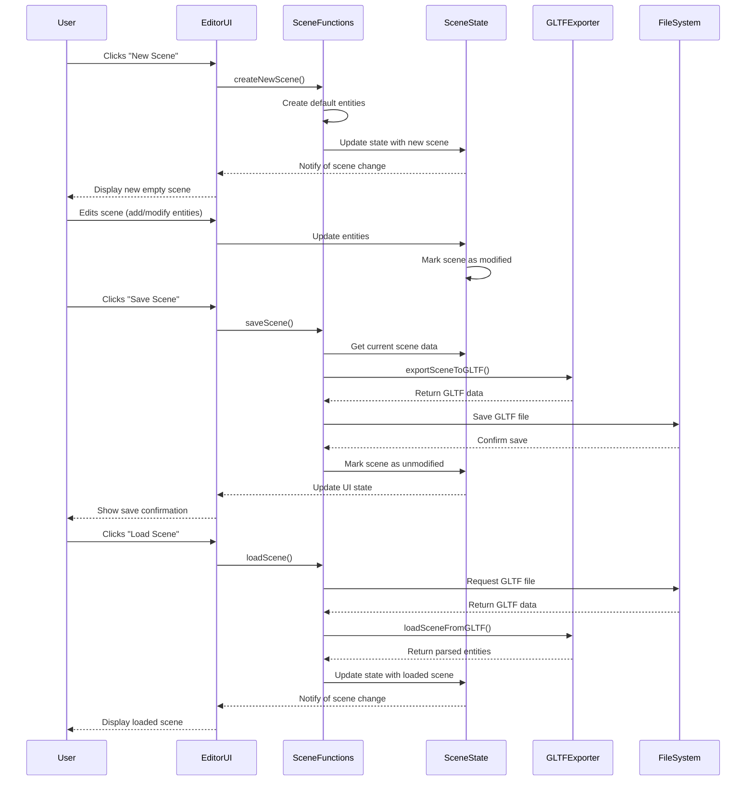

# Scene operations and GLTF management

## Overview

The Scene Operations and GLTF Management component is a fundamental element of the iR Engine's World Editor that handles the creation, loading, and saving of 3D environments. It provides a comprehensive system for managing scene files using the GL Transmission Format (GLTF), enabling users to preserve their work and share it across different platforms. By implementing specialized functions for scene serialization and deserialization, this component ensures that complex 3D worlds can be reliably stored and reconstructed. This chapter explores the implementation, workflow, and management of scenes within the World Editor.

## Core concepts

### Scene structure

A scene in the World Editor represents a complete 3D environment:

- **Entity hierarchy**: The organizational structure of all objects in the scene
- **Component data**: Properties and configurations attached to entities
- **Spatial information**: Positions, rotations, and scales of objects
- **Asset references**: Links to models, textures, and other resources
- **Environment settings**: Lighting, physics, and other scene-wide configurations

This structure forms the foundation of all 3D worlds created in the editor.

### GLTF format

The GLTF (GL Transmission Format) serves as the primary file format for scenes:

- **Industry standard**: Widely supported across 3D applications and engines
- **Comprehensive structure**: Capable of representing complex 3D scenes
- **Binary efficiency**: Supports both JSON (.gltf) and binary (.glb) formats
- **Asset embedding**: Can include or reference textures and other resources
- **Extension system**: Supports custom data through standardized extensions

This format provides a reliable and efficient way to store and share 3D content.

### Scene operations

The scene management system provides essential operations:

- **Creation**: Starting new scenes from templates or empty states
- **Loading**: Opening existing scenes from files
- **Saving**: Preserving the current state of a scene
- **Exporting**: Generating optimized versions for different platforms
- **Importing**: Bringing external scenes into the current project

These operations enable a complete workflow for scene management.

## Implementation

### Scene state management

The scene state service manages the current scene information:

```typescript
// Simplified from: src/services/SceneState.ts
import { defineState, getMutableState } from '@ir-engine/hyperflux';
import { Entity } from '@ir-engine/ecs';

/**
 * State management for scenes
 */
export const SceneState = defineState({
  name: 'SceneState',
  
  // Initial state
  initial: () => ({
    currentScenePath: '',
    isModified: false,
    rootEntity: null as Entity | null,
    entities: [] as Entity[],
    selectedEntityId: '' as string | null
  }),
  
  // Load a scene from a file
  loadScene: async (scenePath: string) => {
    const state = getMutableState(SceneState);
    
    try {
      // Set loading state
      state.currentScenePath.set(scenePath);
      
      // Load the scene file
      const sceneData = await loadSceneFile(scenePath);
      
      // Parse the scene data
      const { rootEntity, entities } = parseSceneData(sceneData);
      
      // Update state with loaded scene
      state.rootEntity.set(rootEntity);
      state.entities.set(entities);
      state.isModified.set(false);
      
      console.log(`Scene loaded: ${scenePath}`);
      return true;
    } catch (error) {
      console.error(`Failed to load scene: ${error}`);
      return false;
    }
  },
  
  // Mark the scene as modified
  setModified: (modified: boolean = true) => {
    const state = getMutableState(SceneState);
    state.isModified.set(modified);
  },
  
  // Select an entity in the scene
  selectEntity: (entityId: string | null) => {
    const state = getMutableState(SceneState);
    state.selectedEntityId.set(entityId);
  }
});
```

This service:
1. Defines a state structure for tracking scene information
2. Provides methods for loading scenes and managing selection
3. Tracks whether the scene has unsaved changes
4. Maintains references to all entities in the scene
5. Uses Hyperflux for reactive state management

### Scene creation

The scene creation function initializes new scenes:

```typescript
// Simplified from: src/functions/sceneFunctions.ts
import { SceneState } from '../services/SceneState';
import { Entity, createEntity, addComponent } from '@ir-engine/ecs';

/**
 * Creates a new empty scene
 * @returns Promise resolving to the created scene
 */
export const createNewScene = async (): Promise<boolean> => {
  try {
    // Create root entity
    const rootEntity = createEntity();
    addComponent(rootEntity, 'transform', {
      position: { x: 0, y: 0, z: 0 },
      rotation: { x: 0, y: 0, z: 0 },
      scale: { x: 1, y: 1, z: 1 }
    });
    
    // Create default camera
    const cameraEntity = createEntity();
    addComponent(cameraEntity, 'transform', {
      position: { x: 0, y: 2, z: 5 },
      rotation: { x: -0.3, y: 0, z: 0 },
      scale: { x: 1, y: 1, z: 1 }
    });
    addComponent(cameraEntity, 'camera', {
      fov: 60,
      near: 0.1,
      far: 1000
    });
    
    // Create default light
    const lightEntity = createEntity();
    addComponent(lightEntity, 'transform', {
      position: { x: 1, y: 3, z: 2 },
      rotation: { x: -0.5, y: 0.5, z: 0 },
      scale: { x: 1, y: 1, z: 1 }
    });
    addComponent(lightEntity, 'directionalLight', {
      color: '#ffffff',
      intensity: 1
    });
    
    // Add camera and light as children of root
    addComponent(rootEntity, 'hierarchy', {
      children: [cameraEntity.id, lightEntity.id]
    });
    
    // Update scene state
    const state = getMutableState(SceneState);
    state.rootEntity.set(rootEntity);
    state.entities.set([rootEntity, cameraEntity, lightEntity]);
    state.currentScenePath.set('');
    state.isModified.set(true);
    
    console.log('New scene created');
    return true;
  } catch (error) {
    console.error(`Failed to create new scene: ${error}`);
    return false;
  }
};
```

This function:
1. Creates a root entity for the scene
2. Adds default camera and light entities
3. Sets up basic components and hierarchy
4. Updates the scene state with the new entities
5. Marks the scene as modified (unsaved)

### Scene saving

The scene saving function serializes the scene to a GLTF file:

```typescript
// Simplified from: src/functions/sceneFunctions.ts
import { SceneState } from '../services/SceneState';
import { exportSceneToGLTF } from './exportGLTF';
import { FilesState } from '../services/FilesState';

/**
 * Saves the current scene to a file
 * @param path Optional path to save to (uses current path if not provided)
 * @returns Promise resolving to success status
 */
export const saveScene = async (path?: string): Promise<boolean> => {
  try {
    const state = getMutableState(SceneState);
    const scenePath = path || state.currentScenePath.value;
    
    // If no path is provided and no current path exists, show save dialog
    if (!scenePath) {
      return saveSceneAs();
    }
    
    // Get the root entity and all entities
    const rootEntity = state.rootEntity.value;
    if (!rootEntity) {
      throw new Error('No scene to save');
    }
    
    // Export the scene to GLTF format
    const gltfData = await exportSceneToGLTF(rootEntity);
    
    // Save the GLTF data to the specified path
    await FilesState.saveFile(scenePath, gltfData);
    
    // Update scene state
    state.currentScenePath.set(scenePath);
    state.isModified.set(false);
    
    console.log(`Scene saved to: ${scenePath}`);
    return true;
  } catch (error) {
    console.error(`Failed to save scene: ${error}`);
    return false;
  }
};

/**
 * Saves the current scene to a new file
 * @returns Promise resolving to success status
 */
export const saveSceneAs = async (): Promise<boolean> => {
  // Show save dialog to get new path
  const newPath = await showSaveDialog({
    title: 'Save Scene As',
    defaultPath: 'New Scene.gltf',
    filters: [{ name: 'GLTF Files', extensions: ['gltf', 'glb'] }]
  });
  
  if (!newPath) {
    return false; // User cancelled
  }
  
  // Save to the new path
  return saveScene(newPath);
};
```

This function:
1. Retrieves the current scene data from state
2. Exports the scene to GLTF format
3. Saves the GLTF data to the specified file
4. Updates the scene state to reflect the save
5. Provides a "Save As" option for creating new files

### GLTF export

The GLTF export function converts scene data to the GLTF format:

```typescript
// Simplified from: src/functions/exportGLTF.ts
import { Entity, getComponent } from '@ir-engine/ecs';
import { GLTFExporter } from '@ir-engine/gltf';

/**
 * Exports a scene to GLTF format
 * @param rootEntity Root entity of the scene
 * @returns Promise resolving to GLTF data
 */
export const exportSceneToGLTF = async (rootEntity: Entity): Promise<ArrayBuffer> => {
  // Create a new GLTF exporter
  const exporter = new GLTFExporter();
  
  // Process the entity hierarchy
  const scene = processEntityHierarchy(rootEntity);
  
  // Export the scene to GLTF
  return new Promise((resolve, reject) => {
    exporter.parse(
      scene,
      (gltfData) => {
        resolve(gltfData);
      },
      (error) => {
        reject(error);
      },
      { binary: true } // Export as GLB (binary GLTF)
    );
  });
};

/**
 * Processes an entity hierarchy for GLTF export
 * @param entity Root entity to process
 * @returns Processed scene object
 */
const processEntityHierarchy = (entity: Entity) => {
  // Create a scene object
  const scene = {
    type: 'Scene',
    children: [],
    userData: { entityId: entity.id }
  };
  
  // Process the root entity
  processEntity(entity, scene);
  
  // Process children recursively
  const hierarchyComponent = getComponent(entity, 'hierarchy');
  if (hierarchyComponent && hierarchyComponent.children) {
    for (const childId of hierarchyComponent.children) {
      const childEntity = getEntityById(childId);
      if (childEntity) {
        const childObject = { type: 'Object3D', userData: { entityId: childId } };
        processEntity(childEntity, childObject);
        scene.children.push(childObject);
      }
    }
  }
  
  return scene;
};

/**
 * Processes a single entity for GLTF export
 * @param entity Entity to process
 * @param object Target object to populate
 */
const processEntity = (entity: Entity, object: any) => {
  // Process transform component
  const transform = getComponent(entity, 'transform');
  if (transform) {
    object.position = transform.position;
    object.rotation = transform.rotation;
    object.scale = transform.scale;
  }
  
  // Process mesh component
  const mesh = getComponent(entity, 'mesh');
  if (mesh) {
    object.geometry = mesh.geometry;
    object.material = mesh.material;
  }
  
  // Process other components
  // Implementation details omitted for brevity
};
```

This function:
1. Creates a GLTF exporter instance
2. Processes the entity hierarchy into a format suitable for export
3. Extracts component data from entities
4. Converts entity relationships to GLTF scene structure
5. Generates a binary GLB file containing the scene data

### GLTF import

The GLTF import function loads scene data from a GLTF file:

```typescript
// Simplified from: src/functions/importGLTF.ts
import { GLTFLoader } from '@ir-engine/gltf';
import { createEntity, addComponent } from '@ir-engine/ecs';

/**
 * Loads a scene from a GLTF file
 * @param url URL of the GLTF file to load
 * @returns Promise resolving to the loaded scene data
 */
export const loadSceneFromGLTF = async (url: string): Promise<{
  rootEntity: Entity;
  entities: Entity[];
}> => {
  // Create a new GLTF loader
  const loader = new GLTFLoader();
  
  // Load the GLTF file
  return new Promise((resolve, reject) => {
    loader.load(
      url,
      (gltf) => {
        // Process the loaded GLTF data
        const { rootEntity, entities } = processGLTFScene(gltf.scene);
        resolve({ rootEntity, entities });
      },
      undefined,
      (error) => {
        reject(error);
      }
    );
  });
};

/**
 * Processes a GLTF scene into entities
 * @param gltfScene The loaded GLTF scene
 * @returns Processed entities
 */
const processGLTFScene = (gltfScene: any): {
  rootEntity: Entity;
  entities: Entity[];
} => {
  const entities: Entity[] = [];
  
  // Create root entity
  const rootEntity = createEntity();
  entities.push(rootEntity);
  
  // Add transform component to root
  addComponent(rootEntity, 'transform', {
    position: {
      x: gltfScene.position.x,
      y: gltfScene.position.y,
      z: gltfScene.position.z
    },
    rotation: {
      x: gltfScene.rotation.x,
      y: gltfScene.rotation.y,
      z: gltfScene.rotation.z
    },
    scale: {
      x: gltfScene.scale.x,
      y: gltfScene.scale.y,
      z: gltfScene.scale.z
    }
  });
  
  // Process children
  const childEntities = processGLTFChildren(gltfScene.children);
  entities.push(...childEntities.entities);
  
  // Add hierarchy component to root
  addComponent(rootEntity, 'hierarchy', {
    children: childEntities.entityIds
  });
  
  return { rootEntity, entities };
};

/**
 * Processes GLTF child objects into entities
 * @param children GLTF child objects
 * @returns Processed child entities
 */
const processGLTFChildren = (children: any[]): {
  entities: Entity[];
  entityIds: string[];
} => {
  const entities: Entity[] = [];
  const entityIds: string[] = [];
  
  for (const child of children) {
    // Create entity for child
    const entity = createEntity();
    entities.push(entity);
    entityIds.push(entity.id);
    
    // Process components based on object properties
    // Implementation details omitted for brevity
  }
  
  return { entities, entityIds };
};
```

This function:
1. Creates a GLTF loader instance
2. Loads the GLTF file from the provided URL
3. Processes the loaded scene into entities
4. Extracts transform and other component data
5. Reconstructs the entity hierarchy from the GLTF structure

## Scene workflow

The complete scene workflow follows this sequence:



This diagram illustrates:
1. The user creates a new scene, which initializes default entities
2. The user edits the scene, which updates the scene state
3. The user saves the scene, which exports it to GLTF and writes to a file
4. The user loads a scene, which reads a GLTF file and reconstructs the entities

## Integration with other components

The scene operations system integrates with several other components of the World Editor:

### Entity Component System

Scenes are built on the Entity Component System architecture:

```typescript
// Example of ECS integration
import { SceneState } from '../services/SceneState';
import { createEntity, addComponent, removeEntity } from '@ir-engine/ecs';

/**
 * Adds a new entity to the scene
 * @param parentId Optional parent entity ID
 * @returns The created entity
 */
export const addEntityToScene = (parentId?: string): Entity => {
  // Create a new entity
  const entity = createEntity();
  
  // Add transform component
  addComponent(entity, 'transform', {
    position: { x: 0, y: 0, z: 0 },
    rotation: { x: 0, y: 0, z: 0 },
    scale: { x: 1, y: 1, z: 1 }
  });
  
  // Get scene state
  const state = getMutableState(SceneState);
  
  // Add to parent if specified
  if (parentId) {
    const parentEntity = state.entities.value.find(e => e.id === parentId);
    if (parentEntity) {
      const hierarchyComponent = getComponent(parentEntity, 'hierarchy') || { children: [] };
      hierarchyComponent.children.push(entity.id);
      addComponent(parentEntity, 'hierarchy', hierarchyComponent);
    }
  } else {
    // Add to root if no parent specified
    const rootEntity = state.rootEntity.value;
    if (rootEntity) {
      const hierarchyComponent = getComponent(rootEntity, 'hierarchy') || { children: [] };
      hierarchyComponent.children.push(entity.id);
      addComponent(rootEntity, 'hierarchy', hierarchyComponent);
    }
  }
  
  // Update scene state
  state.entities.merge([entity]);
  state.isModified.set(true);
  
  return entity;
};
```

This integration:
- Uses the ECS to create and manage entities in the scene
- Maintains parent-child relationships through hierarchy components
- Updates the scene state when entities are added or modified
- Marks the scene as modified when changes occur
- Provides a consistent entity structure for scene operations

### Asset system

Scenes reference assets from the asset system:

```typescript
// Example of asset system integration
import { SceneState } from '../services/SceneState';
import { FilesState } from '../services/FilesState';
import { addComponent } from '@ir-engine/ecs';

/**
 * Adds a model asset to an entity
 * @param entityId ID of the target entity
 * @param assetId ID of the model asset
 * @returns Success status
 */
export const addModelToEntity = (entityId: string, assetId: string): boolean => {
  // Get the entity
  const state = getMutableState(SceneState);
  const entity = state.entities.value.find(e => e.id === entityId);
  if (!entity) {
    return false;
  }
  
  // Get the asset
  const asset = FilesState.getFileById(assetId);
  if (!asset) {
    return false;
  }
  
  // Add model component to the entity
  addComponent(entity, 'model', {
    url: asset.url,
    type: asset.contentType
  });
  
  // Mark scene as modified
  state.isModified.set(true);
  
  return true;
};
```

This integration:
- Connects assets from the file system to entities in the scene
- Adds components that reference asset URLs
- Updates the scene state when assets are added to entities
- Maintains relationships between entities and their assets
- Enables asset-based workflows in scene creation

### Gizmo system

Scene operations interact with the gizmo system for manipulation:

```typescript
// Example of gizmo system integration
import { SceneState } from '../services/SceneState';
import { TransformGizmoSystem } from '../systems/TransformGizmoSystem';
import { getComponent, updateComponent } from '@ir-engine/ecs';

/**
 * Updates an entity's transform based on gizmo manipulation
 * @param entityId ID of the entity being transformed
 * @param newTransform New transform values
 * @returns Success status
 */
export const updateEntityTransform = (
  entityId: string,
  newTransform: {
    position?: Vector3;
    rotation?: Vector3;
    scale?: Vector3;
  }
): boolean => {
  // Get the entity
  const state = getMutableState(SceneState);
  const entity = state.entities.value.find(e => e.id === entityId);
  if (!entity) {
    return false;
  }
  
  // Get current transform
  const transform = getComponent(entity, 'transform');
  if (!transform) {
    return false;
  }
  
  // Update transform with new values
  const updatedTransform = {
    ...transform,
    ...newTransform
  };
  
  // Apply the updated transform
  updateComponent(entity, 'transform', updatedTransform);
  
  // Mark scene as modified
  state.isModified.set(true);
  
  return true;
};
```

This integration:
- Receives transform updates from the gizmo system
- Applies changes to entity transform components
- Updates the scene state to reflect modifications
- Marks the scene as modified when transforms change
- Enables visual manipulation of scene elements

## Benefits of scene operations

The Scene Operations and GLTF Management component provides several key advantages:

1. **Persistence**: Enables saving and loading of complex 3D environments
2. **Standardization**: Uses industry-standard GLTF format for compatibility
3. **Workflow**: Provides a complete set of operations for scene management
4. **Integration**: Connects with other editor systems for a cohesive experience
5. **Efficiency**: Optimizes scene data for storage and loading performance
6. **Collaboration**: Facilitates sharing of scenes between users and applications
7. **Iteration**: Supports versioning and experimentation through "Save As" functionality

These benefits create a reliable and flexible foundation for 3D world creation.

## Next steps

With an understanding of scene operations and GLTF management, the next chapter explores how the Entity Component System is integrated into the World Editor.

Next: [Entity Component System integration](04_entity_component_system__ecs____editor_integration_.md)

---


