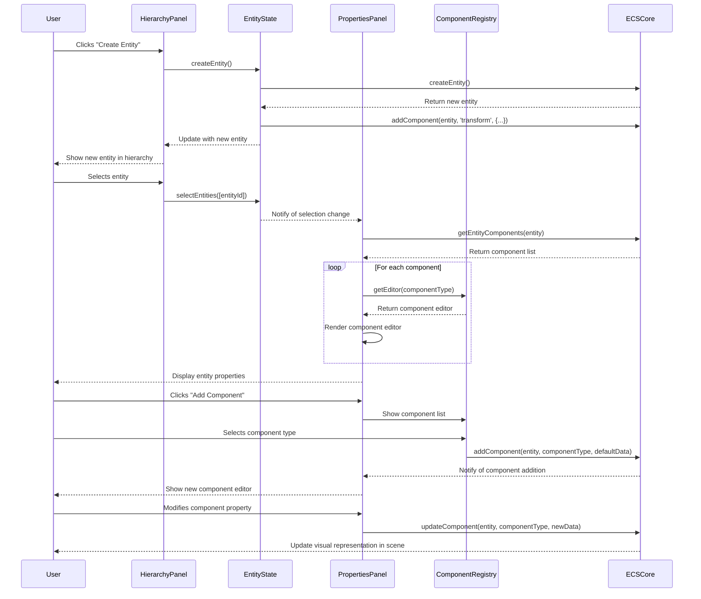

# Entity Component System integration

## Overview

The Entity Component System (ECS) integration is a fundamental element of the iR Engine's World Editor that provides a flexible architecture for defining and manipulating objects in 3D worlds. It implements a composition-based approach where entities are constructed from modular components rather than rigid inheritance hierarchies. By separating data (components) from logic (systems) and identity (entities), this architecture enables intuitive visual editing of complex objects while maintaining high performance. This chapter explores the implementation, workflow, and benefits of the ECS integration within the World Editor.

## Core concepts

### Entity architecture

The Entity Component System follows a composition-based architecture:

- **Entities**: Unique identifiers that represent objects in the scene
- **Components**: Data containers that define specific aspects of an entity
- **Systems**: Logic processors that operate on entities with specific components
- **Queries**: Filters that find entities matching specific component combinations
- **Events**: Notifications that trigger when entity or component states change

This architecture provides a flexible foundation for object definition and manipulation.

### Component types

The editor supports various component types for entity definition:

- **Transform**: Defines position, rotation, and scale in 3D space
- **Mesh**: References 3D geometry for visual representation
- **Material**: Defines surface appearance properties
- **Light**: Creates various light sources (point, directional, spot)
- **Camera**: Defines viewpoints and projection properties
- **Physics**: Adds collision and physical behavior
- **Audio**: Attaches sound sources and listeners
- **Script**: Adds custom behavior through code or visual scripts

These components can be combined in any configuration to create diverse entity types.

### Editor integration

The editor provides specialized interfaces for ECS interaction:

- **Properties panel**: Displays and edits component data
- **Component browser**: Lists available components for addition
- **Entity hierarchy**: Shows parent-child relationships between entities
- **Selection system**: Manages the currently selected entities
- **Undo/redo**: Tracks component changes for reversible operations

This integration creates an intuitive visual interface for the underlying ECS architecture.

## Implementation

### Entity management

The entity management system handles entity creation and organization:

```typescript
// Simplified from: src/services/EntityServices.ts
import { defineState, getMutableState } from '@ir-engine/hyperflux';
import { createEntity, removeEntity, hasComponent, getComponent } from '@ir-engine/ecs';
import { SceneState } from './SceneState';

/**
 * State management for entities
 */
export const EntityState = defineState({
  name: 'EntityState',
  
  // Initial state
  initial: () => ({
    entities: [] as Entity[],
    selectedEntityIds: [] as string[]
  }),
  
  // Create a new entity
  createEntity: (parentId?: string) => {
    const state = getMutableState(EntityState);
    const sceneState = getMutableState(SceneState);
    
    // Create a new entity
    const entity = createEntity();
    
    // Add transform component
    addComponent(entity, 'transform', {
      position: { x: 0, y: 0, z: 0 },
      rotation: { x: 0, y: 0, z: 0 },
      scale: { x: 1, y: 1, z: 1 }
    });
    
    // Add to parent if specified
    if (parentId) {
      const parentEntity = state.entities.value.find(e => e.id === parentId);
      if (parentEntity) {
        const hierarchyComponent = getComponent(parentEntity, 'hierarchy') || { children: [] };
        hierarchyComponent.children.push(entity.id);
        addComponent(parentEntity, 'hierarchy', hierarchyComponent);
      }
    }
    
    // Add to entity list
    state.entities.merge([entity]);
    
    // Mark scene as modified
    sceneState.isModified.set(true);
    
    return entity;
  },
  
  // Remove an entity
  removeEntity: (entityId: string) => {
    const state = getMutableState(EntityState);
    const sceneState = getMutableState(SceneState);
    
    // Find the entity
    const entity = state.entities.value.find(e => e.id === entityId);
    if (!entity) return false;
    
    // Remove from parent's hierarchy
    state.entities.value.forEach(e => {
      if (hasComponent(e, 'hierarchy')) {
        const hierarchy = getComponent(e, 'hierarchy');
        const childIndex = hierarchy.children.indexOf(entityId);
        if (childIndex >= 0) {
          hierarchy.children.splice(childIndex, 1);
          addComponent(e, 'hierarchy', hierarchy);
        }
      }
    });
    
    // Remove the entity
    removeEntity(entity);
    
    // Update entity list
    state.entities.set(state.entities.value.filter(e => e.id !== entityId));
    
    // Deselect if selected
    if (state.selectedEntityIds.value.includes(entityId)) {
      state.selectedEntityIds.set(
        state.selectedEntityIds.value.filter(id => id !== entityId)
      );
    }
    
    // Mark scene as modified
    sceneState.isModified.set(true);
    
    return true;
  },
  
  // Select entities
  selectEntities: (entityIds: string[], addToSelection: boolean = false) => {
    const state = getMutableState(EntityState);
    
    if (addToSelection) {
      // Add to current selection
      const newSelection = [...state.selectedEntityIds.value];
      entityIds.forEach(id => {
        if (!newSelection.includes(id)) {
          newSelection.push(id);
        }
      });
      state.selectedEntityIds.set(newSelection);
    } else {
      // Replace current selection
      state.selectedEntityIds.set(entityIds);
    }
  }
});
```

This service:
1. Provides methods for creating and removing entities
2. Manages parent-child relationships between entities
3. Handles entity selection for editing
4. Updates the scene state when entities change
5. Maintains a list of all entities in the scene

### Component editing

The component editing system provides interfaces for modifying component data:

```typescript
// Simplified from: src/panels/properties/propertyeditor.tsx
import React, { useEffect, useState } from 'react';
import { useHookstate } from '@hookstate/core';
import { EntityState } from '../../services/EntityServices';
import { ComponentRegistry } from '../../services/ComponentRegistry';
import { hasComponent, getComponent, addComponent, removeComponent } from '@ir-engine/ecs';
import { AddComponentButton } from './AddComponentButton';
import { ComponentHeader } from './ComponentHeader';

/**
 * Property editor for entity components
 * @param props Component properties
 * @returns Property editor component
 */
export const PropertyEditor: React.FC = () => {
  // Get selected entity
  const entityState = useHookstate(EntityState.state);
  const selectedIds = entityState.selectedEntityIds.value;
  
  // Handle multi-selection
  const isMultiSelect = selectedIds.length > 1;
  
  // If nothing selected, show empty state
  if (selectedIds.length === 0) {
    return <div className="property-editor-empty">No entity selected</div>;
  }
  
  // Get the primary selected entity
  const primaryEntityId = selectedIds[0];
  const entity = entityState.entities.value.find(e => e.id === primaryEntityId);
  
  if (!entity) {
    return <div className="property-editor-empty">Selected entity not found</div>;
  }
  
  // Get all components on the entity
  const entityComponents = getEntityComponents(entity);
  
  return (
    <div className="property-editor">
      {/* Entity header with name */}
      <EntityHeader entity={entity} isMultiSelect={isMultiSelect} />
      
      {/* Component editors */}
      {entityComponents.map(componentType => (
        <ComponentEditorWrapper
          key={componentType}
          entity={entity}
          componentType={componentType}
          isMultiSelect={isMultiSelect}
        />
      ))}
      
      {/* Add component button */}
      <AddComponentButton
        entity={entity}
        existingComponents={entityComponents}
      />
    </div>
  );
};

/**
 * Component editor wrapper
 * @param props Component properties
 * @returns Component editor wrapper
 */
const ComponentEditorWrapper: React.FC<{
  entity: Entity;
  componentType: string;
  isMultiSelect: boolean;
}> = ({ entity, componentType, isMultiSelect }) => {
  // Get component data
  const componentData = getComponent(entity, componentType);
  
  // Get editor for this component type
  const ComponentEditor = ComponentRegistry.getEditor(componentType);
  
  // If no editor is registered for this component type
  if (!ComponentEditor) {
    return (
      <div className="component-editor">
        <ComponentHeader
          name={componentType}
          entity={entity}
          componentType={componentType}
        />
        <div className="component-editor-unsupported">
          No editor available for this component type
        </div>
      </div>
    );
  }
  
  // Handle component removal
  const handleRemoveComponent = () => {
    removeComponent(entity, componentType);
    // Mark scene as modified
    // Implementation details omitted for brevity
  };
  
  return (
    <div className="component-editor">
      <ComponentHeader
        name={componentType}
        entity={entity}
        componentType={componentType}
        onRemove={handleRemoveComponent}
      />
      <ComponentEditor
        entity={entity}
        componentType={componentType}
        data={componentData}
        isMultiSelect={isMultiSelect}
      />
    </div>
  );
};
```

This component:
1. Retrieves the selected entity from the entity state
2. Gets all components attached to the entity
3. Renders specialized editors for each component type
4. Provides controls for adding and removing components
5. Handles multi-selection for editing multiple entities

### Component registry

The component registry manages available component types and their editors:

```typescript
// Simplified from: src/services/ComponentRegistry.ts
import { defineState, getMutableState } from '@ir-engine/hyperflux';
import { TransformEditor } from '../components/editors/TransformEditor';
import { MeshEditor } from '../components/editors/MeshEditor';
import { LightEditor } from '../components/editors/LightEditor';
import { CameraEditor } from '../components/editors/CameraEditor';

/**
 * Registry for component types and editors
 */
export const ComponentRegistry = defineState({
  name: 'ComponentRegistry',
  
  // Initial state
  initial: () => ({
    // Component definitions
    components: {
      transform: {
        name: 'Transform',
        description: 'Position, rotation, and scale in 3D space',
        category: 'Basic',
        editor: TransformEditor,
        defaultData: {
          position: { x: 0, y: 0, z: 0 },
          rotation: { x: 0, y: 0, z: 0 },
          scale: { x: 1, y: 1, z: 1 }
        }
      },
      mesh: {
        name: 'Mesh',
        description: '3D model geometry',
        category: 'Rendering',
        editor: MeshEditor,
        defaultData: {
          url: '',
          visible: true
        }
      },
      directionalLight: {
        name: 'Directional Light',
        description: 'Light that shines in a specific direction',
        category: 'Lighting',
        editor: LightEditor,
        defaultData: {
          color: '#ffffff',
          intensity: 1,
          castShadow: true
        }
      },
      camera: {
        name: 'Camera',
        description: 'Viewpoint for rendering',
        category: 'Rendering',
        editor: CameraEditor,
        defaultData: {
          fov: 60,
          near: 0.1,
          far: 1000,
          isActive: false
        }
      }
      // Additional component definitions...
    },
    
    // Component categories
    categories: [
      { id: 'Basic', name: 'Basic' },
      { id: 'Rendering', name: 'Rendering' },
      { id: 'Lighting', name: 'Lighting' },
      { id: 'Physics', name: 'Physics' },
      { id: 'Audio', name: 'Audio' },
      { id: 'Scripting', name: 'Scripting' }
    ]
  }),
  
  // Get component definition
  getComponent: (componentType: string) => {
    const state = getMutableState(ComponentRegistry);
    return state.components[componentType];
  },
  
  // Get editor for component type
  getEditor: (componentType: string) => {
    const state = getMutableState(ComponentRegistry);
    const component = state.components[componentType];
    return component ? component.editor : null;
  },
  
  // Get default data for component type
  getDefaultData: (componentType: string) => {
    const state = getMutableState(ComponentRegistry);
    const component = state.components[componentType];
    return component ? { ...component.defaultData } : {};
  },
  
  // Get components by category
  getComponentsByCategory: (categoryId: string) => {
    const state = getMutableState(ComponentRegistry);
    const result = [];
    
    for (const [type, component] of Object.entries(state.components)) {
      if (component.category === categoryId) {
        result.push({ type, ...component });
      }
    }
    
    return result;
  }
});
```

This service:
1. Defines available component types and their metadata
2. Organizes components into categories for browsing
3. Provides default data for component initialization
4. Maps component types to their specialized editors
5. Offers methods for querying component information

### Transform editor

The transform editor provides controls for manipulating spatial properties:

```typescript
// Simplified from: src/components/editors/TransformEditor.tsx
import React from 'react';
import { Vector3Input } from '@ir-engine/ui/src/components/inputs/Vector3Input';
import { useHookstate } from '@hookstate/core';
import { SceneState } from '../../services/SceneState';
import { getComponent, updateComponent } from '@ir-engine/ecs';

/**
 * Editor for transform components
 * @param props Component properties
 * @returns Transform editor component
 */
export const TransformEditor: React.FC<{
  entity: Entity;
  data: any;
  isMultiSelect: boolean;
}> = ({ entity, data, isMultiSelect }) => {
  const sceneState = useHookstate(SceneState.state);
  
  // Handle position change
  const handlePositionChange = (position: Vector3) => {
    const transform = getComponent(entity, 'transform');
    updateComponent(entity, 'transform', {
      ...transform,
      position
    });
    
    // Mark scene as modified
    sceneState.isModified.set(true);
  };
  
  // Handle rotation change
  const handleRotationChange = (rotation: Vector3) => {
    const transform = getComponent(entity, 'transform');
    updateComponent(entity, 'transform', {
      ...transform,
      rotation
    });
    
    // Mark scene as modified
    sceneState.isModified.set(true);
  };
  
  // Handle scale change
  const handleScaleChange = (scale: Vector3) => {
    const transform = getComponent(entity, 'transform');
    updateComponent(entity, 'transform', {
      ...transform,
      scale
    });
    
    // Mark scene as modified
    sceneState.isModified.set(true);
  };
  
  return (
    <div className="transform-editor">
      <div className="editor-row">
        <label>Position</label>
        <Vector3Input
          value={data.position}
          onChange={handlePositionChange}
          disabled={isMultiSelect}
        />
      </div>
      
      <div className="editor-row">
        <label>Rotation</label>
        <Vector3Input
          value={data.rotation}
          onChange={handleRotationChange}
          disabled={isMultiSelect}
        />
      </div>
      
      <div className="editor-row">
        <label>Scale</label>
        <Vector3Input
          value={data.scale}
          onChange={handleScaleChange}
          disabled={isMultiSelect}
        />
      </div>
    </div>
  );
};
```

This component:
1. Provides input fields for position, rotation, and scale
2. Updates the transform component when values change
3. Marks the scene as modified for save tracking
4. Handles multi-selection state for editing multiple entities
5. Uses specialized Vector3Input components for coordinate editing

### Add component dialog

The add component dialog allows adding new components to entities:

```typescript
// Simplified from: src/panels/properties/AddComponentButton.tsx
import React, { useState } from 'react';
import { Button, Dialog, List, ListItem, SearchInput } from '@ir-engine/ui';
import { ComponentRegistry } from '../../services/ComponentRegistry';
import { addComponent } from '@ir-engine/ecs';
import { SceneState } from '../../services/SceneState';

/**
 * Button and dialog for adding components to entities
 * @param props Component properties
 * @returns Add component button component
 */
export const AddComponentButton: React.FC<{
  entity: Entity;
  existingComponents: string[];
}> = ({ entity, existingComponents }) => {
  // Dialog state
  const [isOpen, setIsOpen] = useState(false);
  const [searchQuery, setSearchQuery] = useState('');
  
  // Get component categories
  const categories = ComponentRegistry.state.categories.value;
  
  // Handle component selection
  const handleSelectComponent = (componentType: string) => {
    // Get default data for the component
    const defaultData = ComponentRegistry.getDefaultData(componentType);
    
    // Add component to entity
    addComponent(entity, componentType, defaultData);
    
    // Mark scene as modified
    const sceneState = getMutableState(SceneState);
    sceneState.isModified.set(true);
    
    // Close dialog
    setIsOpen(false);
  };
  
  // Filter components based on search query
  const filterComponents = (components) => {
    if (!searchQuery) return components;
    
    return components.filter(component => 
      component.name.toLowerCase().includes(searchQuery.toLowerCase()) ||
      component.description.toLowerCase().includes(searchQuery.toLowerCase())
    );
  };
  
  return (
    <>
      <Button
        className="add-component-button"
        onClick={() => setIsOpen(true)}
      >
        Add Component
      </Button>
      
      <Dialog
        isOpen={isOpen}
        onClose={() => setIsOpen(false)}
        title="Add Component"
      >
        <SearchInput
          value={searchQuery}
          onChange={(e) => setSearchQuery(e.target.value)}
          placeholder="Search components..."
        />
        
        <div className="component-categories">
          {categories.map(category => {
            // Get components for this category
            const components = filterComponents(
              ComponentRegistry.getComponentsByCategory(category.id)
            );
            
            // Skip empty categories
            if (components.length === 0) return null;
            
            return (
              <div key={category.id} className="component-category">
                <h3>{category.name}</h3>
                <List>
                  {components.map(component => {
                    // Skip components that already exist on the entity
                    if (existingComponents.includes(component.type)) {
                      return null;
                    }
                    
                    return (
                      <ListItem
                        key={component.type}
                        onClick={() => handleSelectComponent(component.type)}
                      >
                        <div className="component-item">
                          <div className="component-name">{component.name}</div>
                          <div className="component-description">
                            {component.description}
                          </div>
                        </div>
                      </ListItem>
                    );
                  })}
                </List>
              </div>
            );
          })}
        </div>
      </Dialog>
    </>
  );
};
```

This component:
1. Displays a button that opens the add component dialog
2. Shows available components organized by category
3. Provides search functionality for finding components
4. Filters out components already on the entity
5. Adds selected components with default values

## ECS workflow

The complete ECS workflow follows this sequence:



This diagram illustrates:
1. The user creates an entity, which initializes it with a transform component
2. The user selects an entity, which displays its components in the Properties Panel
3. The user adds a component, which attaches it to the entity with default values
4. The user modifies a component property, which updates the entity's behavior

## Integration with other components

The ECS integration connects with several other components of the World Editor:

### Gizmo system

The ECS integrates with the gizmo system for visual manipulation:

```typescript
// Example of gizmo system integration
import { EntityState } from '../services/EntityServices';
import { hasComponent, getComponent } from '@ir-engine/ecs';
import { TransformGizmoSystem } from '../systems/TransformGizmoSystem';

/**
 * Updates the transform gizmo based on selection
 */
export const updateTransformGizmo = () => {
  const entityState = getMutableState(EntityState);
  const selectedIds = entityState.selectedEntityIds.value;
  
  // Get the transform gizmo system
  const transformGizmoSystem = getSystem(TransformGizmoSystem);
  
  // If nothing selected, hide gizmo
  if (selectedIds.length === 0) {
    transformGizmoSystem.hide();
    return;
  }
  
  // Get the primary selected entity
  const primaryEntityId = selectedIds[0];
  const entity = entityState.entities.value.find(e => e.id === primaryEntityId);
  
  // If entity has a transform component, show gizmo
  if (entity && hasComponent(entity, 'transform')) {
    const transform = getComponent(entity, 'transform');
    transformGizmoSystem.show(entity, transform);
  } else {
    transformGizmoSystem.hide();
  }
};
```

This integration:
- Monitors entity selection changes
- Checks if selected entities have transform components
- Shows or hides gizmos based on component presence
- Updates gizmo position and orientation to match entity transforms
- Enables visual manipulation of entity properties

### Scene serialization

The ECS integrates with scene serialization for saving and loading:

```typescript
// Example of scene serialization integration
import { EntityState } from '../services/EntityServices';
import { getComponent, getAllComponents } from '@ir-engine/ecs';

/**
 * Serializes entities for scene saving
 * @returns Serialized entity data
 */
export const serializeEntities = () => {
  const entityState = getMutableState(EntityState);
  const entities = entityState.entities.value;
  
  // Serialize each entity
  const serializedEntities = entities.map(entity => {
    // Get all components on the entity
    const components = getAllComponents(entity);
    
    // Serialize each component
    const serializedComponents = {};
    for (const [type, data] of Object.entries(components)) {
      serializedComponents[type] = data;
    }
    
    // Return serialized entity
    return {
      id: entity.id,
      name: getComponent(entity, 'name')?.value || 'Entity',
      components: serializedComponents
    };
  });
  
  return serializedEntities;
};
```

This integration:
- Extracts component data from entities for serialization
- Preserves entity IDs and relationships
- Converts component data to a format suitable for storage
- Supports the scene saving and loading process
- Enables persistence of entity configurations

### Visual scripting

The ECS integrates with the visual scripting system for behavior definition:

```typescript
// Example of visual scripting integration
import { EntityState } from '../services/EntityServices';
import { addComponent, getComponent, updateComponent } from '@ir-engine/ecs';
import { VisualScriptState } from '../services/VisualScriptState';

/**
 * Attaches a visual script to an entity
 * @param entityId ID of the target entity
 * @param scriptId ID of the visual script
 * @returns Success status
 */
export const attachVisualScript = (entityId: string, scriptId: string): boolean => {
  // Get the entity
  const entityState = getMutableState(EntityState);
  const entity = entityState.entities.value.find(e => e.id === entityId);
  if (!entity) {
    return false;
  }
  
  // Get the script
  const script = VisualScriptState.getScriptById(scriptId);
  if (!script) {
    return false;
  }
  
  // Check if entity already has a script component
  if (hasComponent(entity, 'script')) {
    // Update existing script component
    const scriptComponent = getComponent(entity, 'script');
    updateComponent(entity, 'script', {
      ...scriptComponent,
      scriptId: scriptId
    });
  } else {
    // Add new script component
    addComponent(entity, 'script', {
      scriptId: scriptId,
      enabled: true,
      parameters: {}
    });
  }
  
  return true;
};
```

This integration:
- Connects visual scripts to entities through script components
- Updates script references when changes occur
- Maintains parameters for script customization
- Enables behavior definition through the visual scripting system
- Provides a visual interface for entity behavior programming

## Benefits of ECS integration

The Entity Component System integration provides several key advantages:

1. **Flexibility**: Enables creation of diverse entity types through component composition
2. **Modularity**: Separates data (components) from logic (systems) for better organization
3. **Performance**: Optimizes processing by operating on components in batches
4. **Extensibility**: Allows easy addition of new component types and systems
5. **Visualization**: Provides intuitive interfaces for component editing
6. **Reusability**: Enables sharing and reuse of component configurations
7. **Maintainability**: Simplifies debugging by isolating functionality in components

These benefits create a powerful and intuitive foundation for 3D world creation.

## Next steps

With an understanding of the Entity Component System integration, the next chapter explores how gizmos provide visual tools for manipulating entities in the 3D space.

Next: [Gizmos](05_gizmos_.md)

---


