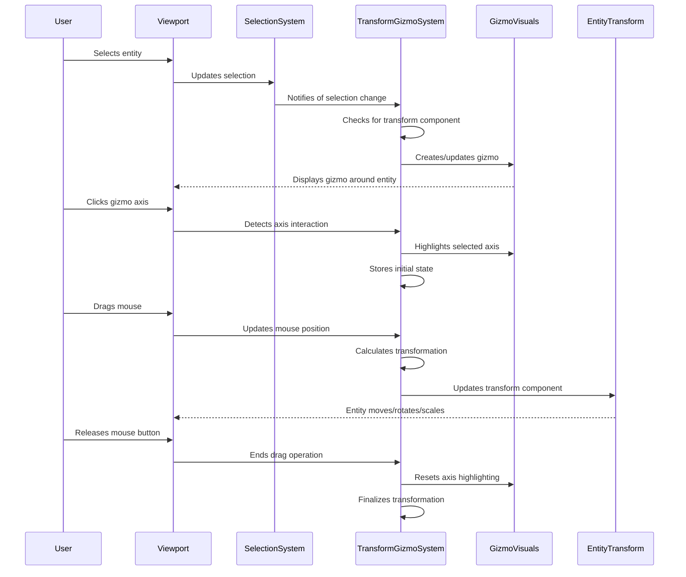

# Gizmos

## Overview

The Gizmos component is a critical element of the iR Engine's World Editor that provides interactive 3D controls for manipulating objects in the viewport. It implements specialized visual handles that enable direct manipulation of entity properties, particularly transformations like position, rotation, and scale. 

By creating intuitive spatial controls that correspond to the underlying component data, this system bridges the gap between visual editing and data manipulation. This chapter explores the implementation, interaction, and types of gizmos available in the World Editor.

## Core concepts

### Gizmo types

The editor implements several types of gizmos for different purposes:

- **Transform gizmo**: Handles for moving, rotating, and scaling entities
- **Camera gizmo**: Controls for viewport navigation and camera positioning
- **Light gizmo**: Visual indicators and controls for light sources
- **Audio gizmo**: Spatial representations of sound sources and ranges
- **Collider gizmo**: Visualizations of physics collision boundaries
- **Custom gizmos**: Specialized controls for specific component types

These gizmos provide intuitive visual interfaces for manipulating different aspects of entities.

### Gizmo modes

The transform gizmo operates in different modes for specific transformations:

- **Translate mode**: Arrows and planes for moving entities along axes
- **Rotate mode**: Rings for rotating entities around axes
- **Scale mode**: Handles for resizing entities along axes
- **Universal mode**: Combined controls for multiple transformation types
- **Local/world space**: Options for working in different coordinate systems

These modes provide specialized controls for different transformation operations.

### Gizmo interaction

Gizmos implement a consistent interaction model:

- **Selection**: Gizmos appear when compatible entities are selected
- **Highlighting**: Visual feedback indicates which gizmo element is active
- **Dragging**: Mouse movement translates to component property changes
- **Snapping**: Optional grid alignment for precise positioning
- **Multi-entity editing**: Support for transforming multiple entities simultaneously

This interaction model creates an intuitive and responsive editing experience.

## Implementation

### Transform gizmo system

The transform gizmo system manages the creation and behavior of transformation controls:

```typescript
// Simplified from: src/systems/TransformGizmoSystem.ts
import { defineSystem, defineQuery, hasComponent } from '@ir-engine/ecs';
import { useHookstate } from '@hookstate/core';
import { EntityState } from '../services/EntityServices';
import { EditorState } from '../services/EditorServices';
import { TransformGizmoControlComponent } from '../components/gizmo/TransformGizmoControlComponent';
import { TransformGizmoVisualComponent } from '../components/gizmo/TransformGizmoVisualComponent';
import { createGizmoEntity, updateGizmoTransform } from '../functions/gizmoFunctions';

/**
 * System for managing transform gizmos
 */
export const TransformGizmoSystem = defineSystem({
  name: 'TransformGizmoSystem',
  
  // Queries for entities with transform gizmo components
  queries: {
    gizmoControls: defineQuery([TransformGizmoControlComponent]),
    gizmoVisuals: defineQuery([TransformGizmoVisualComponent])
  },
  
  // System setup
  setup: () => {
    // Create the gizmo entity
    const gizmoEntity = createGizmoEntity();
    
    return { gizmoEntity };
  },
  
  // System execution
  execute: (system, world) => {
    const { gizmoEntity } = system;
    const entityState = useHookstate(EntityState.state);
    const editorState = useHookstate(EditorState.state);
    
    // Get selected entities
    const selectedEntityIds = entityState.selectedEntityIds.value;
    const selectedEntities = selectedEntityIds.map(id => 
      entityState.entities.value.find(e => e.id === id)
    ).filter(Boolean);
    
    // Check if any selected entity has a transform component
    const hasTransformable = selectedEntities.some(entity => 
      hasComponent(entity, 'transform')
    );
    
    // Show or hide gizmo based on selection
    if (selectedEntities.length > 0 && hasTransformable) {
      // Show gizmo
      if (!hasComponent(gizmoEntity, TransformGizmoControlComponent)) {
        addComponent(gizmoEntity, TransformGizmoControlComponent, {
          controlledEntities: selectedEntities,
          mode: editorState.transformMode.value,
          space: editorState.transformSpace.value,
          dragging: false,
          axis: null
        });
      }
      
      // Update gizmo transform to match selection
      updateGizmoTransform(gizmoEntity, selectedEntities);
      
      // Update gizmo mode if it changed
      const gizmoControl = getComponent(gizmoEntity, TransformGizmoControlComponent);
      if (gizmoControl.mode !== editorState.transformMode.value) {
        updateComponent(gizmoEntity, TransformGizmoControlComponent, {
          ...gizmoControl,
          mode: editorState.transformMode.value
        });
      }
    } else {
      // Hide gizmo
      if (hasComponent(gizmoEntity, TransformGizmoControlComponent)) {
        removeComponent(gizmoEntity, TransformGizmoControlComponent);
      }
    }
    
    // Process gizmo interaction
    const gizmoControls = system.queries.gizmoControls.entities;
    for (const gizmoEntity of gizmoControls) {
      processGizmoInteraction(gizmoEntity, world);
    }
  }
});
```

This system:
1. Creates and manages the gizmo entity
2. Shows or hides the gizmo based on entity selection
3. Updates the gizmo's position and orientation to match selected entities
4. Changes the gizmo mode based on editor state
5. Processes user interaction with the gizmo

### Gizmo control component

The gizmo control component defines the state and behavior of a gizmo:

```typescript
// Simplified from: src/components/gizmo/TransformGizmoControlComponent.ts
import { defineComponent } from '@ir-engine/ecs';

/**
 * Component for transform gizmo control
 */
export const TransformGizmoControlComponent = defineComponent({
  name: 'TransformGizmoControlComponent',
  
  // Component schema
  schema: {
    // Entities controlled by this gizmo
    controlledEntities: { type: 'array', default: [] },
    
    // Current transformation mode
    mode: { type: 'string', default: 'translate' },
    
    // Coordinate space (local or world)
    space: { type: 'string', default: 'world' },
    
    // Is the gizmo currently being dragged
    dragging: { type: 'boolean', default: false },
    
    // Currently active axis or plane
    axis: { type: 'string', default: null },
    
    // Start position for drag operation
    startPosition: { type: 'vector3', default: { x: 0, y: 0, z: 0 } },
    
    // Start rotation for drag operation
    startRotation: { type: 'vector3', default: { x: 0, y: 0, z: 0 } },
    
    // Start scale for drag operation
    startScale: { type: 'vector3', default: { x: 1, y: 1, z: 1 } },
    
    // Mouse position at drag start
    mouseStart: { type: 'vector2', default: { x: 0, y: 0 } },
    
    // Current mouse position during drag
    mouseCurrent: { type: 'vector2', default: { x: 0, y: 0 } },
    
    // Snapping settings
    snap: { type: 'boolean', default: false },
    snapValue: { type: 'number', default: 1 }
  }
});
```

This component:
1. Stores references to the entities being controlled
2. Tracks the current transformation mode and coordinate space
3. Maintains state for the active drag operation
4. Records starting values for transformations
5. Stores mouse positions for calculating changes

### Gizmo visual component

The gizmo visual component manages the 3D representation of the gizmo:

```typescript
// Simplified from: src/components/gizmo/TransformGizmoVisualComponent.ts
import { defineComponent } from '@ir-engine/ecs';
import { Object3D } from 'three';

/**
 * Component for transform gizmo visuals
 */
export const TransformGizmoVisualComponent = defineComponent({
  name: 'TransformGizmoVisualComponent',
  
  // Component schema
  schema: {
    // Root object for all gizmo visuals
    root: { type: 'object', default: null },
    
    // Translate mode visuals
    translateVisuals: { type: 'object', default: null },
    
    // Rotate mode visuals
    rotateVisuals: { type: 'object', default: null },
    
    // Scale mode visuals
    scaleVisuals: { type: 'object', default: null },
    
    // Currently active visuals
    activeVisuals: { type: 'object', default: null },
    
    // Highlight materials for active elements
    highlightMaterials: { type: 'object', default: {} },
    
    // Normal materials for inactive elements
    normalMaterials: { type: 'object', default: {} },
    
    // Visibility state
    visible: { type: 'boolean', default: true }
  },
  
  // Component initialization
  init: (component) => {
    // Create root object
    component.root = new Object3D();
    
    // Create visuals for each mode
    component.translateVisuals = createTranslateVisuals();
    component.rotateVisuals = createRotateVisuals();
    component.scaleVisuals = createScaleVisuals();
    
    // Add visuals to root
    component.root.add(component.translateVisuals);
    component.root.add(component.rotateVisuals);
    component.root.add(component.scaleVisuals);
    
    // Hide all initially
    component.translateVisuals.visible = false;
    component.rotateVisuals.visible = false;
    component.scaleVisuals.visible = false;
    
    // Create materials
    setupMaterials(component);
    
    return component;
  }
});
```

This component:
1. Creates and manages the 3D objects that represent the gizmo
2. Maintains separate visual sets for different transformation modes
3. Handles visibility of the appropriate visual elements
4. Manages materials for normal and highlighted states
5. Provides a structure for organizing complex gizmo visuals

### Gizmo interaction

The gizmo interaction functions handle user input and apply transformations:

```typescript
// Simplified from: src/functions/gizmoFunctions.ts
import { getComponent, updateComponent } from '@ir-engine/ecs';
import { Vector2, Vector3, Raycaster } from 'three';
import { TransformGizmoControlComponent } from '../components/gizmo/TransformGizmoControlComponent';

/**
 * Processes gizmo interaction
 * @param gizmoEntity The gizmo entity
 * @param world The ECS world
 */
export const processGizmoInteraction = (gizmoEntity, world) => {
  const gizmoControl = getComponent(gizmoEntity, TransformGizmoControlComponent);
  
  // If not dragging, check for drag start
  if (!gizmoControl.dragging) {
    if (world.input.mouseDown && world.input.mouseOverGizmo) {
      startDrag(gizmoEntity, world);
    }
  } else {
    // If dragging, update or end drag
    if (world.input.mouseDown) {
      updateDrag(gizmoEntity, world);
    } else {
      endDrag(gizmoEntity, world);
    }
  }
};

/**
 * Starts a gizmo drag operation
 * @param gizmoEntity The gizmo entity
 * @param world The ECS world
 */
export const startDrag = (gizmoEntity, world) => {
  const gizmoControl = getComponent(gizmoEntity, TransformGizmoControlComponent);
  const raycaster = new Raycaster();
  
  // Set up raycaster from mouse position
  const mousePosition = new Vector2(
    (world.input.mouseX / window.innerWidth) * 2 - 1,
    -(world.input.mouseY / window.innerHeight) * 2 + 1
  );
  raycaster.setFromCamera(mousePosition, world.camera);
  
  // Determine which axis was clicked
  const axis = determineClickedAxis(raycaster, gizmoEntity);
  if (!axis) return;
  
  // Store starting values for controlled entities
  const startValues = gizmoControl.controlledEntities.map(entity => {
    const transform = getComponent(entity, 'transform');
    return {
      entityId: entity.id,
      position: { ...transform.position },
      rotation: { ...transform.rotation },
      scale: { ...transform.scale }
    };
  });
  
  // Update gizmo control state
  updateComponent(gizmoEntity, TransformGizmoControlComponent, {
    ...gizmoControl,
    dragging: true,
    axis,
    startValues,
    mouseStart: { x: world.input.mouseX, y: world.input.mouseY },
    mouseCurrent: { x: world.input.mouseX, y: world.input.mouseY }
  });
  
  // Highlight the active axis
  highlightAxis(gizmoEntity, axis);
};

/**
 * Updates a gizmo drag operation
 * @param gizmoEntity The gizmo entity
 * @param world The ECS world
 */
export const updateDrag = (gizmoEntity, world) => {
  const gizmoControl = getComponent(gizmoEntity, TransformGizmoControlComponent);
  
  // Update current mouse position
  updateComponent(gizmoEntity, TransformGizmoControlComponent, {
    ...gizmoControl,
    mouseCurrent: { x: world.input.mouseX, y: world.input.mouseY }
  });
  
  // Calculate delta from start position
  const deltaX = world.input.mouseX - gizmoControl.mouseStart.x;
  const deltaY = world.input.mouseY - gizmoControl.mouseStart.y;
  
  // Apply transformation based on mode
  switch (gizmoControl.mode) {
    case 'translate':
      applyTranslation(gizmoEntity, deltaX, deltaY, world);
      break;
    case 'rotate':
      applyRotation(gizmoEntity, deltaX, deltaY, world);
      break;
    case 'scale':
      applyScale(gizmoEntity, deltaX, deltaY, world);
      break;
  }
};

/**
 * Ends a gizmo drag operation
 * @param gizmoEntity The gizmo entity
 * @param world The ECS world
 */
export const endDrag = (gizmoEntity, world) => {
  const gizmoControl = getComponent(gizmoEntity, TransformGizmoControlComponent);
  
  // Reset gizmo control state
  updateComponent(gizmoEntity, TransformGizmoControlComponent, {
    ...gizmoControl,
    dragging: false,
    axis: null
  });
  
  // Reset axis highlighting
  resetAxisHighlighting(gizmoEntity);
};
```

These functions:
1. Handle the start, update, and end of drag operations
2. Determine which axis or plane the user is interacting with
3. Calculate transformation changes based on mouse movement
4. Apply changes to the controlled entities' transform components
5. Provide visual feedback through axis highlighting

### Camera gizmo

The camera gizmo provides controls for viewport navigation:

```typescript
// Simplified from: src/components/gizmo/CameraGizmoComponent.ts
import { defineComponent } from '@ir-engine/ecs';
import { Object3D, Mesh, SphereGeometry, MeshBasicMaterial } from 'three';

/**
 * Component for camera gizmo
 */
export const CameraGizmoComponent = defineComponent({
  name: 'CameraGizmoComponent',
  
  // Component schema
  schema: {
    // Root object for camera gizmo
    root: { type: 'object', default: null },
    
    // Individual axis objects
    xAxis: { type: 'object', default: null },
    yAxis: { type: 'object', default: null },
    zAxis: { type: 'object', default: null },
    
    // Center sphere
    center: { type: 'object', default: null },
    
    // Position in viewport (0-1)
    viewportPosition: { type: 'vector2', default: { x: 0.9, y: 0.1 } },
    
    // Size in pixels
    size: { type: 'number', default: 80 }
  },
  
  // Component initialization
  init: (component) => {
    // Create root object
    component.root = new Object3D();
    
    // Create center sphere
    const sphereGeometry = new SphereGeometry(0.2, 16, 16);
    const sphereMaterial = new MeshBasicMaterial({ color: 0xffffff });
    component.center = new Mesh(sphereGeometry, sphereMaterial);
    component.root.add(component.center);
    
    // Create axis indicators
    component.xAxis = createAxisIndicator(0xff0000, new Vector3(1, 0, 0));
    component.yAxis = createAxisIndicator(0x00ff00, new Vector3(0, 1, 0));
    component.zAxis = createAxisIndicator(0x0000ff, new Vector3(0, 0, 1));
    
    component.root.add(component.xAxis);
    component.root.add(component.yAxis);
    component.root.add(component.zAxis);
    
    return component;
  }
});
```

This component:
1. Creates a visual representation of the camera orientation
2. Provides clickable elements for standard views (top, front, side)
3. Maintains a fixed position in the viewport corner
4. Updates to reflect the current camera orientation
5. Handles user interaction for quick view changes

## Gizmo workflow

The complete gizmo workflow follows this sequence:



This diagram illustrates:
1. The gizmo appears when an entity with a transform component is selected
2. The user interacts with a specific part of the gizmo (axis, ring, etc.)
3. As the user drags, the system calculates and applies transformations
4. The entity updates in real-time, providing immediate visual feedback
5. The operation completes when the user releases the mouse button

## Integration with other components

The gizmo system integrates with several other components of the World Editor:

### Entity Component System

Gizmos interact directly with the ECS to modify entity components:

```typescript
// Example of ECS integration
import { getComponent, updateComponent } from '@ir-engine/ecs';
import { TransformGizmoControlComponent } from '../components/gizmo/TransformGizmoControlComponent';

/**
 * Applies a translation to controlled entities
 * @param gizmoEntity The gizmo entity
 * @param deltaX Mouse X movement
 * @param deltaY Mouse Y movement
 * @param world The ECS world
 */
export const applyTranslation = (gizmoEntity, deltaX, deltaY, world) => {
  const gizmoControl = getComponent(gizmoEntity, TransformGizmoControlComponent);
  const { axis, controlledEntities, startValues, snap, snapValue } = gizmoControl;
  
  // Calculate world space movement based on mouse delta
  const worldDelta = calculateWorldDelta(gizmoEntity, deltaX, deltaY, world);
  
  // Apply to each controlled entity
  controlledEntities.forEach((entity, index) => {
    const startValue = startValues[index];
    const transform = getComponent(entity, 'transform');
    
    // Calculate new position based on axis and delta
    let newPosition = { ...transform.position };
    
    if (axis === 'X' || axis === 'XY' || axis === 'XZ') {
      newPosition.x = startValue.position.x + worldDelta.x;
      if (snap) newPosition.x = Math.round(newPosition.x / snapValue) * snapValue;
    }
    
    if (axis === 'Y' || axis === 'XY' || axis === 'YZ') {
      newPosition.y = startValue.position.y + worldDelta.y;
      if (snap) newPosition.y = Math.round(newPosition.y / snapValue) * snapValue;
    }
    
    if (axis === 'Z' || axis === 'XZ' || axis === 'YZ') {
      newPosition.z = startValue.position.z + worldDelta.z;
      if (snap) newPosition.z = Math.round(newPosition.z / snapValue) * snapValue;
    }
    
    // Update the entity's transform component
    updateComponent(entity, 'transform', {
      ...transform,
      position: newPosition
    });
  });
};
```

This integration:
- Retrieves and updates transform components directly
- Applies transformations based on gizmo interaction
- Supports features like snapping for precise positioning
- Handles multiple selected entities simultaneously
- Maintains the connection between visual manipulation and data

### Editor state

Gizmos respond to changes in editor state:

```typescript
// Example of editor state integration
import { useHookstate } from '@hookstate/core';
import { EditorState } from '../services/EditorServices';
import { TransformGizmoControlComponent } from '../components/gizmo/TransformGizmoControlComponent';
import { TransformGizmoVisualComponent } from '../components/gizmo/TransformGizmoVisualComponent';

/**
 * Updates gizmo based on editor state changes
 * @param gizmoEntity The gizmo entity
 */
export const updateGizmoFromEditorState = (gizmoEntity) => {
  const editorState = useHookstate(EditorState.state);
  const gizmoControl = getComponent(gizmoEntity, TransformGizmoControlComponent);
  const gizmoVisual = getComponent(gizmoEntity, TransformGizmoVisualComponent);
  
  // Update transform mode
  if (gizmoControl.mode !== editorState.transformMode.value) {
    updateComponent(gizmoEntity, TransformGizmoControlComponent, {
      ...gizmoControl,
      mode: editorState.transformMode.value
    });
    
    // Update visuals for new mode
    updateGizmoVisuals(gizmoEntity, editorState.transformMode.value);
  }
  
  // Update coordinate space
  if (gizmoControl.space !== editorState.transformSpace.value) {
    updateComponent(gizmoEntity, TransformGizmoControlComponent, {
      ...gizmoControl,
      space: editorState.transformSpace.value
    });
    
    // Update gizmo orientation
    updateGizmoOrientation(gizmoEntity, editorState.transformSpace.value);
  }
  
  // Update snap settings
  if (gizmoControl.snap !== editorState.snapEnabled.value ||
      gizmoControl.snapValue !== editorState.snapValue.value) {
    updateComponent(gizmoEntity, TransformGizmoControlComponent, {
      ...gizmoControl,
      snap: editorState.snapEnabled.value,
      snapValue: editorState.snapValue.value
    });
  }
};
```

This integration:
- Monitors editor state for changes to transformation settings
- Updates gizmo configuration to match current editor mode
- Switches between different visual representations
- Adjusts coordinate systems based on local/world space setting
- Applies snapping settings for precise transformations

### Viewport system

Gizmos integrate with the viewport for rendering and interaction:

```typescript
// Example of viewport integration
import { Object3D, Raycaster, Vector2 } from 'three';
import { CameraGizmoComponent } from '../components/gizmo/CameraGizmoComponent';

/**
 * Updates camera gizmo position in viewport
 * @param gizmoEntity The camera gizmo entity
 * @param viewport The viewport information
 */
export const updateCameraGizmoViewport = (gizmoEntity, viewport) => {
  const gizmo = getComponent(gizmoEntity, CameraGizmoComponent);
  
  // Calculate screen position
  const x = viewport.width * gizmo.viewportPosition.x;
  const y = viewport.height * gizmo.viewportPosition.y;
  
  // Position gizmo in corner of viewport
  positionObjectInViewport(gizmo.root, x, y, gizmo.size, viewport.camera);
};

/**
 * Checks if mouse is over a gizmo
 * @param mouseX Mouse X position
 * @param mouseY Mouse Y position
 * @param gizmoEntities Array of gizmo entities
 * @param viewport The viewport information
 * @returns Object with hit information or null
 */
export const checkGizmoIntersection = (mouseX, mouseY, gizmoEntities, viewport) => {
  // Create raycaster from mouse position
  const raycaster = new Raycaster();
  const mousePosition = new Vector2(
    (mouseX / viewport.width) * 2 - 1,
    -(mouseY / viewport.height) * 2 + 1
  );
  raycaster.setFromCamera(mousePosition, viewport.camera);
  
  // Collect all gizmo objects
  const gizmoObjects = [];
  gizmoEntities.forEach(entity => {
    // Get visual component
    const visual = getComponent(entity, TransformGizmoVisualComponent) || 
                  getComponent(entity, CameraGizmoComponent);
    
    if (visual && visual.root) {
      gizmoObjects.push(visual.root);
    }
  });
  
  // Check for intersections
  const intersects = raycaster.intersectObjects(gizmoObjects, true);
  
  return intersects.length > 0 ? intersects[0] : null;
};
```

This integration:
- Positions gizmos correctly in the viewport
- Handles mouse interaction through raycasting
- Maintains proper scale regardless of camera distance
- Ensures gizmos are visible and usable in different viewport configurations
- Provides hit testing for determining which gizmo element is clicked

## Benefits of gizmos

The Gizmos component provides several key advantages:

1. **Intuitive editing**: Provides direct manipulation of objects in 3D space
2. **Visual feedback**: Shows transformation axes and planes clearly
3. **Precision**: Enables accurate positioning, rotation, and scaling
4. **Efficiency**: Speeds up common transformation operations
5. **Consistency**: Maintains familiar controls across different object types
6. **Flexibility**: Supports different transformation modes and coordinate spaces
7. **Discoverability**: Makes spatial editing capabilities visually apparent

These benefits create a more intuitive and efficient editing experience for 3D world creation.

## Next steps

With an understanding of gizmos and how they enable direct manipulation of entities, the next chapter explores how the Visual Scripting System provides a node-based approach to defining entity behavior.

Next: [Visual scripting system](06_visual_scripting_system_.md)

---


