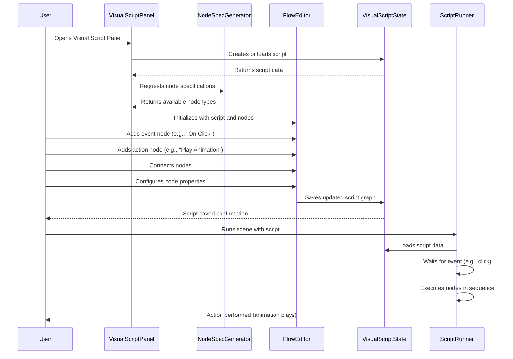

# Visual scripting system

## Overview

The Visual Scripting System is a powerful component of the iR Engine's World Editor that enables the creation of interactive behaviors without traditional programming. It implements a node-based interface where users connect visual elements representing actions, events, and data to define logic flows. 

By providing an intuitive graphical alternative to text-based coding, this system makes behavior creation accessible to users with varying technical backgrounds. This chapter explores the implementation, workflow, and capabilities of the visual scripting system within the World Editor.

## Core concepts

### Node-based programming

The visual scripting system is built on a node-based programming paradigm:

- **Nodes**: Visual blocks representing specific functions or operations
- **Edges**: Connections between nodes that define data and execution flow
- **Sockets**: Input and output points on nodes where connections attach
- **Graphs**: Complete networks of connected nodes that define a behavior
- **Variables**: Named data storage that can be accessed across a graph

This paradigm provides an intuitive visual representation of program logic.

### Node types

The system includes several categories of nodes for different purposes:

- **Event nodes**: Trigger execution based on specific conditions or inputs
- **Action nodes**: Perform operations that affect entities or the environment
- **Logic nodes**: Control the flow of execution with conditions and branches
- **Data nodes**: Provide, manipulate, or store data values
- **Entity nodes**: Reference and interact with scene objects
- **Math nodes**: Perform mathematical calculations and operations
- **Custom nodes**: User-defined functionality for specific requirements

These node types provide a comprehensive toolkit for behavior creation.

### Script execution

The script execution system processes visual scripts at runtime:

- **Event detection**: Monitors for conditions that trigger event nodes
- **Flow traversal**: Follows execution paths through connected nodes
- **Data propagation**: Passes values between nodes along data connections
- **Action invocation**: Calls engine functions based on node configurations
- **State management**: Maintains script variables and execution context

This execution system translates visual graphs into runtime behaviors.

## Implementation

### Visual script panel

The visual script panel provides the main interface for script creation:

```typescript
// Simplified from: src/panels/visualscript/index.tsx
import React from 'react';
import { useHookstate } from '@hookstate/core';
import { PanelDragContainer, PanelTitle } from '@ir-engine/ui/src/components/editor/layout/Panel';
import { TabData } from 'rc-dock';
import { useTranslation } from 'react-i18next';
import { VisualScriptState } from '../../services/VisualScriptState';
import { VisualScriptFlow } from './flow';
import { VisualScriptSidepanel } from './sidepanel';

/**
 * Visual script panel content component
 * @returns Visual script panel component
 */
const VisualScriptPanel: React.FC = () => {
  const { t } = useTranslation();
  const visualScriptState = useHookstate(VisualScriptState.state);
  const currentScriptId = visualScriptState.currentScriptId.value;
  
  // If no script is selected, show empty state
  if (!currentScriptId) {
    return (
      <div className="visual-script-panel-empty">
        <p>{t('editor:visualScript.noScriptSelected')}</p>
        <button onClick={() => VisualScriptState.createNewScript()}>
          {t('editor:visualScript.createNew')}
        </button>
      </div>
    );
  }
  
  return (
    <div className="visual-script-panel">
      <div className="visual-script-panel-content">
        <VisualScriptFlow scriptId={currentScriptId} />
        <VisualScriptSidepanel scriptId={currentScriptId} />
      </div>
    </div>
  );
};

/**
 * Visual script panel title component
 * @returns Visual script panel title component
 */
const VisualScriptPanelTitle: React.FC = () => {
  const { t } = useTranslation();
  
  return (
    <PanelDragContainer>
      <PanelTitle>{t('editor:visualScript.title')}</PanelTitle>
    </PanelDragContainer>
  );
};

/**
 * Visual script panel tab configuration
 */
export const VisualScriptPanelTab: TabData = {
  id: 'visualScriptPanel',
  title: <VisualScriptPanelTitle />,
  content: <VisualScriptPanel />,
  closable: false
};
```

This component:
1. Provides the main interface for creating and editing visual scripts
2. Shows an empty state when no script is selected
3. Renders the flow editor for node manipulation
4. Includes a side panel for script properties and variables
5. Integrates with the editor's tab system

### Flow editor

The flow editor manages the canvas where nodes are placed and connected:

```typescript
// Simplified from: src/panels/visualscript/flow.tsx
import React, { useCallback, useEffect, useState } from 'react';
import ReactFlow, {
  Background,
  Controls,
  MiniMap,
  addEdge,
  useNodesState,
  useEdgesState
} from 'reactflow';
import { useHookstate } from '@hookstate/core';
import { VisualScriptState } from '../../services/VisualScriptState';
import { NodeTypes } from './node/types';
import { useNodeSpecGenerator } from './hooks/useNodeSpecGenerator';
import { visualToFlow } from './transformers/visualToFlow';
import { flowToVisual } from './transformers/flowToVisual';

/**
 * Visual script flow editor component
 * @param props Component properties
 * @returns Visual script flow editor component
 */
export const VisualScriptFlow: React.FC<{
  scriptId: string;
}> = ({ scriptId }) => {
  // Get script data
  const visualScriptState = useHookstate(VisualScriptState.state);
  const script = visualScriptState.scripts[scriptId].value;
  
  // Node and edge state
  const [nodes, setNodes, onNodesChange] = useNodesState([]);
  const [edges, setEdges, onEdgesChange] = useEdgesState([]);
  
  // Node specifications
  const nodeSpecs = useNodeSpecGenerator();
  
  // Initialize flow from script data
  useEffect(() => {
    if (script && script.graph) {
      const { nodes: flowNodes, edges: flowEdges } = visualToFlow(script.graph, nodeSpecs);
      setNodes(flowNodes);
      setEdges(flowEdges);
    }
  }, [script, nodeSpecs]);
  
  // Handle edge connections
  const onConnect = useCallback((params) => {
    setEdges((eds) => addEdge(params, eds));
  }, [setEdges]);
  
  // Save changes to script
  const onSave = useCallback(() => {
    const graph = flowToVisual(nodes, edges);
    VisualScriptState.updateScriptGraph(scriptId, graph);
  }, [scriptId, nodes, edges]);
  
  // Auto-save on changes
  useEffect(() => {
    const timer = setTimeout(onSave, 1000);
    return () => clearTimeout(timer);
  }, [nodes, edges, onSave]);
  
  return (
    <div className="visual-script-flow">
      <ReactFlow
        nodes={nodes}
        edges={edges}
        onNodesChange={onNodesChange}
        onEdgesChange={onEdgesChange}
        onConnect={onConnect}
        nodeTypes={NodeTypes}
        fitView
      >
        <Background />
        <Controls />
        <MiniMap />
      </ReactFlow>
    </div>
  );
};
```

This component:
1. Uses ReactFlow for the node-based interface
2. Converts between visual script data and flow representation
3. Handles node and edge changes
4. Provides background, controls, and minimap for navigation
5. Auto-saves changes to the script state

### Node component

The node component renders individual nodes in the flow editor:

```typescript
// Simplified from: src/panels/visualscript/node/index.tsx
import React, { memo } from 'react';
import { Handle, Position, NodeProps } from 'reactflow';
import { NodeSpecJSON } from '../types';

/**
 * Visual script node component
 * @param props Component properties
 * @returns Visual script node component
 */
export const VisualScriptNode: React.FC<NodeProps<{
  spec: NodeSpecJSON;
  data: Record<string, any>;
}>> = memo(({ id, data, selected }) => {
  const { spec, data: nodeData } = data;
  
  return (
    <div className={`visual-script-node ${spec.category} ${selected ? 'selected' : ''}`}>
      <div className="node-header">
        <div className="node-title">{spec.label}</div>
      </div>
      
      <div className="node-content">
        {/* Input sockets */}
        {spec.inputs.map((input) => (
          <div key={input.id} className="node-socket input-socket">
            <Handle
              type="target"
              position={Position.Left}
              id={input.id}
              className={`socket ${input.type}`}
            />
            <div className="socket-label">{input.label}</div>
            {input.showControl && renderInputControl(input, nodeData[input.id], id)}
          </div>
        ))}
        
        {/* Output sockets */}
        {spec.outputs.map((output) => (
          <div key={output.id} className="node-socket output-socket">
            <div className="socket-label">{output.label}</div>
            <Handle
              type="source"
              position={Position.Right}
              id={output.id}
              className={`socket ${output.type}`}
            />
          </div>
        ))}
      </div>
    </div>
  );
});

/**
 * Renders an input control based on type
 * @param input Input specification
 * @param value Current value
 * @param nodeId Node ID
 * @returns Input control component
 */
const renderInputControl = (input, value, nodeId) => {
  switch (input.controlType) {
    case 'number':
      return (
        <input
          type="number"
          value={value || 0}
          onChange={(e) => updateNodeData(nodeId, input.id, parseFloat(e.target.value))}
        />
      );
    case 'string':
      return (
        <input
          type="text"
          value={value || ''}
          onChange={(e) => updateNodeData(nodeId, input.id, e.target.value)}
        />
      );
    case 'boolean':
      return (
        <input
          type="checkbox"
          checked={value || false}
          onChange={(e) => updateNodeData(nodeId, input.id, e.target.checked)}
        />
      );
    // Additional control types...
    default:
      return null;
  }
};
```

This component:
1. Renders a node with header and content sections
2. Creates input and output sockets based on node specification
3. Provides appropriate controls for editable inputs
4. Handles value changes and updates node data
5. Applies styling based on node category and selection state

### Node specification generator

The node specification generator defines available node types:

```typescript
// Simplified from: src/panels/visualscript/hooks/useNodeSpecGenerator.ts
import { useCallback } from 'react';
import { NodeSpecJSON, SocketType } from '../types';

/**
 * Hook for generating node specifications
 * @returns Node specification generator
 */
export const useNodeSpecGenerator = () => {
  /**
   * Generates specifications for all available node types
   * @returns Map of node specifications by type
   */
  const generateNodeSpecs = useCallback(() => {
    const specs = new Map<string, NodeSpecJSON>();
    
    // Event nodes
    specs.set('onStart', {
      type: 'onStart',
      category: 'event',
      label: 'On Start',
      description: 'Triggered when the scene starts',
      inputs: [],
      outputs: [
        {
          id: 'flow',
          label: 'Flow',
          type: SocketType.Flow
        }
      ]
    });
    
    specs.set('onClick', {
      type: 'onClick',
      category: 'event',
      label: 'On Click',
      description: 'Triggered when the entity is clicked',
      inputs: [],
      outputs: [
        {
          id: 'flow',
          label: 'Flow',
          type: SocketType.Flow
        },
        {
          id: 'entity',
          label: 'Entity',
          type: SocketType.Entity
        }
      ]
    });
    
    // Action nodes
    specs.set('playAnimation', {
      type: 'playAnimation',
      category: 'action',
      label: 'Play Animation',
      description: 'Plays an animation on an entity',
      inputs: [
        {
          id: 'flow',
          label: 'Flow',
          type: SocketType.Flow
        },
        {
          id: 'entity',
          label: 'Entity',
          type: SocketType.Entity,
          defaultValue: 'self'
        },
        {
          id: 'animationName',
          label: 'Animation',
          type: SocketType.String,
          controlType: 'string',
          showControl: true
        }
      ],
      outputs: [
        {
          id: 'flow',
          label: 'Complete',
          type: SocketType.Flow
        }
      ]
    });
    
    // Logic nodes
    specs.set('branch', {
      type: 'branch',
      category: 'logic',
      label: 'Branch (If/Else)',
      description: 'Branches flow based on a condition',
      inputs: [
        {
          id: 'flow',
          label: 'Flow',
          type: SocketType.Flow
        },
        {
          id: 'condition',
          label: 'Condition',
          type: SocketType.Boolean
        }
      ],
      outputs: [
        {
          id: 'true',
          label: 'True',
          type: SocketType.Flow
        },
        {
          id: 'false',
          label: 'False',
          type: SocketType.Flow
        }
      ]
    });
    
    // Data nodes
    specs.set('number', {
      type: 'number',
      category: 'data',
      label: 'Number',
      description: 'Provides a number value',
      inputs: [
        {
          id: 'value',
          label: 'Value',
          type: SocketType.Number,
          controlType: 'number',
          showControl: true,
          defaultValue: 0
        }
      ],
      outputs: [
        {
          id: 'value',
          label: 'Value',
          type: SocketType.Number
        }
      ]
    });
    
    // Additional node specifications...
    
    return specs;
  }, []);
  
  return generateNodeSpecs();
};
```

This hook:
1. Defines specifications for all available node types
2. Organizes nodes into categories (event, action, logic, data)
3. Specifies inputs and outputs with their types and properties
4. Provides default values and control types for editable inputs
5. Includes descriptions for documentation and tooltips

### Script state management

The script state service manages visual script data:

```typescript
// Simplified from: src/services/VisualScriptState.ts
import { defineState, getMutableState } from '@ir-engine/hyperflux';
import { v4 as uuidv4 } from 'uuid';
import { GraphJSON } from '../panels/visualscript/types';

/**
 * State management for visual scripts
 */
export const VisualScriptState = defineState({
  name: 'VisualScriptState',
  
  // Initial state
  initial: () => ({
    scripts: {} as Record<string, {
      id: string;
      name: string;
      description: string;
      graph: GraphJSON;
      variables: Record<string, any>;
    }>,
    currentScriptId: null as string | null
  }),
  
  // Create a new script
  createNewScript: () => {
    const state = getMutableState(VisualScriptState);
    const id = uuidv4();
    
    // Create empty script
    state.scripts[id].set({
      id,
      name: 'New Script',
      description: '',
      graph: {
        nodes: [],
        edges: []
      },
      variables: {}
    });
    
    // Set as current script
    state.currentScriptId.set(id);
    
    return id;
  },
  
  // Update script graph
  updateScriptGraph: (scriptId: string, graph: GraphJSON) => {
    const state = getMutableState(VisualScriptState);
    
    if (state.scripts[scriptId].value) {
      state.scripts[scriptId].graph.set(graph);
    }
  },
  
  // Set current script
  setCurrentScript: (scriptId: string) => {
    const state = getMutableState(VisualScriptState);
    state.currentScriptId.set(scriptId);
  },
  
  // Get script by ID
  getScriptById: (scriptId: string) => {
    const state = getMutableState(VisualScriptState);
    return state.scripts[scriptId].value;
  },
  
  // Delete script
  deleteScript: (scriptId: string) => {
    const state = getMutableState(VisualScriptState);
    
    // Remove script
    state.scripts[scriptId].set(undefined);
    
    // Clear current script if it was the deleted one
    if (state.currentScriptId.value === scriptId) {
      state.currentScriptId.set(null);
    }
  }
});
```

This service:
1. Defines a state structure for storing visual scripts
2. Provides methods for creating, updating, and deleting scripts
3. Manages the currently selected script
4. Stores script metadata, graph structure, and variables
5. Uses Hyperflux for reactive state management

### Script execution

The script execution system runs visual scripts at runtime:

```typescript
// Simplified from: src/runtime/VisualScriptRunner.ts
import { Entity, getComponent, addComponent } from '@ir-engine/ecs';
import { VisualScriptState } from '../services/VisualScriptState';
import { NodeExecutors } from './NodeExecutors';

/**
 * Runs a visual script on an entity
 * @param entity Entity to run the script on
 * @param scriptId ID of the script to run
 * @param eventType Type of event that triggered the script
 * @param eventData Additional event data
 */
export const runVisualScript = (
  entity: Entity,
  scriptId: string,
  eventType: string,
  eventData: any = {}
) => {
  // Get the script
  const script = VisualScriptState.getScriptById(scriptId);
  if (!script) return;
  
  // Create execution context
  const context = {
    entity,
    variables: { ...script.variables },
    eventData
  };
  
  // Find event nodes matching the event type
  const eventNodes = script.graph.nodes.filter(node => 
    node.type === eventType
  );
  
  // Execute each matching event node
  for (const eventNode of eventNodes) {
    executeNode(eventNode.id, script.graph, context);
  }
};

/**
 * Executes a node and follows the execution flow
 * @param nodeId ID of the node to execute
 * @param graph Script graph
 * @param context Execution context
 */
const executeNode = (nodeId: string, graph: any, context: any) => {
  // Find the node
  const node = graph.nodes.find(n => n.id === nodeId);
  if (!node) return;
  
  // Get the node executor
  const executor = NodeExecutors[node.type];
  if (!executor) return;
  
  // Execute the node
  const outputs = executor(node.data, context);
  
  // Follow execution flow
  if (outputs && outputs.flow) {
    // Find edges connected to the flow output
    const edges = graph.edges.filter(edge => 
      edge.source === nodeId && edge.sourceHandle === 'flow'
    );
    
    // Execute connected nodes
    for (const edge of edges) {
      executeNode(edge.target, graph, context);
    }
  }
};
```

This system:
1. Retrieves script data from the script state
2. Creates an execution context with entity and variable information
3. Finds event nodes that match the triggering event
4. Executes nodes and follows the execution flow
5. Passes data between nodes according to connections

## Script workflow

The complete visual scripting workflow follows this sequence:



This diagram illustrates:
1. The user creates or loads a visual script
2. The panel initializes with available node types
3. The user builds the script by adding and connecting nodes
4. The script is saved to the script state
5. At runtime, the script runner executes the nodes when events occur

## Integration with other components

The visual scripting system integrates with several other components of the World Editor:

### Entity Component System

Visual scripts interact with the ECS to manipulate entities:

```typescript
// Example of ECS integration
import { Entity, getComponent, addComponent, removeComponent } from '@ir-engine/ecs';

/**
 * Node executor for the "Add Component" action
 * @param data Node data
 * @param context Execution context
 * @returns Node outputs
 */
export const executeAddComponentNode = (data: any, context: any) => {
  const { entity } = context;
  const { componentType, componentData } = data;
  
  // Add component to entity
  addComponent(entity, componentType, componentData);
  
  // Return flow output
  return { flow: true };
};

/**
 * Node executor for the "Get Component Property" data node
 * @param data Node data
 * @param context Execution context
 * @returns Node outputs
 */
export const executeGetComponentPropertyNode = (data: any, context: any) => {
  const { entity } = context;
  const { componentType, propertyPath } = data;
  
  // Get component
  const component = getComponent(entity, componentType);
  if (!component) return { value: null };
  
  // Get property value
  const value = getPropertyByPath(component, propertyPath);
  
  // Return value output
  return { value };
};
```

This integration:
- Allows scripts to add, remove, and modify entity components
- Provides access to component properties for logic and calculations
- Enables scripts to query entity state and relationships
- Connects visual logic to the underlying entity architecture
- Maintains consistency with the ECS programming model

### Scene management

Visual scripts integrate with scene operations:

```typescript
// Example of scene management integration
import { SceneState } from '../services/SceneState';

/**
 * Node executor for the "Load Scene" action
 * @param data Node data
 * @param context Execution context
 * @returns Node outputs
 */
export const executeLoadSceneNode = (data: any, context: any) => {
  const { scenePath } = data;
  
  // Load the scene
  SceneState.loadScene(scenePath)
    .then(() => {
      // Continue execution if successful
      return { flow: true };
    })
    .catch(error => {
      console.error('Failed to load scene:', error);
      return { flow: false };
    });
};

/**
 * Node executor for the "Get Current Scene" data node
 * @param data Node data
 * @param context Execution context
 * @returns Node outputs
 */
export const executeGetCurrentSceneNode = (data: any, context: any) => {
  const currentScene = SceneState.state.currentScenePath.value;
  
  // Return scene path output
  return { scenePath: currentScene };
};
```

This integration:
- Enables scripts to load and manage scenes
- Provides access to scene information for logic
- Allows creation of scene transitions and level management
- Connects visual scripting to the scene workflow
- Supports building complete interactive experiences

### Asset system

Visual scripts can reference and manipulate assets:

```typescript
// Example of asset system integration
import { FilesState } from '../services/FilesState';

/**
 * Node executor for the "Play Sound" action
 * @param data Node data
 * @param context Execution context
 * @returns Node outputs
 */
export const executePlaySoundNode = (data: any, context: any) => {
  const { soundAssetId, volume, loop } = data;
  
  // Get sound asset
  const soundAsset = FilesState.getFileById(soundAssetId);
  if (!soundAsset) {
    console.error('Sound asset not found:', soundAssetId);
    return { flow: true }; // Continue execution despite error
  }
  
  // Play the sound
  const audioSystem = getAudioSystem();
  audioSystem.playSound(soundAsset.url, {
    volume: volume || 1.0,
    loop: loop || false
  });
  
  // Return flow output
  return { flow: true };
};
```

This integration:
- Allows scripts to reference and use assets like sounds, textures, and models
- Provides access to asset metadata and properties
- Enables dynamic asset loading and manipulation
- Connects visual scripting to the asset management system
- Supports creating rich multimedia experiences

## Benefits of visual scripting

The Visual Scripting System provides several key advantages:

1. **Accessibility**: Enables non-programmers to create complex behaviors
2. **Visualization**: Represents logic flows in an intuitive graphical format
3. **Rapid iteration**: Facilitates quick prototyping and testing of ideas
4. **Modularity**: Encourages creation of reusable script components
5. **Integration**: Connects seamlessly with other editor systems
6. **Extensibility**: Allows addition of custom nodes for specialized functionality
7. **Debugging**: Provides visual tracing of execution paths

These benefits create a more inclusive and efficient development process for interactive content creation.

## Next steps

With an understanding of the visual scripting system, the next chapter explores the editor control functions that provide core functionality for managing the World Editor.

Next: [Editor control functions](07_editor_control_functions_.md)

---


