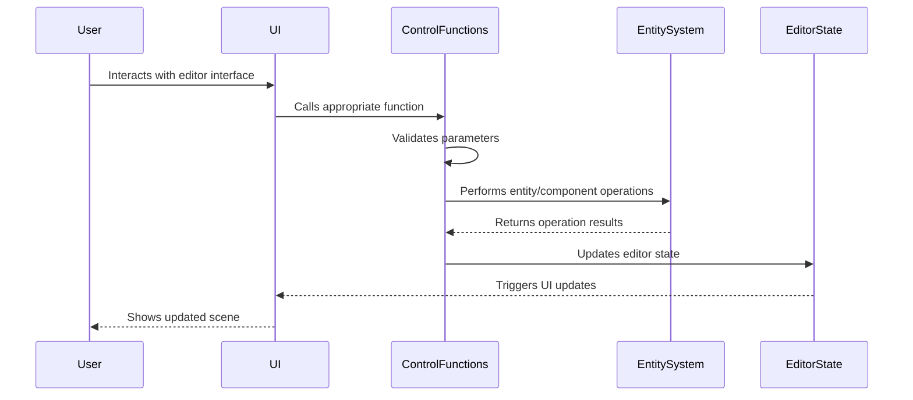

# Editor control functions

## Overview

The Editor Control Functions component is a fundamental element of the iR Engine's World Editor that provides a centralized set of operations for manipulating entities and components. It implements an internal API that abstracts common editing tasks, enabling consistent behavior across different parts of the user interface. 

By separating the implementation of editing operations from the UI elements that trigger them, this component creates a modular and maintainable architecture. This chapter explores the implementation, usage, and benefits of the editor control functions within the World Editor.

## Core concepts

### Function architecture

The editor control functions follow a consistent architecture:

- **Centralization**: Core editing operations are defined in a single location
- **Abstraction**: Functions hide implementation details from UI components
- **Consistency**: Common operations use the same underlying logic
- **Validation**: Input parameters are checked before operations are performed
- **Feedback**: Operations provide appropriate return values and error handling

This architecture creates a reliable foundation for editor operations.

### Operation types

The editor supports various types of operations:

- **Entity operations**: Creating, duplicating, and removing entities
- **Component operations**: Adding, removing, and modifying components
- **Selection operations**: Selecting, deselecting, and querying entities
- **Hierarchy operations**: Managing parent-child relationships
- **Transform operations**: Manipulating position, rotation, and scale
- **Utility operations**: Common helper functions for editor tasks

These operations cover the essential editing capabilities of the World Editor.

### State integration

The control functions integrate with the editor's state management:

- **Scene modification**: Operations mark the scene as modified
- **Selection updates**: Selection state is updated after operations
- **Undo/redo**: Operations can be recorded for undo/redo functionality
- **Event notification**: State changes trigger appropriate UI updates
- **Validation**: Operations check state conditions before execution

This integration ensures that the editor's state remains consistent.

## Implementation

### Entity creation

The entity creation function creates new entities in the scene:

```typescript
// Simplified from: src/functions/EditorControlFunctions.ts
import { createEntity, addComponent } from '@ir-engine/ecs';
import { v4 as uuidv4 } from 'uuid';
import { EditorState } from '../services/EditorServices';
import { SceneState } from '../services/SceneState';

/**
 * Creates a new entity in the scene
 * @param options Creation options
 * @returns The created entity
 */
export const createObject = (options: {
  name?: string;
  parentId?: string;
  beforeEntityId?: string;
  components?: Array<{
    type: string;
    data: any;
  }>;
}): Entity => {
  const {
    name = 'New Entity',
    parentId,
    beforeEntityId,
    components = []
  } = options;
  
  // Create the entity
  const entity = createEntity();
  
  // Add UUID component
  addComponent(entity, 'uuid', {
    id: uuidv4()
  });
  
  // Add name component
  addComponent(entity, 'name', {
    value: name
  });
  
  // Add transform component
  addComponent(entity, 'transform', {
    position: { x: 0, y: 0, z: 0 },
    rotation: { x: 0, y: 0, z: 0 },
    scale: { x: 1, y: 1, z: 1 }
  });
  
  // Add hierarchy component if parent specified
  if (parentId) {
    const parentEntity = findEntityById(parentId);
    if (parentEntity) {
      // Add to parent's children
      const parentHierarchy = getComponent(parentEntity, 'hierarchy') || { children: [] };
      
      if (beforeEntityId) {
        // Insert at specific position
        const index = parentHierarchy.children.indexOf(beforeEntityId);
        if (index >= 0) {
          parentHierarchy.children.splice(index, 0, entity.id);
        } else {
          parentHierarchy.children.push(entity.id);
        }
      } else {
        // Add to end
        parentHierarchy.children.push(entity.id);
      }
      
      addComponent(parentEntity, 'hierarchy', parentHierarchy);
    }
  }
  
  // Add additional components
  for (const component of components) {
    addComponent(entity, component.type, component.data);
  }
  
  // Add to scene
  const sceneState = getMutableState(SceneState);
  sceneState.entities.merge([entity]);
  
  // Mark scene as modified
  const editorState = getMutableState(EditorState);
  editorState.isModified.set(true);
  
  return entity;
};
```

This function:
1. Creates a new entity with a unique identifier
2. Adds basic components like name and transform
3. Handles parent-child relationships in the hierarchy
4. Adds any additional components specified in the options
5. Updates the scene state and marks it as modified

### Entity duplication

The entity duplication function creates copies of existing entities:

```typescript
// Simplified from: src/functions/EditorControlFunctions.ts
import { createEntity, addComponent, getComponent, getAllComponents } from '@ir-engine/ecs';
import { v4 as uuidv4 } from 'uuid';
import { EditorState } from '../services/EditorServices';
import { SceneState } from '../services/SceneState';

/**
 * Duplicates entities in the scene
 * @param entityIds IDs of entities to duplicate
 * @returns The duplicated entities
 */
export const duplicateObjects = (entityIds: string[]): Entity[] => {
  const duplicatedEntities: Entity[] = [];
  const sceneState = getMutableState(SceneState);
  
  for (const entityId of entityIds) {
    // Find the original entity
    const originalEntity = sceneState.entities.value.find(e => e.id === entityId);
    if (!originalEntity) continue;
    
    // Skip scene root
    if (getComponent(originalEntity, 'scene')) continue;
    
    // Create new entity
    const newEntity = createEntity();
    
    // Add UUID component
    addComponent(newEntity, 'uuid', {
      id: uuidv4()
    });
    
    // Copy name component with "_Copy" suffix
    const nameComponent = getComponent(originalEntity, 'name');
    addComponent(newEntity, 'name', {
      value: nameComponent ? `${nameComponent.value}_Copy` : 'Copy'
    });
    
    // Copy all other components except UUID and special components
    const components = getAllComponents(originalEntity);
    for (const [type, data] of Object.entries(components)) {
      if (type === 'uuid' || type === 'scene') continue;
      
      // Deep copy component data
      const componentData = JSON.parse(JSON.stringify(data));
      
      // Special handling for hierarchy component
      if (type === 'hierarchy') {
        // Don't copy children references
        componentData.children = [];
      }
      
      addComponent(newEntity, type, componentData);
    }
    
    // Add to same parent as original
    const parentEntity = findParentEntity(originalEntity);
    if (parentEntity) {
      const parentHierarchy = getComponent(parentEntity, 'hierarchy') || { children: [] };
      
      // Add after the original in the hierarchy
      const index = parentHierarchy.children.indexOf(entityId);
      if (index >= 0) {
        parentHierarchy.children.splice(index + 1, 0, newEntity.id);
      } else {
        parentHierarchy.children.push(newEntity.id);
      }
      
      addComponent(parentEntity, 'hierarchy', parentHierarchy);
    }
    
    // Add to scene
    sceneState.entities.merge([newEntity]);
    duplicatedEntities.push(newEntity);
  }
  
  // Mark scene as modified
  const editorState = getMutableState(EditorState);
  editorState.isModified.set(true);
  
  // Select the duplicated entities
  editorState.selectedEntityIds.set(duplicatedEntities.map(e => e.id));
  
  return duplicatedEntities;
};
```

This function:
1. Creates new entities for each entity being duplicated
2. Copies all components and their data from the original entities
3. Handles special cases like hierarchy components
4. Places duplicates in the same parent as the originals
5. Selects the newly created duplicates

### Entity removal

The entity removal function deletes entities from the scene:

```typescript
// Simplified from: src/functions/EditorControlFunctions.ts
import { removeEntity, hasComponent, getComponent } from '@ir-engine/ecs';
import { EditorState } from '../services/EditorServices';
import { SceneState } from '../services/SceneState';

/**
 * Removes entities from the scene
 * @param entityIds IDs of entities to remove
 * @returns Success status
 */
export const removeObjects = (entityIds: string[]): boolean => {
  const sceneState = getMutableState(SceneState);
  const editorState = getMutableState(EditorState);
  
  // Deselect entities that will be removed
  const currentSelection = editorState.selectedEntityIds.value;
  const newSelection = currentSelection.filter(id => !entityIds.includes(id));
  editorState.selectedEntityIds.set(newSelection);
  
  for (const entityId of entityIds) {
    // Find the entity
    const entity = sceneState.entities.value.find(e => e.id === entityId);
    if (!entity) continue;
    
    // Skip scene root
    if (hasComponent(entity, 'scene')) continue;
    
    // Remove from parent's hierarchy
    const parentEntity = findParentEntity(entity);
    if (parentEntity) {
      const parentHierarchy = getComponent(parentEntity, 'hierarchy');
      if (parentHierarchy) {
        const childIndex = parentHierarchy.children.indexOf(entityId);
        if (childIndex >= 0) {
          parentHierarchy.children.splice(childIndex, 1);
          addComponent(parentEntity, 'hierarchy', parentHierarchy);
        }
      }
    }
    
    // Remove the entity
    removeEntity(entity);
    
    // Update entity list
    sceneState.entities.set(sceneState.entities.value.filter(e => e.id !== entityId));
  }
  
  // Mark scene as modified
  editorState.isModified.set(true);
  
  return true;
};
```

This function:
1. Deselects entities that will be removed
2. Removes entities from their parent's hierarchy
3. Deletes the entities and their components
4. Updates the scene's entity list
5. Marks the scene as modified

### Component modification

The component modification function updates component properties:

```typescript
// Simplified from: src/functions/EditorControlFunctions.ts
import { getComponent, updateComponent } from '@ir-engine/ecs';
import { EditorState } from '../services/EditorServices';
import { SceneState } from '../services/SceneState';

/**
 * Modifies component properties on entities
 * @param entityIds IDs of entities to modify
 * @param componentType Type of component to modify
 * @param properties Properties to update
 * @returns Success status
 */
export const modifyProperties = (
  entityIds: string[],
  componentType: string,
  properties: Record<string, any>
): boolean => {
  const sceneState = getMutableState(SceneState);
  const editorState = getMutableState(EditorState);
  
  for (const entityId of entityIds) {
    // Find the entity
    const entity = sceneState.entities.value.find(e => e.id === entityId);
    if (!entity) continue;
    
    // Check if entity has the component
    if (!hasComponent(entity, componentType)) continue;
    
    // Get current component data
    const component = getComponent(entity, componentType);
    
    // Update properties
    const updatedComponent = {
      ...component,
      ...properties
    };
    
    // Apply updated component
    updateComponent(entity, componentType, updatedComponent);
  }
  
  // Mark scene as modified
  editorState.isModified.set(true);
  
  return true;
};
```

This function:
1. Finds the entities to modify
2. Checks if each entity has the specified component
3. Gets the current component data
4. Updates the specified properties
5. Applies the changes and marks the scene as modified

### Component management

The component management function adds or removes components:

```typescript
// Simplified from: src/functions/EditorControlFunctions.ts
import { hasComponent, addComponent, removeComponent } from '@ir-engine/ecs';
import { EditorState } from '../services/EditorServices';
import { ComponentRegistry } from '../services/ComponentRegistry';

/**
 * Adds or removes components from entities
 * @param entityIds IDs of entities to modify
 * @param componentType Type of component to add or remove
 * @param add True to add, false to remove
 * @param defaultData Default data for new components
 * @returns Success status
 */
export const addOrRemoveComponent = (
  entityIds: string[],
  componentType: string,
  add: boolean,
  defaultData?: any
): boolean => {
  const editorState = getMutableState(EditorState);
  
  for (const entityId of entityIds) {
    // Find the entity
    const entity = findEntityById(entityId);
    if (!entity) continue;
    
    if (add) {
      // Skip if entity already has the component
      if (hasComponent(entity, componentType)) continue;
      
      // Get default data if not provided
      const data = defaultData || ComponentRegistry.getDefaultData(componentType);
      
      // Add the component
      addComponent(entity, componentType, data);
    } else {
      // Skip if entity doesn't have the component
      if (!hasComponent(entity, componentType)) continue;
      
      // Remove the component
      removeComponent(entity, componentType);
    }
  }
  
  // Mark scene as modified
  editorState.isModified.set(true);
  
  return true;
};
```

This function:
1. Processes each entity in the provided list
2. For addition, adds the component with default or provided data
3. For removal, removes the component if it exists
4. Skips operations that don't apply (adding existing or removing non-existent)
5. Marks the scene as modified after changes

## Control function workflow

The complete control function workflow follows this sequence:



This diagram illustrates:
1. The user interacts with the editor interface (buttons, menus, etc.)
2. The UI calls the appropriate control function
3. The control function validates parameters and performs operations
4. The entity system processes the requested changes
5. The editor state is updated to reflect the changes
6. The UI updates to show the modified scene

## Integration with other components

The editor control functions integrate with several other components of the World Editor:

### User interface

Control functions are called from various UI elements:

```typescript
// Example of UI integration
import { createObject, removeObjects } from '../../functions/EditorControlFunctions';

/**
 * Hierarchy panel context menu component
 * @param props Component properties
 * @returns Context menu component
 */
export const HierarchyContextMenu: React.FC<{
  entityId: string;
  position: { x: number; y: number };
  onClose: () => void;
}> = ({ entityId, position, onClose }) => {
  // Handle create empty entity
  const handleCreateEmpty = () => {
    createObject({
      name: 'New Entity',
      parentId: entityId
    });
    onClose();
  };
  
  // Handle delete entity
  const handleDelete = () => {
    removeObjects([entityId]);
    onClose();
  };
  
  return (
    <div className="context-menu" style={{ left: position.x, top: position.y }}>
      <div className="context-menu-item" onClick={handleCreateEmpty}>
        Create Empty
      </div>
      <div className="context-menu-item" onClick={handleDelete}>
        Delete
      </div>
    </div>
  );
};
```

This integration:
- Connects UI elements directly to control functions
- Provides a clean separation between UI and logic
- Ensures consistent behavior across different UI elements
- Simplifies UI component implementation
- Centralizes operation logic for better maintainability

### Keyboard shortcuts

Control functions are triggered by keyboard shortcuts:

```typescript
// Example of keyboard shortcut integration
import { duplicateObjects, removeObjects } from '../../functions/EditorControlFunctions';
import { EditorState } from '../../services/EditorServices';

/**
 * Handles editor keyboard shortcuts
 * @param event Keyboard event
 */
export const handleKeyboardShortcuts = (event: KeyboardEvent) => {
  const editorState = EditorState.state;
  const selectedEntityIds = editorState.selectedEntityIds.value;
  
  // Skip if no entities are selected
  if (selectedEntityIds.length === 0) return;
  
  // Handle delete key
  if (event.key === 'Delete') {
    event.preventDefault();
    removeObjects(selectedEntityIds);
  }
  
  // Handle duplicate (Ctrl+D)
  if (event.key === 'd' && (event.ctrlKey || event.metaKey)) {
    event.preventDefault();
    duplicateObjects(selectedEntityIds);
  }
  
  // Additional shortcuts...
};
```

This integration:
- Provides keyboard shortcuts for common operations
- Uses the same control functions as UI elements
- Ensures consistent behavior regardless of input method
- Centralizes shortcut handling logic
- Improves editor usability with keyboard navigation

### Undo/redo system

Control functions integrate with the undo/redo system:

```typescript
// Example of undo/redo integration
import { modifyProperties } from '../../functions/EditorControlFunctions';
import { UndoRedoState } from '../../services/UndoRedoState';

/**
 * Records an operation for undo/redo and executes it
 * @param entityIds Entities to modify
 * @param componentType Component type
 * @param newProperties New property values
 * @param oldProperties Old property values for undo
 */
export const recordAndModifyProperties = (
  entityIds: string[],
  componentType: string,
  newProperties: Record<string, any>,
  oldProperties: Record<string, any>
) => {
  // Create undo operation
  const undoOperation = {
    type: 'modifyProperties',
    entityIds,
    componentType,
    properties: oldProperties
  };
  
  // Create redo operation
  const redoOperation = {
    type: 'modifyProperties',
    entityIds,
    componentType,
    properties: newProperties
  };
  
  // Record the operation
  UndoRedoState.recordOperation(undoOperation, redoOperation);
  
  // Execute the operation
  modifyProperties(entityIds, componentType, newProperties);
};
```

This integration:
- Records operations for undo/redo functionality
- Stores the information needed to reverse operations
- Uses the same control functions for both initial execution and undo/redo
- Maintains consistency between direct operations and undo/redo
- Provides a reliable history of user actions

## Benefits of control functions

The Editor Control Functions component provides several key advantages:

1. **Centralization**: Consolidates editing logic in a single location
2. **Consistency**: Ensures the same behavior across different UI elements
3. **Modularity**: Separates UI implementation from editing logic
4. **Maintainability**: Makes it easier to update or fix editing operations
5. **Extensibility**: Provides a foundation for adding new editing capabilities
6. **Reliability**: Implements validation and error handling for operations
7. **Testability**: Enables unit testing of editing logic independent of UI

These benefits create a more robust and maintainable foundation for the World Editor.

## Next steps

With an understanding of editor control functions, the next chapter explores how modal dialogs provide focused interaction for important decisions and inputs.

Next: [Modal dialog management](08_modal_dialog_management_.md)

---


