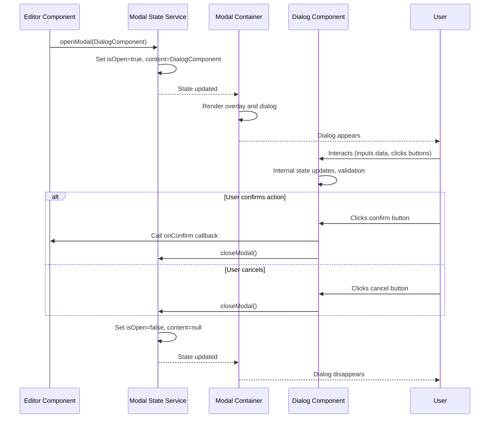

# Modal dialog management

## Overview

The Modal Dialog Management component is an essential element of the iR Engine's World Editor that handles focused user interactions through popup windows. It provides a standardized system for requesting user input, confirming actions, and displaying important information while temporarily blocking interaction with the rest of the editor. By implementing a centralized modal state service, this component ensures consistent behavior and appearance across all dialog interactions. This chapter explores the implementation, workflow, and usage of modal dialogs within the World Editor.

## Core concepts

### Modal dialogs

Modal dialogs are popup windows that require user attention:

- **Focus control**: Temporarily blocks interaction with the rest of the editor
- **User input**: Collects specific information from the user
- **Decision points**: Presents options for critical actions
- **Information display**: Shows important messages or warnings
- **Workflow interruption**: Ensures critical decisions are made consciously

These dialogs create a clear interaction path for important user decisions.

### Centralized management

The modal state service provides centralized dialog control:

- **Single source of truth**: Maintains the current state of modal dialogs
- **Standardized API**: Offers consistent methods for opening and closing dialogs
- **Content flexibility**: Accepts any component as dialog content
- **Global accessibility**: Available to all parts of the editor
- **State management**: Tracks whether a dialog is currently active

This centralized approach ensures consistent behavior across the editor.

### Dialog components

Dialog components define the content and behavior of modals:

- **Self-contained UI**: Includes all necessary interface elements
- **Internal state**: Manages its own data and validation
- **Action handlers**: Contains logic for responding to user choices
- **Communication**: Reports results back to the calling code
- **Styling consistency**: Follows the editor's design patterns

These components provide the actual content displayed within the modal framework.

## Implementation

### Modal state service

The modal state service manages dialog visibility and content:

```typescript
// Simplified from: src/common/services/ModalState.ts
import { createState, useState } from '@hookstate/core';
import { ReactNode } from 'react';

/**
 * State for modal dialogs
 */
interface ModalStateType {
  // Whether a modal is currently visible
  isOpen: boolean;
  
  // The content to display in the modal
  content: ReactNode | null;
}

// Create the global state
const modalState = createState<ModalStateType>({
  isOpen: false,
  content: null
});

/**
 * Modal state service
 */
export const ModalState = {
  /**
   * Gets the current state
   * @returns Modal state hook
   */
  useState: () => useState(modalState),
  
  /**
   * Checks if a modal is currently open
   * @returns Whether a modal is open
   */
  isOpen: () => modalState.value.isOpen,
  
  /**
   * Gets the current modal content
   * @returns Modal content
   */
  getContent: () => modalState.value.content,
  
  /**
   * Opens a modal with the specified content
   * @param content Modal content
   */
  openModal: (content: ReactNode) => {
    modalState.set({
      isOpen: true,
      content
    });
  },
  
  /**
   * Closes the current modal
   */
  closeModal: () => {
    modalState.set({
      isOpen: false,
      content: null
    });
  }
};
```

This service:
1. Defines a state structure for tracking modal visibility and content
2. Creates a global state instance using a state management library
3. Provides methods for checking the current state
4. Implements functions for opening and closing modals
5. Makes the state accessible throughout the application

### Dialog component example

A typical dialog component implements its own UI and behavior:

```typescript
// Example dialog component: src/components/dialogs/SaveSceneDialog.tsx
import React, { useState } from 'react';
import { Button, Input, Dialog, DialogTitle, DialogContent, DialogActions } from '../ui/components';
import { ModalState } from '../../common/services/ModalState';

/**
 * Props for the save scene dialog
 */
interface SaveSceneDialogProps {
  // Initial scene name
  initialName?: string;
  
  // Callback when save is confirmed
  onSave?: (sceneName: string) => void;
}

/**
 * Dialog for saving a scene
 * @param props Component props
 * @returns Dialog component
 */
export function SaveSceneDialog(props: SaveSceneDialogProps) {
  // Local state for the scene name
  const [sceneName, setSceneName] = useState(props.initialName || 'New Scene');
  
  // Local state for validation
  const [isValid, setIsValid] = useState(true);
  const [errorMessage, setErrorMessage] = useState('');
  
  /**
   * Validates the scene name
   * @param name Scene name to validate
   * @returns Whether the name is valid
   */
  const validateName = (name: string) => {
    if (!name.trim()) {
      setIsValid(false);
      setErrorMessage('Scene name cannot be empty');
      return false;
    }
    
    if (name.includes('/') || name.includes('\\')) {
      setIsValid(false);
      setErrorMessage('Scene name cannot contain slashes');
      return false;
    }
    
    setIsValid(true);
    setErrorMessage('');
    return true;
  };
  
  /**
   * Handles input changes
   * @param e Change event
   */
  const handleChange = (e: React.ChangeEvent<HTMLInputElement>) => {
    const newName = e.target.value;
    setSceneName(newName);
    validateName(newName);
  };
  
  /**
   * Handles save button click
   */
  const handleSave = () => {
    if (validateName(sceneName)) {
      // Call the onSave callback if provided
      if (props.onSave) {
        props.onSave(sceneName);
      }
      
      // Close the modal
      ModalState.closeModal();
    }
  };
  
  /**
   * Handles cancel button click
   */
  const handleCancel = () => {
    // Just close the modal
    ModalState.closeModal();
  };
  
  return (
    <Dialog>
      <DialogTitle>Save Scene</DialogTitle>
      <DialogContent>
        <div className="form-group">
          <label htmlFor="scene-name">Scene Name:</label>
          <Input
            id="scene-name"
            value={sceneName}
            onChange={handleChange}
            error={!isValid}
            autoFocus
          />
          {!isValid && <div className="error-message">{errorMessage}</div>}
        </div>
      </DialogContent>
      <DialogActions>
        <Button onClick={handleCancel} variant="secondary">Cancel</Button>
        <Button onClick={handleSave} variant="primary" disabled={!isValid}>Save</Button>
      </DialogActions>
    </Dialog>
  );
}
```

This component:
1. Manages its own internal state for the scene name and validation
2. Provides input validation with error messages
3. Handles user interactions like input changes and button clicks
4. Calls the provided callback when the save action is confirmed
5. Closes itself by calling `ModalState.closeModal()`

### Modal container

The modal container renders the active dialog:

```typescript
// Simplified from: src/components/ModalContainer.tsx
import React from 'react';
import { ModalState } from '../common/services/ModalState';

/**
 * Container for rendering modal dialogs
 * @returns Modal container component
 */
export function ModalContainer() {
  // Get the current modal state
  const modalState = ModalState.useState();
  
  // If no modal is open, render nothing
  if (!modalState.isOpen.value) {
    return null;
  }
  
  // Get the content to render
  const content = modalState.content.value;
  
  // Render the modal overlay and content
  return (
    <div className="modal-overlay">
      <div className="modal-container">
        {content}
      </div>
    </div>
  );
}
```

This component:
1. Subscribes to the modal state to detect changes
2. Renders nothing when no modal is active
3. Displays the modal content within a container when active
4. Provides the overlay that blocks interaction with the rest of the editor

### Opening a dialog

Dialogs are opened by calling the modal state service:

```typescript
// Example of opening a dialog
import { ModalState } from '../common/services/ModalState';
import { SaveSceneDialog } from '../components/dialogs/SaveSceneDialog';

/**
 * Handles the "Save As" action
 */
function handleSaveAs() {
  // Define the save callback
  const onSave = (sceneName: string) => {
    console.log(`Saving scene as: ${sceneName}`);
    // Actual save logic would go here
    saveScene(sceneName);
  };
  
  // Open the save dialog
  ModalState.openModal(
    <SaveSceneDialog 
      initialName="My Scene" 
      onSave={onSave} 
    />
  );
}
```

This code:
1. Defines a callback function to handle the save action
2. Creates a SaveSceneDialog component with props
3. Opens the modal with the dialog as content
4. The dialog will be displayed until closed

## Modal dialog workflow

The complete modal dialog workflow follows this sequence:



This diagram illustrates:
1. An editor component opens a modal with specific content
2. The modal state service updates its internal state
3. The modal container renders the dialog
4. The user interacts with the dialog
5. The dialog handles user input and validation
6. The user confirms or cancels the action
7. The dialog calls the appropriate callback and closes
8. The modal state service updates its state
9. The modal container removes the dialog from the screen

## Common dialog types

The World Editor implements several types of modal dialogs:

### Confirmation dialogs

Dialogs that ask for confirmation before performing actions:

```typescript
// Example confirmation dialog
import { ModalState } from '../common/services/ModalState';
import { ConfirmationDialog } from '../components/dialogs/ConfirmationDialog';

/**
 * Asks for confirmation before deleting an object
 * @param objectName Name of the object to delete
 */
function confirmDelete(objectName: string) {
  const handleConfirm = () => {
    // Perform the delete operation
    deleteObject(objectName);
  };
  
  ModalState.openModal(
    <ConfirmationDialog
      title="Confirm Delete"
      message={`Are you sure you want to delete "${objectName}"? This action cannot be undone.`}
      confirmLabel="Delete"
      cancelLabel="Cancel"
      onConfirm={handleConfirm}
      danger={true}
    />
  );
}
```

These dialogs:
- Present a clear question to the user
- Offer confirm and cancel options
- May highlight dangerous actions
- Execute a callback when confirmed
- Prevent accidental destructive actions

### Input dialogs

Dialogs that collect specific information from the user:

```typescript
// Example input dialog
import { ModalState } from '../common/services/ModalState';
import { InputDialog } from '../components/dialogs/InputDialog';

/**
 * Prompts for a new folder name
 */
function createNewFolder() {
  const handleCreate = (folderName: string) => {
    // Create the folder
    createFolder(folderName);
  };
  
  ModalState.openModal(
    <InputDialog
      title="Create New Folder"
      label="Folder Name:"
      initialValue="New Folder"
      confirmLabel="Create"
      cancelLabel="Cancel"
      onConfirm={handleCreate}
      validator={(value) => {
        if (!value.trim()) return "Folder name cannot be empty";
        if (value.includes('/')) return "Folder name cannot contain slashes";
        return null; // No error
      }}
    />
  );
}
```

These dialogs:
- Collect specific information from the user
- Provide input validation
- Display error messages for invalid input
- Return the collected data via callback
- May have default values

### Settings dialogs

Dialogs that present multiple configuration options:

```typescript
// Example settings dialog
import { ModalState } from '../common/services/ModalState';
import { ImportSettingsDialog } from '../components/dialogs/ImportSettingsDialog';

/**
 * Shows import settings for a model
 * @param modelPath Path to the model file
 */
function showImportSettings(modelPath: string) {
  const handleApply = (settings: ImportSettings) => {
    // Apply the import settings
    importModel(modelPath, settings);
  };
  
  ModalState.openModal(
    <ImportSettingsDialog
      filePath={modelPath}
      initialSettings={getDefaultSettings(modelPath)}
      onApply={handleApply}
    />
  );
}
```

These dialogs:
- Present multiple configuration options
- May have sections or tabs for organization
- Often include advanced settings
- Apply settings when confirmed
- May have preset or default configurations

## Integration with other components

The modal dialog system integrates with several other components of the World Editor:

### Editor UI framework

Modals are rendered within the editor UI framework:

```typescript
// Example of UI framework integration
import React from 'react';
import { EditorPanels } from './EditorPanels';
import { Toolbar } from './Toolbar';
import { Viewport } from './Viewport';
import { StatusBar } from './StatusBar';
import { ModalContainer } from './ModalContainer';

/**
 * Main editor layout
 * @returns Editor component
 */
export function Editor() {
  return (
    <div className="editor-layout">
      <Toolbar />
      <div className="editor-main">
        <EditorPanels />
        <Viewport />
      </div>
      <StatusBar />
      
      {/* Modal container is rendered last to appear on top */}
      <ModalContainer />
    </div>
  );
}
```

This integration:
- Places the modal container at the top level of the UI
- Ensures modals appear above all other UI elements
- Maintains the modal's position during editor resizing
- Provides a consistent appearance for all dialogs
- Centralizes modal rendering logic

### Editor global state

Modals interact with the editor's global state:

```typescript
// Example of global state integration
import { ModalState } from '../common/services/ModalState';
import { EditorState } from '../common/services/EditorState';
import { SaveSceneDialog } from '../components/dialogs/SaveSceneDialog';

/**
 * Handles the save action
 */
function handleSave() {
  const currentScene = EditorState.getCurrentScene();
  
  // If the scene has never been saved, show the save dialog
  if (!currentScene.path) {
    ModalState.openModal(
      <SaveSceneDialog
        initialName={currentScene.name}
        onSave={(name) => {
          // Update the scene name in the global state
          EditorState.saveScene(name);
        }}
      />
    );
  } else {
    // Scene already has a path, save directly
    EditorState.saveScene();
  }
}
```

This integration:
- Accesses global state to determine dialog behavior
- Updates global state based on dialog results
- Coordinates between user input and application state
- Ensures state consistency after modal interactions
- Provides context for modal decisions

### Editor systems

Modals are used by various editor systems:

```typescript
// Example of editor system integration
import { ModalState } from '../common/services/ModalState';
import { ConfirmationDialog } from '../components/dialogs/ConfirmationDialog';
import { SceneSystem } from '../systems/SceneSystem';

/**
 * Handles the close scene action
 */
function handleCloseScene() {
  // Check if there are unsaved changes
  if (SceneSystem.hasUnsavedChanges()) {
    ModalState.openModal(
      <ConfirmationDialog
        title="Unsaved Changes"
        message="The current scene has unsaved changes. Do you want to save before closing?"
        confirmLabel="Save"
        cancelLabel="Don't Save"
        alternateLabel="Cancel"
        onConfirm={() => {
          // Save and then close
          SceneSystem.saveScene().then(() => {
            SceneSystem.closeScene();
          });
        }}
        onCancel={() => {
          // Close without saving
          SceneSystem.closeScene();
        }}
        // If alternate is clicked, do nothing (keep scene open)
      />
    );
  } else {
    // No unsaved changes, close directly
    SceneSystem.closeScene();
  }
}
```

This integration:
- Coordinates with editor systems to check conditions
- Triggers system actions based on dialog results
- Provides user control over system operations
- Ensures proper sequence of operations
- Prevents data loss through confirmation

## Benefits of modal dialog management

The Modal Dialog Management component provides several key advantages:

1. **Focus control**: Ensures important decisions receive dedicated attention
2. **Consistency**: Provides a uniform appearance and behavior for all dialogs
3. **Reusability**: Enables dialog components to be used across the editor
4. **Separation of concerns**: Isolates dialog UI from business logic
5. **Centralized management**: Simplifies dialog tracking and control
6. **User guidance**: Creates clear decision points in complex workflows
7. **Error prevention**: Confirms potentially destructive actions before execution

These benefits make modal dialog management an essential component for creating a robust and user-friendly editor interface.

## Conclusion

The Modal Dialog Management component provides a standardized system for handling focused user interactions through popup windows. By centralizing dialog control and providing a consistent framework for dialog components, it ensures that important decisions and user inputs are handled clearly and effectively throughout the editor.

This concludes our exploration of the iR Engine's World Editor. We've covered the key components that make up this powerful editing environment, from the UI framework to modal dialog management. Each component plays a vital role in creating a flexible, intuitive, and powerful tool for world creation.

---


