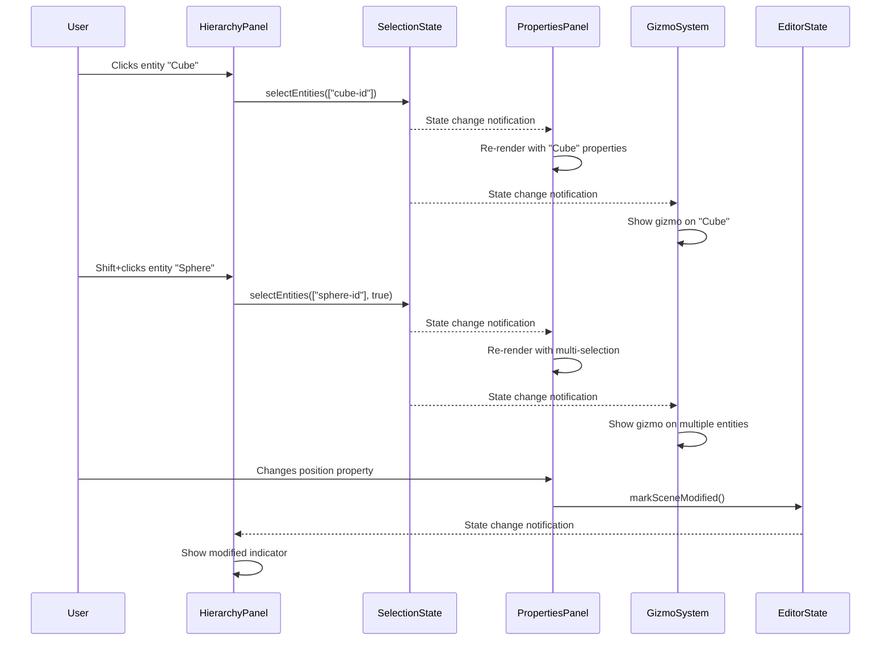

# Editor state management

## Overview

The Editor State Management component is a critical element of the iR Engine's World Editor that provides a centralized system for maintaining and synchronizing the editor's internal state. It implements a reactive state management pattern using Hyperflux, enabling different parts of the editor to share information without direct coupling. 

By creating a consistent source of truth for editor data, this component ensures that all UI elements and systems reflect the same state. This chapter explores the implementation, architecture, and benefits of the state management system within the World Editor.

## Core concepts

### State architecture

The editor state follows a centralized architecture:

- **State definition**: Each state module defines a specific domain of information
- **Initial values**: Default values are provided for all state properties
- **Mutability control**: State can only be modified through specific methods
- **Reactivity**: Changes to state automatically notify dependent components
- **Persistence**: Some state can be saved and restored between sessions

This architecture creates a reliable foundation for managing editor information.

### State domains

The editor manages several domains of state:

- **Editor state**: Core information about the current project and scene
- **Selection state**: Currently selected entities and components
- **Transform state**: Active transformation mode and coordinate space
- **UI state**: Panel layouts, visibility, and active tabs
- **File state**: Asset browser location and filters
- **Tool state**: Currently active tool and its settings

These domains organize related information for better management.

### Reactivity pattern

The state management system implements a reactive pattern:

- **Publishers**: Components that update state values
- **Subscribers**: Components that observe and react to state changes
- **Automatic updates**: UI refreshes when observed state changes
- **Granular subscriptions**: Components only react to relevant changes
- **Unidirectional flow**: State flows from central store to UI components

This pattern ensures consistent and efficient state updates throughout the editor.

## Implementation

### Hyperflux state definition

The Hyperflux system provides the foundation for state management:

```typescript
// Simplified from: src/services/EditorServices.ts
import { defineState, getMutableState } from '@ir-engine/hyperflux';
import { Entity } from '@ir-engine/ecs';

/**
 * Core editor state management
 */
export const EditorState = defineState({
  name: 'EditorState',
  
  // Initial state
  initial: () => ({
    // Project information
    projectName: '',
    projectPath: '',
    
    // Scene information
    sceneName: '',
    scenePath: '',
    isModified: false,
    
    // Editor settings
    transformMode: 'translate', // 'translate', 'rotate', 'scale'
    transformSpace: 'world', // 'world', 'local'
    snapEnabled: false,
    snapValue: 1,
    
    // UI state
    activePanelTab: 'hierarchy',
    showGrid: true,
    showGizmos: true,
    
    // Engine reference
    engine: null as any
  }),
  
  // Mark scene as modified
  markSceneModified: () => {
    const state = getMutableState(EditorState);
    state.isModified.set(true);
  },
  
  // Set transform mode
  setTransformMode: (mode: 'translate' | 'rotate' | 'scale') => {
    const state = getMutableState(EditorState);
    state.transformMode.set(mode);
  },
  
  // Set transform space
  setTransformSpace: (space: 'world' | 'local') => {
    const state = getMutableState(EditorState);
    state.transformSpace.set(space);
  },
  
  // Toggle snap
  toggleSnap: () => {
    const state = getMutableState(EditorState);
    state.snapEnabled.set(!state.snapEnabled.value);
  },
  
  // Set active panel tab
  setActivePanelTab: (tab: string) => {
    const state = getMutableState(EditorState);
    state.activePanelTab.set(tab);
  }
});
```

This code:
1. Defines a state module named 'EditorState'
2. Specifies initial values for all state properties
3. Provides methods for common state modifications
4. Uses Hyperflux's `defineState` and `getMutableState` functions
5. Organizes related state properties in a single module

### Selection state

The selection state manages currently selected entities:

```typescript
// Simplified from: src/services/SelectionState.ts
import { defineState, getMutableState } from '@ir-engine/hyperflux';
import { Entity } from '@ir-engine/ecs';

/**
 * Selection state management
 */
export const SelectionState = defineState({
  name: 'SelectionState',
  
  // Initial state
  initial: () => ({
    selectedEntityIds: [] as string[],
    lastSelectedEntityId: null as string | null
  }),
  
  // Select entities
  selectEntities: (entityIds: string[], addToSelection: boolean = false) => {
    const state = getMutableState(SelectionState);
    
    if (addToSelection) {
      // Add to current selection
      const currentSelection = state.selectedEntityIds.value;
      const newSelection = [...currentSelection];
      
      entityIds.forEach(id => {
        if (!newSelection.includes(id)) {
          newSelection.push(id);
        }
      });
      
      state.selectedEntityIds.set(newSelection);
    } else {
      // Replace current selection
      state.selectedEntityIds.set(entityIds);
    }
    
    // Update last selected entity
    if (entityIds.length > 0) {
      state.lastSelectedEntityId.set(entityIds[entityIds.length - 1]);
    }
  },
  
  // Clear selection
  clearSelection: () => {
    const state = getMutableState(SelectionState);
    state.selectedEntityIds.set([]);
    state.lastSelectedEntityId.set(null);
  },
  
  // Toggle entity selection
  toggleEntitySelection: (entityId: string) => {
    const state = getMutableState(SelectionState);
    const currentSelection = state.selectedEntityIds.value;
    
    if (currentSelection.includes(entityId)) {
      // Remove from selection
      state.selectedEntityIds.set(
        currentSelection.filter(id => id !== entityId)
      );
      
      // Update last selected entity
      if (state.lastSelectedEntityId.value === entityId) {
        state.lastSelectedEntityId.set(
          currentSelection.length > 1 ? 
            currentSelection[currentSelection.length - 2] : 
            null
        );
      }
    } else {
      // Add to selection
      state.selectedEntityIds.set([...currentSelection, entityId]);
      state.lastSelectedEntityId.set(entityId);
    }
  }
});
```

This module:
1. Manages the list of selected entity IDs
2. Tracks the most recently selected entity
3. Provides methods for selecting, deselecting, and toggling entities
4. Supports both single and multi-selection
5. Maintains selection state for the entire editor

### UI state integration

UI components integrate with state using Hyperflux hooks:

```typescript
// Simplified from: src/panels/properties/index.tsx
import React from 'react';
import { useHookstate } from '@ir-engine/hyperflux';
import { SelectionState } from '../../services/SelectionState';
import { EntityState } from '../../services/EntityState';
import { PropertyEditor } from './PropertyEditor';

/**
 * Properties panel component
 * @returns Properties panel component
 */
export const PropertiesPanel: React.FC = () => {
  // Subscribe to selection state
  const selectionState = useHookstate(SelectionState.state);
  const selectedIds = selectionState.selectedEntityIds.value;
  
  // Subscribe to entity state
  const entityState = useHookstate(EntityState.state);
  const entities = entityState.entities.value;
  
  // Get selected entities
  const selectedEntities = selectedIds
    .map(id => entities.find(entity => entity.id === id))
    .filter(Boolean);
  
  // If nothing selected, show empty state
  if (selectedEntities.length === 0) {
    return (
      <div className="properties-panel-empty">
        <p>No entity selected</p>
      </div>
    );
  }
  
  // If multiple entities selected, show multi-selection state
  if (selectedEntities.length > 1) {
    return (
      <div className="properties-panel">
        <div className="properties-header">
          <h3>Multiple Selection ({selectedEntities.length} entities)</h3>
        </div>
        <PropertyEditor entities={selectedEntities} isMultiSelect={true} />
      </div>
    );
  }
  
  // Single entity selected
  const selectedEntity = selectedEntities[0];
  
  return (
    <div className="properties-panel">
      <div className="properties-header">
        <h3>{selectedEntity.name || 'Entity'}</h3>
      </div>
      <PropertyEditor entities={[selectedEntity]} isMultiSelect={false} />
    </div>
  );
};
```

This component:
1. Uses `useHookstate` to subscribe to selection and entity state
2. Automatically re-renders when the observed state changes
3. Displays different content based on selection state
4. Finds selected entities by matching IDs from selection state
5. Passes selected entities to the property editor component

### System state integration

Editor systems also integrate with state:

```typescript
// Simplified from: src/systems/TransformGizmoSystem.ts
import { defineSystem, defineQuery } from '@ir-engine/ecs';
import { useHookstate } from '@ir-engine/hyperflux';
import { SelectionState } from '../services/SelectionState';
import { EditorState } from '../services/EditorState';

/**
 * System for transform gizmo management
 */
export const TransformGizmoSystem = defineSystem({
  name: 'TransformGizmoSystem',
  
  // System execution
  execute: (system, world) => {
    // Get current state
    const selectionState = useHookstate(SelectionState.state);
    const editorState = useHookstate(EditorState.state);
    
    // Get selected entities
    const selectedIds = selectionState.selectedEntityIds.value;
    
    // Get transform mode and space
    const transformMode = editorState.transformMode.value;
    const transformSpace = editorState.transformSpace.value;
    
    // Skip if no entities selected or gizmos disabled
    if (selectedIds.length === 0 || !editorState.showGizmos.value) {
      hideGizmo();
      return;
    }
    
    // Get selected entities
    const selectedEntities = selectedIds
      .map(id => findEntityById(id))
      .filter(Boolean);
    
    // Update gizmo
    updateGizmo(selectedEntities, transformMode, transformSpace);
  }
});
```

This system:
1. Uses Hyperflux to access selection and editor state
2. Reacts to changes in selected entities and transform settings
3. Updates the transform gizmo based on current state
4. Shows or hides the gizmo depending on selection
5. Applies the correct transform mode and space

### State persistence

Some state is persisted between editor sessions:

```typescript
// Simplified from: src/services/EditorPreferences.ts
import { defineState, getMutableState } from '@ir-engine/hyperflux';

/**
 * Editor preferences state management
 */
export const EditorPreferences = defineState({
  name: 'EditorPreferences',
  
  // Initial state
  initial: () => ({
    // UI preferences
    darkMode: false,
    panelLayout: 'default',
    fontSize: 'medium',
    
    // Editor preferences
    autosave: true,
    autosaveInterval: 5, // minutes
    showGrid: true,
    gridSize: 1,
    
    // Tool preferences
    defaultTransformMode: 'translate',
    defaultTransformSpace: 'world',
    snapEnabled: false,
    snapValue: 1
  }),
  
  // Load preferences from storage
  loadPreferences: () => {
    const state = getMutableState(EditorPreferences);
    
    try {
      const savedPreferences = localStorage.getItem('editorPreferences');
      if (savedPreferences) {
        const preferences = JSON.parse(savedPreferences);
        
        // Update state with saved preferences
        Object.entries(preferences).forEach(([key, value]) => {
          if (state[key] !== undefined) {
            state[key].set(value);
          }
        });
      }
    } catch (error) {
      console.error('Failed to load editor preferences:', error);
    }
  },
  
  // Save preferences to storage
  savePreferences: () => {
    const state = getMutableState(EditorPreferences);
    
    try {
      const preferences = {};
      
      // Convert state to plain object
      Object.keys(state.initial()).forEach(key => {
        preferences[key] = state[key].value;
      });
      
      // Save to local storage
      localStorage.setItem('editorPreferences', JSON.stringify(preferences));
    } catch (error) {
      console.error('Failed to save editor preferences:', error);
    }
  }
});
```

This module:
1. Defines user preferences that persist between sessions
2. Provides methods for loading and saving preferences
3. Uses local storage for persistence
4. Handles errors during loading and saving
5. Maintains default values for preferences

## State workflow

The complete state workflow follows this sequence:



This diagram illustrates:
1. The user selects an entity in the hierarchy panel
2. The selection state is updated with the selected entity ID
3. The properties panel reacts to the selection change and displays properties
4. The gizmo system reacts to the selection change and shows the gizmo
5. When properties are modified, the scene is marked as modified
6. Other panels react to the modified state

## Integration with other components

The state management system integrates with several other components of the World Editor:

### Control functions

Editor control functions update state after operations:

```typescript
// Example of control function integration
import { removeObjects } from '../functions/EditorControlFunctions';
import { SelectionState } from '../services/SelectionState';
import { EditorState } from '../services/EditorState';

/**
 * Deletes selected entities
 */
export const deleteSelectedEntities = () => {
  // Get selected entity IDs
  const selectedIds = SelectionState.state.selectedEntityIds.value;
  
  // Skip if nothing selected
  if (selectedIds.length === 0) return;
  
  // Remove the entities
  removeObjects(selectedIds);
  
  // Clear selection
  SelectionState.clearSelection();
  
  // Mark scene as modified
  EditorState.markSceneModified();
};
```

This integration:
- Retrieves current selection from state
- Performs operations based on state values
- Updates state after operations complete
- Ensures UI reflects the latest state
- Maintains consistency between operations and state

### Toolbar

The toolbar reads and updates state:

```typescript
// Example of toolbar integration
import React from 'react';
import { useHookstate } from '@ir-engine/hyperflux';
import { EditorState } from '../../services/EditorState';
import { Button, ToggleButton } from '@ir-engine/ui';

/**
 * Transform tools component
 * @returns Transform tools component
 */
export const TransformTools: React.FC = () => {
  // Subscribe to editor state
  const editorState = useHookstate(EditorState.state);
  const transformMode = editorState.transformMode.value;
  const transformSpace = editorState.transformSpace.value;
  
  // Handle transform mode change
  const handleModeChange = (mode: 'translate' | 'rotate' | 'scale') => {
    EditorState.setTransformMode(mode);
  };
  
  // Handle transform space change
  const handleSpaceChange = (space: 'world' | 'local') => {
    EditorState.setTransformSpace(space);
  };
  
  return (
    <div className="transform-tools">
      <div className="tool-group">
        <ToggleButton
          active={transformMode === 'translate'}
          onClick={() => handleModeChange('translate')}
          icon="move"
          tooltip="Translate (W)"
        />
        <ToggleButton
          active={transformMode === 'rotate'}
          onClick={() => handleModeChange('rotate')}
          icon="rotate"
          tooltip="Rotate (E)"
        />
        <ToggleButton
          active={transformMode === 'scale'}
          onClick={() => handleModeChange('scale')}
          icon="scale"
          tooltip="Scale (R)"
        />
      </div>
      
      <div className="tool-group">
        <ToggleButton
          active={transformSpace === 'world'}
          onClick={() => handleSpaceChange('world')}
          label="World"
          tooltip="World Space"
        />
        <ToggleButton
          active={transformSpace === 'local'}
          onClick={() => handleSpaceChange('local')}
          label="Local"
          tooltip="Local Space"
        />
      </div>
    </div>
  );
};
```

This integration:
- Subscribes to editor state for transform mode and space
- Updates state when buttons are clicked
- Reflects current state in button appearance
- Provides visual feedback for active tools
- Creates a reactive UI that stays in sync with state

### Scene serialization

Scene serialization preserves state in saved files:

```typescript
// Example of scene serialization integration
import { EditorState } from '../services/EditorState';
import { SceneState } from '../services/SceneState';

/**
 * Saves editor state in scene metadata
 * @param sceneData Scene data object
 * @returns Updated scene data with editor state
 */
export const saveEditorStateInScene = (sceneData: any) => {
  // Get relevant editor state
  const editorState = EditorState.state;
  
  // Create editor metadata
  const editorMetadata = {
    camera: {
      position: editorState.cameraPosition.value,
      target: editorState.cameraTarget.value
    },
    grid: {
      visible: editorState.showGrid.value,
      size: editorState.gridSize.value
    },
    selection: SceneState.state.selectedEntityIds.value
  };
  
  // Add editor metadata to scene data
  sceneData.metadata = {
    ...sceneData.metadata,
    editor: editorMetadata
  };
  
  return sceneData;
};

/**
 * Restores editor state from scene metadata
 * @param sceneData Scene data object
 */
export const restoreEditorStateFromScene = (sceneData: any) => {
  // Skip if no editor metadata
  if (!sceneData.metadata?.editor) return;
  
  const editorMetadata = sceneData.metadata.editor;
  const editorState = getMutableState(EditorState);
  
  // Restore camera state
  if (editorMetadata.camera) {
    editorState.cameraPosition.set(editorMetadata.camera.position);
    editorState.cameraTarget.set(editorMetadata.camera.target);
  }
  
  // Restore grid state
  if (editorMetadata.grid) {
    editorState.showGrid.set(editorMetadata.grid.visible);
    editorState.gridSize.set(editorMetadata.grid.size);
  }
  
  // Restore selection
  if (editorMetadata.selection) {
    SceneState.selectEntities(editorMetadata.selection);
  }
};
```

This integration:
- Saves editor state as metadata in scene files
- Restores editor state when scenes are loaded
- Preserves camera position, grid settings, and selection
- Enables consistent editing experience across sessions
- Maintains editor context with scene data

## Benefits of state management

The Editor State Management component provides several key advantages:

1. **Centralization**: Provides a single source of truth for editor information
2. **Reactivity**: Automatically updates UI when state changes
3. **Decoupling**: Reduces direct dependencies between components
4. **Consistency**: Ensures all parts of the editor see the same state
5. **Predictability**: Creates a clear flow of data through the application
6. **Testability**: Makes it easier to test components in isolation
7. **Persistence**: Enables saving and restoring editor state

These benefits create a more maintainable and reliable foundation for the World Editor.

## Next steps

This concludes our exploration of the World Editor's architecture and components. You now have a comprehensive understanding of how the editor is structured, from its panel layout to its state management system. With this knowledge, you can more effectively use the World Editor to create immersive 3D worlds and potentially contribute to its development.

---


