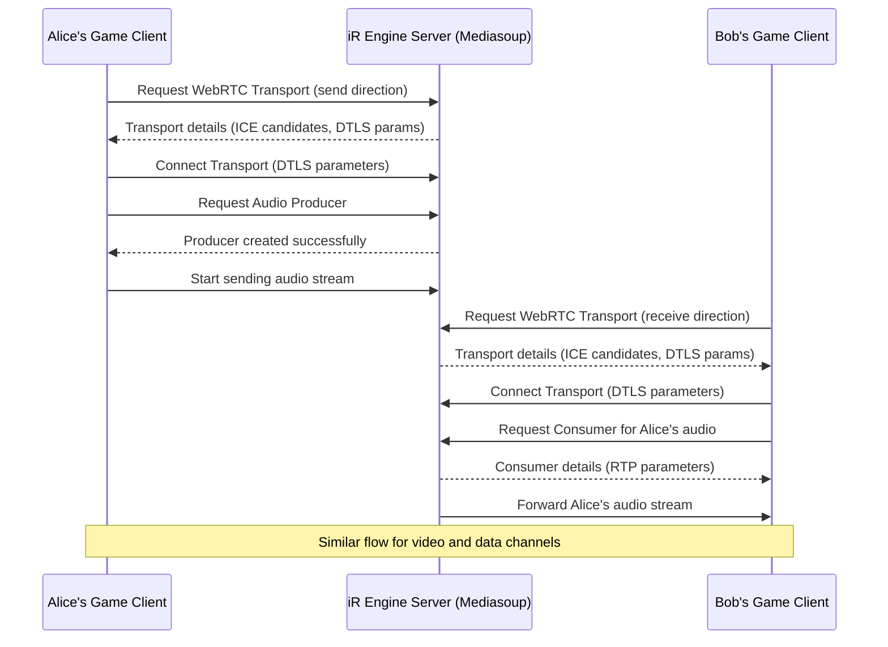

# Mediasoup WebRTC communication backbone

## Overview

The Mediasoup WebRTC Communication Backbone is the core real-time communication system of the iR Engine's multiplayer infrastructure. It enables the efficient exchange of audio, video, and custom game data between players in a multiplayer environment. 

By leveraging WebRTC technology and the Mediasoup Selective Forwarding Unit (SFU) architecture, the system provides low-latency, scalable communication channels that are essential for creating responsive multiplayer experiences. This chapter explores the implementation, components, and workflow of the WebRTC communication backbone within the iR Engine.

## Core concepts

### Real-time communication requirements

Multiplayer games require several types of real-time communication:

- **Audio transmission**: Enabling players to speak to each other
- **Video transmission**: Sharing webcam feeds when applicable
- **Game data exchange**: Transmitting player actions, positions, and game state updates
- **Low latency**: Ensuring all communication happens with minimal delay
- **Scalability**: Supporting multiple concurrent players efficiently

These requirements create significant technical challenges, particularly when dealing with many simultaneous connections.

### WebRTC technology

WebRTC (Web Real-Time Communication) provides the foundation for peer-to-peer communication:

- **Browser-native technology**: Built into modern web browsers
- **Direct communication**: Enables peer-to-peer connections
- **Media capabilities**: Handles audio and video streaming
- **Data channels**: Supports custom data exchange
- **NAT traversal**: Includes mechanisms to establish connections across networks

WebRTC provides the core protocols and APIs needed for real-time communication.

### Selective forwarding unit architecture

While WebRTC supports peer-to-peer connections, direct connections between all players would be inefficient at scale. The Mediasoup SFU architecture addresses this:

- **Centralized routing**: Each player connects to the server rather than to every other player
- **Efficient distribution**: The server forwards media and data only to players who need it
- **Reduced bandwidth**: Players send their streams once, regardless of the number of recipients
- **Improved scalability**: Supports more concurrent players than direct peer-to-peer
- **Server-side control**: Enables additional features like recording and stream manipulation

This architecture significantly reduces the number of connections required, making large multiplayer sessions feasible.

## Implementation

### Core Mediasoup components

The Mediasoup implementation uses several key components:

#### Workers and routers

Workers and routers form the foundation of the Mediasoup infrastructure:

```typescript
// Simplified from src/SocketWebRTCServerFunctions.ts
export async function startWebRTC() {
  // Create Mediasoup workers (separate processes for media handling)
  const workers = [];
  for (let i = 0; i < numWorkers; i++) {
    const worker = await createWorker({
      logLevel: 'warn',
      rtcMinPort: 40000,
      rtcMaxPort: 49999
    });
    workers.push(worker);
  }
  
  // Create a router in each worker
  const routers = [];
  for (const worker of workers) {
    const router = await worker.createRouter({
      mediaCodecs: supportedMediaCodecs
    });
    routers.push(router);
  }
  
  logger.info('Mediasoup workers and routers created');
  return { routers, workers };
}
```

This code:
- Creates multiple Mediasoup worker processes for load distribution
- Configures each worker with appropriate network ports
- Creates a router within each worker to handle media routing
- Returns the created workers and routers for use by the system

#### Transports

Transports establish the communication channels between clients and the server:

```typescript
// Simplified from src/WebRTCFunctions.ts
export async function handleWebRtcTransportCreate(action) {
  const { networkId, direction } = action;
  
  // Get the appropriate router
  const router = getRouterForNetwork(networkId);
  
  // Create transport options with ICE candidates and DTLS parameters
  const options = {
    listenIps: config.mediasoup.webRtcTransport.listenIps,
    enableUdp: true,
    enableTcp: true,
    preferUdp: true,
    initialAvailableOutgoingBitrate: 1000000
  };
  
  // Create the WebRTC transport
  const transport = await router.createWebRtcTransport(options);
  
  // Store the transport in state
  const transportState = getMutableState(MediasoupTransportState);
  transportState.transports[networkId][direction].merge({
    id: transport.id,
    iceParameters: transport.iceParameters,
    iceCandidates: transport.iceCandidates,
    dtlsParameters: transport.dtlsParameters
  });
  
  // Set up transport event handlers
  transport.on('dtlsstatechange', (dtlsState) => {
    if (dtlsState === 'closed') {
      transport.close();
    }
  });
  
  // Store the transport object for later use
  transportObjects[transport.id] = transport;
  
  return transport;
}
```

This function:
- Creates a WebRTC transport for a specific network and direction
- Configures the transport with appropriate network parameters
- Stores the transport details in the application state
- Sets up event handlers for transport lifecycle events
- Returns the created transport for further operations

#### Producers

Producers represent outgoing media or data streams:

```typescript
// Simplified from src/WebRTCFunctions.ts
export async function handleRequestProducer(action) {
  const { networkId, transportId, kind, rtpParameters, appData } = action;
  
  // Get the transport object
  const transport = transportObjects[transportId];
  if (!transport) {
    throw new Error(`Transport ${transportId} not found`);
  }
  
  // Create the producer
  const producer = await transport.produce({
    kind,
    rtpParameters,
    appData
  });
  
  // Store the producer in state
  const producerState = getMutableState(MediasoupMediaProducerState);
  producerState.producers[networkId].merge({
    [producer.id]: {
      id: producer.id,
      kind,
      transportId,
      appData
    }
  });
  
  // Set up producer event handlers
  producer.on('transportclose', () => {
    producer.close();
    // Remove from state
  });
  
  // Store the producer object for later use
  producerObjects[producer.id] = producer;
  
  return producer;
}
```

This function:
- Creates a producer for a specific transport and media kind
- Configures the producer with the provided RTP parameters
- Stores the producer details in the application state
- Sets up event handlers for producer lifecycle events
- Returns the created producer for further operations

#### Consumers

Consumers represent incoming media or data streams:

```typescript
// Simplified from src/WebRTCFunctions.ts
export async function handleRequestConsumer(action) {
  const { networkId, consumerNetworkId, producerId, transportId, appData } = action;
  
  // Get the transport and producer objects
  const transport = transportObjects[transportId];
  const producer = producerObjects[producerId];
  
  if (!transport || !producer) {
    throw new Error('Transport or producer not found');
  }
  
  // Check if the consumer can consume the producer
  if (!router.canConsume({
    producerId: producer.id,
    rtpCapabilities: action.rtpCapabilities
  })) {
    throw new Error('Cannot consume this producer');
  }
  
  // Create the consumer
  const consumer = await transport.consume({
    producerId: producer.id,
    rtpCapabilities: action.rtpCapabilities,
    paused: true,
    appData
  });
  
  // Store the consumer in state
  const consumerState = getMutableState(MediasoupMediaConsumerState);
  consumerState.consumers[networkId].merge({
    [consumer.id]: {
      id: consumer.id,
      producerId,
      transportId,
      appData
    }
  });
  
  // Set up consumer event handlers
  consumer.on('transportclose', () => {
    consumer.close();
    // Remove from state
  });
  
  // Store the consumer object for later use
  consumerObjects[consumer.id] = consumer;
  
  return consumer;
}
```

This function:
- Creates a consumer for a specific transport and producer
- Checks if the consumer can consume the producer's media
- Configures the consumer with the provided RTP capabilities
- Stores the consumer details in the application state
- Sets up event handlers for consumer lifecycle events
- Returns the created consumer for further operations

### Data channels

In addition to media (audio/video), the system supports custom game data exchange:

```typescript
// Simplified from src/MediasoupServerSystem.tsx
const requestDataProducerActionQueue = defineActionQueue(MediasoupDataProducerActions.requestDataProducer.matches);
const requestDataConsumerActionQueue = defineActionQueue(MediasoupDataConsumerActions.requestDataConsumer.matches);

// Handler for data producer requests
const handleRequestDataProducer = async (action) => {
  const { networkId, transportId, label, protocol, appData } = action;
  
  // Get the transport object
  const transport = transportObjects[transportId];
  
  // Create the data producer
  const dataProducer = await transport.produceData({
    label,
    protocol,
    appData
  });
  
  // Store the data producer in state
  const dataProducerState = getMutableState(MediasoupDataProducerState);
  dataProducerState.dataProducers[networkId].merge({
    [dataProducer.id]: {
      id: dataProducer.id,
      label,
      protocol,
      appData
    }
  });
  
  return dataProducer;
};

// Handler for data consumer requests
const handleRequestDataConsumer = async (action) => {
  const { networkId, dataProducerId, transportId, appData } = action;
  
  // Get the transport and data producer objects
  const transport = transportObjects[transportId];
  const dataProducer = dataProducerObjects[dataProducerId];
  
  // Create the data consumer
  const dataConsumer = await transport.consumeData({
    dataProducerId,
    appData
  });
  
  // Store the data consumer in state
  const dataConsumerState = getMutableState(MediasoupDataConsumerState);
  dataConsumerState.dataConsumers[networkId].merge({
    [dataConsumer.id]: {
      id: dataConsumer.id,
      dataProducerId,
      label: dataProducer.label,
      protocol: dataProducer.protocol,
      appData
    }
  });
  
  return dataConsumer;
};
```

This code:
- Defines action queues for data producer and consumer requests
- Implements handlers for creating data producers and consumers
- Configures data channels with appropriate labels and protocols
- Stores data channel details in the application state
- Enables the exchange of custom game data between clients

## Communication workflow

The complete WebRTC communication workflow follows this sequence:



This diagram illustrates:
1. Clients establish WebRTC transports with the server
2. Producers are created for outgoing streams (audio, video, data)
3. Consumers are created for incoming streams
4. The server forwards media and data between clients
5. This process enables real-time communication between players

## Integration with other components

The WebRTC communication backbone integrates with several other components of the multiplayer infrastructure:

### Instance lifecycle management

The WebRTC system is initialized during instance startup:

```typescript
// Simplified from src/InstanceServerModule.ts
import { MediasoupServerSystem } from './MediasoupServerSystem';

export const InstanceServerModule = {
  async initialize() {
    // Initialize Mediasoup
    await startWebRTC();
    
    // Register the Mediasoup server system
    Engine.instance.systemRegistry.add(MediasoupServerSystem);
    
    // Other initialization steps
  }
};
```

This integration:
- Ensures WebRTC is available when the instance starts
- Registers the MediasoupServerSystem to handle WebRTC operations
- Makes real-time communication available to connected clients

### Hyperflux state management

WebRTC components are managed through Hyperflux state:

```typescript
// Simplified from src/transports/mediasoup/MediasoupTransportState.ts
import { defineState } from '@ir-engine/hyperflux';

export const MediasoupTransportState = defineState({
  name: 'ee.common.MediasoupTransportState',
  initial: {
    transports: {} as Record<NetworkId, {
      send: {
        id: '',
        iceParameters: {},
        iceCandidates: [],
        dtlsParameters: {}
      },
      recv: {
        id: '',
        iceParameters: {},
        iceCandidates: [],
        dtlsParameters: {}
      }
    }>
  }
});
```

This integration:
- Stores WebRTC transport details in Hyperflux state
- Makes transport information available throughout the application
- Enables reactive updates when transport state changes
- Similar state structures exist for producers and consumers

### User connection and authorization

WebRTC connections are established after user authentication:

```typescript
// Conceptual integration with user connection
function handleUserConnected(user, socket) {
  // After user is authenticated
  socket.on('webrtc-transport-create', async (data, callback) => {
    try {
      // Create WebRTC transport for the authenticated user
      const transport = await handleWebRtcTransportCreate({
        networkId: user.networkId,
        direction: data.direction
      });
      
      // Return transport details to the client
      callback({
        id: transport.id,
        iceParameters: transport.iceParameters,
        iceCandidates: transport.iceCandidates,
        dtlsParameters: transport.dtlsParameters
      });
    } catch (error) {
      callback({ error: error.message });
    }
  });
  
  // Other WebRTC-related event handlers
}
```

This integration:
- Ensures only authenticated users can establish WebRTC connections
- Associates WebRTC components with specific user sessions
- Provides secure communication channels for authorized users

## Benefits of Mediasoup WebRTC

The Mediasoup WebRTC Communication Backbone provides several key advantages:

1. **Scalability**: Efficiently handles many concurrent users through the SFU architecture
2. **Low latency**: Minimizes communication delay for responsive multiplayer experiences
3. **Flexibility**: Supports various media types and custom game data
4. **Bandwidth efficiency**: Optimizes network usage compared to peer-to-peer approaches
5. **Server control**: Enables additional features like recording and stream manipulation
6. **Cross-platform compatibility**: Works across different browsers and devices
7. **NAT traversal**: Handles complex network configurations through ICE mechanisms

These benefits make the WebRTC communication backbone an essential foundation for creating engaging multiplayer experiences in the iR Engine.

## Next steps

With an understanding of how real-time communication is handled, the next chapter explores how game instances are created, managed, and terminated.

Next: [Instance lifecycle management](02_instance_lifecycle_management_.md)

---


