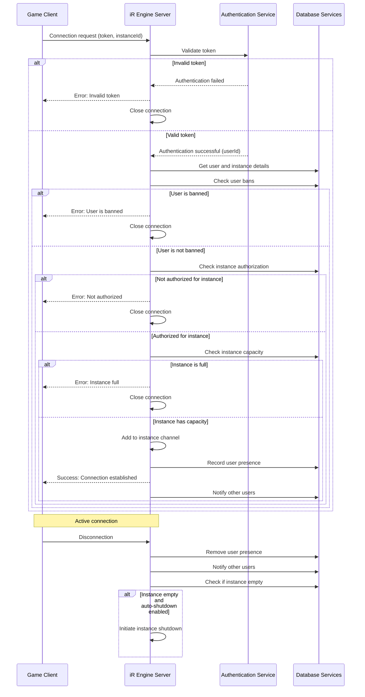

# User connection and authorization

## Overview

The User Connection and Authorization system is a critical component of the iR Engine's multiplayer infrastructure that manages how players connect to game instances and verifies their permissions. It ensures that only authenticated users with appropriate authorization can access specific game environments. 

By implementing robust security checks and connection management, this system protects game instances from unauthorized access while providing legitimate players with a seamless connection experience. This chapter explores the implementation, workflow, and security aspects of user connection and authorization within the iR Engine.

## Core concepts

### Authentication and authorization

The system implements two distinct security processes:

- **Authentication**: Verifying the identity of a user
  - Validates that users are who they claim to be
  - Processes authentication tokens or credentials
  - Confirms the legitimacy of the connection request
  - Establishes the user's identity within the system
  - Rejects invalid or expired credentials

- **Authorization**: Determining if a user has permission to access a specific resource
  - Checks if the authenticated user can join a particular instance
  - Enforces access control rules and restrictions
  - Verifies instance-specific permissions
  - Handles capacity limitations and user bans
  - Ensures appropriate access levels

These processes work together to create a secure multiplayer environment.

### Connection management

Once authenticated and authorized, user connections must be properly managed:

- **Connection establishment**: Creating network connections between clients and servers
- **Channel assignment**: Adding users to appropriate communication channels
- **State synchronization**: Ensuring the client and server have consistent state
- **Connection monitoring**: Tracking the status and health of connections
- **Disconnection handling**: Managing graceful disconnections and timeouts

Effective connection management ensures stable and reliable multiplayer experiences.

## Implementation

### Connection request handling

The system processes incoming connection requests from clients:

```typescript
// Simplified from: src/SocketFunctions.ts
function setupSocketFunctions(app) {
  const logger = app.get('logger');
  
  // Create a network server to handle connections
  const server = new NetworkServer();
  
  // Handle new connection attempts
  server.on('connection', (spark) => {
    logger.info(`New connection attempt from ${spark.address.ip}`);
    
    // Set up event handlers for this connection
    spark.on('data', async (message) => {
      try {
        // Parse the incoming message
        const data = JSON.parse(message);
        
        // Handle authentication request
        if (data.type === 'authenticate') {
          await handleAuthenticationRequest(app, spark, data);
        }
        
        // Handle other message types
        // ...
      } catch (error) {
        logger.error(`Error processing message: ${error.message}`);
        spark.write(JSON.stringify({
          status: 'error',
          message: 'Invalid message format'
        }));
      }
    });
    
    // Handle disconnection
    spark.on('end', () => {
      handleDisconnection(app, spark);
    });
  });
  
  return server;
}
```

This function:
1. Creates a network server to handle client connections
2. Sets up event handlers for new connections
3. Processes incoming messages from clients
4. Routes authentication requests to the appropriate handler
5. Manages disconnection events

### Authentication process

The authentication process verifies the identity of connecting users:

```typescript
// Simplified from: src/channels.ts
async function handleAuthenticationRequest(app, spark, data) {
  const logger = app.get('logger');
  const { token, peerID, instanceId } = data;
  
  try {
    // Validate the authentication token
    const authResult = await app.service('authentication').strategies.jwt.authenticate(
      { accessToken: token },
      {}
    );
    
    // Extract user information from the authentication result
    const identityProviderPath = app.get('authentication').entity;
    const userId = authResult[identityProviderPath].userId;
    
    logger.info(`User ${userId} authenticated successfully`);
    
    // Store user information with the connection
    spark.userId = userId;
    spark.peerID = peerID;
    spark.instanceId = instanceId;
    
    // Proceed to authorization
    await authorizeUserForInstance(app, spark, userId, instanceId);
  } catch (error) {
    logger.error(`Authentication failed: ${error.message}`);
    
    // Send authentication failure response
    spark.write(JSON.stringify({
      status: 'error',
      message: 'Authentication failed',
      code: 'INVALID_TOKEN'
    }));
    
    // Close the connection
    spark.end();
  }
}
```

This function:
1. Extracts the token, peer ID, and instance ID from the request
2. Validates the authentication token using the authentication service
3. Retrieves the user ID from the authentication result
4. Associates the user information with the connection
5. Proceeds to the authorization step if authentication succeeds
6. Sends an error response and closes the connection if authentication fails

### Authorization process

The authorization process checks if authenticated users can access specific instances:

```typescript
// Simplified from: src/NetworkFunctions.ts
async function authorizeUserForInstance(app, spark, userId, instanceId) {
  const logger = app.get('logger');
  
  try {
    // Get instance details
    const instance = await app.service('instance').get(instanceId);
    if (!instance) {
      throw new Error(`Instance ${instanceId} not found`);
    }
    
    // Get user details
    const user = await app.service('user').get(userId);
    if (!user) {
      throw new Error(`User ${userId} not found`);
    }
    
    // Check if the user is banned
    const banQuery = {
      query: {
        userId: userId,
        active: true
      }
    };
    const bans = await app.service('ban').find(banQuery);
    if (bans.total > 0) {
      throw new Error(`User ${userId} is banned`);
    }
    
    // Check if the instance is private and if the user is authorized
    if (instance.isPrivate) {
      const authQuery = {
        query: {
          instanceId: instanceId,
          userId: userId
        }
      };
      const authorizations = await app.service('instance-authorization').find(authQuery);
      if (authorizations.total === 0) {
        throw new Error(`User ${userId} not authorized for private instance ${instanceId}`);
      }
    }
    
    // Check if the instance is full
    const currentUsers = await app.service('user-instance').find({
      query: {
        instanceId: instanceId
      }
    });
    if (currentUsers.total >= instance.maxUsers) {
      throw new Error(`Instance ${instanceId} is full`);
    }
    
    logger.info(`User ${userId} authorized for instance ${instanceId}`);
    
    // Proceed to connection establishment
    await establishConnection(app, spark, user, instance);
  } catch (error) {
    logger.error(`Authorization failed: ${error.message}`);
    
    // Send authorization failure response
    spark.write(JSON.stringify({
      status: 'error',
      message: error.message,
      code: 'AUTHORIZATION_FAILED'
    }));
    
    // Close the connection
    spark.end();
  }
}
```

This function:
1. Retrieves instance and user details from their respective services
2. Checks if the user is banned from the system
3. Verifies authorization for private instances
4. Ensures the instance has not reached its capacity
5. Proceeds to connection establishment if authorization succeeds
6. Sends an error response and closes the connection if authorization fails

### Connection establishment

After successful authentication and authorization, the connection is established:

```typescript
// Simplified from: src/NetworkFunctions.ts
async function establishConnection(app, spark, user, instance) {
  const logger = app.get('logger');
  
  try {
    // Add the connection to the instance channel
    app.channel(`instanceIds/${instance.id}`).join(spark);
    
    // Record the user's presence in the instance
    await app.service('user-instance').create({
      userId: user.id,
      instanceId: instance.id,
      peerID: spark.peerID
    });
    
    // Get WebRTC router capabilities for this instance
    const instanceServerState = getState(InstanceServerState);
    const router = instanceServerState.routers[0]; // Simplified
    const routerRtpCapabilities = router.rtpCapabilities;
    
    // Send success response with necessary connection information
    spark.write(JSON.stringify({
      status: 'success',
      message: 'Connection established',
      routerRtpCapabilities,
      user: {
        id: user.id,
        name: user.name
      },
      instance: {
        id: instance.id,
        name: instance.name
      }
    }));
    
    // Notify other users in the instance about the new connection
    app.service('message').create({
      type: 'user-joined',
      instanceId: instance.id,
      userId: user.id
    });
    
    logger.info(`User ${user.id} successfully connected to instance ${instance.id}`);
  } catch (error) {
    logger.error(`Connection establishment failed: ${error.message}`);
    
    // Send connection failure response
    spark.write(JSON.stringify({
      status: 'error',
      message: 'Failed to establish connection',
      code: 'CONNECTION_FAILED'
    }));
    
    // Close the connection
    spark.end();
  }
}
```

This function:
1. Adds the connection to the appropriate instance channel
2. Records the user's presence in the instance
3. Retrieves WebRTC router capabilities for the instance
4. Sends a success response with necessary connection information
5. Notifies other users in the instance about the new connection
6. Handles any errors that occur during connection establishment

### Disconnection handling

The system manages user disconnections from instances:

```typescript
// Simplified from: src/channels.ts
async function handleDisconnection(app, spark) {
  const logger = app.get('logger');
  
  // Check if this was an authenticated connection
  if (!spark.userId || !spark.instanceId) {
    logger.info(`Unauthenticated connection from ${spark.address.ip} disconnected`);
    return;
  }
  
  try {
    const userId = spark.userId;
    const instanceId = spark.instanceId;
    
    logger.info(`User ${userId} disconnected from instance ${instanceId}`);
    
    // Remove the user from the instance channel
    app.channel(`instanceIds/${instanceId}`).leave(spark);
    
    // Remove the user's presence record
    await app.service('user-instance').remove(null, {
      query: {
        userId: userId,
        instanceId: instanceId
      }
    });
    
    // Notify other users in the instance about the disconnection
    app.service('message').create({
      type: 'user-left',
      instanceId: instanceId,
      userId: userId
    });
    
    // Check if the instance is now empty
    const remainingUsers = await app.service('user-instance').find({
      query: {
        instanceId: instanceId
      }
    });
    
    // If the instance is empty and configured for auto-shutdown, initiate shutdown
    if (remainingUsers.total === 0) {
      const instance = await app.service('instance').get(instanceId);
      if (instance.autoShutdownWhenEmpty) {
        logger.info(`Instance ${instanceId} is empty, initiating shutdown`);
        await app.service('instance-server').shutdown(instanceId);
      }
    }
  } catch (error) {
    logger.error(`Error handling disconnection: ${error.message}`);
  }
}
```

This function:
1. Identifies the disconnecting user and instance
2. Removes the user from the instance channel
3. Updates the user's presence record in the database
4. Notifies other users about the disconnection
5. Checks if the instance is now empty
6. Initiates instance shutdown if appropriate

## Connection workflow

The complete user connection workflow follows this sequence:



This diagram illustrates:
1. The client sends a connection request with authentication token
2. The server validates the token with the authentication service
3. If authentication fails, the connection is rejected
4. If authentication succeeds, the server checks authorization
5. The server verifies the user is not banned
6. The server checks instance-specific authorization
7. The server ensures the instance has capacity
8. If all checks pass, the connection is established
9. When the client disconnects, the server updates records
10. If the instance becomes empty, shutdown may be initiated

## Integration with other components

The user connection and authorization system integrates with several other components of the multiplayer infrastructure:

### Instance lifecycle management

The connection system interacts with instance lifecycle management:

```typescript
// Simplified integration with instance lifecycle
async function updateInstanceForUser(app, userId, instanceId) {
  const instanceServerState = getState(InstanceServerState);
  
  // Check if the instance is already initialized on this server
  if (!instanceServerState.instance || instanceServerState.instance.id !== instanceId) {
    // Initialize the instance if needed
    await initializeInstance(app, instanceId);
  }
  
  // Ensure the instance is ready
  if (!instanceServerState.ready) {
    throw new Error(`Instance ${instanceId} is not ready`);
  }
  
  // Update instance user count
  await app.service('instance').patch(instanceId, {
    currentUsers: {
      $inc: 1
    }
  });
}
```

This integration:
- Ensures the instance is initialized before user connection
- Verifies the instance is in a ready state
- Updates instance statistics when users connect
- Maintains the relationship between users and instances

### Mediasoup WebRTC

The connection system integrates with the WebRTC communication backbone:

```typescript
// Simplified integration with Mediasoup
async function setupWebRTCForUser(app, spark, userId, instanceId) {
  // Get the router for this instance
  const instanceServerState = getState(InstanceServerState);
  const router = instanceServerState.routers[0]; // Simplified
  
  // Send router capabilities to the client
  spark.write(JSON.stringify({
    type: 'webrtc-router-capabilities',
    routerRtpCapabilities: router.rtpCapabilities
  }));
  
  // Set up event handlers for WebRTC transport creation
  spark.on('data', (message) => {
    const data = JSON.parse(message);
    
    if (data.type === 'webrtc-transport-create') {
      handleWebRtcTransportCreate(app, spark, data);
    } else if (data.type === 'webrtc-transport-connect') {
      handleWebRtcTransportConnect(app, spark, data);
    } else if (data.type === 'webrtc-producer-create') {
      handleWebRtcProducerCreate(app, spark, data);
    } else if (data.type === 'webrtc-consumer-create') {
      handleWebRtcConsumerCreate(app, spark, data);
    }
  });
}
```

This integration:
- Provides WebRTC router capabilities to connected clients
- Sets up event handlers for WebRTC-related requests
- Enables real-time communication for authenticated users
- Manages the WebRTC components for each connection

### FeathersJS services

The connection system uses FeathersJS services for data operations:

```typescript
// Simplified integration with FeathersJS services
async function validateUserAccess(app, userId, instanceId) {
  // Check if the user exists
  const user = await app.service('user').get(userId);
  
  // Check if the instance exists
  const instance = await app.service('instance').get(instanceId);
  
  // Check if the user is banned
  const bans = await app.service('ban').find({
    query: {
      userId: userId,
      active: true
    }
  });
  
  if (bans.total > 0) {
    throw new Error('User is banned');
  }
  
  // Check instance-specific authorization
  if (instance.isPrivate) {
    const authorizations = await app.service('instance-authorization').find({
      query: {
        instanceId: instanceId,
        userId: userId
      }
    });
    
    if (authorizations.total === 0) {
      throw new Error('Not authorized for this instance');
    }
  }
  
  return { user, instance };
}
```

This integration:
- Uses FeathersJS services to access user and instance data
- Queries ban records to enforce system-wide restrictions
- Checks instance-specific authorization records
- Leverages the service architecture for consistent data access

## Benefits of user connection and authorization

The User Connection and Authorization system provides several key advantages:

1. **Security**: Ensures only legitimate users can access game instances
2. **Access control**: Enforces instance-specific permissions and restrictions
3. **Identity verification**: Confirms the identity of connecting users
4. **Resource protection**: Prevents unauthorized access to game resources
5. **Capacity management**: Controls the number of users in each instance
6. **Moderation support**: Enforces bans and other administrative actions
7. **Connection tracking**: Maintains records of user connections and disconnections

These benefits make the user connection and authorization system an essential component for creating secure and controlled multiplayer experiences.

## Next steps

With an understanding of how users connect to game instances, the next chapter explores the underlying application framework that powers these services.

Next: [FeathersJS application & services](04_feathersjs_application___services_.md)

---


