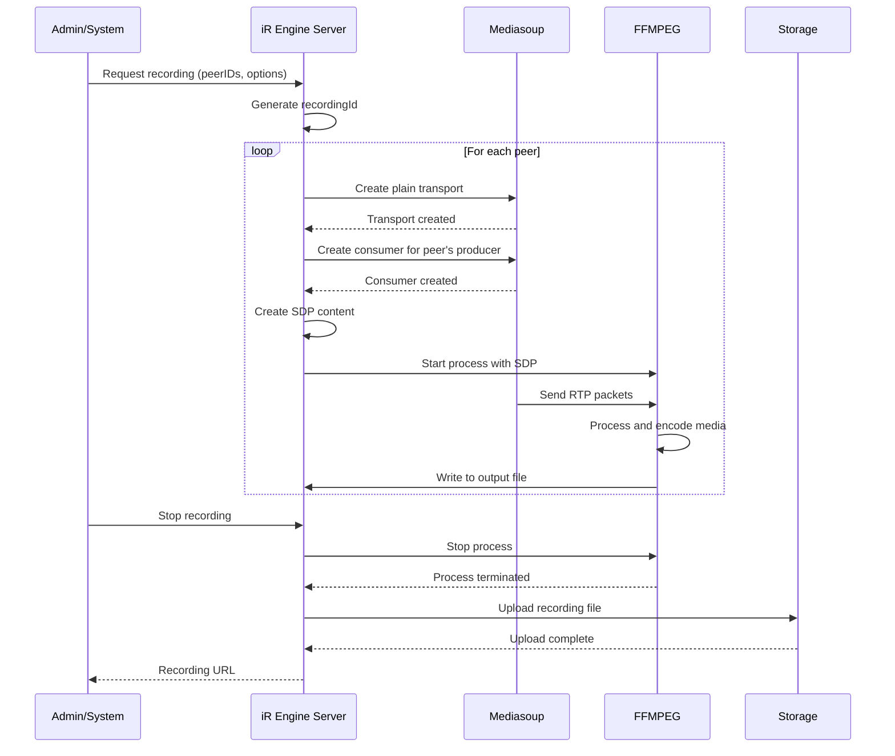

# Media stream recording

## Overview

The Media Stream Recording component is a specialized feature of the iR Engine's multiplayer infrastructure that enables the capture and storage of audio and video streams from players during gameplay sessions. It leverages the WebRTC communication backbone to access media streams and processes them into standard video formats for later viewing or analysis. By providing robust recording capabilities, this system enhances the multiplayer experience with features like session replay, content creation, and performance analysis. This chapter explores the implementation, workflow, and applications of media stream recording within the iR Engine.

## Core concepts

### Media capture

The system captures media streams directly from the multiplayer session:

- **Stream interception**: Tapping into the existing WebRTC media flows
- **Audio recording**: Capturing player voice communications
- **Video recording**: Capturing webcam feeds or screen shares
- **Selective recording**: Ability to record specific players or all participants
- **Minimal performance impact**: Designed to avoid affecting gameplay experience

This approach ensures high-quality recordings without disrupting the game session.

### Media processing

Captured streams are processed into standard media formats:

- **Format conversion**: Transforming raw WebRTC streams into standard video files
- **Codec handling**: Supporting various audio and video codecs (VP8, H.264, Opus)
- **Synchronization**: Ensuring audio and video remain properly aligned
- **Quality control**: Balancing file size and recording quality
- **Real-time processing**: Converting streams as they arrive rather than after completion

This processing creates usable media files from the raw stream data.

### Storage and access

Processed recordings are stored for later access:

- **Cloud storage**: Uploading recordings to cloud storage services
- **Local storage**: Option for storing recordings on local infrastructure
- **Metadata tracking**: Maintaining information about recordings (participants, duration, etc.)
- **Access control**: Managing who can access recorded content
- **Retrieval mechanisms**: APIs for finding and accessing recordings

This storage system ensures recordings are preserved and accessible when needed.

## Implementation

### Recording system initialization

The recording system is initialized as part of the server setup:

```typescript
// Simplified from: src/MediasoupRecordingSystem.ts
import { defineSystem } from '@ir-engine/ecs/src/SystemFunctions';
import { getMutableState, none } from '@ir-engine/hyperflux';
import { RecordingAPIState } from '@ir-engine/common/src/recording/ECSRecordingSystem';
import { useEffect } from 'react';

// Define the recording system
export const MediasoupRecordingSystem = defineSystem({
  uuid: 'ee.instanceserver.MediasoupRecordingSystem',
  
  // Reactor component that exposes recording functionality
  reactor: () => {
    useEffect(() => {
      // Make recording functions available through Hyperflux state
      getMutableState(RecordingAPIState).merge({
        createMediaChannelRecorder: startMediaRecording,
        stopMediaChannelRecorder: stopMediaRecording
      });
      
      // Cleanup when system is destroyed
      return () => {
        getMutableState(RecordingAPIState).merge({
          createMediaChannelRecorder: none,
          stopMediaChannelRecorder: none
        });
      };
    }, []);
    
    return null;
  },
  
  // Regular execution function
  execute: () => {
    // Check for recording requests
    // Monitor active recordings
    // Handle recording errors
  }
});
```

This code:
- Defines a system for managing media recordings
- Exposes recording functions through Hyperflux state
- Sets up cleanup when the system is destroyed
- Implements an execution function for regular processing

### Starting a recording

The system provides functions to initiate recordings:

```typescript
// Simplified from: src/MediasoupRecordingSystem.ts
import { getState } from '@ir-engine/hyperflux';
import { MediasoupMediaProducerState } from './MediasoupMediaProducerState';

/**
 * Starts recording media for specified peers
 * @param peerIDs Array of peer IDs to record
 * @param options Recording options
 * @returns Recording ID and control functions
 */
async function startMediaRecording(
  peerIDs: string[],
  options: {
    audioEnabled?: boolean;
    videoEnabled?: boolean;
    outputFormat?: 'webm' | 'mp4';
    quality?: 'high' | 'medium' | 'low';
  } = {}
) {
  // Generate a unique recording ID
  const recordingId = generateUniqueId();
  
  // Default options
  const {
    audioEnabled = true,
    videoEnabled = true,
    outputFormat = 'webm',
    quality = 'medium'
  } = options;
  
  // Track recording state
  const recordingState = {
    id: recordingId,
    peerIDs,
    startTime: Date.now(),
    status: 'initializing',
    tracks: {} as Record<string, any>
  };
  
  // Store recording state
  activeRecordings.set(recordingId, recordingState);
  
  try {
    // Process each peer
    for (const peerID of peerIDs) {
      // Get the peer's producers from state
      const mediaProducerState = getState(MediasoupMediaProducerState);
      const peerProducers = Object.values(mediaProducerState.producers)
        .flatMap(networkProducers => Object.values(networkProducers))
        .filter(producer => producer.peerID === peerID);
      
      // Find audio and video producers
      const audioProducer = peerProducers.find(p => p.kind === 'audio');
      const videoProducer = peerProducers.find(p => p.kind === 'video');
      
      // Start recording for this peer if they have the required producers
      if ((audioEnabled && audioProducer) || (videoEnabled && videoProducer)) {
        await startMediaRecordingPair(
          recordingId,
          peerID,
          audioEnabled ? audioProducer : null,
          videoEnabled ? videoProducer : null,
          outputFormat,
          quality
        );
      }
    }
    
    // Update recording status
    recordingState.status = 'recording';
    
    // Return recording control interface
    return {
      recordingId,
      stop: () => stopMediaRecording(recordingId),
      getStatus: () => getRecordingStatus(recordingId)
    };
  } catch (error) {
    // Handle initialization errors
    console.error(`Failed to start recording ${recordingId}:`, error);
    
    // Clean up any partially initialized resources
    await stopMediaRecording(recordingId);
    
    // Remove recording state
    activeRecordings.delete(recordingId);
    
    throw error;
  }
}
```

This function:
1. Generates a unique ID for the recording
2. Processes recording options with sensible defaults
3. Initializes recording state tracking
4. Retrieves the media producers for each peer
5. Starts recording for each peer with the required producers
6. Returns a control interface for managing the recording

### Setting up media consumers

The system creates special consumers to access media streams:

```typescript
// Simplified from: src/MediasoupRecordingSystem.ts
import { getRouterForPeer } from './MediasoupUtils';

/**
 * Creates Mediasoup consumers for recording
 * @param peerID Peer ID to record
 * @param producer Producer to consume
 * @returns Consumer and transport information
 */
async function createRecordingConsumer(peerID: string, producer: any) {
  // Get the router for this peer
  const router = getRouterForPeer(peerID);
  
  // Create a plain transport for server-side media consumption
  // This transport doesn't use DTLS/ICE like normal WebRTC
  const transport = await router.createPlainTransport({
    listenIp: { ip: '127.0.0.1', announcedIp: null },
    rtcpMux: true,
    comedia: false
  });
  
  // Create a consumer to receive the producer's media
  const consumer = await transport.consume({
    producerId: producer.id,
    rtpCapabilities: router.rtpCapabilities,
    paused: false
  });
  
  // Return the consumer and transport
  return {
    consumer,
    transport,
    kind: producer.kind,
    rtpParameters: consumer.rtpParameters,
    localRtpPort: transport.tuple.localPort
  };
}
```

This function:
1. Gets the Mediasoup router for the specified peer
2. Creates a plain transport for server-side media consumption
3. Creates a consumer to receive the producer's media
4. Returns the consumer, transport, and related information

### Processing media with FFMPEG

The system uses FFMPEG to process and encode the media streams:

```typescript
// Simplified from: src/FFMPEG.ts
import { spawn } from 'child_process';
import ffmpegStatic from 'ffmpeg-static';
import { createWriteStream } from 'fs';

/**
 * Starts FFMPEG process to record media
 * @param audioTrack Audio track information
 * @param videoTrack Video track information
 * @param outputPath Output file path
 * @param options Encoding options
 * @returns FFMPEG process and control functions
 */
async function startFFMPEG(
  audioTrack: any | null,
  videoTrack: any | null,
  outputPath: string,
  options: {
    format: 'webm' | 'mp4';
    quality: 'high' | 'medium' | 'low';
  }
) {
  // Create SDP (Session Description Protocol) content
  // This tells FFMPEG what kind of media to expect and where
  const sdpContent = createSDPContent(audioTrack, videoTrack);
  
  // Determine codec settings based on quality
  const videoCodecSettings = getVideoCodecSettings(options.quality);
  const audioCodecSettings = getAudioCodecSettings(options.quality);
  
  // Build FFMPEG arguments
  const ffmpegArgs = [
    // Input options
    '-protocol_whitelist', 'pipe,file,rtp,udp',
    '-i', 'pipe:0', // Read SDP from stdin
    
    // Video codec settings (if video track exists)
    ...(videoTrack ? videoCodecSettings : []),
    
    // Audio codec settings (if audio track exists)
    ...(audioTrack ? audioCodecSettings : []),
    
    // Output format
    '-f', options.format,
    
    // Output options
    '-y', outputPath // Output file path
  ];
  
  // Spawn FFMPEG process
  const ffmpegProcess = spawn(ffmpegStatic, ffmpegArgs);
  
  // Write SDP content to FFMPEG's stdin
  ffmpegProcess.stdin.write(sdpContent);
  ffmpegProcess.stdin.end();
  
  // Handle process events
  ffmpegProcess.on('error', (error) => {
    console.error('FFMPEG process error:', error);
  });
  
  // Return process and control functions
  return {
    process: ffmpegProcess,
    stop: () => {
      ffmpegProcess.kill('SIGINT');
    }
  };
}

/**
 * Creates SDP content for FFMPEG
 * @param audioTrack Audio track information
 * @param videoTrack Video track information
 * @returns SDP content string
 */
function createSDPContent(audioTrack: any | null, videoTrack: any | null) {
  // SDP header
  let sdp = 'v=0\n';
  sdp += 'o=- 0 0 IN IP4 127.0.0.1\n';
  sdp += 's=iR Engine Media Recording\n';
  sdp += 'c=IN IP4 127.0.0.1\n';
  sdp += 't=0 0\n';
  
  // Add audio media section if audio track exists
  if (audioTrack) {
    sdp += 'm=audio ' + audioTrack.localRtpPort + ' RTP/AVP 111\n';
    sdp += 'a=rtpmap:111 ' + audioTrack.rtpParameters.codecs[0].mimeType.split('/')[1] + '/' + audioTrack.rtpParameters.codecs[0].clockRate + '\n';
    // Add other audio parameters
  }
  
  // Add video media section if video track exists
  if (videoTrack) {
    sdp += 'm=video ' + videoTrack.localRtpPort + ' RTP/AVP 96\n';
    sdp += 'a=rtpmap:96 ' + videoTrack.rtpParameters.codecs[0].mimeType.split('/')[1] + '/' + videoTrack.rtpParameters.codecs[0].clockRate + '\n';
    // Add other video parameters
  }
  
  return sdp;
}
```

This code:
1. Creates SDP content that describes the media streams for FFMPEG
2. Determines codec settings based on the requested quality
3. Builds FFMPEG command-line arguments
4. Spawns an FFMPEG process with the appropriate configuration
5. Writes the SDP content to FFMPEG's standard input
6. Returns the process and control functions

### Uploading recordings

The system uploads completed recordings to storage:

```typescript
// Simplified from: src/MediasoupRecordingSystem.ts
import { createReadStream } from 'fs';
import { uploadToStorage } from './StorageService';

/**
 * Uploads a recording to storage
 * @param recordingId Recording ID
 * @param filePath Local file path
 * @returns Storage URL
 */
async function uploadRecording(recordingId: string, filePath: string) {
  try {
    // Create a read stream from the file
    const fileStream = createReadStream(filePath);
    
    // Generate storage path
    const storagePath = `recordings/${recordingId}/${path.basename(filePath)}`;
    
    // Upload to storage
    const url = await uploadToStorage(fileStream, storagePath, {
      contentType: getContentType(filePath),
      metadata: {
        recordingId,
        timestamp: new Date().toISOString()
      }
    });
    
    console.log(`Recording ${recordingId} uploaded to ${url}`);
    
    return url;
  } catch (error) {
    console.error(`Failed to upload recording ${recordingId}:`, error);
    throw error;
  }
}

/**
 * Gets content type based on file extension
 * @param filePath File path
 * @returns Content type
 */
function getContentType(filePath: string) {
  const extension = path.extname(filePath).toLowerCase();
  
  switch (extension) {
    case '.webm':
      return 'video/webm';
    case '.mp4':
      return 'video/mp4';
    case '.ogg':
      return 'audio/ogg';
    default:
      return 'application/octet-stream';
  }
}
```

This code:
1. Creates a read stream from the local recording file
2. Generates a storage path for the recording
3. Uploads the file to storage with appropriate metadata
4. Returns the URL for accessing the uploaded recording

## Recording workflow

The complete recording workflow follows this sequence:



This diagram illustrates:
1. An admin or system requests a recording with specific peers and options
2. The server generates a unique recording ID
3. For each peer, the server creates transports and consumers in Mediasoup
4. The server creates SDP content and starts an FFMPEG process
5. Mediasoup sends RTP packets to FFMPEG, which processes and encodes the media
6. When the recording is stopped, the FFMPEG process is terminated
7. The server uploads the recording file to storage
8. The recording URL is returned to the admin or system

## Integration with other components

The media stream recording system integrates with several other components of the multiplayer infrastructure:

### WebRTC communication backbone

The recording system leverages the WebRTC infrastructure:

```typescript
// Example of WebRTC integration
import { getState } from '@ir-engine/hyperflux';
import { MediasoupMediaProducerState } from './MediasoupMediaProducerState';

// Function to find producers for a peer
function findProducersForPeer(peerID: string) {
  // Get the current producer state
  const producerState = getState(MediasoupMediaProducerState);
  
  // Find all producers for this peer across all networks
  const peerProducers = Object.values(producerState.producers)
    .flatMap(networkProducers => Object.values(networkProducers))
    .filter(producer => producer.peerID === peerID);
  
  // Separate audio and video producers
  const audioProducer = peerProducers.find(p => p.kind === 'audio');
  const videoProducer = peerProducers.find(p => p.kind === 'video');
  
  return { audioProducer, videoProducer };
}
```

This integration:
- Uses the WebRTC state to find media producers for specific peers
- Accesses the Mediasoup infrastructure to create consumers
- Leverages the existing media flow for recording purposes
- Minimizes additional overhead by tapping into existing streams

### Hyperflux state management

The recording system uses Hyperflux for state management:

```typescript
// Example of Hyperflux integration
import { defineState, getMutableState } from '@ir-engine/hyperflux';

// Define recording state
export const RecordingState = defineState({
  name: 'ee.recording.RecordingState',
  initial: {
    activeRecordings: {} as Record<string, {
      id: string;
      peerIDs: string[];
      startTime: number;
      status: 'initializing' | 'recording' | 'stopping' | 'completed' | 'error';
      error?: string;
      outputUrls?: string[];
    }>
  }
});

// Function to update recording status
function updateRecordingStatus(recordingId: string, status: string, error?: string) {
  const recordingState = getMutableState(RecordingState);
  
  if (recordingState.activeRecordings[recordingId]) {
    recordingState.activeRecordings[recordingId].status.set(status);
    
    if (error) {
      recordingState.activeRecordings[recordingId].error.set(error);
    }
  }
}
```

This integration:
- Defines a state container for tracking recording status
- Updates state as recordings progress through their lifecycle
- Makes recording status available to other components
- Follows Hyperflux patterns for state management

### FeathersJS services

The recording system integrates with FeathersJS services:

```typescript
// Example of FeathersJS integration
import { Application } from '@feathersjs/feathers';

// Recording service
class RecordingService {
  app: Application;
  
  constructor(app: Application) {
    this.app = app;
  }
  
  // Start a recording
  async create(data: {
    peerIDs: string[];
    options?: {
      audioEnabled?: boolean;
      videoEnabled?: boolean;
      outputFormat?: 'webm' | 'mp4';
      quality?: 'high' | 'medium' | 'low';
    }
  }) {
    // Get the recording function from Hyperflux state
    const recordingAPI = getState(RecordingAPIState);
    
    if (!recordingAPI.createMediaChannelRecorder) {
      throw new Error('Recording system not available');
    }
    
    // Start the recording
    const recording = await recordingAPI.createMediaChannelRecorder(
      data.peerIDs,
      data.options
    );
    
    // Return recording information
    return {
      recordingId: recording.recordingId,
      status: 'recording',
      peerIDs: data.peerIDs
    };
  }
  
  // Stop a recording
  async patch(recordingId: string) {
    // Get the stop function from Hyperflux state
    const recordingAPI = getState(RecordingAPIState);
    
    if (!recordingAPI.stopMediaChannelRecorder) {
      throw new Error('Recording system not available');
    }
    
    // Stop the recording
    const result = await recordingAPI.stopMediaChannelRecorder(recordingId);
    
    // Return result
    return {
      recordingId,
      status: 'completed',
      outputUrls: result.outputUrls
    };
  }
  
  // Get recording status
  async get(recordingId: string) {
    const recordingState = getState(RecordingState);
    const recording = recordingState.activeRecordings[recordingId];
    
    if (!recording) {
      throw new Error(`Recording ${recordingId} not found`);
    }
    
    return {
      recordingId,
      status: recording.status,
      peerIDs: recording.peerIDs,
      startTime: recording.startTime,
      error: recording.error,
      outputUrls: recording.outputUrls
    };
  }
}

// Register the service
export default function(app: Application) {
  app.use('/recordings', new RecordingService(app));
}
```

This integration:
- Creates a FeathersJS service for managing recordings
- Exposes recording functionality through a standard API
- Leverages Hyperflux state for accessing recording functions
- Provides methods for starting, stopping, and checking recordings

## Benefits of media stream recording

The Media Stream Recording system provides several key advantages:

1. **Session replay**: Enables players to review past gameplay or meetings
2. **Content creation**: Provides high-quality footage for streaming or promotional content
3. **Performance analysis**: Allows players and coaches to analyze gameplay
4. **Training materials**: Creates instructional content for new players
5. **Compliance and moderation**: Maintains records for moderation or compliance purposes
6. **Event archiving**: Preserves important events or tournaments
7. **Debugging**: Helps developers identify and fix issues by reviewing sessions

These benefits make media stream recording an essential feature for enhancing the multiplayer experience.

## Conclusion

The Media Stream Recording system represents a powerful extension of the iR Engine's multiplayer infrastructure. By leveraging the WebRTC communication backbone, it enables the capture and preservation of gameplay sessions for various purposes. This capability enhances the overall multiplayer experience and provides valuable tools for players, content creators, and developers.

Throughout this documentation series, we've explored the complete multiplayer infrastructure of the iR Engine, from the WebRTC communication backbone to instance lifecycle management, user connection and authorization, the FeathersJS application structure, the Hyperflux state management system, and finally, media stream recording. Together, these components create a robust foundation for building engaging multiplayer experiences.

---


