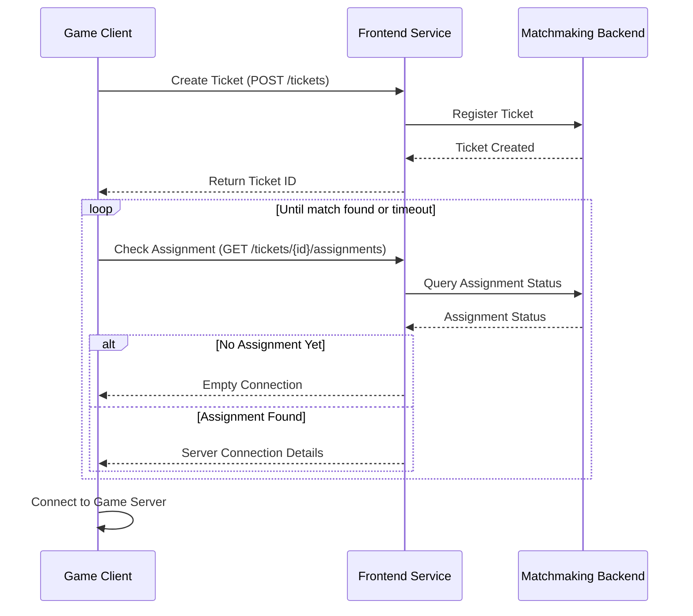

# Frontend service interaction

## Overview

The Frontend Service Interaction component serves as the entry point to the iR Engine's matchmaking system. It provides the API interface through which game clients communicate with the matchmaking infrastructure, enabling players to request matches and receive game assignments. By abstracting the complexity of the underlying matchmaking processes, this component creates a straightforward way for games to integrate with the matchmaking system. This chapter explores the implementation, workflow, and integration of the frontend service within the iR Engine's matchmaking architecture.

## Core concepts

### Client-server communication

The frontend service establishes a communication channel between game clients and the matchmaking system:

- **Request submission**: Game clients send match requests to the matchmaking system
- **Response handling**: The matchmaking system provides responses with ticket IDs or assignments
- **Status polling**: Clients periodically check for updates on their match requests
- **Connection details**: When matches are found, clients receive server connection information

This communication follows standard API patterns, typically using HTTP requests and JSON data formats.

### Match request lifecycle

A match request follows a defined lifecycle through the frontend service:

1. **Creation**: Client submits a request for a match with specific criteria
2. **Acknowledgment**: System creates a ticket and returns a unique identifier
3. **Processing**: Matchmaking system works to find suitable matches (invisible to client)
4. **Assignment**: When a match is found, connection details are provided to the client
5. **Completion**: Client connects to the assigned game server

This lifecycle provides a structured approach to handling match requests from submission to fulfillment.

## Implementation

### Creating a match ticket

The first step in the matchmaking process is creating a ticket:

```typescript
// From: src/functions.ts
import { MatchTicketType } from './match-ticket.schema';
// ... other imports and setup ...

const FRONTEND_SERVICE_URL = 'http://localhost:51504/v1/frontendservice';

/**
 * Creates a match ticket for the specified game mode
 * @param gameMode The desired game mode (e.g., "CaptureTheFlag")
 * @returns A promise resolving to the created match ticket
 */
async function createTicket(gameMode: string): Promise<MatchTicketType> {
  console.log(`Creating ticket for game mode: ${gameMode}`);
  
  try {
    // Send POST request to create a ticket
    const response = await axios.post(`${FRONTEND_SERVICE_URL}/tickets`, {
      searchFields: {
        tags: [gameMode]
      }
    });
    
    // Return the ticket data
    return response.data as MatchTicketType;
  } catch (error) {
    console.error('Failed to create match ticket:', error);
    throw new Error('Failed to create match ticket');
  }
}
```

This function:
1. Takes a game mode parameter that specifies what type of game the player wants
2. Sends an HTTP POST request to the frontend service's `/tickets` endpoint
3. Includes search fields (like game mode tags) that will be used for matchmaking
4. Returns a match ticket object with a unique ID for future reference

### Checking for match assignments

After creating a ticket, clients need to check if a match has been found:

```typescript
// From: src/functions.ts
import { MatchTicketAssignmentType } from './match-ticket-assignment.schema';
// ... other imports and setup ...

/**
 * Gets the assignment for a specific ticket
 * @param ticketId The ID of the ticket to check
 * @returns A promise resolving to the ticket assignment (if any)
 */
async function getTicketsAssignment(ticketId: string): Promise<MatchTicketAssignmentType> {
  console.log(`Checking assignment for ticket: ${ticketId}`);
  
  try {
    // Create an AbortController for timeout handling
    const controller = new AbortController();
    const timeoutId = setTimeout(() => controller.abort(), 10000); // 10 second timeout
    
    // Send GET request to check for assignment
    const response = await fetch(
      `${FRONTEND_SERVICE_URL}/tickets/${ticketId}/assignments`, 
      { signal: controller.signal }
    );
    
    // Clear the timeout
    clearTimeout(timeoutId);
    
    // Check for errors
    if (!response.ok) {
      throw new Error(`HTTP error: ${response.status}`);
    }
    
    // Parse the response
    const data = await readStreamFirstData(response.body);
    return data as MatchTicketAssignmentType;
  } catch (error) {
    if (error.name === 'AbortError') {
      console.error('Request timed out');
      return { connection: '' } as MatchTicketAssignmentType;
    }
    
    console.error('Failed to get ticket assignment:', error);
    throw new Error('Failed to get ticket assignment');
  }
}

/**
 * Helper function to read the first chunk of data from a stream
 */
async function readStreamFirstData(stream) {
  const reader = stream.getReader();
  const { value, done } = await reader.read();
  reader.releaseLock();
  
  if (done) {
    return null;
  }
  
  // Parse the JSON data
  const text = new TextDecoder().decode(value);
  return JSON.parse(text);
}
```

This function:
1. Takes a ticket ID parameter that was received from the `createTicket` function
2. Sends an HTTP GET request to the `/tickets/{ticketId}/assignments` endpoint
3. Includes timeout handling to prevent indefinite waiting
4. Parses the response to extract assignment information
5. Returns an assignment object that may contain connection details if a match was found

### Polling for assignments

Since matchmaking takes time, clients typically poll for assignments:

```typescript
// Example usage in a game client
async function findMatch(gameMode: string): Promise<string> {
  // Step 1: Create a ticket
  console.log(`Finding a match for game mode: ${gameMode}`);
  const ticket = await createTicket(gameMode);
  console.log(`Ticket created with ID: ${ticket.id}`);
  
  // Step 2: Poll for assignment
  let assignment = await getTicketsAssignment(ticket.id);
  let attempts = 0;
  const MAX_ATTEMPTS = 30; // Maximum polling attempts
  
  while (assignment.connection === '' && attempts < MAX_ATTEMPTS) {
    console.log(`No assignment yet, waiting (attempt ${attempts + 1}/${MAX_ATTEMPTS})...`);
    
    // Wait before trying again
    await new Promise(resolve => setTimeout(resolve, 5000)); // 5 second delay
    
    // Check again
    assignment = await getTicketsAssignment(ticket.id);
    attempts++;
  }
  
  // Step 3: Handle the result
  if (assignment.connection !== '') {
    console.log(`Match found! Server connection: ${assignment.connection}`);
    return assignment.connection;
  } else {
    console.log('Failed to find a match within the time limit');
    throw new Error('Matchmaking timeout');
  }
}
```

This function:
1. Creates a match ticket for the specified game mode
2. Repeatedly checks for an assignment with a delay between attempts
3. Limits the number of attempts to prevent infinite polling
4. Returns the connection details when a match is found
5. Throws an error if no match is found within the time limit

## Communication flow

The complete frontend service interaction follows this sequence:



This diagram illustrates:
1. The client creates a ticket through the frontend service
2. The frontend service registers the ticket with the matchmaking backend
3. The client periodically checks for an assignment
4. The frontend service queries the backend for the current status
5. When a match is found, the frontend service provides connection details
6. The client connects to the assigned game server

## API endpoints

The frontend service exposes several key endpoints:

| Endpoint | Method | Description | Request Body | Response |
|----------|--------|-------------|--------------|----------|
| `/tickets` | POST | Create a new match ticket | Game criteria (mode, etc.) | Ticket object with ID |
| `/tickets/{id}` | GET | Get ticket details | None | Ticket object |
| `/tickets/{id}` | DELETE | Cancel a ticket | None | Success status |
| `/tickets/{id}/assignments` | GET | Get assignment for a ticket | None | Assignment object |

These endpoints provide a complete interface for managing the matchmaking process from the client perspective.

## Configuration

The frontend service is configured through environment variables:

```typescript
// From: src/config.ts
export const config = {
  frontendService: {
    url: process.env.FRONTEND_SERVICE_URL || 'http://localhost:51504/v1/frontendservice',
    timeout: parseInt(process.env.FRONTEND_SERVICE_TIMEOUT || '10000', 10),
    retryCount: parseInt(process.env.FRONTEND_SERVICE_RETRY_COUNT || '3', 10),
    retryDelay: parseInt(process.env.FRONTEND_SERVICE_RETRY_DELAY || '1000', 10)
  }
};
```

This configuration:
- Sets the base URL for the frontend service
- Defines timeout values for requests
- Configures retry behavior for failed requests
- Provides defaults while allowing customization through environment variables

## Integration with other components

The frontend service interacts with several other components of the matchmaking system:

### Match ticket

The frontend service creates and manages match tickets:

```typescript
// From: src/match-ticket.schema.ts
export interface MatchTicketType {
  id: string;
  searchFields?: {
    tags?: string[];
    doubleArgs?: Record<string, number>;
    stringArgs?: Record<string, string>;
  };
  extensions?: Record<string, any>;
  createTime?: string;
}
```

This integration:
- Defines the structure of match tickets
- Ensures consistent data format between client and server
- Provides fields for specifying match criteria

### Match assignment

The frontend service delivers match assignments to clients:

```typescript
// From: src/match-ticket-assignment.schema.ts
export interface MatchTicketAssignmentType {
  connection: string;
  extensions?: Record<string, any>;
}
```

This integration:
- Defines the structure of match assignments
- Provides connection details for game servers
- Allows for extension data for additional information

## Benefits of frontend service interaction

The Frontend Service Interaction component provides several key advantages:

1. **Abstraction**: Hides the complexity of the matchmaking system from game clients
2. **Standardization**: Provides a consistent API for all games to integrate with
3. **Decoupling**: Separates client concerns from backend matchmaking logic
4. **Scalability**: Allows the backend to scale independently of client interactions
5. **Flexibility**: Supports various game types and matchmaking criteria
6. **Monitoring**: Provides a clear entry point for logging and monitoring
7. **Error handling**: Centralizes error management for client-facing operations

These benefits make the frontend service an essential component for creating a robust and user-friendly matchmaking experience.

## Next steps

With an understanding of how game clients interact with the matchmaking system, the next chapter explores the structure and purpose of match tickets in detail.

Next: [Match ticket](02_match_ticket_.md)

---


