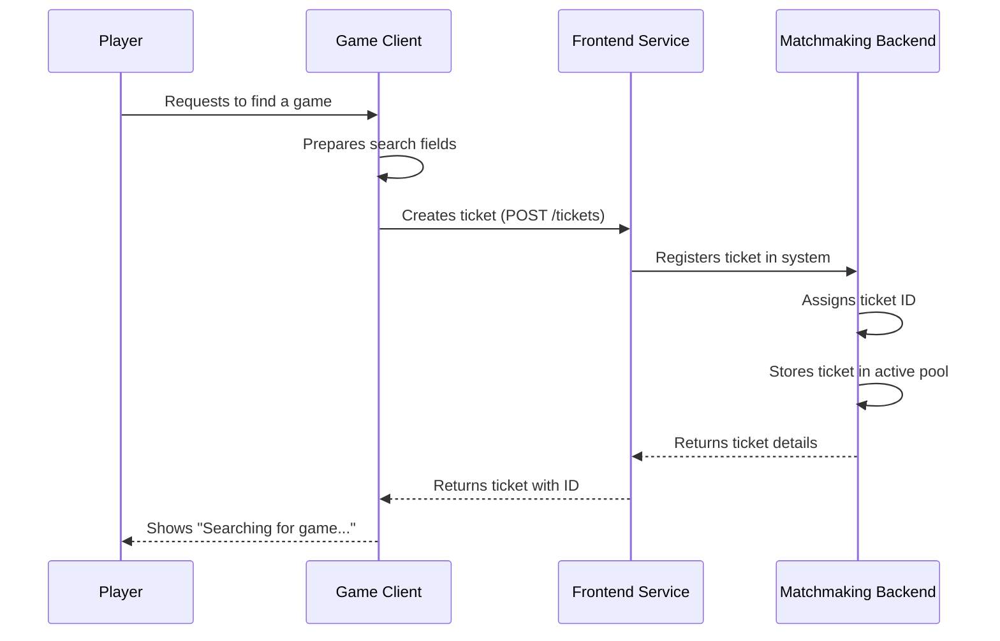

# Match ticket

## Overview

The Match Ticket is a fundamental data structure within the iR Engine's matchmaking system that represents a player's or group's request to join a game. It contains essential information about the desired game type, player attributes, and timing details that the matchmaking system uses to find appropriate matches. 

By serving as a standardized format for game requests, match tickets enable the system to efficiently process and fulfill player matchmaking needs. This chapter explores the structure, creation, and lifecycle of match tickets within the matchmaking architecture.

## Core concepts

### Request representation

A match ticket serves as a formal representation of a matchmaking request:

- **Identification**: Each ticket has a unique identifier for tracking and reference
- **Game criteria**: The ticket specifies what type of game the player wants to join
- **Player information**: Details about the player or group making the request
- **Timing data**: Information about when the request was made
- **Additional attributes**: Optional parameters for more specific matching requirements

This structured approach ensures that all necessary information is captured for effective matchmaking.

### Ticket lifecycle

Match tickets follow a defined lifecycle within the system:

1. **Creation**: Generated when a player requests to join a game
2. **Queuing**: Added to a pool of active tickets awaiting matching
3. **Processing**: Evaluated against match profiles by the match function
4. **Assignment**: Associated with a game server when a suitable match is found
5. **Fulfillment**: Completed when the player joins the assigned game
6. **Expiration/Cancellation**: Removed if the player cancels or the ticket times out

This lifecycle ensures proper tracking and handling of matchmaking requests from submission to completion.

## Implementation

### Ticket structure

The match ticket is defined with a specific schema:

```typescript
// From: src/match-ticket.schema.ts
export interface MatchTicketType {
  // Unique identifier for the ticket
  id: string;
  
  // Fields used for matchmaking
  searchFields?: {
    // Tags for categorical matching (e.g., game modes)
    tags?: string[];
    
    // Numerical values for range-based matching
    doubleArgs?: Record<string, number>;
    
    // String values for exact matching
    stringArgs?: Record<string, string>;
  };
  
  // Additional custom data
  extensions?: Record<string, any>;
  
  // Timestamp when the ticket was created
  createTime?: string;
}
```

This structure:
- Provides a unique ID for tracking the ticket
- Contains searchFields for specifying match criteria
- Supports extensions for custom data
- Includes creation time for queue management

### Creating search fields

When creating a ticket, search fields are prepared to specify the match criteria:

```typescript
// From: src/functions.ts
/**
 * Prepares search fields for a match ticket
 * @param gameMode The desired game mode
 * @param attributes Additional matching attributes
 * @returns Structured search fields for the ticket
 */
function prepareSearchFieldsForTicket(
  gameMode: string, 
  attributes?: Record<string, string>
): any {
  // Initialize search fields with game mode and timestamp
  const searchFields: any = {
    tags: [gameMode],
    doubleArgs: {
      'time.enterqueue': Date.now() // When the player started searching
    }
  };

  // Add optional attributes if provided
  if (attributes) {
    searchFields.stringArgs = {};
    
    // Prefix attribute keys for namespace clarity
    for (const key in attributes) {
      searchFields.stringArgs['attributes.' + key] = attributes[key];
    }
  }
  
  return searchFields;
}
```

This function:
1. Takes a game mode parameter (e.g., "CaptureTheFlag")
2. Adds the game mode as a tag for categorical matching
3. Records the current timestamp to track queue time
4. Incorporates optional attributes for more specific matching
5. Returns a structured object ready for inclusion in a match ticket

### Creating a match ticket

The complete process of creating a match ticket involves:

```typescript
// From: src/functions.ts
import { MatchTicketType } from './match-ticket.schema';
import axios from 'axios';
// ... other imports ...

const FRONTEND_SERVICE_URL = process.env.FRONTEND_SERVICE_URL || 'http://localhost:51504/v1/frontendservice';

/**
 * Creates a match ticket for the specified criteria
 * @param gameMode The desired game mode
 * @param attributes Optional additional matching attributes
 * @returns A promise resolving to the created match ticket
 */
async function createTicket(
  gameMode: string,
  attributes?: Record<string, string>
): Promise<MatchTicketType> {
  console.log(`Creating ticket for game mode: ${gameMode}`);
  
  try {
    // Prepare the search fields
    const searchFields = prepareSearchFieldsForTicket(gameMode, attributes);
    
    // Send the request to create a ticket
    const response = await axios.post(`${FRONTEND_SERVICE_URL}/tickets`, {
      searchFields
    });
    
    // Log success and return the ticket
    const ticket = response.data as MatchTicketType;
    console.log(`Ticket created with ID: ${ticket.id}`);
    return ticket;
  } catch (error) {
    console.error('Failed to create match ticket:', error);
    throw new Error('Failed to create match ticket');
  }
}
```

This function:
1. Prepares search fields using the helper function
2. Sends an HTTP POST request to the frontend service
3. Includes the search fields in the request body
4. Returns the created ticket with its assigned ID
5. Handles errors that might occur during ticket creation

### Ticket creation workflow

The complete workflow for ticket creation follows this sequence:



This diagram illustrates:
1. The player initiates a request to find a game
2. The client prepares search fields based on the desired game type
3. The client sends a request to create a ticket
4. The frontend service forwards this to the matchmaking backend
5. The backend assigns an ID and stores the ticket
6. The ticket details are returned to the client
7. The client indicates to the player that matchmaking is in progress

## Ticket components

### Tags

Tags are string identifiers used for categorical matching:

```typescript
// Example of tags in search fields
const searchFields = {
  tags: ['CaptureTheFlag', 'Competitive']
};
```

Tags typically represent:
- Game modes (e.g., "Deathmatch", "CaptureTheFlag")
- Game types (e.g., "Casual", "Competitive")
- Region preferences (e.g., "NA", "EU", "Asia")

The matchmaking system uses tags to group players who want similar game experiences.

### Double arguments

Double arguments are numerical values used for range-based matching:

```typescript
// Example of double arguments in search fields
const searchFields = {
  doubleArgs: {
    'time.enterqueue': 1678886400000, // Timestamp
    'skill.rating': 1850,             // Player skill rating
    'latency.region.us-west': 45      // Ping to US West servers
  }
};
```

Double arguments typically represent:
- Queue entry time for wait time prioritization
- Skill ratings for balanced matchmaking
- Latency measurements for connection quality
- Player counts for party size considerations

The matchmaking system can use these values to find players within acceptable ranges.

### String arguments

String arguments are text values used for exact matching:

```typescript
// Example of string arguments in search fields
const searchFields = {
  stringArgs: {
    'attributes.map': 'DesertRuins',
    'attributes.skillTier': 'Gold',
    'attributes.role': 'Support'
  }
};
```

String arguments typically represent:
- Map preferences
- Character or role selections
- Skill tiers or divisions
- Other categorical preferences that aren't tags

The matchmaking system uses these for exact matching requirements.

## Group tickets

Match tickets can represent either individual players or pre-formed groups:

```typescript
// Example of creating a group ticket
async function createGroupTicket(
  groupId: string,
  playerIds: string[],
  gameMode: string
): Promise<MatchTicketType> {
  // Prepare search fields
  const searchFields = prepareSearchFieldsForTicket(gameMode);
  
  // Add group information
  const extensions = {
    group: {
      id: groupId,
      players: playerIds
    }
  };
  
  // Create the ticket
  const response = await axios.post(`${FRONTEND_SERVICE_URL}/tickets`, {
    searchFields,
    extensions
  });
  
  return response.data as MatchTicketType;
}
```

Group tickets:
- Keep players together in the same match
- Ensure friends can play on the same team
- Are treated as a single unit during matchmaking
- May have special handling for team balancing

## Ticket pool

All active tickets are stored in a pool for processing:

```go
// Conceptual representation from open-match-custom-pods/director/main.go
func fetchTickets(ctx context.Context, client pb.FrontendServiceClient) ([]*pb.Ticket, error) {
    // Query for all active tickets
    req := &pb.QueryTicketsRequest{
        Pool: &pb.Pool{
            Filter: []*pb.Filter{
                {
                    Tag: "CaptureTheFlag",
                },
            },
        },
    }
    
    // Get tickets from the pool
    resp, err := client.QueryTickets(ctx, req)
    if err != nil {
        return nil, err
    }
    
    return resp.Tickets, nil
}
```

The ticket pool:
- Contains all active tickets awaiting matches
- Is queried by the match function to form potential matches
- Can be filtered by specific criteria (e.g., game mode)
- Is continuously updated as new tickets are created and existing ones are fulfilled

## Integration with other components

The match ticket integrates with several other components of the matchmaking system:

### Frontend service

The frontend service creates and manages tickets:

```typescript
// Example of frontend service integration
import { createTicket, deleteTicket } from './functions';

// Create a ticket when the player clicks "Find Game"
async function handleFindGameClick() {
  const gameMode = getSelectedGameMode(); // e.g., "CaptureTheFlag"
  const attributes = getSelectedAttributes(); // e.g., { map: "DesertRuins" }
  
  try {
    // Create the ticket
    const ticket = await createTicket(gameMode, attributes);
    
    // Store the ticket ID for later reference
    setCurrentTicketId(ticket.id);
    
    // Start polling for assignment
    startAssignmentPolling(ticket.id);
  } catch (error) {
    console.error('Failed to find game:', error);
    showErrorMessage('Failed to start matchmaking');
  }
}

// Cancel the ticket when the player clicks "Cancel"
async function handleCancelClick() {
  const ticketId = getCurrentTicketId();
  
  if (ticketId) {
    try {
      // Delete the ticket
      await deleteTicket(ticketId);
      
      // Stop polling for assignment
      stopAssignmentPolling();
      
      // Clear the ticket ID
      setCurrentTicketId(null);
    } catch (error) {
      console.error('Failed to cancel matchmaking:', error);
    }
  }
}
```

This integration:
- Creates tickets when players request matches
- Manages ticket lifecycle from the client perspective
- Handles cancellation when players no longer want to match
- Provides feedback to players about the matchmaking process

### Match function

The match function processes tickets to form matches:

```go
// Conceptual representation from open-match-custom-pods/mmf/main.go
func makeMatches(tickets []*pb.Ticket, profile *pb.MatchProfile) []*pb.Match {
    // Group tickets by game mode
    ticketsByMode := groupTicketsByTag(tickets)
    
    // Process each game mode separately
    var matches []*pb.Match
    for mode, modeTickets := range ticketsByMode {
        // Sort tickets by wait time
        sortTicketsByEnterQueue(modeTickets)
        
        // Form matches based on profile requirements
        for len(modeTickets) >= profile.GetMinPlayers() {
            // Take enough tickets for a match
            matchTickets := modeTickets[:profile.GetMaxPlayers()]
            modeTickets = modeTickets[profile.GetMaxPlayers():]
            
            // Create a match
            match := &pb.Match{
                MatchId: uuid.New().String(),
                Tickets: matchTickets,
                // Additional match properties
            }
            
            matches = append(matches, match)
        }
    }
    
    return matches
}
```

This integration:
- Processes tickets based on their search fields
- Groups tickets by common criteria (e.g., game mode)
- Forms potential matches according to match profiles
- Prioritizes tickets based on wait time or other factors

## Benefits of match tickets

The Match Ticket system provides several key advantages:

1. **Standardization**: Creates a consistent format for matchmaking requests
2. **Flexibility**: Supports various game types and matching criteria
3. **Traceability**: Enables tracking of individual matchmaking requests
4. **Prioritization**: Allows for fair handling based on wait time
5. **Grouping**: Supports pre-formed parties staying together
6. **Extensibility**: Accommodates custom data for specialized matching
7. **Cancellation**: Provides a mechanism for players to withdraw requests

These benefits make match tickets an essential component for creating a robust and flexible matchmaking system.

## Next steps

With an understanding of how match tickets represent player requests, the next chapter explores how the system defines the rules for forming valid matches.

Next: [Match profile](03_match_profile_.md)

---


