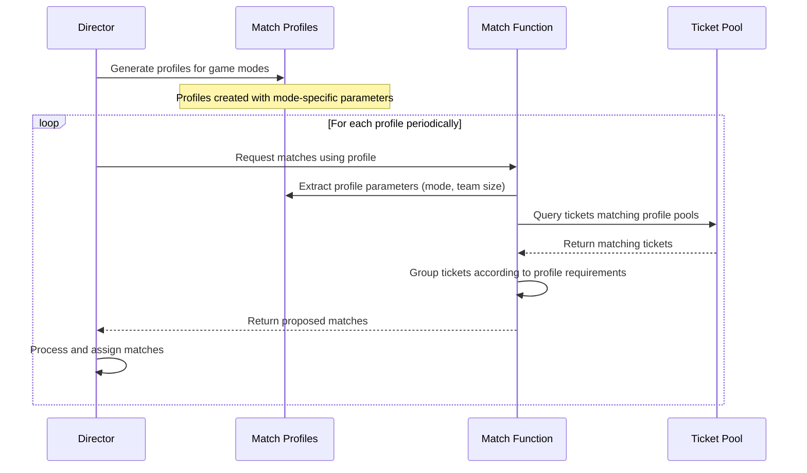

# Match profile

## Overview

The Match Profile is a configuration structure within the iR Engine's matchmaking system that defines the criteria and requirements for creating valid game matches. It serves as a blueprint that specifies what constitutes a complete and balanced game session for a particular mode or type. By providing parameters such as team sizes, player counts, and filtering criteria, match profiles guide the matchmaking process in grouping appropriate players together. This chapter explores the structure, implementation, and role of match profiles within the matchmaking architecture.

## Core concepts

### Game session definition

A match profile defines the parameters of a valid game session:

- **Game mode**: Specifies the type of game being created (e.g., "CaptureTheFlag")
- **Player requirements**: Defines how many players are needed for a complete match
- **Team structure**: Specifies how players should be organized (e.g., two teams of five)
- **Selection criteria**: Determines which match tickets are eligible for this game type
- **Custom parameters**: Provides additional game-specific configuration

This structured approach ensures that matches are created according to the game's design requirements.

### Ticket filtering

Match profiles use pools and filters to select appropriate tickets:

- **Pools**: Collections of tickets that meet specific criteria
- **Filters**: Rules that determine which tickets belong in a pool
- **Tag filters**: Select tickets based on their tags (e.g., game mode)
- **Range filters**: Select tickets based on numerical values within ranges
- **String filters**: Select tickets based on exact string matches

These filtering mechanisms ensure that only compatible tickets are considered for matching.

## Implementation

### Profile structure

Match profiles are defined using a specific structure:

```go
// From: open-match-custom-pods/director/profile.go
import (
    "open-match.dev/open-match/pkg/pb"
    "lagunalabs/matchmaking/common"
    "google.golang.org/protobuf/types/known/anypb"
)

// Match profile structure
type MatchProfile struct {
    // Unique identifier for the profile
    Name string
    
    // Collections of tickets that meet specific criteria
    Pools []*Pool
    
    // Custom data for the profile
    Extensions map[string]*anypb.Any
}

// Pool structure for filtering tickets
type Pool struct {
    // Name of the pool
    Name string
    
    // Filters for selecting tickets based on tags
    TagPresentFilters []*TagPresentFilter
    
    // Other filter types (DoubleRangeFilters, StringEqualsFilters, etc.)
}

// Filter for selecting tickets with specific tags
type TagPresentFilter struct {
    // Tag that must be present in the ticket
    Tag string
}
```

This structure:
- Provides a name for identifying the profile
- Contains pools for grouping tickets by criteria
- Includes extensions for custom game-specific data
- Uses filters to select appropriate tickets

### Profile generation

Match profiles are generated programmatically based on game modes:

```go
// Simplified from: open-match-custom-pods/director/profile.go
func generateProfiles(modes []string, teamSizes map[string]uint32) []*pb.MatchProfile {
    var profiles []*pb.MatchProfile
    
    // Create a profile for each game mode
    for _, mode := range modes {
        // Create custom profile data
        profileData := &common.ProfileDataMessage{
            Mode:     mode,             // e.g., "CaptureTheFlag"
            TeamSize: teamSizes[mode],  // e.g., 5 (for a 5v5 game)
        }
        
        // Marshal the profile data
        marshalledProfileData, err := anypb.New(profileData)
        if err != nil {
            // Handle error
            continue
        }
        
        // Create the match profile
        profile := &pb.MatchProfile{
            // Name based on the game mode
            Name: "mode_based_profile_" + mode,
            
            // Define pools for filtering tickets
            Pools: []*pb.Pool{{
                Name: "pool_mode_" + mode,
                
                // Filter for tickets with the specific game mode tag
                TagPresentFilters: []*pb.TagPresentFilter{
                    {Tag: mode}, // e.g., Tag: "CaptureTheFlag"
                },
                
                // Additional filters could be added here
            }},
            
            // Store custom data in extensions
            Extensions: map[string]*anypb.Any{
                "profileData": marshalledProfileData,
            },
        }
        
        // Add the profile to the list
        profiles = append(profiles, profile)
    }
    
    return profiles
}
```

This function:
1. Takes a list of game modes and their corresponding team sizes
2. Creates a profile for each game mode
3. Sets up a pool with a tag filter for the specific mode
4. Stores mode and team size information in the profile extensions
5. Returns a list of profiles ready for use in matchmaking

### Custom profile data

Game-specific parameters are stored in profile extensions:

```go
// From: open-match-custom-pods/_common/profilemessage.pb.go
// ProfileDataMessage contains custom data for match profiles
type ProfileDataMessage struct {
    // Game mode (e.g., "CaptureTheFlag")
    Mode string
    
    // Number of players per team
    TeamSize uint32
    
    // Other game-specific parameters could be added here
}
```

This custom data:
- Specifies the game mode for the profile
- Defines the team size for the game
- Can be extended with additional parameters as needed
- Is accessible to the match function for creating balanced matches

## Profile usage workflow

The complete workflow for using match profiles follows this sequence:



This diagram illustrates:
1. The director generates profiles for each game mode
2. For each profile, the director periodically requests matches
3. The match function extracts parameters from the profile
4. The match function queries for tickets matching the profile's pools
5. The match function groups tickets according to the profile requirements
6. The match function returns proposed matches to the director
7. The director processes and assigns the matches

## Profile components

### Name

Each profile has a unique identifier:

```go
// Example of profile naming
profile := &pb.MatchProfile{
    Name: "mode_based_profile_CaptureTheFlag",
    // Other profile properties
}
```

The name typically:
- Identifies the specific game mode or type
- Provides a reference for logging and debugging
- Helps distinguish between different match configurations
- Is used when requesting matches from the match function

### Pools

Pools define collections of tickets that meet specific criteria:

```go
// Example of pool definition
pool := &pb.Pool{
    Name: "pool_mode_CaptureTheFlag",
    
    // Filter for tickets with the "CaptureTheFlag" tag
    TagPresentFilters: []*pb.TagPresentFilter{
        {Tag: "CaptureTheFlag"},
    },
    
    // Filter for tickets with skill rating in a specific range
    DoubleRangeFilters: []*pb.DoubleRangeFilter{
        {
            DoubleArg: "skill.rating",
            Min: 1000,
            Max: 2000,
        },
    },
    
    // Filter for tickets with a specific role
    StringEqualsFilters: []*pb.StringEqualsFilter{
        {
            StringArg: "attributes.role",
            Value: "Support",
        },
    },
}
```

Pools can use various filter types:
- **TagPresentFilters**: Select tickets with specific tags
- **DoubleRangeFilters**: Select tickets with numerical values in ranges
- **StringEqualsFilters**: Select tickets with exact string matches

These filters can be combined to create precise selection criteria.

### Extensions

Extensions store custom data for the profile:

```go
// Example of profile extensions
extensions := map[string]*anypb.Any{
    "profileData": marshalledProfileData,
    "matchOptions": marshalledMatchOptions,
    "regionInfo": marshalledRegionInfo,
}
```

Extensions typically store:
- Game mode information
- Team size and structure
- Match duration or round settings
- Map rotation or selection rules
- Other game-specific configuration

This custom data is used by the match function to create appropriate matches.

## Director integration

The director uses profiles to request matches:

```go
// Simplified from: open-match-custom-pods/director/main.go
func main() {
    // Generate profiles for all game modes
    modes := []string{"CaptureTheFlag", "Deathmatch", "KingOfTheHill"}
    teamSizes := map[string]uint32{
        "CaptureTheFlag": 5,  // 5v5
        "Deathmatch":     4,  // 4v4
        "KingOfTheHill":  6,  // 6v6
    }
    profiles := generateProfiles(modes, teamSizes)
    
    // Periodically request matches for each profile
    for range time.Tick(time.Second * 5) {
        for _, profile := range profiles {
            go func(p *pb.MatchProfile) {
                // Request matches using this profile
                matches, err := fetchMatches(backendClient, p, mmfHost, mmfPort)
                if err != nil {
                    // Handle error
                    return
                }
                
                // Process the matches
                for _, match := range matches {
                    // Assign the match
                    assignMatch(backendClient, match)
                }
            }(profile)
        }
    }
}
```

This integration:
- Generates profiles for all supported game modes
- Periodically requests matches for each profile
- Processes and assigns the resulting matches
- Runs concurrently for multiple profiles

## Match function integration

The match function uses profiles to create matches:

```go
// Simplified from: open-match-custom-pods/mmf/main.go
func makeMatches(tickets []*pb.Ticket, profile *pb.MatchProfile) []*pb.Match {
    // Extract profile data
    profileData := &common.ProfileDataMessage{}
    if ext, ok := profile.Extensions["profileData"]; ok {
        ext.UnmarshalTo(profileData)
    }
    
    // Get mode and team size
    mode := profileData.Mode
    teamSize := int(profileData.TeamSize)
    
    // Create matches based on profile parameters
    var matches []*pb.Match
    
    // Group tickets into matches
    for i := 0; i+2*teamSize <= len(tickets); i += 2*teamSize {
        // Create two teams
        team1 := tickets[i:i+teamSize]
        team2 := tickets[i+teamSize:i+2*teamSize]
        
        // Create a match
        match := &pb.Match{
            MatchId: uuid.New().String(),
            MatchProfile: profile.Name,
            Tickets: append(team1, team2...),
            Extensions: map[string]*anypb.Any{
                "teams": createTeamsExtension(team1, team2),
            },
        }
        
        matches = append(matches, match)
    }
    
    return matches
}
```

This integration:
- Extracts custom data from the profile
- Uses the mode and team size to structure matches
- Groups tickets according to the profile requirements
- Creates matches with appropriate team assignments
- Returns the proposed matches to the director

## Benefits of match profiles

The Match Profile system provides several key advantages:

1. **Standardization**: Creates a consistent format for defining game requirements
2. **Flexibility**: Supports various game types with different parameters
3. **Separation of concerns**: Decouples match definition from match creation logic
4. **Configurability**: Allows for easy adjustment of game parameters
5. **Extensibility**: Accommodates custom data for specialized game types
6. **Reusability**: Enables the same matching logic to be used for different game modes
7. **Clarity**: Provides a clear contract between the director and match function

These benefits make match profiles an essential component for creating a robust and flexible matchmaking system.

## Next steps

With an understanding of how match profiles define the requirements for valid matches, the next chapter explores how the match function uses these profiles to create balanced game sessions.

Next: [Match function (MMF)](04_match_function__mmf__.md)

---


