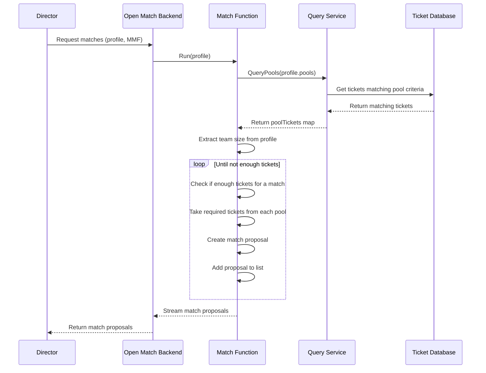

# Match function (MMF)

## Overview

The Match Function (MMF) is a core component of the iR Engine's matchmaking system that implements the logic for grouping players into balanced game sessions. It processes match tickets according to the criteria defined in match profiles, creating match proposals that represent potential game instances. By applying game-specific rules and considering factors like team sizes and player attributes, the MMF ensures that matches are fair, balanced, and aligned with the game's design. This chapter explores the implementation, workflow, and integration of the match function within the matchmaking architecture.

## Core concepts

### Match creation logic

The match function implements the core logic for creating game matches:

- **Ticket grouping**: Combines compatible match tickets into potential game sessions
- **Profile interpretation**: Applies the rules and requirements defined in match profiles
- **Team formation**: Organizes players into balanced teams when applicable
- **Match proposal**: Creates structured representations of potential game sessions
- **Scoring**: Assigns quality scores to match proposals for evaluation

This logic ensures that matches meet the game's requirements for player counts, team balance, and other criteria.

### Query-based filtering

The match function uses query services to filter and retrieve appropriate tickets:

- **Pool queries**: Retrieves tickets that match the criteria defined in profile pools
- **Filtering**: Applies tag, range, and string filters to select compatible tickets
- **Batching**: Processes tickets in groups to create multiple match proposals
- **Efficiency**: Optimizes queries to handle large numbers of concurrent players

This query-based approach allows the match function to efficiently process the available ticket pool.

## Implementation

### Match function service

The match function is implemented as a service that responds to match requests:

```go
// Simplified from: open-match-custom-pods/matchfunction/mmf/matchfunction.go
package mmf

import (
    "log"
    "context"
    
    "open-match.dev/open-match/pkg/matchfunction"
    "open-match.dev/open-match/pkg/pb"
)

// MatchFunctionService implements the gRPC service for creating matches
type MatchFunctionService struct {
    queryServiceClient pb.QueryServiceClient
    matchName          string
}

// Run is the entry point for the match function
func (s *MatchFunctionService) Run(req *pb.RunRequest, stream pb.MatchFunction_RunServer) error {
    // Get the match profile from the request
    profile := req.GetProfile()
    log.Printf("MMF starting for profile: %s", profile.GetName())
    
    // Query for tickets matching the profile's pools
    poolTickets, err := matchfunction.QueryPools(stream.Context(), s.queryServiceClient, profile.GetPools())
    if err != nil {
        log.Printf("Failed to query pools: %v", err)
        return err
    }
    
    // Check if we have any tickets to process
    if len(poolTickets) == 0 {
        log.Printf("No tickets found for profile %s", profile.GetName())
        return nil
    }
    
    // Create match proposals from the available tickets
    proposals, err := makeMatches(profile, poolTickets)
    if err != nil {
        log.Printf("Failed to make matches: %v", err)
        return err
    }
    
    // Send the match proposals back to Open Match
    for _, proposal := range proposals {
        if err := stream.Send(&pb.RunResponse{Proposal: proposal}); err != nil {
            log.Printf("Failed to send proposal: %v", err)
            return err
        }
    }
    
    log.Printf("Sent %d proposals for profile %s", len(proposals), profile.GetName())
    return nil
}
```

This service:
1. Receives a match profile from the request
2. Queries for tickets that match the profile's pools
3. Creates match proposals using the makeMatches function
4. Streams the proposals back to Open Match
5. Handles errors and logs the process for debugging

### Match creation logic

The makeMatches function implements the core logic for creating matches:

```go
// Simplified from: open-match-custom-pods/matchfunction/mmf/matchfunction.go
func makeMatches(p *pb.MatchProfile, poolTickets map[string][]*pb.Ticket) ([]*pb.Match, error) {
    // Default players needed per pool for a match
    var playersNeededPerPool = 1
    
    // Extract team size from profile extensions
    if p.Extensions != nil {
        if profileDataMsg, ok := p.Extensions["profileData"]; ok {
            // Unmarshal the profile data
            profileData := &common.ProfileDataMessage{}
            if err := profileDataMsg.UnmarshalTo(profileData); err == nil {
                // Get the team size from the profile data
                playersNeededPerPool = int(profileData.GetTeamSize())
                log.Printf("Using team size from profile: %d", playersNeededPerPool)
            }
        }
    }
    
    // List to hold match proposals
    var matchesToPropose []*pb.Match
    
    // Keep creating matches until we run out of tickets
    for {
        canMakeThisMatch := true
        currentMatchTickets := []*pb.Ticket{}
        
        // Process each pool in the profile
        for poolName, ticketsInThisPool := range poolTickets {
            // Check if we have enough tickets in this pool
            if len(ticketsInThisPool) < playersNeededPerPool {
                canMakeThisMatch = false
                break
            }
            
            // Take the required number of tickets from this pool
            ticketsToTake := ticketsInThisPool[0:playersNeededPerPool]
            currentMatchTickets = append(currentMatchTickets, ticketsToTake...)
            
            // Remove the taken tickets from the pool
            poolTickets[poolName] = ticketsInThisPool[playersNeededPerPool:]
        }
        
        // If we couldn't get enough tickets for all pools, stop making matches
        if !canMakeThisMatch {
            log.Printf("Not enough tickets to make another full match")
            break
        }
        
        // Create a match proposal with the gathered tickets
        proposal := &pb.Match{
            MatchId:       fmt.Sprintf("profile-%s-time-%d", p.GetName(), time.Now().UnixNano()),
            MatchProfile:  p.GetName(),
            MatchFunction: matchName,
            Tickets:       currentMatchTickets,
        }
        
        // Add the proposal to our list
        matchesToPropose = append(matchesToPropose, proposal)
        log.Printf("Created match proposal with ID: %s", proposal.MatchId)
    }
    
    return matchesToPropose, nil
}
```

This function:
1. Extracts the team size from the profile's extensions
2. Iteratively creates matches until there aren't enough tickets
3. For each match, takes the required number of tickets from each pool
4. Creates a match proposal with a unique ID and the selected tickets
5. Returns all created match proposals

### Team formation

For team-based games, the match function can organize players into teams:

```go
// Example of team formation logic
func createTeams(tickets []*pb.Ticket, teamSize int) map[string][]*pb.Ticket {
    teams := make(map[string][]*pb.Ticket)
    
    // Create two teams (red and blue)
    redTeam := tickets[0:teamSize]
    blueTeam := tickets[teamSize:2*teamSize]
    
    teams["red"] = redTeam
    teams["blue"] = blueTeam
    
    return teams
}

// Store team information in the match proposal
func addTeamsToProposal(proposal *pb.Match, teams map[string][]*pb.Ticket) error {
    // Create a teams message
    teamsMsg := &common.TeamsMessage{
        Teams: make(map[string]*common.TeamMessage),
    }
    
    // Add each team to the message
    for teamName, teamTickets := range teams {
        ticketIds := make([]string, len(teamTickets))
        for i, ticket := range teamTickets {
            ticketIds[i] = ticket.Id
        }
        
        teamsMsg.Teams[teamName] = &common.TeamMessage{
            TicketIds: ticketIds,
        }
    }
    
    // Marshal the teams message
    teamsAny, err := anypb.New(teamsMsg)
    if err != nil {
        return err
    }
    
    // Add the teams message to the proposal extensions
    if proposal.Extensions == nil {
        proposal.Extensions = make(map[string]*anypb.Any)
    }
    proposal.Extensions["teams"] = teamsAny
    
    return nil
}
```

This logic:
- Divides the selected tickets into teams
- Creates a structured representation of the teams
- Stores the team information in the match proposal's extensions
- Enables the game server to assign players to the correct teams

### Match scoring

The match function can assign quality scores to match proposals:

```go
// Example of match scoring logic
func scoreMatch(proposal *pb.Match) float64 {
    // Start with a base score
    score := 100.0
    
    // Calculate average wait time
    var totalWaitTime float64
    for _, ticket := range proposal.Tickets {
        // Get the ticket's creation time
        var enterQueueTime float64
        if ticket.SearchFields != nil && ticket.SearchFields.DoubleArgs != nil {
            if time, ok := ticket.SearchFields.DoubleArgs["time.enterqueue"]; ok {
                enterQueueTime = time
            }
        }
        
        // Calculate wait time
        if enterQueueTime > 0 {
            waitTime := float64(time.Now().UnixNano()) - enterQueueTime
            totalWaitTime += waitTime
        }
    }
    
    // Adjust score based on average wait time
    if len(proposal.Tickets) > 0 {
        averageWaitTime := totalWaitTime / float64(len(proposal.Tickets))
        
        // Increase score for matches with longer wait times
        waitTimeBonus := math.Min(50.0, averageWaitTime / 1000000000.0 * 10.0) // 10 points per second of wait, up to 50
        score += waitTimeBonus
    }
    
    return score
}
```

This logic:
- Starts with a base score for the match
- Calculates the average wait time for players in the match
- Adjusts the score based on factors like wait time
- Helps prioritize matches with players who have been waiting longer

## Match function workflow

The complete match function workflow follows this sequence:



This diagram illustrates:
1. The director requests matches from the Open Match backend
2. The backend calls the match function with the specified profile
3. The match function queries for tickets matching the profile's pools
4. The match function extracts parameters like team size from the profile
5. The match function iteratively creates match proposals
6. The match function streams the proposals back to the backend
7. The backend returns the proposals to the director

## Integration with other components

The match function integrates with several other components of the matchmaking system:

### Match profile

The match function interprets and applies match profiles:

```go
// Example of profile integration
func extractProfileParameters(profile *pb.MatchProfile) (string, int, error) {
    // Default values
    mode := "default"
    teamSize := 1
    
    // Extract custom data from profile extensions
    if profile.Extensions != nil {
        if profileDataMsg, ok := profile.Extensions["profileData"]; ok {
            // Unmarshal the profile data
            profileData := &common.ProfileDataMessage{}
            if err := profileDataMsg.UnmarshalTo(profileData); err != nil {
                return mode, teamSize, err
            }
            
            // Get parameters from the profile data
            mode = profileData.GetMode()
            teamSize = int(profileData.GetTeamSize())
        }
    }
    
    return mode, teamSize, nil
}
```

This integration:
- Extracts game-specific parameters from the profile
- Applies these parameters to the match creation logic
- Ensures matches conform to the requirements defined in the profile
- Provides flexibility for different game modes and configurations

### Query service

The match function uses the query service to retrieve tickets:

```go
// Example of query service integration
func queryTickets(ctx context.Context, queryClient pb.QueryServiceClient, pools []*pb.Pool) (map[string][]*pb.Ticket, error) {
    // Use the Open Match helper function to query pools
    poolTickets, err := matchfunction.QueryPools(ctx, queryClient, pools)
    if err != nil {
        return nil, err
    }
    
    // Additional processing if needed
    for poolName, tickets := range poolTickets {
        // Sort tickets by wait time
        sort.Slice(tickets, func(i, j int) bool {
            timeI := getEnterQueueTime(tickets[i])
            timeJ := getEnterQueueTime(tickets[j])
            return timeI < timeJ // Earlier time (longer wait) comes first
        })
    }
    
    return poolTickets, nil
}

// Helper function to get the enter queue time from a ticket
func getEnterQueueTime(ticket *pb.Ticket) float64 {
    if ticket.SearchFields != nil && ticket.SearchFields.DoubleArgs != nil {
        if time, ok := ticket.SearchFields.DoubleArgs["time.enterqueue"]; ok {
            return time
        }
    }
    return 0
}
```

This integration:
- Uses the Open Match query service to retrieve tickets
- Applies additional processing like sorting by wait time
- Organizes tickets by pool for efficient match creation
- Handles large numbers of tickets efficiently

### Director

The match function responds to requests from the director:

```go
// Example of director integration in server.go
func Start(queryServiceAddr string, port int) {
    // Create a connection to the query service
    conn, err := grpc.Dial(queryServiceAddr, grpc.WithInsecure())
    if err != nil {
        log.Fatalf("Failed to connect to query service: %v", err)
    }
    defer conn.Close()
    
    // Create the match function service
    mmfService := &MatchFunctionService{
        queryServiceClient: pb.NewQueryServiceClient(conn),
        matchName:          "mode-based-mmf",
    }
    
    // Create a gRPC server
    server := grpc.NewServer()
    pb.RegisterMatchFunctionServer(server, mmfService)
    
    // Start the server
    lis, err := net.Listen("tcp", fmt.Sprintf(":%d", port))
    if err != nil {
        log.Fatalf("Failed to listen: %v", err)
    }
    
    log.Printf("Starting Match Function server on port %d", port)
    if err := server.Serve(lis); err != nil {
        log.Fatalf("Failed to serve: %v", err)
    }
}
```

This integration:
- Creates a gRPC server that the director can call
- Registers the match function service with Open Match
- Listens for match requests from the director
- Provides a standardized interface for match creation

## Benefits of the match function

The Match Function (MMF) provides several key advantages:

1. **Customization**: Enables game-specific matching logic tailored to the game's needs
2. **Flexibility**: Supports various game modes with different team structures
3. **Scalability**: Processes large numbers of tickets efficiently
4. **Fairness**: Creates balanced matches based on defined criteria
5. **Prioritization**: Can incorporate wait time and other factors into match quality
6. **Separation of concerns**: Isolates matching logic from other system components
7. **Extensibility**: Allows for additional matching criteria as the game evolves

These benefits make the match function an essential component for creating fair and enjoyable game experiences.

## Next steps

With an understanding of how the match function creates potential game sessions, the next chapter explores how the director orchestrates the overall matchmaking process.

Next: [Director](05_director_.md)

---


