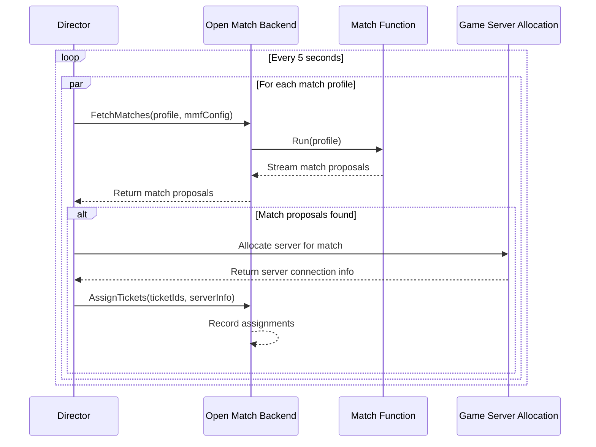

# Director

## Overview

The Director is the orchestration component of the iR Engine's matchmaking system that coordinates the entire matchmaking process. It manages the flow of match requests, initiates the creation of match proposals, and finalizes matches by assigning players to game servers. By continuously monitoring the system and making decisions about when and how to create matches, the Director ensures that players are efficiently grouped into appropriate game sessions. This chapter explores the implementation, workflow, and responsibilities of the Director within the matchmaking architecture.

## Core concepts

### Orchestration

The Director orchestrates the matchmaking process:

- **Coordination**: Manages the interaction between different matchmaking components
- **Scheduling**: Determines when to initiate match creation for different game modes
- **Decision-making**: Evaluates match proposals and decides which to fulfill
- **Assignment**: Finalizes matches by assigning players to game servers
- **Monitoring**: Tracks the state of the matchmaking system and adjusts as needed

This orchestration ensures that the matchmaking process runs smoothly and efficiently.

### Continuous operation

The Director operates in a continuous cycle:

- **Periodic execution**: Runs at regular intervals to check for potential matches
- **Profile iteration**: Processes each match profile in each cycle
- **Concurrent handling**: Manages multiple game modes simultaneously
- **Stateless operation**: Maintains minimal state between cycles
- **Fault tolerance**: Handles errors and continues operation

This continuous operation ensures that players are matched into games as quickly as possible.

## Implementation

### Main loop

The Director's main function implements a continuous processing loop:

```go
// Simplified from: open-match-custom-pods/director/main.go
func main() {
    // Initialize connections to Open Match Backend
    conn, err := grpc.Dial(fmt.Sprintf("%s:%d", envConfig.BackendHostName, envConfig.BackendPort), grpc.WithInsecure())
    if err != nil {
        log.Fatalf("Failed to connect to Open Match Backend: %v", err)
    }
    defer conn.Close()
    
    // Create a client for the Backend service
    be := pb.NewBackendServiceClient(conn)
    
    // Generate match profiles for all supported game modes
    profiles := generateProfiles(envConfig.GameTypes, envConfig.GameTypesSizes)
    log.Printf("Generated %d match profiles", len(profiles))
    
    // Main processing loop - runs every 5 seconds
    for range time.Tick(time.Second * 5) {
        var wg sync.WaitGroup
        
        // Process each profile concurrently
        for _, p := range profiles {
            wg.Add(1)
            go func(wg *sync.WaitGroup, profile *pb.MatchProfile) {
                defer wg.Done()
                
                // Step 1: Fetch match proposals for this profile
                matches, err := fetch(be, profile, envConfig.FunctionHostName, envConfig.FunctionPort)
                if err != nil {
                    log.Printf("Failed to fetch matches for profile %s: %v", profile.GetName(), err)
                    return
                }
                
                // Step 2: Assign matches to game servers if any were found
                if len(matches) > 0 {
                    log.Printf("Got %d match proposals for profile %s", len(matches), profile.GetName())
                    if err := assign(be, profile, matches); err != nil {
                        log.Printf("Failed to assign matches for profile %s: %v", profile.GetName(), err)
                    }
                }
            }(&wg, p)
        }
        
        // Wait for all profile processing to complete before next cycle
        wg.Wait()
    }
}
```

This implementation:
1. Connects to the Open Match Backend service
2. Generates match profiles for all supported game modes
3. Runs a loop that executes every 5 seconds
4. Processes each profile concurrently in each cycle
5. Fetches match proposals for each profile
6. Assigns matches to game servers when proposals are found
7. Waits for all profile processing to complete before the next cycle

### Fetching match proposals

The fetch function requests match proposals from the match function:

```go
// Simplified from: open-match-custom-pods/director/main.go
func fetch(be pb.BackendServiceClient, p *pb.MatchProfile, functionHostName string, functionPort int32) ([]*pb.Match, error) {
    // Prepare the request to fetch matches
    req := &pb.FetchMatchesRequest{
        // Specify the match function configuration
        Config: &pb.FunctionConfig{
            Host: functionHostName,
            Port: functionPort,
            Type: pb.FunctionConfig_GRPC,
        },
        // Provide the match profile to use
        Profile: p,
    }
    
    // Request match proposals from Open Match Backend
    stream, err := be.FetchMatches(context.Background(), req)
    if err != nil {
        return nil, fmt.Errorf("failed to fetch matches: %v", err)
    }
    
    // Collect all match proposals from the stream
    var proposals []*pb.Match
    for {
        resp, err := stream.Recv()
        if err == io.EOF {
            break
        }
        if err != nil {
            return nil, fmt.Errorf("failed to receive match: %v", err)
        }
        
        proposals = append(proposals, resp.GetMatch())
    }
    
    return proposals, nil
}
```

This function:
1. Prepares a request with the match function configuration and profile
2. Sends the request to the Open Match Backend
3. Receives a stream of match proposals in response
4. Collects all proposals from the stream
5. Returns the collected proposals for further processing

### Assigning matches

The assign function finalizes matches by assigning players to game servers:

```go
// Simplified from: open-match-custom-pods/director/main.go
func assign(be pb.BackendServiceClient, p *pb.MatchProfile, matches []*pb.Match) error {
    // Process each match proposal
    for _, match := range matches {
        // Extract ticket IDs from the match
        ticketIDs := []string{}
        for _, ticket := range match.GetTickets() {
            ticketIDs = append(ticketIDs, ticket.Id)
        }
        
        // In a production system, this would come from a game server allocation service
        // For this example, we generate a unique server address
        serverConnectionInfo := "gameserver_" + uuid.New().String() + ":7777"
        log.Printf("Assigning tickets %v to server: %s", ticketIDs, serverConnectionInfo)
        
        // Prepare the assignment request
        req := &pb.AssignTicketsRequest{
            Assignments: []*pb.AssignmentGroup{{
                TicketIds: ticketIDs,
                Assignment: &pb.Assignment{
                    // Connection information for the game server
                    Connection: serverConnectionInfo,
                    // Additional assignment details could be added here
                },
            }},
        }
        
        // Send the assignment request to Open Match Backend
        if _, err := be.AssignTickets(context.Background(), req); err != nil {
            return fmt.Errorf("failed to assign tickets: %v", err)
        }
    }
    
    return nil
}
```

This function:
1. Processes each match proposal individually
2. Extracts the ticket IDs from the match
3. Determines the game server connection information
4. Prepares an assignment request with the tickets and server information
5. Sends the assignment request to the Open Match Backend
6. Handles any errors that occur during assignment

## Director workflow

The complete Director workflow follows this sequence:



This diagram illustrates:
1. The Director runs a cycle every 5 seconds
2. For each match profile, it requests match proposals
3. The Backend forwards the request to the Match Function
4. The Match Function returns proposals to the Backend
5. The Backend forwards the proposals to the Director
6. If proposals are found, the Director allocates a game server
7. The Director assigns the tickets to the allocated server
8. The Backend records the assignments for players to retrieve

## Game server allocation

In a production environment, the Director would interact with a game server allocation service:

```go
// Example of game server allocation integration
func allocateGameServer(match *pb.Match) (string, error) {
    // Extract relevant information from the match
    profileData := &common.ProfileDataMessage{}
    if ext, ok := match.MatchProfile.Extensions["profileData"]; ok {
        ext.UnmarshalTo(profileData)
    }
    
    // Determine game mode and player count
    gameMode := profileData.Mode
    playerCount := len(match.Tickets)
    
    // Request a game server from the allocation service
    serverRequest := &allocation.ServerRequest{
        GameMode: gameMode,
        Players: playerCount,
        Region: "us-west", // Could be determined dynamically
    }
    
    // Call the allocation service
    serverResponse, err := allocationClient.AllocateServer(context.Background(), serverRequest)
    if err != nil {
        return "", fmt.Errorf("failed to allocate server: %v", err)
    }
    
    // Return the connection information
    return serverResponse.ConnectionString, nil
}
```

This integration:
- Extracts game-specific information from the match
- Determines the requirements for the game server
- Requests a server from an allocation service
- Returns the connection information for the assigned server

## Integration with other components

The Director integrates with several other components of the matchmaking system:

### Match profile

The Director uses match profiles to guide the matchmaking process:

```go
// Example of profile integration
func generateProfiles(modes []string, teamSizes map[string]uint32) []*pb.MatchProfile {
    var profiles []*pb.MatchProfile
    
    // Create a profile for each game mode
    for _, mode := range modes {
        // Create profile data with mode and team size
        profileData := &common.ProfileDataMessage{
            Mode:     mode,
            TeamSize: teamSizes[mode],
        }
        
        // Marshal the profile data
        marshalledProfileData, err := anypb.New(profileData)
        if err != nil {
            log.Printf("Failed to marshal profile data for mode %s: %v", mode, err)
            continue
        }
        
        // Create the match profile
        profile := &pb.MatchProfile{
            Name: "mode_based_profile_" + mode,
            Pools: []*pb.Pool{{
                Name: "pool_mode_" + mode,
                TagPresentFilters: []*pb.TagPresentFilter{
                    {Tag: mode},
                },
            }},
            Extensions: map[string]*anypb.Any{
                "profileData": marshalledProfileData,
            },
        }
        
        profiles = append(profiles, profile)
    }
    
    return profiles
}
```

This integration:
- Creates profiles for each supported game mode
- Configures the profiles with appropriate parameters
- Uses the profiles to guide the match function
- Ensures matches are created according to game requirements

### Match function

The Director interacts with the match function through the Open Match Backend:

```go
// Example of match function integration
func configureFetchRequest(profile *pb.MatchProfile, mmfHost string, mmfPort int32) *pb.FetchMatchesRequest {
    return &pb.FetchMatchesRequest{
        Config: &pb.FunctionConfig{
            Host: mmfHost,
            Port: mmfPort,
            Type: pb.FunctionConfig_GRPC,
        },
        Profile: profile,
    }
}
```

This integration:
- Specifies the match function to use for each profile
- Provides the profile to the match function
- Receives match proposals from the match function
- Processes the proposals to create actual matches

### Match assignment

The Director creates match assignments for players:

```go
// Example of assignment integration
func createAssignment(ticketIds []string, serverInfo string) *pb.AssignTicketsRequest {
    return &pb.AssignTicketsRequest{
        Assignments: []*pb.AssignmentGroup{{
            TicketIds: ticketIds,
            Assignment: &pb.Assignment{
                Connection: serverInfo,
                // Additional assignment details
                Extensions: map[string]*anypb.Any{
                    // Game-specific information
                },
            },
        }},
    }
}
```

This integration:
- Creates assignments with server connection information
- Associates assignments with specific tickets
- Provides additional game-specific information
- Enables players to retrieve their assignments

## Benefits of the director

The Director provides several key advantages:

1. **Centralized control**: Provides a single point of coordination for the matchmaking process
2. **Continuous operation**: Ensures matches are created as soon as possible
3. **Concurrent processing**: Handles multiple game modes efficiently
4. **Flexible scheduling**: Adapts to different game modes and player populations
5. **Server allocation**: Manages the assignment of players to game servers
6. **Error handling**: Provides resilience against component failures
7. **Monitoring**: Enables visibility into the matchmaking process

These benefits make the Director an essential component for creating a robust and efficient matchmaking system.

## Next steps

With an understanding of how the Director orchestrates the matchmaking process, the next chapter explores how players receive their match assignments and connect to game servers.

Next: [Match assignment](06_match_assignment_.md)

---


