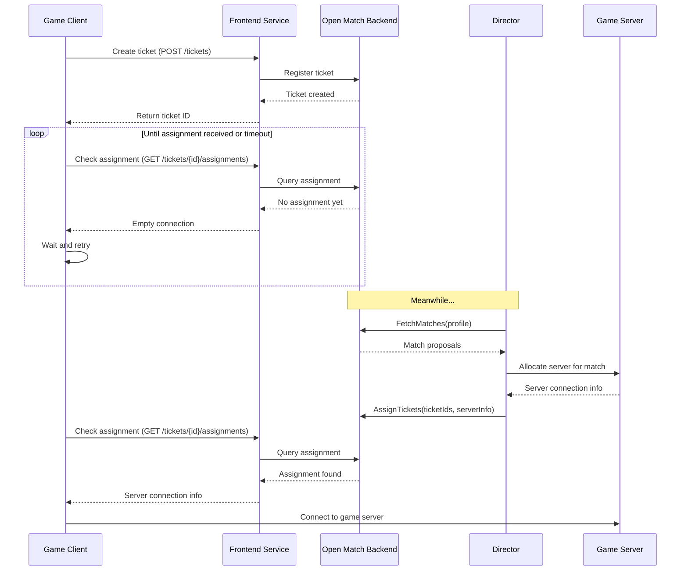

# Match assignment

## Overview

The Match Assignment is the final output of the iR Engine's matchmaking system that provides players with the information needed to join their game session. It contains the connection details for the assigned game server and any additional game-specific information required by the client. 

By delivering this crucial information to players, match assignments complete the matchmaking process, enabling players to transition from searching for a game to actively participating in one. This chapter explores the structure, delivery, and usage of match assignments within the matchmaking architecture.

## Core concepts

### Connection information

The primary purpose of a match assignment is to provide connection information:

- **Server address**: The IP address or hostname of the game server
- **Port number**: The network port for connecting to the server
- **Connection string**: Often formatted as "address:port" (e.g., "192.168.1.100:7777")
- **Protocol details**: Sometimes includes information about the connection protocol
- **Authentication tokens**: May include tokens for secure server access

This connection information enables the game client to establish a network connection to the assigned game server.

### Assignment delivery

Match assignments are delivered to players through a defined process:

- **Polling**: Clients periodically check for assignments using their ticket ID
- **Response handling**: Clients process the assignment when received
- **Connection initiation**: Clients use the assignment to connect to the game server
- **Timeout handling**: Clients manage cases where assignments are delayed or never arrive
- **Error recovery**: Clients handle connection failures and retry mechanisms

This delivery process ensures that players receive their assignments and can join their games.

## Implementation

### Assignment structure

The match assignment is defined with a specific schema:

```typescript
// From: src/match-ticket-assignment.schema.ts
import { Type } from '@sinclair/typebox';

export const matchTicketAssignmentSchema = Type.Object(
  {
    // The game server connection information
    connection: Type.String(),
    
    // Optional additional information
    extensions: Type.Optional(
      Type.Record(
        Type.String(), // Extension key
        Type.Object({  // Extension value
          typeUrl: Type.String(), // Type information
          value: Type.String()    // Encoded value
        })
      )
    )
  },
  { additionalProperties: false }
);

// Type definition for TypeScript
export type MatchTicketAssignmentType = {
  connection: string;
  extensions?: Record<string, {
    typeUrl: string;
    value: string;
  }>;
};
```

This structure:
- Defines the `connection` field for server address information
- Provides an `extensions` field for additional game-specific data
- Uses TypeScript types for type safety in the client code
- Restricts additional properties for consistent data handling

### Retrieving assignments

Clients retrieve match assignments by polling the frontend service:

```typescript
// From: src/functions.ts
import { MatchTicketAssignmentType } from './match-ticket-assignment.schema';

/**
 * Gets the assignment for a specific ticket
 * @param ticketId The ID of the ticket to check
 * @returns A promise resolving to the ticket assignment (if any)
 */
async function getTicketsAssignment(ticketId: string): Promise<MatchTicketAssignmentType> {
  console.log(`Checking assignment for ticket: ${ticketId}`);
  
  try {
    // Create an AbortController for timeout handling
    const controller = new AbortController();
    const timeoutId = setTimeout(() => controller.abort(), 10000); // 10 second timeout
    
    // Send GET request to check for assignment
    const response = await fetch(
      `${FRONTEND_SERVICE_URL}/tickets/${ticketId}/assignments`, 
      { signal: controller.signal }
    );
    
    // Clear the timeout
    clearTimeout(timeoutId);
    
    // Check for errors
    if (!response.ok) {
      throw new Error(`HTTP error: ${response.status}`);
    }
    
    // Parse the response
    const data = await readStreamFirstData(response.body);
    return data as MatchTicketAssignmentType;
  } catch (error) {
    if (error.name === 'AbortError') {
      console.error('Request timed out');
      return { connection: '' } as MatchTicketAssignmentType;
    }
    
    console.error('Failed to get ticket assignment:', error);
    throw new Error('Failed to get ticket assignment');
  }
}

/**
 * Helper function to read the first chunk of data from a stream
 */
async function readStreamFirstData(stream) {
  const reader = stream.getReader();
  const { value, done } = await reader.read();
  reader.releaseLock();
  
  if (done) {
    return null;
  }
  
  // Parse the JSON data
  const text = new TextDecoder().decode(value);
  return JSON.parse(text);
}
```

This function:
1. Takes a ticket ID parameter that identifies the player's match request
2. Sends an HTTP GET request to the frontend service's assignments endpoint
3. Includes timeout handling to prevent indefinite waiting
4. Parses the response to extract assignment information
5. Returns an assignment object that may contain connection details if a match was found

### Polling for assignments

Since matchmaking takes time, clients typically poll for assignments:

```typescript
// Example of assignment polling in a game client
async function waitForGameAssignment(ticketId: string, maxAttempts: number = 30): Promise<string> {
  console.log(`Waiting for game assignment for ticket: ${ticketId}`);
  
  // Initial check
  let assignment = await getTicketsAssignment(ticketId);
  let attempts = 0;
  
  // Keep checking until we get an assignment or reach max attempts
  while (assignment.connection === '' && attempts < maxAttempts) {
    console.log(`No assignment yet, waiting (attempt ${attempts + 1}/${maxAttempts})...`);
    
    // Wait before trying again
    await new Promise(resolve => setTimeout(resolve, 5000)); // 5 second delay
    
    // Check again
    assignment = await getTicketsAssignment(ticketId);
    attempts++;
  }
  
  // Check if we got an assignment
  if (assignment.connection !== '') {
    console.log(`Game assignment received: ${assignment.connection}`);
    return assignment.connection;
  } else {
    console.log('Failed to get game assignment within the time limit');
    throw new Error('Matchmaking timeout');
  }
}
```

This function:
1. Takes a ticket ID and an optional maximum number of attempts
2. Checks for an assignment initially
3. If no assignment is found, waits and checks again periodically
4. Continues until an assignment is received or the maximum attempts are reached
5. Returns the connection string when an assignment is found
6. Throws an error if no assignment is received within the time limit

## Assignment creation

The Director creates match assignments when finalizing matches:

```go
// Simplified from: open-match-custom-pods/director/main.go
func assign(be pb.BackendServiceClient, p *pb.MatchProfile, matches []*pb.Match) error {
    for _, match := range matches {
        // Extract ticket IDs from the match
        ticketIDs := []string{}
        for _, ticket := range match.GetTickets() {
            ticketIDs = append(ticketIDs, ticket.Id)
        }
        
        // Get game mode from profile extensions
        gameMode := ""
        if p.Extensions != nil {
            if profileDataMsg, ok := p.Extensions["profileData"]; ok {
                profileData := &common.ProfileDataMessage{}
                if err := profileDataMsg.UnmarshalTo(profileData); err == nil {
                    gameMode = profileData.GetMode()
                }
            }
        }
        
        // Get server connection information
        // In a real system, this would come from a game server allocation service
        serverConnectionInfo := "gameserver_" + uuid.New().String() + ":7777"
        
        // Create game mode extension
        gameModeValue := &wrappers.StringValue{Value: gameMode}
        gameModeAny, err := anypb.New(gameModeValue)
        if err != nil {
            return fmt.Errorf("failed to marshal game mode: %v", err)
        }
        
        // Create the assignment
        assignment := &pb.Assignment{
            // Connection information for the game server
            Connection: serverConnectionInfo,
            
            // Additional game-specific information
            Extensions: map[string]*anypb.Any{
                "gameMode": gameModeAny,
            },
        }
        
        // Create the assignment request
        req := &pb.AssignTicketsRequest{
            Assignments: []*pb.AssignmentGroup{{
                TicketIds: ticketIDs,
                Assignment: assignment,
            }},
        }
        
        // Send the assignment request to Open Match Backend
        if _, err := be.AssignTickets(context.Background(), req); err != nil {
            return fmt.Errorf("failed to assign tickets: %v", err)
        }
        
        log.Printf("Assigned tickets %v to server: %s", ticketIDs, serverConnectionInfo)
    }
    
    return nil
}
```

This function:
1. Processes each match proposal individually
2. Extracts the ticket IDs from the match
3. Retrieves the game mode from the profile extensions
4. Determines the game server connection information
5. Creates an assignment with the connection information and game mode
6. Sends the assignment to the Open Match Backend
7. Logs the assignment for monitoring and debugging

## Assignment workflow

The complete assignment workflow follows this sequence:



This diagram illustrates:
1. The client creates a ticket and receives a ticket ID
2. The client periodically checks for an assignment
3. Initially, no assignment is available
4. The Director processes match proposals and assigns tickets to a server
5. The client checks again and receives the assignment
6. The client uses the connection information to join the game server

## Using assignments in game clients

Game clients use assignments to connect to game servers:

```typescript
// Example of using assignments in a game client
async function joinGame() {
  try {
    // Step 1: Create a match ticket
    console.log("Finding a game...");
    const ticket = await createTicket("CaptureTheFlag");
    console.log(`Ticket created with ID: ${ticket.id}`);
    
    // Step 2: Wait for an assignment
    console.log("Waiting for game assignment...");
    const serverAddress = await waitForGameAssignment(ticket.id);
    
    // Step 3: Connect to the game server
    console.log(`Connecting to game server: ${serverAddress}`);
    
    // Parse the connection string
    const [host, portStr] = serverAddress.split(':');
    const port = parseInt(portStr, 10);
    
    // Connect to the server (implementation depends on the game)
    const connection = await connectToGameServer(host, port);
    
    console.log("Connected to game server successfully!");
    return connection;
  } catch (error) {
    console.error("Failed to join game:", error);
    throw error;
  }
}

// Example game server connection function
async function connectToGameServer(host: string, port: number) {
  // Implementation depends on the game's networking library
  // This is just a placeholder example
  return new Promise((resolve, reject) => {
    try {
      const connection = new GameConnection();
      connection.connect(host, port, {
        onConnect: () => resolve(connection),
        onError: (err) => reject(err)
      });
    } catch (error) {
      reject(error);
    }
  });
}
```

This implementation:
1. Creates a match ticket for the desired game mode
2. Waits for an assignment by polling the frontend service
3. Parses the connection string to extract the host and port
4. Establishes a connection to the game server
5. Handles errors that might occur during the process

## Integration with other components

The match assignment integrates with several other components of the matchmaking system:

### Frontend service

The frontend service delivers assignments to clients:

```typescript
// Example of frontend service integration
import express from 'express';
import { OpenMatchClient } from './open-match-client';

const app = express();
const openMatch = new OpenMatchClient();

// Endpoint to get assignments for a ticket
app.get('/tickets/:ticketId/assignments', async (req, res) => {
  try {
    const { ticketId } = req.params;
    
    // Get the assignment from Open Match
    const assignment = await openMatch.getAssignment(ticketId);
    
    // If no assignment is found, return an empty connection
    if (!assignment) {
      return res.json({ connection: '' });
    }
    
    // Return the assignment
    return res.json({
      connection: assignment.connection,
      extensions: assignment.extensions
    });
  } catch (error) {
    console.error(`Error getting assignment for ticket ${req.params.ticketId}:`, error);
    return res.status(500).json({ error: 'Failed to get assignment' });
  }
});
```

This integration:
- Provides an endpoint for clients to check for assignments
- Retrieves assignments from Open Match
- Returns assignments in a standardized format
- Handles error cases appropriately

### Director

The Director creates assignments when finalizing matches:

```go
// Example of Director integration
import (
    "github.com/google/uuid"
    "open-match.dev/open-match/pkg/pb"
)

// Function to create an assignment
func createAssignment(serverInfo string, gameMode string) (*pb.Assignment, error) {
    // Create game mode extension
    gameModeValue := &wrappers.StringValue{Value: gameMode}
    gameModeAny, err := anypb.New(gameModeValue)
    if err != nil {
        return nil, err
    }
    
    // Create the assignment
    assignment := &pb.Assignment{
        Connection: serverInfo,
        Extensions: map[string]*anypb.Any{
            "gameMode": gameModeAny,
        },
    }
    
    return assignment, nil
}
```

This integration:
- Creates assignments with server connection information
- Includes game-specific information in extensions
- Formats assignments according to the Open Match protocol
- Provides a consistent structure for assignments

### Game server allocation

In a production environment, the Director would integrate with a game server allocation service:

```go
// Example of game server allocation integration
import (
    "context"
    "github.com/example/gameserver-allocator/client"
)

// Function to allocate a game server
func allocateGameServer(gameMode string, playerCount int) (string, error) {
    // Create allocation client
    allocator := client.NewAllocatorClient()
    
    // Request a game server
    allocation, err := allocator.AllocateServer(context.Background(), &client.AllocationRequest{
        GameMode: gameMode,
        PlayerCount: playerCount,
    })
    if err != nil {
        return "", err
    }
    
    // Return the connection string
    return allocation.ConnectionString, nil
}
```

This integration:
- Requests a game server from an allocation service
- Provides game-specific requirements for the server
- Receives connection information for the allocated server
- Includes the connection information in the assignment

## Benefits of match assignments

The Match Assignment system provides several key advantages:

1. **Connection facilitation**: Provides the essential information for clients to join game servers
2. **Decoupling**: Separates matchmaking from game server management
3. **Extensibility**: Supports additional game-specific information through extensions
4. **Standardization**: Creates a consistent format for server connection information
5. **Asynchronous operation**: Allows matchmaking to proceed independently of client polling
6. **Scalability**: Supports large numbers of concurrent matchmaking requests
7. **Flexibility**: Accommodates various game server deployment models

These benefits make match assignments an essential component for completing the matchmaking process and connecting players to their games.

## Conclusion

The Match Assignment represents the successful culmination of the matchmaking process. It provides players with the essential connection information needed to join their assigned game server, completing the journey from requesting a match to actively participating in a game session.

Throughout this documentation, we've explored the complete matchmaking system:

1. The Frontend Service Interaction that handles player requests
2. The Match Ticket that represents a player's desire to join a game
3. The Match Profile that defines the requirements for valid matches
4. The Match Function that groups players into potential matches
5. The Director that orchestrates the matchmaking process
6. The Match Assignment that connects players to game servers

Together, these components form a comprehensive matchmaking system that efficiently connects players for multiplayer gaming experiences.

---


