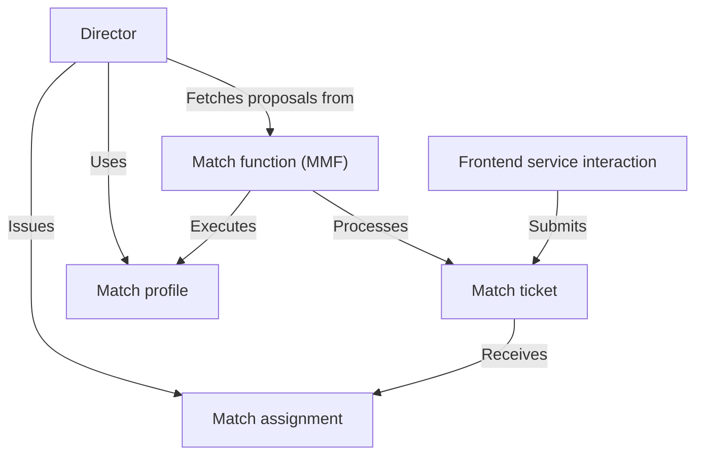

# Matchmaking system

The matchmaking system is designed to connect players for online games within the iR Engine. It processes player requests, called match tickets, which specify what kind of game a player wants to join. The system uses configurable rules, known as match profiles, to define the criteria for a valid game session (e.g., game mode, team size). A core component, the match function (MMF), processes available tickets against these profiles to propose groups of players for matches. The director orchestrates this entire flow: it uses match profiles to get proposals from the MMF, and then finalizes these by creating a match assignment (like a server address) for the successful tickets. Players interact with this system, submitting tickets and checking for their assignments, through a frontend service interaction layer.

## Architecture overview

The matchmaking system consists of several interconnected components that work together to create balanced and appropriate game sessions:

## Documentation chapters

1. [Frontend service interaction](01_frontend_service_interaction_.md)
2. [Match ticket](02_match_ticket_.md)
3. [Match profile](03_match_profile_.md)
4. [Match function (MMF)](04_match_function__mmf__.md)
5. [Director](05_director_.md)
6. [Match assignment](06_match_assignment_.md)

---

