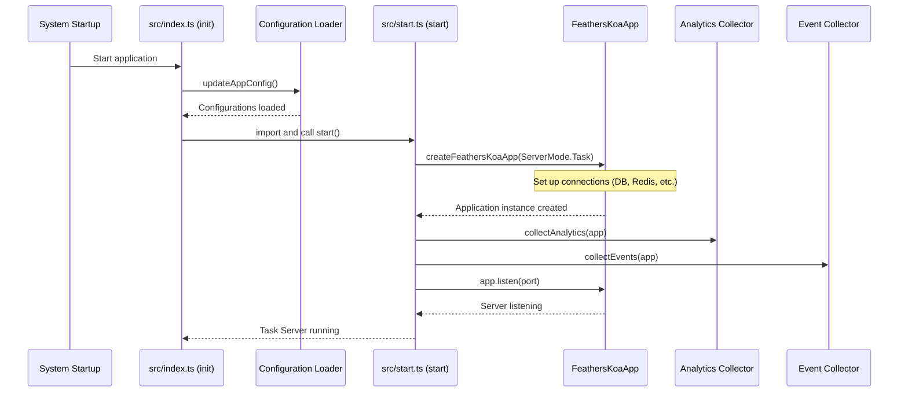

# Task server application

## Overview

The Task Server Application is the central coordinator of the iR Engine's background processing system. It serves as the foundation for managing and executing various automated tasks that run behind the scenes. These tasks include collecting analytics data, monitoring system events, performing scheduled maintenance, and other operations that don't require direct user interaction. 

By centralizing the initialization and management of background tasks, the Task Server ensures reliable execution of critical background operations.

## Purpose and functionality

Background tasks are essential for many aspects of a production application:

- Collecting and analyzing usage data
- Monitoring system health and performance
- Performing scheduled maintenance operations
- Processing queued operations asynchronously
- Generating reports and notifications

The Task Server Application provides the infrastructure to handle these operations by:

1. **Initialization**: Setting up necessary connections to databases, message queues, and other services
2. **Configuration**: Loading and managing application settings
3. **Task management**: Launching and coordinating background tasks
4. **Resource provision**: Providing tasks with access to shared resources and services
5. **Monitoring**: Ensuring tasks are running properly and handling errors

## Implementation

### Entry point: src/index.ts

The application starts with the `index.ts` file, which serves as the entry point:

```typescript
// src/index.ts

// Import the configuration loader
import { updateAppConfig } from '@ir-engine/server-core/src/updateAppConfig';

// Main initialization function
const init = async () => {
  // Load application configurations
  await updateAppConfig();

  // Dynamically import the start function
  const { start } = await import('./start');

  // Start the Task Server
  start();
};

// Execute the initialization
init();
```

This file:
1. Imports the configuration management function
2. Defines an asynchronous initialization function
3. Loads application configurations
4. Imports and calls the main `start` function
5. Executes the initialization process

### Main application: src/start.ts

The `start.ts` file contains the core logic for setting up and starting the Task Server:

```typescript
// src/start.ts
import { Application } from '@ir-engine/server-core/declarations';
import { ServerMode } from '@ir-engine/server-core/src/ServerState';
import { createFeathersKoaApp } from '@ir-engine/server-core/src/createApp';
import multiLogger from '@ir-engine/server-core/src/ServerLogger';

// Import task modules
import collectAnalytics from './collect-analytics';
import collectEvents from './collect-events';

const logger = multiLogger.child({ component: 'taskserver' });

// Main function to start the Task Server
export const start = async (): Promise<Application> => {
  // Create the application instance with Task server mode
  const app = await createFeathersKoaApp(ServerMode.Task);

  // Initialize and start background tasks
  collectAnalytics(app);
  collectEvents(app);

  logger.info('Task server running.');

  // Start a small HTTP server for health checks
  const port = 5050;
  await app.listen(port);
  logger.info('Task server listening on port ' + port);

  return app;
};
```

This function:
1. Creates the application instance using `createFeathersKoaApp` with `ServerMode.Task`
2. Initializes the analytics collection task
3. Initializes the event collection task
4. Starts a small HTTP server for health checks and monitoring
5. Returns the configured application instance

### Key components

The Task Server relies on several important components:

#### createFeathersKoaApp

This function from the server-core package creates the application instance:

```typescript
// Simplified concept
const app = await createFeathersKoaApp(ServerMode.Task);
```

This function:
- Creates a FeathersJS application (a framework for real-time applications)
- Configures it with Koa (a web framework)
- Sets up connections to databases, Redis, and other services
- Initializes authentication and authorization
- Configures logging and error handling
- Returns the fully configured application instance

#### Task modules

The Task Server initializes specific task modules:

```typescript
// Initialize analytics collection
collectAnalytics(app);

// Initialize event collection
collectEvents(app);
```

Each task module is a function that:
- Takes the application instance as a parameter
- Sets up its specific functionality
- May configure periodic execution
- Handles its own error cases
- Uses the application's services and connections

## Initialization flow

The complete initialization sequence follows these steps:



This diagram illustrates:
1. The system starts the application
2. Configuration is loaded
3. The main start function is called
4. The application instance is created with necessary connections
5. Task modules are initialized
6. A small HTTP server is started for monitoring
7. The Task Server is now running and executing background tasks

## Integration with other components

The Task Server integrates with several other components of the background processing system:

### Application configuration management

The Task Server uses the configuration management system to load settings:

```typescript
await updateAppConfig();
```

This loads configuration from various sources (environment variables, configuration files, etc.) and makes them available to the application. More details are covered in [Application configuration management](02_application_configuration_management_.md).

### Analytics data collector

The Task Server initializes the analytics collection task:

```typescript
collectAnalytics(app);
```

This task periodically collects and processes analytics data about system usage. More details are covered in [Analytics data collector](03_analytics_data_collector_.md).

### Kubernetes event collector

The Task Server initializes the event collection task:

```typescript
collectEvents(app);
```

This task monitors and processes events from the Kubernetes cluster. More details are covered in [Kubernetes event collector](06_kubernetes_event_collector_.md).

### Service interaction layer

The Task Server provides tasks with access to services through the application instance:

```typescript
// Example of how a task might use services
const analyticsService = app.service('analytics');
const results = await analyticsService.find({ query: { processed: false } });
```

This allows tasks to interact with databases, message queues, and other services. More details are covered in [Service interaction layer](05_service_interaction_layer_.md).

## Deployment considerations

The Task Server is designed to be deployed in a Kubernetes environment:

- It's packaged as a Docker container
- It can be deployed as a Kubernetes Deployment
- It's typically configured with a single replica (as tasks should only run once)
- It requires access to shared resources like databases and Redis
- It can be monitored through its HTTP endpoint

A simplified Kubernetes deployment might look like:

```yaml
apiVersion: apps/v1
kind: Deployment
metadata:
  name: ir-engine-taskserver
spec:
  replicas: 1
  selector:
    matchLabels:
      app: ir-engine-taskserver
  template:
    metadata:
      labels:
        app: ir-engine-taskserver
    spec:
      containers:
      - name: taskserver
        image: ir-engine/taskserver:latest
        env:
        - name: NODE_ENV
          value: production
        resources:
          limits:
            cpu: "1"
            memory: "1Gi"
          requests:
            cpu: "0.5"
            memory: "512Mi"
```

## Next steps

With an understanding of the Task Server Application's role and implementation, the next chapter explores how configuration is managed to provide the Task Server and its tasks with the settings they need to operate.

Next: [Application configuration management](02_application_configuration_management_.md)

---


