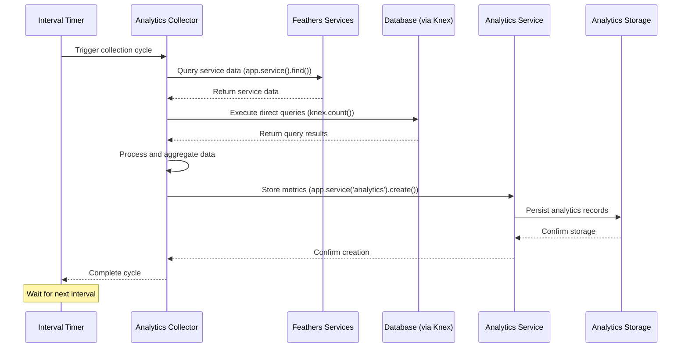

# Analytics data collector

## Overview

The Analytics Data Collector is a specialized background task within the iR Engine that periodically gathers, processes, and stores statistical information about platform usage. It collects metrics such as active user counts, running instances, chat activity, and other operational data. By regularly capturing these statistics, the collector creates a valuable historical record that can be used for monitoring platform health, analyzing usage patterns, and making data-driven decisions. This chapter explores the implementation, functionality, and integration of the Analytics Data Collector within the iR Engine's background processing system.

## Purpose and functionality

The Analytics Data Collector serves several important purposes:

1. **Usage monitoring**: Tracks how many users are active on the platform
2. **Resource utilization**: Measures how many instances, channels, and other resources are in use
3. **Trend analysis**: Creates time-series data for analyzing usage patterns over time
4. **Performance metrics**: Gathers data that can indicate system performance
5. **Business intelligence**: Provides insights for product and business decisions

The collector typically gathers metrics such as:

- Number of active users
- Count of running instances (virtual spaces)
- Active chat channels and messages
- Unique locations or scenes being used
- Server resource utilization
- Feature usage statistics

## Implementation

### Task initialization

The Analytics Data Collector is initialized when the Task Server Application starts:

```typescript
// From src/start.ts
import collectAnalytics from './collect-analytics';

export const start = async (): Promise<Application> => {
  const app = await createFeathersKoaApp(ServerMode.Task);
  
  // Initialize the analytics collector
  collectAnalytics(app);
  
  // ... other initialization code
  
  return app;
};
```

The `collectAnalytics` function receives the application instance, which provides access to services, database connections, and other resources needed for data collection.

### Collector setup

The collector is implemented in `src/collect-analytics.ts`:

```typescript
// Simplified from src/collect-analytics.ts
import config from '@ir-engine/server-core/src/appconfig';
import multiLogger from '@ir-engine/server-core/src/ServerLogger';

const logger = multiLogger.child({ component: 'taskserver:collect-analytics' });

// Get the collection interval from configuration
const DEFAULT_INTERVAL_SECONDS = 1800; // 30 minutes
const configuredInterval = parseInt(config['task-server'].processInterval);
const runIntervalMilliseconds = (configuredInterval || DEFAULT_INTERVAL_SECONDS) * 1000;

// Main export function that sets up the collector
export default (app) => {
  // Schedule periodic execution
  setInterval(async () => {
    try {
      await collectAndStoreData(app);
    } catch (error) {
      logger.error('Error during analytics collection:', error);
    }
  }, runIntervalMilliseconds);

  logger.info(`Analytics collection scheduled to run every ${runIntervalMilliseconds / 1000} seconds`);
};
```

This function:
1. Imports the configuration to determine how often to run
2. Sets up a periodic timer using `setInterval`
3. Calls the `collectAndStoreData` function at each interval
4. Includes error handling to prevent task failures
5. Logs the collection schedule for monitoring

### Data collection and storage

The `collectAndStoreData` function performs the actual data gathering and storage:

```typescript
// Conceptual implementation of collectAndStoreData
async function collectAndStoreData(app) {
  logger.info('Starting analytics collection cycle');

  // --- Data Collection ---
  
  // Example: Get count of active channels using a Feathers service
  const activeChannelsList = await app.service('channel').find({
    paginate: false,
    query: {
      active: true
    }
  });
  const activeChannelsCount = activeChannelsList.length;
  logger.info(`Found ${activeChannelsCount} active channels`);

  // Example: Get count of active users in instances using Knex
  const knex = app.get('knexClient');
  const activeInstanceUsersResult = await knex
    .count('* as count')
    .from('instance_attendance')
    .where('ended', false);
  const activeInstanceUsersCount = activeInstanceUsersResult[0].count;
  logger.info(`Found ${activeInstanceUsersCount} users in instances`);

  // Example: Get count of active instances
  const activeInstancesResult = await knex
    .count('* as count')
    .from('instance')
    .where('ended', false);
  const activeInstancesCount = activeInstancesResult[0].count;
  logger.info(`Found ${activeInstancesCount} active instances`);

  // --- Data Storage ---
  
  // Store the collected metrics
  await app.service('analytics').create({
    type: 'activeChannels',
    count: activeChannelsCount,
    timestamp: new Date()
  });

  await app.service('analytics').create({
    type: 'instanceUsers',
    count: activeInstanceUsersCount,
    timestamp: new Date()
  });

  await app.service('analytics').create({
    type: 'activeInstances',
    count: activeInstancesCount,
    timestamp: new Date()
  });

  logger.info('Analytics collection cycle complete');
}
```

This function:
1. Queries various data sources to gather metrics
2. Uses Feathers services for some data (e.g., channels)
3. Uses direct database queries via Knex for other data
4. Processes the raw data (e.g., counting items)
5. Stores each metric in the analytics service
6. Logs the process for monitoring and debugging

## Data collection methods

The Analytics Data Collector uses several methods to gather data:

### Feathers services

For data already managed by Feathers services, the collector uses service methods:

```typescript
// Example of using a Feathers service
const activeChannelsList = await app.service('channel').find({
  paginate: false,
  query: {
    active: true
  }
});
const activeChannelsCount = activeChannelsList.length;
```

This approach:
- Leverages existing service logic and validation
- Respects service-level access controls
- Follows the established service interaction pattern
- May include additional processing like filtering or counting

### Direct database queries

For more complex or performance-sensitive queries, the collector may use Knex:

```typescript
// Example of using Knex for direct database access
const knex = app.get('knexClient');
const activeInstanceUsersResult = await knex
  .count('* as count')
  .from('instance_attendance')
  .where('ended', false);
const activeInstanceUsersCount = activeInstanceUsersResult[0].count;
```

This approach:
- Allows for optimized SQL queries
- Can perform aggregations at the database level
- May be more efficient for large datasets
- Bypasses service-level processing for direct access

### External API calls

For metrics from external systems, the collector may use API clients:

```typescript
// Example of querying an external system
const k8sApi = app.get('k8sApi');
const nodeMetrics = await k8sApi.listNodeMetrics();
const totalCpuUsage = nodeMetrics.items.reduce((sum, node) => {
  return sum + node.usage.cpu;
}, 0);
```

This approach:
- Gathers data from systems outside the main application
- May include infrastructure metrics from Kubernetes
- Could integrate with third-party monitoring services
- Requires handling external API authentication and rate limits

## Data storage and retrieval

The collected analytics data is typically stored in a structured format:

### Storage format

Each analytics record usually includes:

```typescript
// Typical analytics record structure
interface AnalyticsRecord {
  type: string;        // The metric type (e.g., 'activeUsers')
  count: number;       // The numeric value
  timestamp: Date;     // When the measurement was taken
  metadata?: object;   // Optional additional context
}
```

This structure:
- Identifies the specific metric being recorded
- Provides the actual measurement value
- Timestamps the data for time-series analysis
- May include additional context in metadata

### Storage mechanism

The collector typically uses a Feathers service to store the data:

```typescript
// Storing data via the analytics service
await app.service('analytics').create({
  type: 'activeChannels',
  count: activeChannelsCount,
  timestamp: new Date()
});
```

This service might:
- Store the data in a database table
- Apply any necessary transformations
- Handle authentication and authorization
- Emit events that other parts of the system can listen for

### Data retrieval and analysis

The stored analytics data can later be retrieved for analysis:

```typescript
// Example of retrieving analytics data
const lastWeekAnalytics = await app.service('analytics').find({
  query: {
    type: 'activeUsers',
    timestamp: {
      $gte: new Date(Date.now() - 7 * 24 * 60 * 60 * 1000) // Last 7 days
    },
    $sort: {
      timestamp: 1 // Ascending order by timestamp
    }
  }
});
```

This data can then be:
- Displayed in administrative dashboards
- Used to generate reports
- Analyzed for trends and patterns
- Monitored for anomalies or issues

## Collection workflow

The complete analytics collection workflow follows these steps:



This diagram illustrates:
1. The timer triggers the collection cycle
2. The collector queries various data sources
3. The collector processes the raw data
4. The metrics are stored via the analytics service
5. The cycle completes and waits for the next interval

## Integration with other components

The Analytics Data Collector integrates with several other components of the background processing system:

### Task server application

The collector is initialized and managed by the Task Server Application:

```typescript
// From src/start.ts
collectAnalytics(app);
```

This integration:
- Provides the collector with the application context
- Ensures the collector starts when the Task Server starts
- Gives the collector access to services and resources

### Application configuration management

The collector uses configuration to determine its behavior:

```typescript
// From src/collect-analytics.ts
const configuredInterval = parseInt(config['task-server'].processInterval);
```

This integration:
- Allows the collection interval to be configured
- Enables environment-specific settings
- Supports runtime adjustments without code changes

### Service interaction layer

The collector interacts with various services to gather and store data:

```typescript
// Examples of service interaction
const channels = await app.service('channel').find({ /* query */ });
await app.service('analytics').create({ /* data */ });
```

This integration:
- Leverages the established service architecture
- Ensures consistent data access patterns
- Respects service-level security and validation

### Periodic task scheduler

For more complex scheduling needs, the collector might use a dedicated scheduler:

```typescript
// Conceptual integration with a scheduler
import { scheduleTask } from '../scheduler';

export default (app) => {
  scheduleTask('analytics-collection', {
    interval: config['task-server'].processInterval || 1800,
    handler: async () => {
      await collectAndStoreData(app);
    }
  });
};
```

This integration:
- Provides more sophisticated scheduling options
- Centralizes task management
- May offer better monitoring and reliability

## Benefits of analytics collection

The Analytics Data Collector provides several key benefits:

1. **Data-driven decisions**: Provides quantitative data for product and business decisions
2. **Operational awareness**: Creates visibility into platform usage and health
3. **Trend identification**: Enables recognition of usage patterns over time
4. **Capacity planning**: Helps predict resource needs based on growth trends
5. **Issue detection**: Can identify anomalies that might indicate problems
6. **Performance optimization**: Highlights areas that might need optimization
7. **Business metrics**: Provides data for KPIs and business reporting

These benefits make the Analytics Data Collector a valuable component of the iR Engine's background processing system.

## Next steps

With an understanding of how the Analytics Data Collector periodically gathers and stores metrics, the next chapter explores a more general approach to scheduling and managing periodic tasks.

Next: [Periodic task scheduler](04_periodic_task_scheduler_.md)

---


