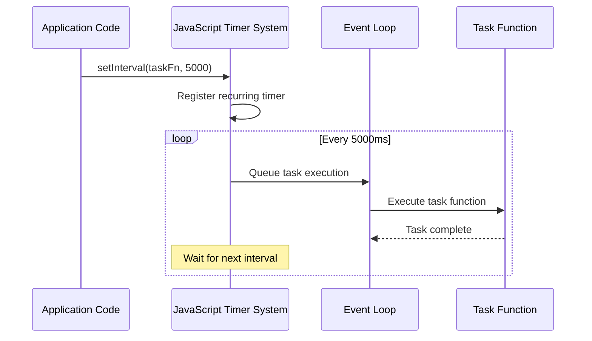

# Periodic task scheduler

## Overview

The Periodic Task Scheduler is a mechanism within the iR Engine's background processing system that enables tasks to run automatically at regular intervals. Rather than being a standalone component, it's an architectural pattern implemented within each task that requires periodic execution. 

By using JavaScript's built-in timing functions, particularly `setInterval`, the system ensures that critical background operations like data collection, monitoring, and maintenance happen consistently without manual intervention. This chapter explores the implementation, functionality, and benefits of periodic task scheduling within the iR Engine.

## Purpose and functionality

Periodic task scheduling serves several essential purposes:

1. **Automation**: Eliminates the need for manual task triggering
2. **Consistency**: Ensures tasks run at regular, predictable intervals
3. **Reliability**: Reduces the risk of tasks being forgotten or missed
4. **Resource management**: Controls when resource-intensive operations occur
5. **Operational autonomy**: Allows the system to maintain itself with minimal intervention

Many background operations require regular execution:

- Collecting analytics data (every 30 minutes)
- Monitoring system events (every few minutes)
- Performing database maintenance (daily)
- Generating reports (hourly or daily)
- Cleaning up temporary resources (periodically)

The scheduler ensures these operations happen automatically and reliably.

## Implementation

### Core mechanism: setInterval

The primary tool for periodic scheduling in the iR Engine is JavaScript's built-in `setInterval` function:

```javascript
// Basic usage of setInterval
function periodicTask() {
  console.log("Executing task at:", new Date().toISOString());
  // Task logic goes here
}

// Execute periodicTask every 5 minutes (300,000 milliseconds)
const intervalId = setInterval(periodicTask, 300000);
```

This function:
1. Takes a callback function as its first parameter
2. Takes a time interval in milliseconds as its second parameter
3. Executes the callback repeatedly at the specified interval
4. Returns an identifier that can be used to cancel the interval if needed

### Implementation in analytics collector

The Analytics Data Collector uses `setInterval` to schedule its execution:

```typescript
// Simplified from src/collect-analytics.ts
import config from '@ir-engine/server-core/src/appconfig';
import multiLogger from '@ir-engine/server-core/src/ServerLogger';

const logger = multiLogger.child({ component: 'taskserver:collect-analytics' });

// Function that performs the actual data collection
async function collectAndStoreData(app) {
  logger.info('Starting analytics collection cycle');
  // Analytics collection logic
  logger.info('Analytics collection cycle complete');
}

// Main export function that sets up periodic execution
export default (app) => {
  // Get the interval from configuration
  const DEFAULT_INTERVAL_SECONDS = 1800; // 30 minutes
  const configuredInterval = parseInt(config['task-server'].processInterval);
  const runIntervalMilliseconds = (configuredInterval || DEFAULT_INTERVAL_SECONDS) * 1000;

  // Schedule periodic execution
  setInterval(async () => {
    try {
      await collectAndStoreData(app);
    } catch (error) {
      logger.error('Error during analytics collection:', error);
    }
  }, runIntervalMilliseconds);

  logger.info(`Analytics collection scheduled to run every ${runIntervalMilliseconds / 1000} seconds`);
};
```

This implementation:
1. Retrieves the execution interval from configuration
2. Sets up error handling to prevent task failures from breaking the schedule
3. Logs the schedule for monitoring and debugging
4. Uses an async function to handle asynchronous operations

### Implementation in event collector

Similarly, the Kubernetes Event Collector uses `setInterval` for its periodic execution:

```typescript
// Simplified from src/collect-events.ts
import config from '@ir-engine/server-core/src/appconfig';
import multiLogger from '@ir-engine/server-core/src/ServerLogger';

const logger = multiLogger.child({ component: 'taskserver:collect-events' });

// Function that collects Kubernetes events
const collectEvents = async (app) => {
  logger.info('Starting Kubernetes event collection');
  // Event collection logic
  logger.info('Kubernetes event collection complete');
};

// Main export function that sets up periodic execution
export default (app) => {
  // Get the interval from configuration
  const DEFAULT_INTERVAL_SECONDS = 60; // 1 minute
  const configuredInterval = parseInt(config.kubernetes?.eventCollectionInterval);
  const intervalMilliseconds = (configuredInterval || DEFAULT_INTERVAL_SECONDS) * 1000;

  // Schedule periodic execution
  setInterval(async () => {
    try {
      await collectEvents(app);
    } catch (error) {
      logger.error('Error collecting Kubernetes events:', error);
    }
  }, intervalMilliseconds);

  // Also run once immediately
  collectEvents(app).catch(error => {
    logger.error('Error during initial Kubernetes event collection:', error);
  });

  logger.info(`Kubernetes event collection scheduled to run every ${intervalMilliseconds / 1000} seconds`);
};
```

This implementation adds an immediate execution in addition to the periodic schedule, ensuring that event collection begins right away rather than waiting for the first interval to elapse.

## How setInterval works

Under the hood, `setInterval` relies on JavaScript's event loop and timer mechanisms:



The process works as follows:
1. When `setInterval` is called, the JavaScript runtime registers a recurring timer
2. When the specified time elapses, the callback is added to the event queue
3. The event loop processes the queue and executes the callback
4. After execution, the timer continues to run, and the process repeats
5. This continues until the interval is explicitly cleared or the process terminates

## Advanced scheduling patterns

While `setInterval` provides basic periodic scheduling, more complex requirements may need additional patterns:

### Error handling and retry logic

To prevent errors from breaking the schedule:

```typescript
setInterval(async () => {
  try {
    await performTask();
  } catch (error) {
    logger.error('Task failed:', error);
    // Optional: Implement retry logic
    setTimeout(async () => {
      try {
        logger.info('Retrying failed task');
        await performTask();
      } catch (retryError) {
        logger.error('Retry also failed:', retryError);
      }
    }, 60000); // Retry after 1 minute
  }
}, intervalMilliseconds);
```

### Dynamic interval adjustment

To adjust intervals based on system conditions:

```typescript
let currentInterval = DEFAULT_INTERVAL;

// Function to adjust the interval
function updateInterval() {
  // Check system load or other conditions
  const systemLoad = getSystemLoad();
  
  if (systemLoad > HIGH_THRESHOLD) {
    // Reduce frequency during high load
    currentInterval = REDUCED_FREQUENCY_INTERVAL;
  } else {
    // Use normal frequency
    currentInterval = DEFAULT_INTERVAL;
  }
}

// Initial schedule
let intervalId = setInterval(async () => {
  await performTask();
  
  // Check if interval needs adjustment
  const previousInterval = currentInterval;
  updateInterval();
  
  // If interval changed, reschedule
  if (previousInterval !== currentInterval) {
    clearInterval(intervalId);
    intervalId = setInterval(performTask, currentInterval);
    logger.info(`Adjusted task interval to ${currentInterval}ms`);
  }
}, currentInterval);
```

### Staggered execution

To prevent multiple tasks from running simultaneously:

```typescript
// Schedule tasks with slight offsets
setTimeout(() => {
  setInterval(taskA, intervalMilliseconds);
}, 0);

setTimeout(() => {
  setInterval(taskB, intervalMilliseconds);
}, 10000); // Start 10 seconds after taskA

setTimeout(() => {
  setInterval(taskC, intervalMilliseconds);
}, 20000); // Start 20 seconds after taskA
```

## Integration with other components

The Periodic Task Scheduler pattern integrates with several other components of the background processing system:

### Task server application

The Task Server Application initializes each task, which then sets up its own periodic execution:

```typescript
// From src/start.ts
import collectAnalytics from './collect-analytics';
import collectEvents from './collect-events';

export const start = async (): Promise<Application> => {
  const app = await createFeathersKoaApp(ServerMode.Task);
  
  // Initialize tasks (which set up their own periodic execution)
  collectAnalytics(app);
  collectEvents(app);
  
  // ... other initialization code
  
  return app;
};
```

This integration:
- Provides each task with the application context
- Allows tasks to access services and resources
- Ensures tasks start when the Task Server starts

### Application configuration management

Tasks retrieve their execution intervals from configuration:

```typescript
// From src/collect-analytics.ts
const configuredInterval = parseInt(config['task-server'].processInterval);
```

This integration:
- Allows intervals to be configured without code changes
- Enables environment-specific scheduling
- Supports runtime adjustments to execution frequency

### Service interaction layer

Periodic tasks often interact with services to perform their work:

```typescript
// Example of a task interacting with services
async function collectAndStoreData(app) {
  // Get data from one service
  const data = await app.service('some-service').find({ /* query */ });
  
  // Process the data
  const processedData = processData(data);
  
  // Store results in another service
  await app.service('results-service').create(processedData);
}
```

This integration:
- Allows tasks to retrieve and store data
- Leverages existing service functionality
- Maintains separation of concerns

## Considerations and best practices

When implementing periodic tasks, several considerations should be kept in mind:

### Interval selection

Choosing appropriate intervals involves balancing several factors:

- **Resource usage**: Shorter intervals increase system load
- **Data freshness**: Longer intervals mean less current data
- **Business requirements**: Some processes have specific timing needs
- **Coordination**: Consider how tasks interact with each other

### Error handling

Robust error handling is critical for periodic tasks:

- **Catch exceptions**: Prevent errors from breaking the schedule
- **Log errors**: Ensure issues are visible for troubleshooting
- **Consider retries**: Implement retry logic for transient failures
- **Monitor failures**: Set up alerts for repeated failures

### Resource management

Periodic tasks should be mindful of resource usage:

- **Database connections**: Release connections after use
- **Memory usage**: Avoid memory leaks in long-running processes
- **CPU utilization**: Be aware of task execution time
- **Network traffic**: Consider the impact of frequent API calls

### Graceful shutdown

Tasks should handle shutdown gracefully:

```typescript
// Example of cleaning up intervals on shutdown
export default (app) => {
  const intervalId = setInterval(periodicTask, interval);
  
  // Clean up on application shutdown
  app.on('close', () => {
    clearInterval(intervalId);
    logger.info('Periodic task scheduler stopped');
  });
};
```

## Benefits of periodic task scheduling

The Periodic Task Scheduler pattern provides several key benefits:

1. **Automation**: Eliminates manual intervention for routine operations
2. **Reliability**: Ensures critical tasks are executed consistently
3. **Simplicity**: Uses built-in JavaScript functionality for basic scheduling
4. **Flexibility**: Allows each task to manage its own execution schedule
5. **Configurability**: Supports adjustable intervals through configuration
6. **Maintainability**: Keeps scheduling logic close to the task implementation

These benefits make periodic task scheduling a fundamental pattern for background processing in the iR Engine.

## Next steps

With an understanding of how tasks are scheduled to run periodically, the next chapter explores how these tasks interact with other parts of the system to retrieve and store data.

Next: [Service interaction layer](05_service_interaction_layer_.md)

---


