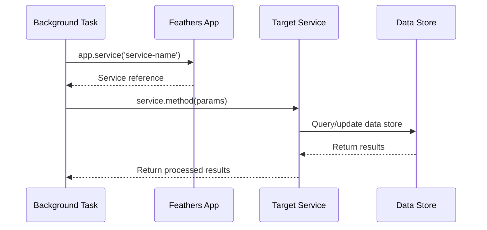

# Service interaction layer

## Overview

The Service Interaction Layer provides a standardized mechanism for background tasks to communicate with other components of the iR Engine. It enables tasks to retrieve data, store results, and trigger actions without needing to understand the internal implementation details of those components. By leveraging FeathersJS services, the layer creates a consistent, modular approach to inter-component communication. This chapter explores how background tasks use the Service Interaction Layer to access and manipulate data across the iR Engine ecosystem.

## Purpose and functionality

The Service Interaction Layer serves several essential purposes:

1. **Standardized communication**: Provides a consistent interface for accessing different parts of the system
2. **Abstraction**: Hides implementation details of data storage and processing
3. **Decoupling**: Reduces dependencies between components
4. **Centralized logic**: Keeps business logic within appropriate services
5. **Testability**: Enables easier testing through service mocking

The layer enables background tasks to perform operations such as:

- Retrieving data from various sources
- Creating or updating records
- Triggering actions in other components
- Subscribing to events and notifications
- Accessing shared resources

## Implementation

### FeathersJS services

The Service Interaction Layer is built on FeathersJS, a framework for real-time applications and REST APIs:

```typescript
// Example of a FeathersJS service definition (not in the background processing project)
// This would typically be in another part of the iR Engine ecosystem
app.use('/channel', {
  async find(params) {
    // Query the database for channels
    const channels = await db.query('SELECT * FROM channels WHERE active = true');
    return channels;
  },
  
  async create(data, params) {
    // Create a new channel
    const result = await db.query('INSERT INTO channels (name, type) VALUES ($1, $2) RETURNING *', 
      [data.name, data.type]);
    return result[0];
  },
  
  // Other methods: get, update, patch, remove
});
```

Each service:
- Is registered with a unique path (e.g., '/channel')
- Implements standard methods (find, get, create, update, patch, remove)
- Encapsulates the logic for a specific resource or functionality
- Can use any data source or implementation internally

### Accessing services

Background tasks access these services through the application instance:

```typescript
// Example from a background task
async function collectChannelData(app) {
  // Get the channel service
  const channelService = app.service('channel');
  
  // Use the service to find active channels
  const activeChannels = await channelService.find({
    query: { active: true },
    paginate: false
  });
  
  return activeChannels;
}
```

The key components:
1. `app.service('service-name')`: Retrieves a reference to the specified service
2. `.find()`, `.create()`, etc.: Calls standard methods on the service
3. Parameters like `query` configure the service request

### Common service methods

The Service Interaction Layer provides several standard methods:

#### find

Retrieves multiple records, often with filtering:

```typescript
// Find all active channels
const activeChannels = await app.service('channel').find({
  query: { active: true },
  paginate: false // Get all results, not just the first page
});

// Find channels with specific criteria
const gameChannels = await app.service('channel').find({
  query: {
    category: 'gaming',
    createdAt: { $gt: new Date('2023-01-01') }
  }
});
```

#### get

Retrieves a single record by ID:

```typescript
// Get a specific channel by ID
const channel = await app.service('channel').get('channel-123');
```

#### create

Creates a new record:

```typescript
// Create a new analytics record
const newRecord = await app.service('analytics').create({
  type: 'activeChannels',
  count: 42,
  timestamp: new Date()
});
```

#### update/patch

Updates existing records:

```typescript
// Update a record completely (replacing all fields)
await app.service('channel').update('channel-123', {
  name: 'New Name',
  active: true,
  category: 'general'
});

// Patch a record (updating only specified fields)
await app.service('channel').patch('channel-123', {
  active: false
});
```

#### remove

Deletes records:

```typescript
// Remove a specific record
await app.service('channel').remove('channel-123');

// Remove multiple records matching criteria
await app.service('channel').remove(null, {
  query: { temporary: true, createdAt: { $lt: yesterday } }
});
```

## Practical examples

### Analytics data collection

The Analytics Data Collector uses services to gather and store metrics:

```typescript
// Simplified from src/collect-analytics.ts
async function collectAndStoreData(app) {
  // Get data from the channel service
  const activeChannelsList = await app.service('channel').find({
    paginate: false
  });
  const activeChannelsCount = activeChannelsList.length;
  
  // Store the result in the analytics service
  await app.service('analytics').create({
    type: 'activeChannels',
    count: activeChannelsCount,
    timestamp: new Date()
  });
  
  logger.info(`Stored channel count (${activeChannelsCount}) in analytics`);
}
```

This example demonstrates:
1. Using the 'channel' service to retrieve data
2. Processing the data (counting channels)
3. Using the 'analytics' service to store the result

### Kubernetes event processing

The Kubernetes Event Collector might use services to process and store events:

```typescript
// Simplified concept from src/collect-events.ts
async function processKubernetesEvent(app, event) {
  // Check if this is a critical event
  if (event.type === 'Warning' && event.reason === 'Failed') {
    // Create an alert using the alerts service
    await app.service('alerts').create({
      source: 'kubernetes',
      level: 'warning',
      message: `${event.involvedObject.kind} ${event.involvedObject.name}: ${event.message}`,
      timestamp: new Date(event.lastTimestamp)
    });
    
    logger.info(`Created alert for Kubernetes event: ${event.reason}`);
  }
  
  // Store the event for historical records
  await app.service('k8s-events').create({
    type: event.type,
    reason: event.reason,
    message: event.message,
    object: `${event.involvedObject.kind}/${event.involvedObject.name}`,
    namespace: event.involvedObject.namespace,
    timestamp: new Date(event.lastTimestamp)
  });
}
```

This example shows:
1. Processing a Kubernetes event
2. Using the 'alerts' service to create notifications for critical events
3. Using the 'k8s-events' service to store all events for historical records

## Service interaction flow

The typical flow of service interaction follows these steps:



This diagram illustrates:
1. The task requests a service reference from the app
2. The task calls a method on the service with parameters
3. The service interacts with its data store (database, API, etc.)
4. The service processes the results and returns them to the task

## Advanced service patterns

### Hooks

FeathersJS services can use hooks for cross-cutting concerns:

```typescript
// Example of service hooks (conceptual)
app.service('analytics').hooks({
  before: {
    create: [
      // Validate data before creation
      validateAnalyticsData(),
      // Add timestamp if not provided
      addTimestamp()
    ]
  },
  after: {
    create: [
      // Notify other systems about new analytics
      notifyDashboard()
    ]
  }
});
```

Hooks can:
- Validate input data
- Transform data before or after service methods
- Handle authentication and authorization
- Log operations
- Trigger side effects

### Real-time events

Services can emit events that other parts of the system can listen for:

```typescript
// Listening for service events
app.service('alerts').on('created', alert => {
  // React to new alerts
  if (alert.level === 'critical') {
    sendEmergencyNotification(alert);
  }
});
```

This enables:
- Real-time updates across the system
- Event-driven architectures
- Loose coupling between components

### Pagination

Services can return paginated results for large datasets:

```typescript
// Using pagination
const result = await app.service('logs').find({
  query: { level: 'error' },
  $limit: 25,
  $skip: 0
});

// Result structure with pagination
// {
//   total: 142,
//   limit: 25,
//   skip: 0,
//   data: [ /* 25 log entries */ ]
// }
```

This helps:
- Manage memory usage for large datasets
- Improve performance
- Enable efficient UI pagination

## Integration with other components

The Service Interaction Layer integrates with several other components of the background processing system:

### Task server application

The Task Server Application provides the service access point:

```typescript
// From src/start.ts
const app = await createFeathersKoaApp(ServerMode.Task);

// Pass the app to tasks, giving them access to services
collectAnalytics(app);
collectEvents(app);
```

This integration:
- Initializes the FeathersJS application
- Registers all available services
- Provides tasks with the entry point to services

### Application configuration management

Services may use configuration to determine their behavior:

```typescript
// Example of a service using configuration
app.service('analytics').hooks({
  before: {
    create: [
      async context => {
        // Get storage limit from configuration
        const storageLimit = config.analytics.storageLimit;
        
        // Check if we need to clean up old records
        const count = await getAnalyticsCount();
        if (count > storageLimit) {
          await cleanupOldAnalytics(storageLimit);
        }
        
        return context;
      }
    ]
  }
});
```

This integration:
- Allows services to adapt to configuration
- Enables environment-specific service behavior
- Supports runtime adjustments to service parameters

### Periodic task scheduler

Tasks scheduled by the Periodic Task Scheduler often use services:

```typescript
// From a task using setInterval
setInterval(async () => {
  try {
    // Use services within the periodic task
    const data = await app.service('some-service').find();
    await processData(app, data);
  } catch (error) {
    logger.error('Error in periodic task:', error);
  }
}, intervalMilliseconds);
```

This integration:
- Enables periodic tasks to access and update data
- Allows scheduled operations to interact with other components
- Maintains separation between scheduling and service interaction

## Benefits of the service interaction layer

The Service Interaction Layer provides several key benefits:

1. **Consistency**: Provides a uniform interface across different resources
2. **Modularity**: Allows components to be developed and tested independently
3. **Abstraction**: Hides implementation details behind a standard interface
4. **Flexibility**: Enables services to change their internal implementation without affecting clients
5. **Testability**: Makes it easier to mock services for testing
6. **Scalability**: Supports distributed architectures and service separation
7. **Maintainability**: Centralizes resource-specific logic in appropriate services

These benefits make the Service Interaction Layer a critical component for enabling effective communication between background tasks and other parts of the iR Engine.

## Next steps

With an understanding of how background tasks interact with services to retrieve and store data, the next chapter explores a specific task that monitors the Kubernetes environment.

Next: [Kubernetes event collector](06_kubernetes_event_collector_.md)

---


