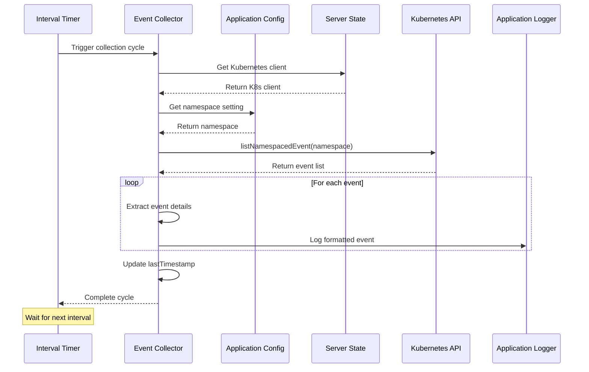

# Kubernetes event collector

## Overview

The Kubernetes Event Collector is a specialized background task within the iR Engine that monitors and logs events from the Kubernetes cluster where the application is deployed. It serves as an operational monitoring system, capturing important cluster activities such as pod startups, failures, scaling operations, and system warnings. 

By collecting and recording these events, the collector provides valuable insights for troubleshooting, operational awareness, and system health monitoring. This chapter explores the implementation, functionality, and integration of the Kubernetes Event Collector within the iR Engine's background processing system.

## Purpose and functionality

The Kubernetes Event Collector serves several important purposes:

1. **Operational monitoring**: Tracks system events in the Kubernetes environment
2. **Troubleshooting**: Provides context for diagnosing application issues
3. **Audit trail**: Creates a historical record of cluster activities
4. **Health awareness**: Identifies potential problems or anomalies
5. **Resource tracking**: Monitors scaling and resource allocation events

The collector typically captures events such as:

- Pod lifecycle events (creation, deletion, failures)
- Deployment scaling operations
- Resource constraints and limits
- System warnings and errors
- Node-related events
- Configuration changes

## Implementation

### Task initialization

The Kubernetes Event Collector is initialized when the Task Server Application starts:

```typescript
// From src/start.ts
import collectEvents from './collect-events';

export const start = async (): Promise<Application> => {
  const app = await createFeathersKoaApp(ServerMode.Task);
  
  // Initialize the Kubernetes event collector
  collectEvents(app);
  
  // ... other initialization code
  
  return app;
};
```

The `collectEvents` function receives the application instance, which provides access to the Kubernetes client, configuration, and other resources needed for event collection.

### Collector setup

The collector is implemented in `src/collect-events.ts`:

```typescript
// Simplified from src/collect-events.ts
import config from '@ir-engine/server-core/src/appconfig';
import { getState } from '@ir-engine/hyperflux';
import { ServerState } from '@ir-engine/server-core/src/ServerState';
import multiLogger from '@ir-engine/server-core/src/ServerLogger';

const logger = multiLogger.child({ component: 'taskserver:collect-events' });
let lastTimestamp: string;

// Main function to fetch and log Kubernetes events
async function fetchAndLogKubernetesEvents() {
  // Get the Kubernetes client from server state
  const k8sClient = getState(ServerState).k8DefaultClient;
  if (!k8sClient) {
    logger.warn('Kubernetes client not available');
    return;
  }

  // Get the namespace to monitor from configuration
  const namespace = config.server.namespace;
  logger.info(`Checking for events in namespace: ${namespace}`);

  try {
    // Query the Kubernetes API for events
    const eventsResponse = await k8sClient.listNamespacedEvent({
      namespace,
      // In a real implementation, we would filter by timestamp
      // timeoutSeconds: 10
    });

    // Process and log the events
    for (const event of eventsResponse.items) {
      // Extract event details
      const kind = event.involvedObject.kind;
      const name = event.involvedObject.name;
      const reason = event.reason;
      const message = event.message;
      const timestamp = event.lastTimestamp || event.firstTimestamp || new Date();
      
      // Log the event
      logger.info(`K8s Event: ${kind} ${name} - ${reason} - ${message} (at ${timestamp})`);
    }
    
    // Update the timestamp for the next run
    lastTimestamp = new Date().toISOString();
  } catch (error) {
    logger.error('Error fetching Kubernetes events:', error);
  }
}

// Main export function that sets up the collector
export default (app): void => {
  // Set the collection interval (e.g., every minute)
  const intervalMilliseconds = 60 * 1000;
  
  // Schedule periodic execution
  setInterval(fetchAndLogKubernetesEvents, intervalMilliseconds);
  
  logger.info(`Kubernetes event collection scheduled to run every ${intervalMilliseconds / 1000} seconds`);
  
  // Run once immediately at startup
  fetchAndLogKubernetesEvents();
};
```

This implementation:
1. Defines a function to fetch and log Kubernetes events
2. Gets the Kubernetes client from the server state
3. Retrieves the namespace to monitor from configuration
4. Queries the Kubernetes API for events in that namespace
5. Processes and logs each event with relevant details
6. Sets up periodic execution using `setInterval`
7. Runs the collection once immediately at startup

### Kubernetes client access

The collector accesses the Kubernetes API through a client provided by the server state:

```typescript
const k8sClient = getState(ServerState).k8DefaultClient;
```

This client:
- Is typically initialized during application startup
- Handles authentication to the Kubernetes API
- Provides methods for querying different Kubernetes resources
- Manages API rate limiting and connection pooling

### Event filtering

In a production implementation, the collector would filter events to avoid processing duplicates:

```typescript
// Conceptual implementation of event filtering
const eventsResponse = await k8sClient.listNamespacedEvent({
  namespace,
  // Only get events newer than the last check
  fieldSelector: lastTimestamp ? `lastTimestamp>=${lastTimestamp}` : undefined
});
```

This filtering:
- Reduces the amount of data processed
- Prevents duplicate logging of the same events
- Focuses on new events since the last collection cycle

## Event collection workflow

The complete event collection workflow follows these steps:



This diagram illustrates:
1. The timer triggers the collection cycle
2. The collector retrieves the Kubernetes client and namespace
3. The collector queries the Kubernetes API for events
4. The collector processes and logs each event
5. The collector updates the timestamp for the next cycle
6. The cycle completes and waits for the next interval

## Event types and processing

The Kubernetes Event Collector handles various types of events:

### Pod lifecycle events

Events related to pod creation, deletion, and status changes:

```
INFO (taskserver:collect-events): K8s Event: Pod my-app-pod-12345 - Scheduled - Successfully assigned my-namespace/my-app-pod-12345 to node-1
INFO (taskserver:collect-events): K8s Event: Pod my-app-pod-12345 - Started - Started container main
INFO (taskserver:collect-events): K8s Event: Pod my-app-pod-12345 - Killing - Container failed liveness probe
```

### Deployment events

Events related to deployment scaling and updates:

```
INFO (taskserver:collect-events): K8s Event: Deployment my-app - ScalingReplicaSet - Scaled up replica set my-app-abc123 to 3
INFO (taskserver:collect-events): K8s Event: Deployment my-app - ScalingReplicaSet - Scaled down replica set my-app-def456 to 0
```

### Resource constraint events

Events related to resource limits and constraints:

```
INFO (taskserver:collect-events): K8s Event: Pod my-app-pod-12345 - FailedScheduling - 0/3 nodes are available: 3 Insufficient memory
INFO (taskserver:collect-events): K8s Event: Pod my-app-pod-12345 - OOMKilled - Container was killed due to OOM (Out of Memory)
```

### System events

Events related to system components and infrastructure:

```
INFO (taskserver:collect-events): K8s Event: Node node-1 - NodeNotReady - Node node-1 status is now: NodeNotReady
INFO (taskserver:collect-events): K8s Event: Node node-1 - NodeReady - Node node-1 status is now: NodeReady
```

## Advanced implementations

While the basic implementation logs events, more sophisticated versions might include additional features:

### Event storage

Storing events in a database for historical analysis:

```typescript
// Conceptual implementation of event storage
async function storeEvent(app, event) {
  await app.service('k8s-events').create({
    kind: event.involvedObject.kind,
    name: event.involvedObject.name,
    namespace: event.involvedObject.namespace,
    reason: event.reason,
    message: event.message,
    timestamp: new Date(event.lastTimestamp || event.firstTimestamp),
    severity: event.type // 'Normal' or 'Warning'
  });
}
```

### Alert generation

Generating alerts for critical events:

```typescript
// Conceptual implementation of alert generation
function shouldGenerateAlert(event) {
  // Generate alerts for warnings and specific critical events
  return (
    event.type === 'Warning' ||
    (event.reason === 'Failed' && event.involvedObject.kind === 'Pod') ||
    event.reason === 'FailedScheduling' ||
    event.reason === 'OOMKilled'
  );
}

async function generateAlert(app, event) {
  if (shouldGenerateAlert(event)) {
    await app.service('alerts').create({
      source: 'kubernetes',
      level: event.type === 'Warning' ? 'warning' : 'info',
      title: `${event.involvedObject.kind} ${event.reason}`,
      message: `${event.involvedObject.kind} ${event.involvedObject.name}: ${event.message}`,
      timestamp: new Date(event.lastTimestamp || event.firstTimestamp)
    });
  }
}
```

### Event aggregation

Aggregating similar events to reduce noise:

```typescript
// Conceptual implementation of event aggregation
const eventCounts = new Map();

function aggregateEvents(events) {
  const aggregated = [];
  
  for (const event of events) {
    const key = `${event.involvedObject.kind}:${event.reason}`;
    
    if (eventCounts.has(key)) {
      // Increment count for this type of event
      eventCounts.set(key, eventCounts.get(key) + 1);
    } else {
      // First occurrence of this event type
      eventCounts.set(key, 1);
      aggregated.push(event);
    }
  }
  
  // Log the counts
  for (const [key, count] of eventCounts.entries()) {
    if (count > 1) {
      const [kind, reason] = key.split(':');
      logger.info(`Aggregated ${count} similar events for ${kind} with reason ${reason}`);
    }
  }
  
  return aggregated;
}
```

## Integration with other components

The Kubernetes Event Collector integrates with several other components of the background processing system:

### Task server application

The collector is initialized and managed by the Task Server Application:

```typescript
// From src/start.ts
collectEvents(app);
```

This integration:
- Provides the collector with the application context
- Ensures the collector starts when the Task Server starts
- Gives the collector access to the Kubernetes client

### Application configuration management

The collector uses configuration to determine which namespace to monitor:

```typescript
// From src/collect-events.ts
const namespace = config.server.namespace;
```

This integration:
- Allows the target namespace to be configured
- Enables environment-specific monitoring
- Supports runtime adjustments without code changes

### Periodic task scheduler

The collector uses the periodic task scheduling pattern for regular execution:

```typescript
// From src/collect-events.ts
setInterval(fetchAndLogKubernetesEvents, intervalMilliseconds);
```

This integration:
- Ensures regular monitoring of Kubernetes events
- Provides consistent operational awareness
- Maintains an up-to-date view of cluster activities

### Service interaction layer

In advanced implementations, the collector might use services to store events or generate alerts:

```typescript
// Conceptual service interaction
await app.service('k8s-events').create({ /* event data */ });
await app.service('alerts').create({ /* alert data */ });
```

This integration:
- Enables persistent storage of events
- Allows for alerting and notification
- Supports integration with monitoring dashboards

## Benefits of Kubernetes event collection

The Kubernetes Event Collector provides several key benefits:

1. **Operational visibility**: Provides insights into cluster activities
2. **Troubleshooting**: Helps diagnose application issues
3. **Proactive monitoring**: Identifies potential problems before they escalate
4. **Historical context**: Maintains a record of system changes
5. **Resource optimization**: Helps understand scaling patterns and resource usage
6. **Security awareness**: Captures potential security-related events
7. **Compliance**: Supports audit requirements with event logging

These benefits make the Kubernetes Event Collector a valuable component for operating applications in Kubernetes environments.

## Conclusion

The Kubernetes Event Collector completes our exploration of the iR Engine's background processing system. Throughout this documentation, we've examined:

1. The Task Server Application that initializes and manages background tasks
2. The Application Configuration Management system that provides operational settings
3. The Analytics Data Collector that gathers platform usage statistics
4. The Periodic Task Scheduler pattern that ensures regular task execution
5. The Service Interaction Layer that enables communication between components
6. The Kubernetes Event Collector that monitors the operational environment

Together, these components form a comprehensive background processing system that supports the iR Engine's operational needs, providing monitoring, data collection, and system awareness.

---


