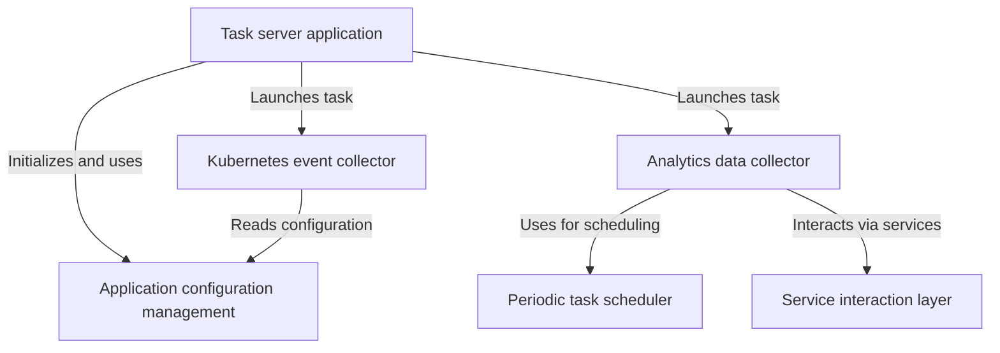

# Background processing

The iR Engine's background processing system is designed to run automated tasks at regular intervals. Key functions include periodically collecting analytics data about platform usage (such as active users and instances) and gathering event logs from the Kubernetes cluster where the application is deployed. This helps in monitoring the system and gathering operational insights.

## Architecture overview

The background processing system consists of several interconnected components that work together to handle various automated tasks:

## Documentation chapters

1. [Task server application](01_task_server_application_.md)
2. [Application configuration management](02_application_configuration_management_.md)
3. [Analytics data collector](03_analytics_data_collector_.md)
4. [Periodic task scheduler](04_periodic_task_scheduler_.md)
5. [Service interaction layer](05_service_interaction_layer_.md)
6. [Kubernetes event collector](06_kubernetes_event_collector_.md)

---

